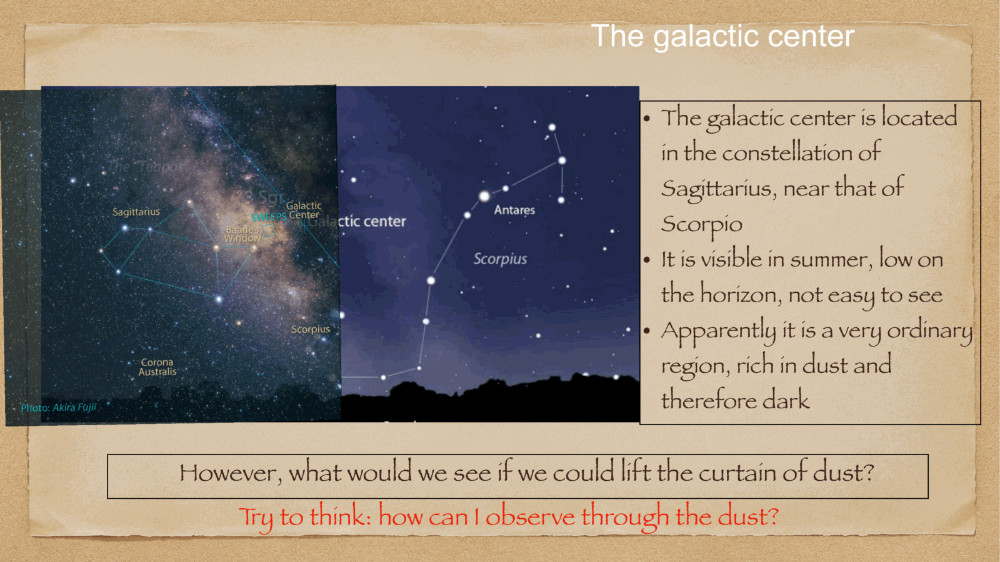
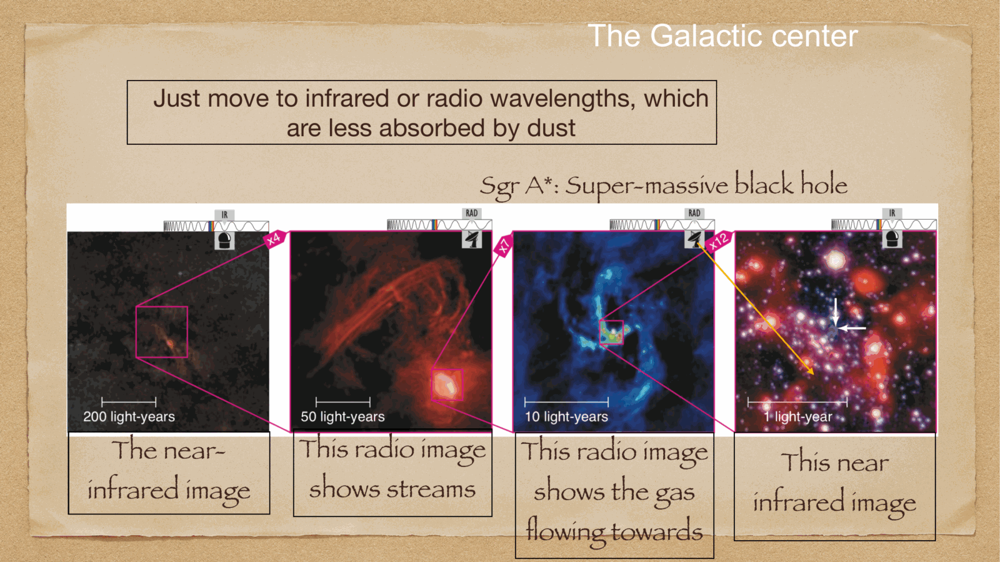
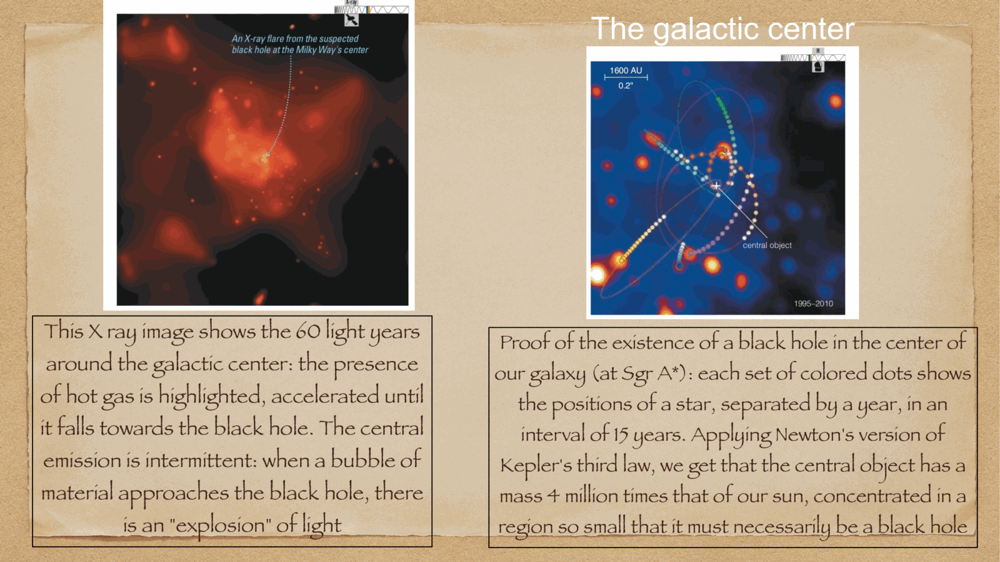
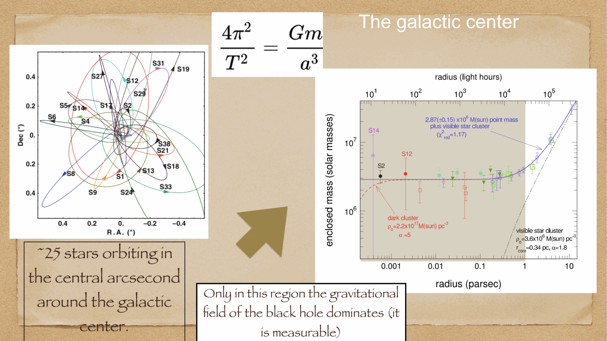

at the exact dynamical center of the Milky Way, at a distance of $R_0 \approx 8.2$ kpc ($26,000$ light-years) in the constellation Sagittarius, sits **Sagittarius A*** (Sgr A*): a supermassive black hole of $4.15 \times 10^6 M_\odot$.

---

## overcoming the optical dust barrier

in the direction of the Galactic Center ($l = 0^\circ, b = 0^\circ$), the line of sight traverses the entire dusty plane of the Milky Way. visual extinction reaches:
$$A_V \approx 30 \text{ magnitudes}$$

optical light is dimmed by a factor of $10^{A_V / 2.5} = 10^{12}$—only **one out of every trillion optical photons** reaches Earth!
consequence: the Galactic Center was completely unobservable until the advent of:
1. **radio astronomy**: first detected by Karl Jansky in 1932; compact non-thermal radio source discovered in 1974 by Balick & Brown and named **Sgr A***.
2. **near-infrared astronomy (NIR, $2.2\,\mu$m K-band)**: interstellar dust extinction drops to $A_K \approx 0.1 A_V \approx 3$ mag (dimming by only a factor of $15$).

---

## the S-star cluster and adaptive optics

starting in the early 1990s, two independent research teams tracked individual stars orbiting within the central parsec of Sgr A*:
- **Reinhard Genzel** (Max Planck Institute for Extraterrestrial Physics, MPE) using ESO's NTT and the 8.2-meter Very Large Telescope (VLT) in Chile.
- **Andrea Ghez** (UCLA) using the 10-meter W. M. Keck Observatory in Hawaii.

using **diffraction-limited near-infrared speckle imaging** and **laser guide star adaptive optics** (compensating for atmospheric turbulence at $\sim 1000$ Hz), both teams tracked the closed Keplerian orbits of dozens of stars (the "S-stars").

---

## the orbit of star S2 (S0-2) and the mass of Sgr A*

the star **S2** (a B0V dwarf star) completed a full closed orbit in 2002 and again in 2018:
- **orbital period**: $P = 16.05 \pm 0.02$ years.
- **semi-major axis**: $a = 0.125'' \approx 1020$ AU.
- **eccentricity**: $e = 0.884$ (highly eccentric).
- **pericenter distance**: $r_p = a(1 - e) \approx 120$ AU $\approx 17$ light-hours (only 4 times the distance of Neptune from the Sun!).
- **maximum velocity at pericenter**: $v_{\text{max}} \approx 7650$ km/s $\approx 2.55\%$ of the speed of light $c$!

### determining the black hole mass via Kepler's third law:
Newton's generalization of Kepler's third law yields:
$$M_\bullet + M_* = \frac{4\pi^2 a^3}{G P^2}$$

substituting the orbital parameters:
$$\boxed{\, M_\bullet = (4.15 \pm 0.13) \times 10^6 M_\odot \,}$$

### the conclusive proof of a black hole:
confining $4.15$ million solar masses within a radius of $r_p \approx 120$ AU yields a minimum central mass density exceeding:
$$\rho_c > 10^{18} \text{ M}_\odot / \text{pc}^3$$
any hypothetical cluster of dark astrophysical objects (e.g. neutron stars, white dwarfs, or dark matter particles) at this density would collapse into a black hole in less than a few thousand years. Sgr A* is therefore definitively a **supermassive black hole**.

the **Schwarzschild radius** of Sgr A* is:
$$R_s = \frac{2 G M_\bullet}{c^2} \approx 1.23 \times 10^{10} \text{ m} \approx 0.082 \text{ AU} \approx 17.7 R_\odot$$
subtending an angular diameter on the sky of $\sim 50\,\mu$as (directly imaged by the Event Horizon Telescope in 2022).

for this landmark experimental proof, **Reinhard Genzel and Andrea Ghez were awarded the 2020 Nobel Prize in Physics** (shared with Roger Penrose).

---

## see also

- [Fundamentals_Astrophysics_Cosmology_MOC](../../04_Atlas/Fundamentals_Astrophysics_Cosmology_MOC.html)
- [Milky Way structure](Milky%20Way%20structure.html)
- [Supernovae and compact remnants](Supernovae%20and%20compact%20remnants.html)
- [AGN and supermassive black holes](interf/AGN%20and%20supermassive%20black%20holes.html)
- [Interstellar absorption](Interstellar%20absorption.html)

  <h4 class="backlinks-title">Linked References (6)</h4>
  <ul class="backlinks-list">
    <li class="backlink-item-wrap"><a href="AGN%20spectroscopy.html" class="backlink-item">AGN spectroscopy</a></li>
    <li class="backlink-item-wrap"><a href="Galactic%20coordinate%20system.html" class="backlink-item">Galactic coordinate system</a></li>
    <li class="backlink-item-wrap"><a href="Milky%20Way%20structure.html" class="backlink-item">Milky Way structure</a></li>
    <li class="backlink-item-wrap"><a href="Supernovae%20and%20compact%20remnants.html" class="backlink-item">Supernovae and compact remnants</a></li>
    <li class="backlink-item-wrap"><a href="Velocity%20dispersion%20from%20line%20width.html" class="backlink-item">Velocity dispersion from line width</a></li>
    <li class="backlink-item-wrap"><a href="../../04_Atlas/Fundamentals_Astrophysics_Cosmology_MOC.html" class="backlink-item">Fundamentals_Astrophysics_Cosmology_MOC</a></li>
  </ul>

