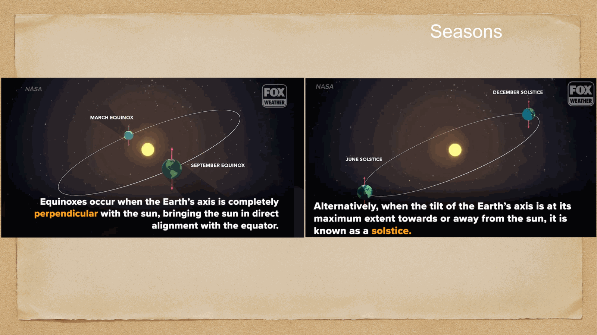
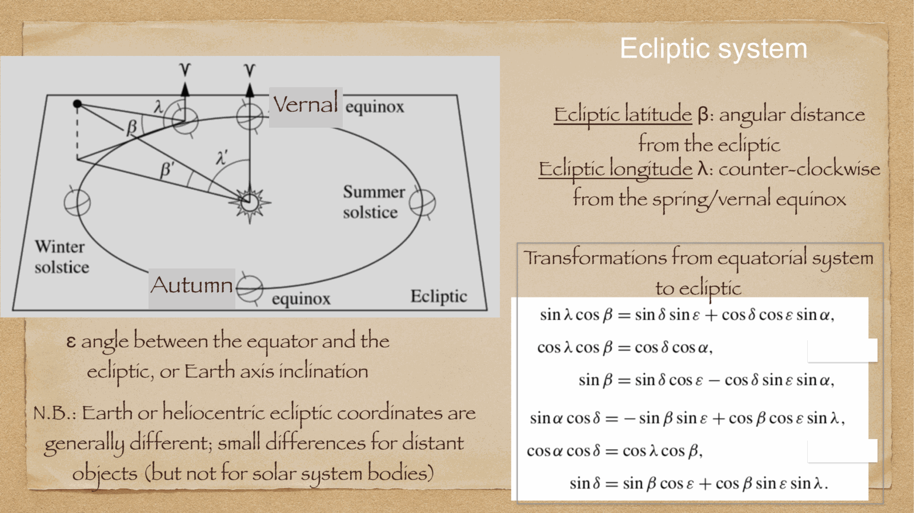
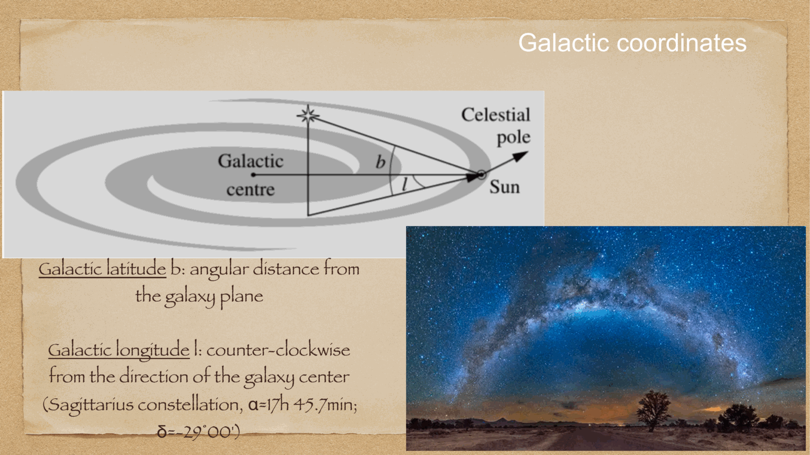
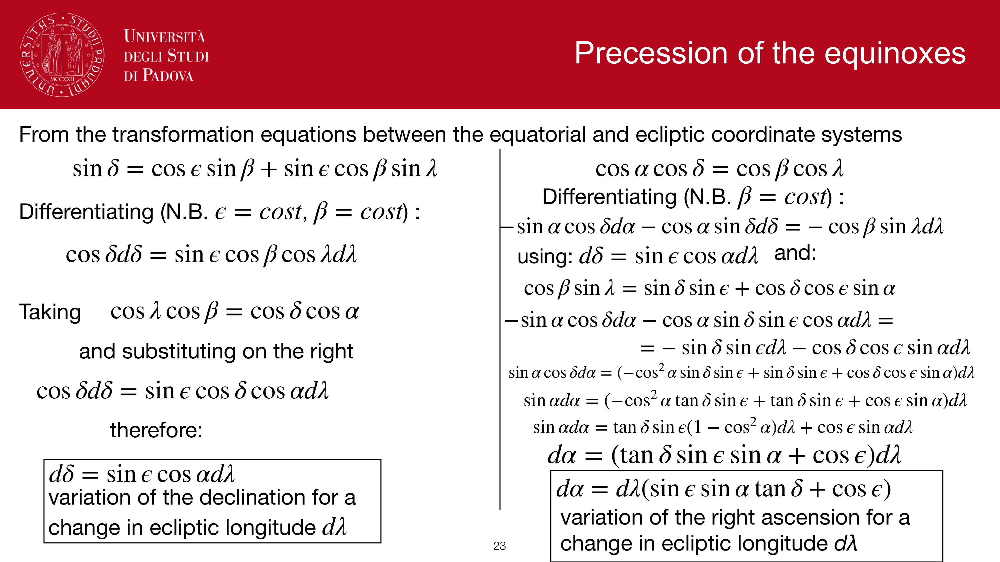
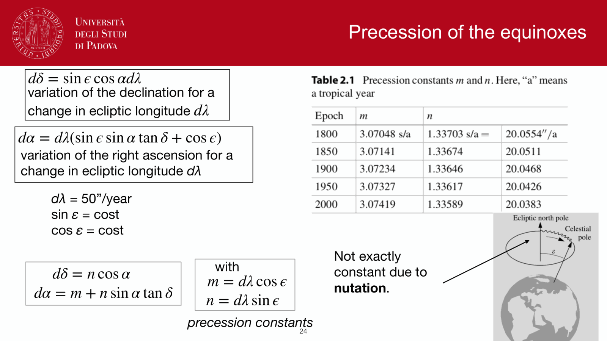

the **Galactic coordinate system** uses the fundamental symmetry plane of our own galaxy, the Milky Way, as its primary reference circle. it is the indispensable coordinate frame for studying Galactic structure, stellar kinematics, the interstellar medium (ISM), and the distribution of dark matter in our Galaxy.

---

## the geometric definition (IAU 1958 standard)

because our solar system is embedded inside the Milky Way disk, the band of the Milky Way traces a great circle across the celestial sphere. the International Astronomical Union (IAU) defined the standard system in 1958 based on neutral hydrogen 21 cm radio observations:

1. **Galactic plane (Galactic equator)**: the plane passing through the Sun parallel to the mean plane of the Milky Way disk ($b = 0^\circ$).
2. **Galactic Center ($l = 0^\circ, b = 0^\circ$)**: located in the constellation Sagittarius, in the precise direction of the compact radio source and supermassive black hole **Sgr A***. equatorial coordinates (J2000.0):
   $$\alpha_{GC} = 17^{\rm h} 45.6^{\rm m}, \quad \delta_{GC} = -28^\circ 56'$$
3. **North Galactic Pole (NGP, $b = +90^\circ$)**: located in Coma Berenices. equatorial coordinates (J2000.0):
   $$\alpha_P = 12^{\rm h} 51.4^{\rm m}, \quad \delta_P = +27^\circ 08'$$
4. **South Galactic Pole (SGP, $b = -90^\circ$)**: located in Sculptor.

the inclination of the Galactic plane to the celestial equator is $i \approx 62.87^\circ$.

---

## the coordinates: longitude and latitude

- **Galactic longitude** $l$ (or $\ell$): measured eastward along the Galactic equator from the direction of the Galactic Center, from $0^\circ$ to $360^\circ$.
  - $l = 0^\circ$: towards the **Galactic Center** (Sagittarius).
  - $l = 90^\circ$: direction of **Galactic rotation** (Cygnus, tangent to the local circular orbit).
  - $l = 180^\circ$: towards the **Galactic Anticenter** (Auriga/Taurus, looking away from the core).
  - $l = 270^\circ$: opposite to Galactic rotation (Vela).
- **Galactic latitude** $b$: the angular distance perpendicular to the Galactic equator, $-90^\circ \le b \le +90^\circ$. positive values point towards the North Galactic Pole (NGP).

---

## coordinate transformation: equatorial ↔ galactic

from spherical trigonometry on the triangle (NCP - NGP - Star):

### equatorial $(\alpha, \delta) \to$ galactic $(l, b)$:
$$\sin b = \sin\delta_P \sin\delta + \cos\delta_P \cos\delta \cos(\alpha - \alpha_P)$$
$$\cos b \sin(l_{CP} - l) = \cos\delta \sin(\alpha - \alpha_P)$$
$$\cos b \cos(l_{CP} - l) = \cos\delta_P \sin\delta - \sin\delta_P \cos\delta \cos(\alpha - \alpha_P)$$
where $\alpha_P = 192.86^\circ$ ($12^{\rm h}51.4^{\rm m}$), $\delta_P = +27.13^\circ$, and $l_{CP} = 122.93^\circ$ is the Galactic longitude of the North Celestial Pole.

---

## observational significance: the zone of avoidance

- **the Galactic plane ($\lvert b\rvert \le 10^\circ$)**: densely packed with stars, molecular clouds, and interstellar dust grains. dust extinction ($A_V$) reaches tens of magnitudes in the visual band, creating the historical **Zone of Avoidance** where optical extragalactic astronomy was historically blind. radio (21 cm, CO) and infrared (2MASS, Spitzer, WISE, JWST) observations penetrate this dust.
- **high galactic latitudes ($\lvert b\rvert > 30^\circ$)**: lines of sight pass quickly out of the thin Galactic disk ($h_z \sim 300$ pc). dust extinction drops to $A_V \lesssim 0.05-0.1$ mag. all major cosmological and deep extragalactic galaxy surveys (Hubble Deep Field, SDSS, DES, COSMOS, Euclid) target these high-$\lvert b\rvert$ windows to avoid Galactic foreground extinction and stellar crowding.

---

## see also

- [[Fundamentals_Astrophysics_Cosmology_MOC]]
- [[Milky Way structure]]
- [[Interstellar medium components and gas cycle]]
- [[Spiral arm kinematics]]
- [[Dark matter on galactic scales]]
- [[Galactic Center]]
- [[Equatorial system]]
- [[Ecliptic system]]

---

## observational astrophysics course slides (Prof. Paolo Cassata)

*Galactic coordinate system: Galactic longitude l, latitude b.*

*IAU 1958 Galactic North Pole and Galactic Center definition.*

## Linked References

- [[Ecliptic system]]
- [[Milky Way structure]]
- [[Fundamentals_Astrophysics_Cosmology_MOC]]
- [[Observational_Astrophysics_MOC]]

