
to truly understand what a galaxy is made of and how it works, optical imaging alone is completely inadequate. a galaxy is a complex ecological system composed of stars of all masses and ages, diffuse hot and cold gas, magnetic fields, relativistic particles, and obscuring dust grains. 

each component reveals itself in a different window of the **electromagnetic spectrum**. this is illustrated comprehensively by the multi-wavelength portrait of the **Whirlpool Galaxy (M51, NGC 5194)**.

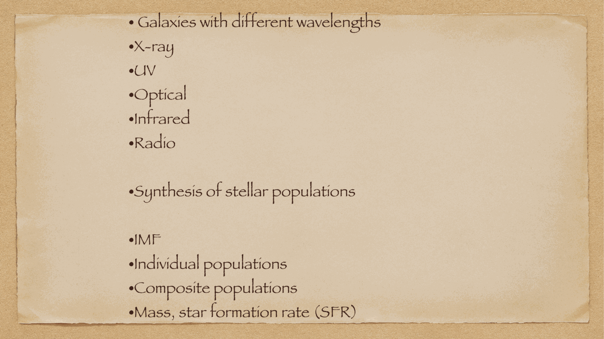

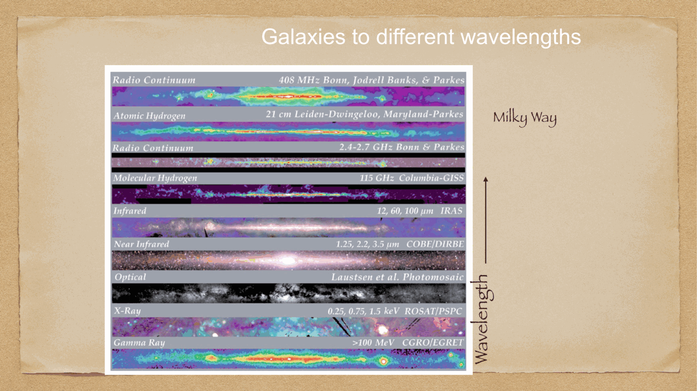

---

## the electromagnetic spectrum as an astrophysical diagnostic

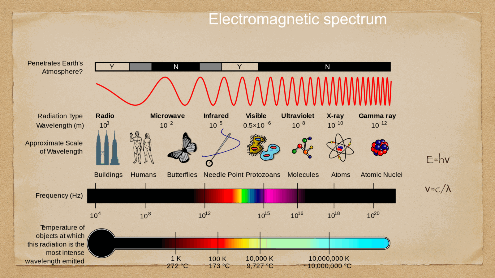

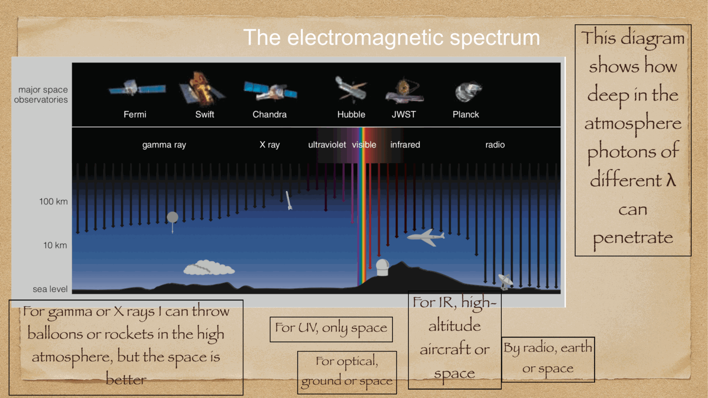

every waveband isolates distinct physical emission mechanisms:

---

## 1. M51 in X-Rays (Chandra X-ray Observatory)

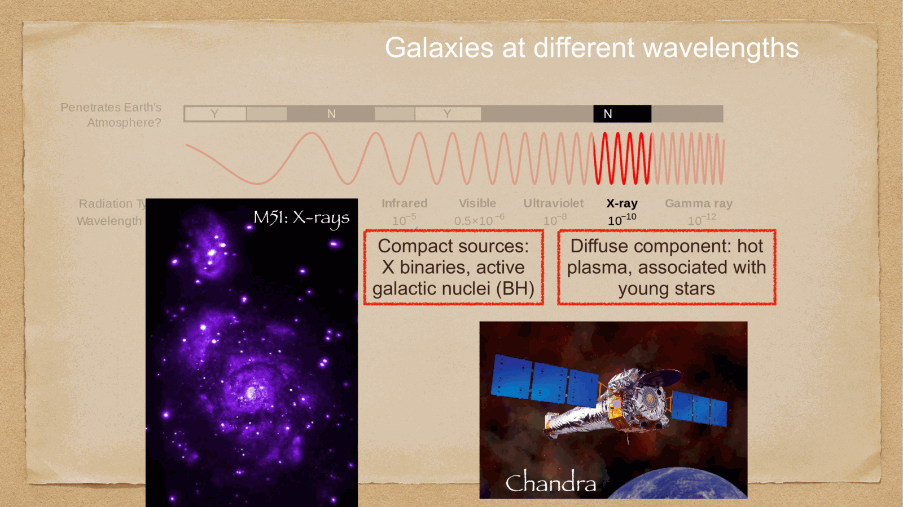

- **wavelength / energy**: $\lambda \sim 0.1 - 10$ nm ($E \sim 0.5 - 10$ keV).
- **emission mechanisms**:
  1. **diffuse hot gas**: shock-heated plasma at temperatures of $T \sim 10^6 - 10^7$ K produced by overlapping supernova explosions in spiral arms, emitting thermal bremsstrahlung and X-ray emission lines.
  2. **point sources (X-ray binaries)**: close binary systems where a neutron star or stellar-mass black hole accretes gas from a companion star via an accretion disk reaching millions of degrees.
  3. **active galactic nucleus (AGN)**: accretion onto the central supermassive black hole.

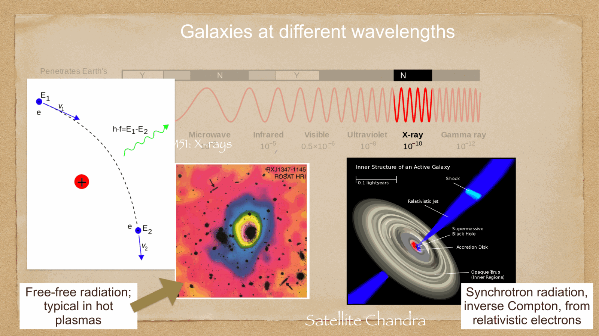

---

## 2. M51 in Ultraviolet (GALEX — Galaxy Evolution Explorer)

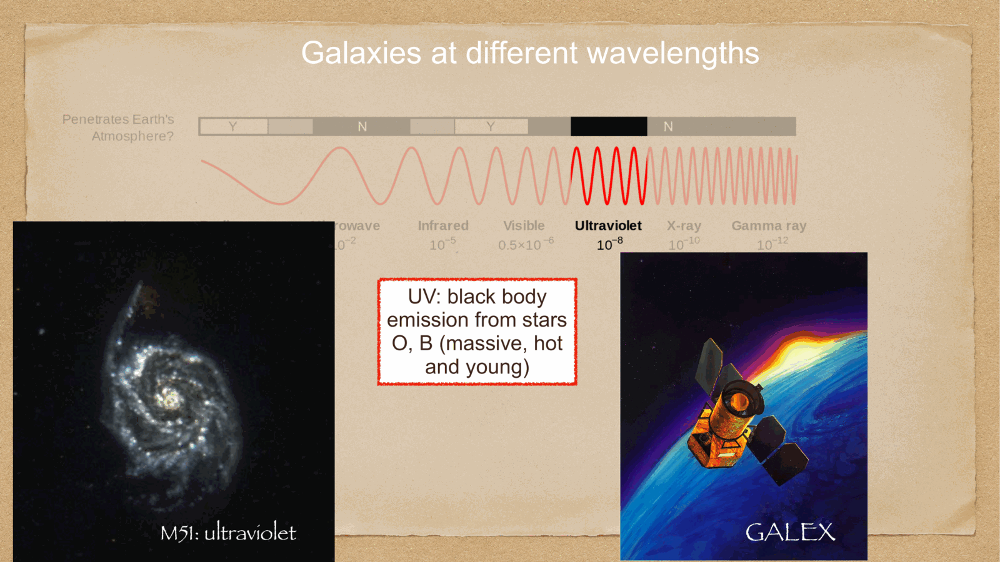

- **wavelength**: Far-UV ($135-175$ nm) and Near-UV ($175-280$ nm).
- **emission mechanism**: thermal photospheric blackbody radiation from young, hot, massive **O and B stars** ($T_{\text{eff}} \sim 20,000 - 50,000$ K).
- **astrophysical diagnostic**: because massive stars have lifetimes $< 100$ Myr, UV emission directly traces the **recent, unobscured Star Formation Rate (SFR)**. the spiral arms light up with brilliant UV knots of young stellar clusters.

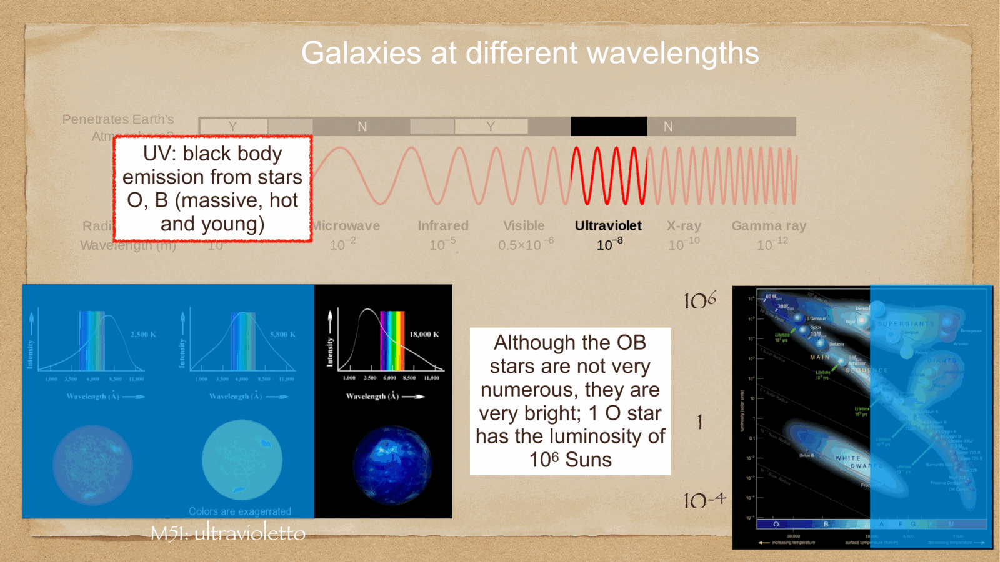

---

## 3. M51 in Optical Light (HST / Ground-Based Telescopes)

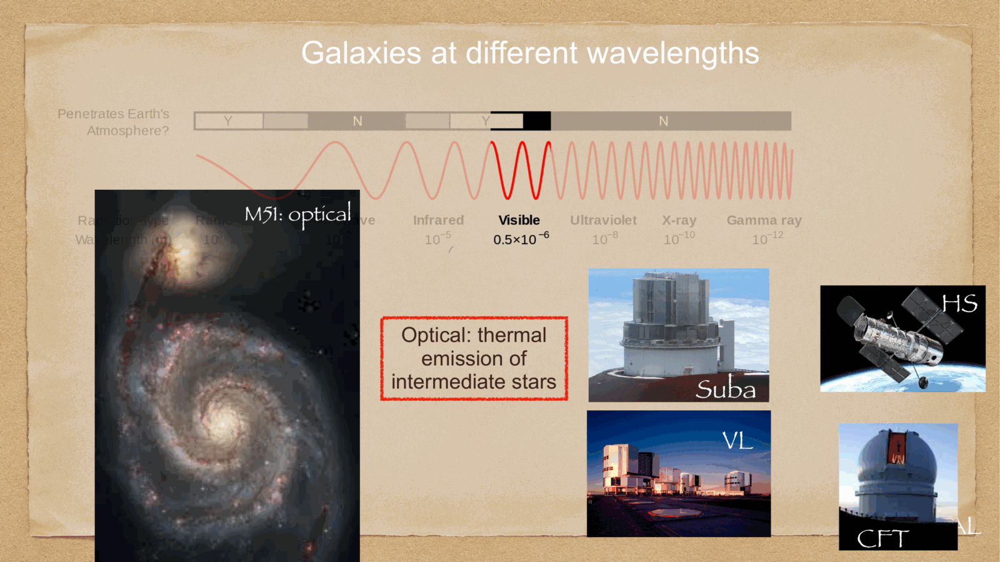

- **wavelength**: $400 - 700$ nm ($4000 - 7000$ Å).
- **emission mechanism**: thermal continuum from intermediate-mass main sequence stars (A, F, G dwarfs) and red giant stars.
- **structural features**: optical light reveals the classic spiral arms and central bulge, but is heavily sliced by dark, filamentary **interstellar dust absorption lanes** running along the inner edges of the spiral arms.

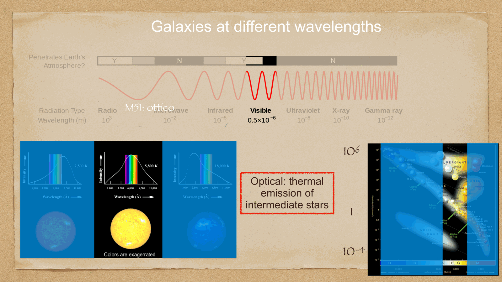

---

## 4. M51 in the $H\alpha$ Recombination Line (Narrowband $656.3$ nm)

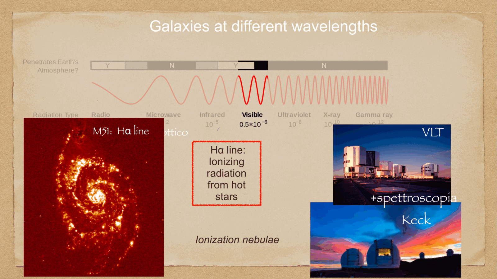

- **wavelength**: $\lambda = 656.28$ nm ($n=3 \to n=2$ Balmer transition).
- **emission mechanism**: photoionized gas in **HII regions**. massive O-stars emit energetic ionizing photons ($h\nu > 13.6$ eV) that strip electrons from hydrogen atoms; cascading radiative recombinations emit bright $H\alpha$ photons.
- **diagnostic**: the total $H\alpha$ luminosity $L(H\alpha)$ is directly proportional to the instantaneous star formation rate (over timescales $\sim 10$ Myr):
  $$\text{SFR}(M_\odot/\text{yr}) \approx 5.5 \times 10^{-42} \, L(H\alpha) \, [\text{erg/s}]$$

---

## 5. M51 in Near-Infrared (NIR: 2MASS, VLT, Spitzer $1 - 2.5\,\mu$m)

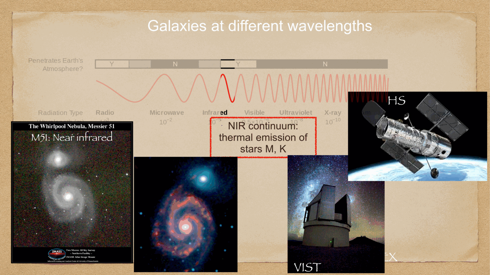

- **wavelength**: $J$ ($1.25\,\mu$m), $H$ ($1.65\,\mu$m), $K_s$ ($2.15\,\mu$m).
- **emission mechanism**: thermal emission peaking from old, low-mass stars (K and M giants).
- **why NIR is the master tracer of stellar mass**:
  1. dust extinction is minimal ($A_K \approx 0.1 A_V$), revealing the true underlying disk structure without obscuration.
  2. NIR light is dominated by the long-lived stars that make up $> 90\%$ of the galaxy's total **stellar mass $M_*$**, unaffected by transient bursts of young stars.

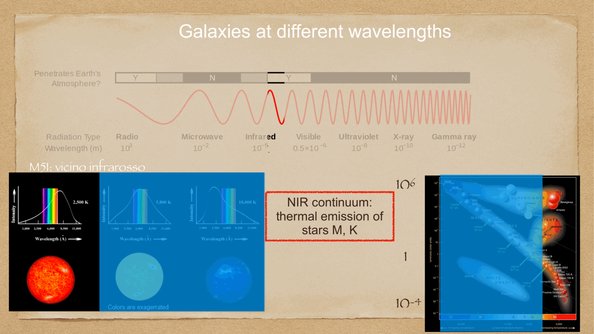

---

## 6. M51 in Mid- and Far-Infrared (MIR/FIR: Spitzer, Herschel $24 - 500\,\mu$m)

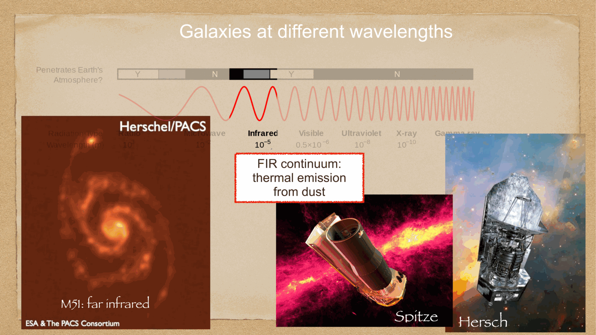

- **wavelength**: $24\,\mu$m, $70\,\mu$m, $100\,\mu$m, $160\,\mu$m, $250\,\mu$m.
- **emission mechanism**: **thermal re-emission from interstellar dust grains**. dust grains absorb UV and optical starlight from young stars, heat up to $T \sim 20 - 50$ K, and re-radiate this energy as modified blackbodies in the far-infrared:
  $$F_\nu \propto \nu^\beta B_\nu(T_{\text{dust}}), \qquad \beta \approx 1.5 - 2.0$$
- **diagnostic**: traces **dust-obscured star formation**; in dusty galaxies, up to $90-99\%$ of total star formation is invisible in UV/optical and can only be detected in the FIR!

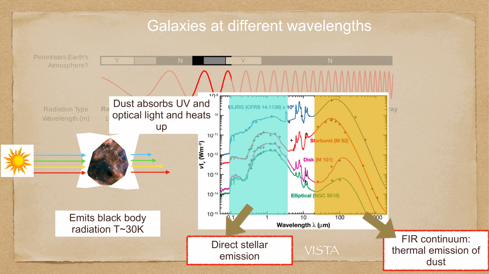

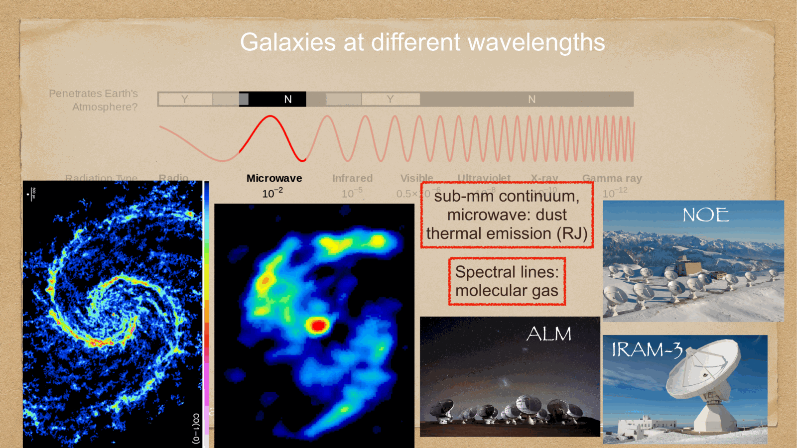

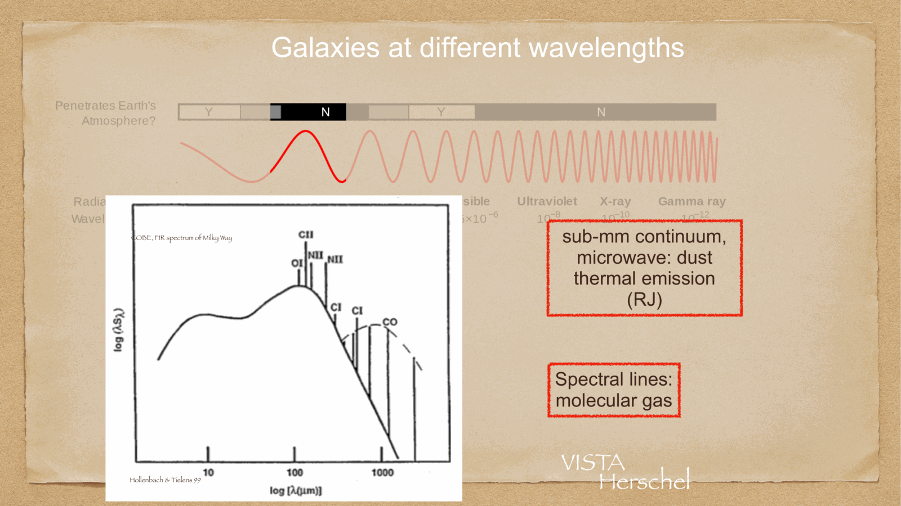

---

## 7. M51 in Radio Continuum (VLA $1.4$ GHz / $20$ cm)

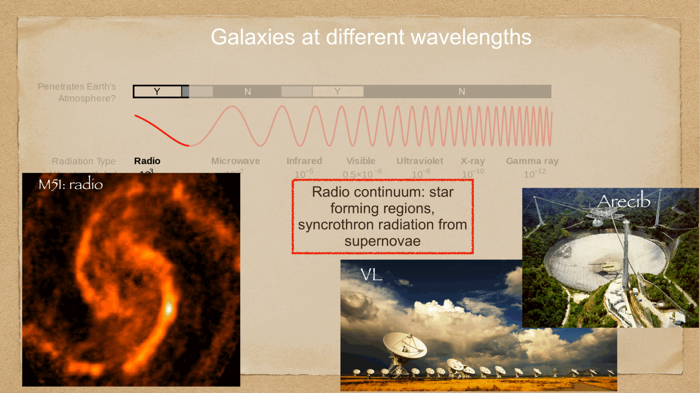

- **wavelength**: centimeter to decimeter radio waves.
- **emission mechanisms**:
  1. **non-thermal synchrotron radiation**: relativistic electrons accelerated in the shock fronts of supernova remnants spiraling around Galactic magnetic fields ($F_\nu \propto \nu^{-\alpha}$, $\alpha \approx 0.7-0.8$).
  2. **thermal free-free radiation (bremsstrahlung)**: electrons scattering off ions in hot HII regions.
- **astrophysical diagnostic**: completely immune to dust extinction; directly measures supernova rate and cosmic ray electron acceleration.

---

## 8. M51 in the 21 cm HI Line (Neutral Hydrogen)

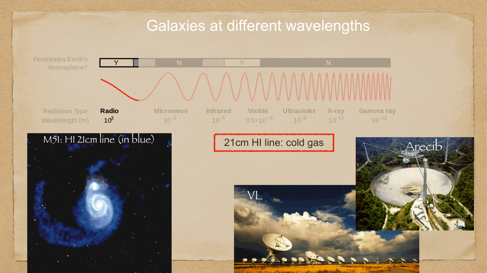

- **frequency / wavelength**: $1420.4$ MHz / $\lambda = 21.1$ cm.
- **emission mechanism**: spin-flip hyperfine transition of neutral atomic hydrogen.
- **diagnostic**: maps the raw gas reservoir of the galaxy. in M51, 21 cm maps reveal that neutral gas extends **more than twice as far out** as the optical stellar disk, tracing tidal bridges and debris connecting M51 to its interacting companion NGC 5195!

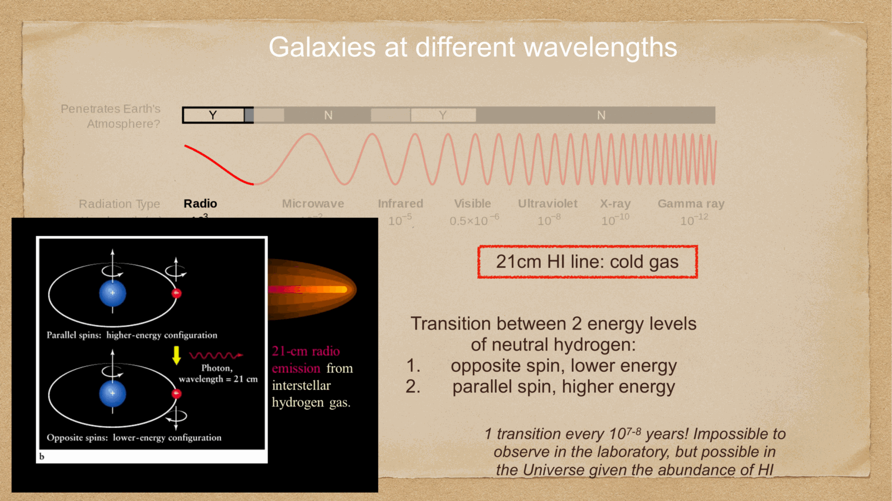

---

## the integrated Panchromatic Spectral Energy Distribution (SED)

when the emission across all wavebands is plotted together, it forms the characteristic **Panchromatic Galaxy SED**:
1. **stellar peak ($0.3 - 2\,\mu$m)**: direct starlight from stars of all spectral types.
2. **dust peak ($8 - 1000\,\mu$m)**: reprocessed starlight emitted by warm and cold dust grains.
3. **radio tail ($> 1$ mm)**: synchrotron and free-free emission.

energy conservation requires that:
$$L_{\text{bol, dust}} = L_{\text{bol, absorbed starlight}}$$
every photon absorbed by dust in the UV/optical is precisely re-emitted in the infrared!

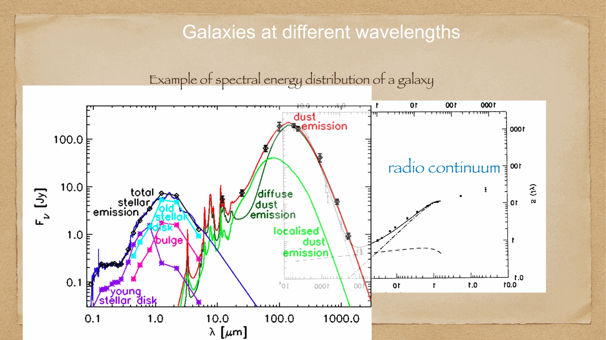

---

## see also

- [Fundamentals_Astrophysics_Cosmology_MOC](../../04_Atlas/Fundamentals_Astrophysics_Cosmology_MOC.html)
- [Galaxies in the local universe](./Galaxies%20in%20the%20local%20universe.html)
- [Spectral energy distributions](./Spectral%20energy%20distributions.html)
- [Electromagnetic radiation basics](./Electromagnetic%20radiation%20basics.html)
- [Interstellar medium components and gas cycle](./Interstellar%20medium%20components%20and%20gas%20cycle.html)


  <h4 class="backlinks-title">Linked References (5)</h4>
  <ul class="backlinks-list">
    <li class="backlink-item-wrap"><a href="./Electromagnetic%20radiation%20basics.html" class="backlink-item">Electromagnetic radiation basics</a></li>
    <li class="backlink-item-wrap"><a href="../../04_Atlas/Fundamentals_Astrophysics_Cosmology_MOC.html" class="backlink-item">Fundamentals_Astrophysics_Cosmology_MOC</a></li>
    <li class="backlink-item-wrap"><a href="./Galaxies%20in%20the%20local%20universe.html" class="backlink-item">Galaxies in the local universe</a></li>
    <li class="backlink-item-wrap"><a href="./Hubble%20morphological%20sequence.html" class="backlink-item">Hubble morphological sequence</a></li>
    <li class="backlink-item-wrap"><a href="./Spectral%20energy%20distributions.html" class="backlink-item">Spectral energy distributions</a></li>
  </ul>

