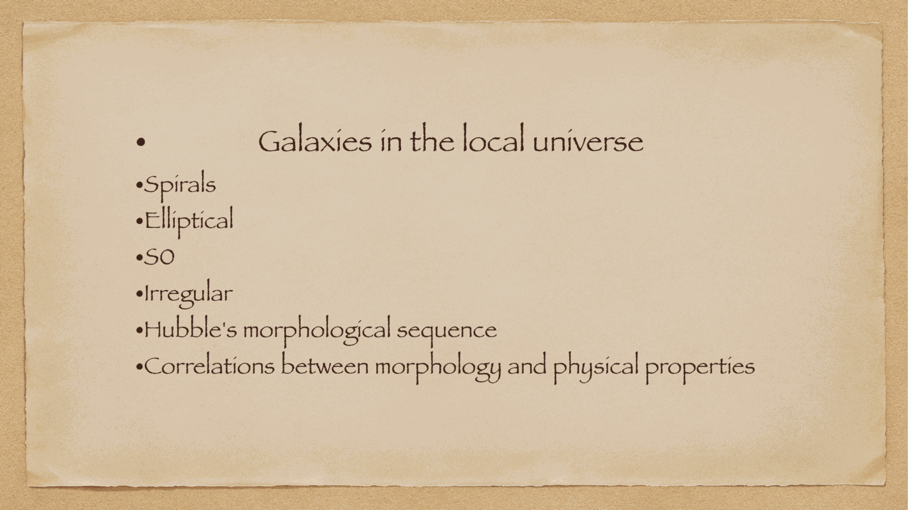
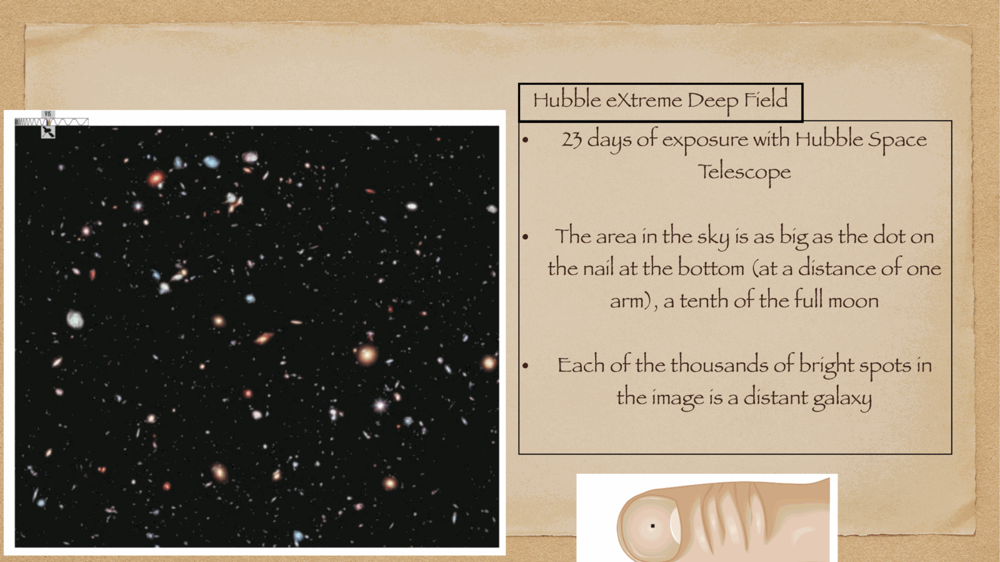
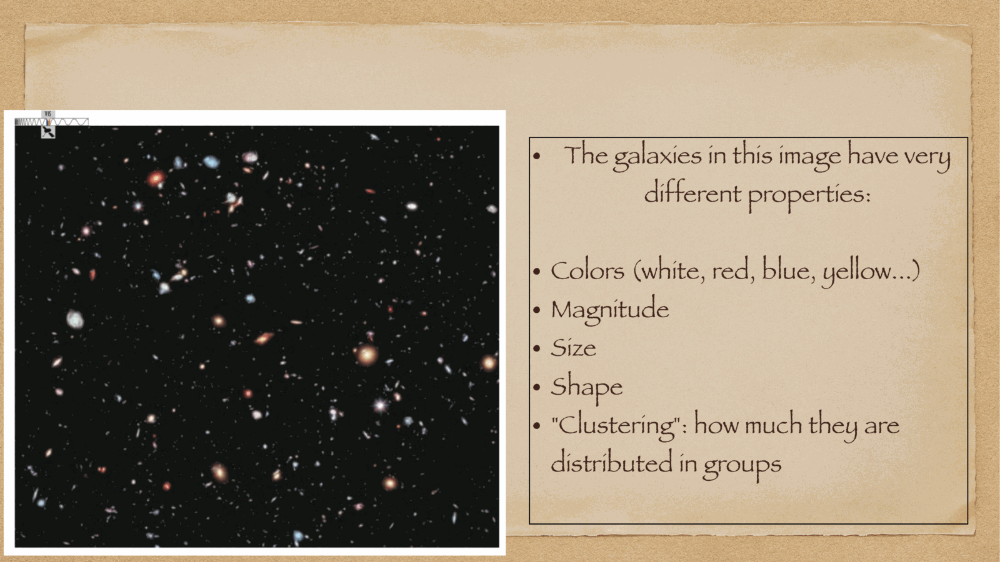
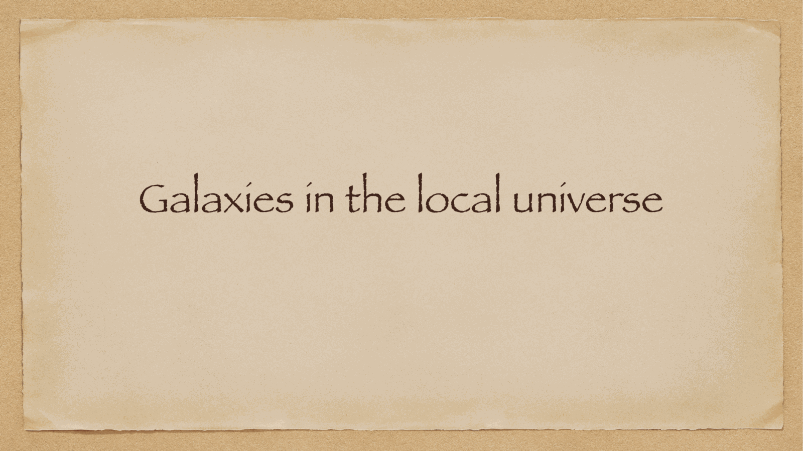
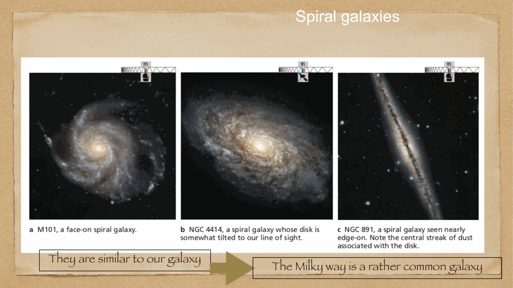
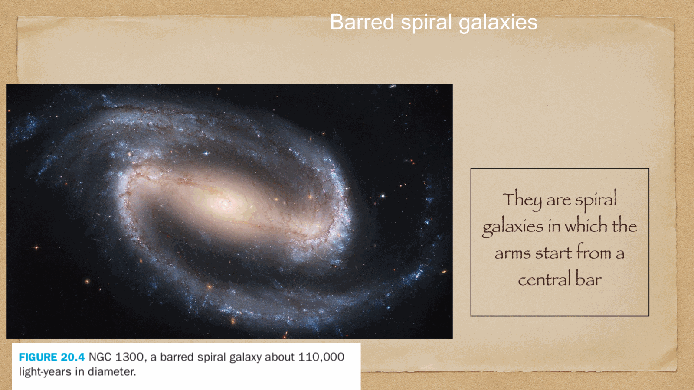
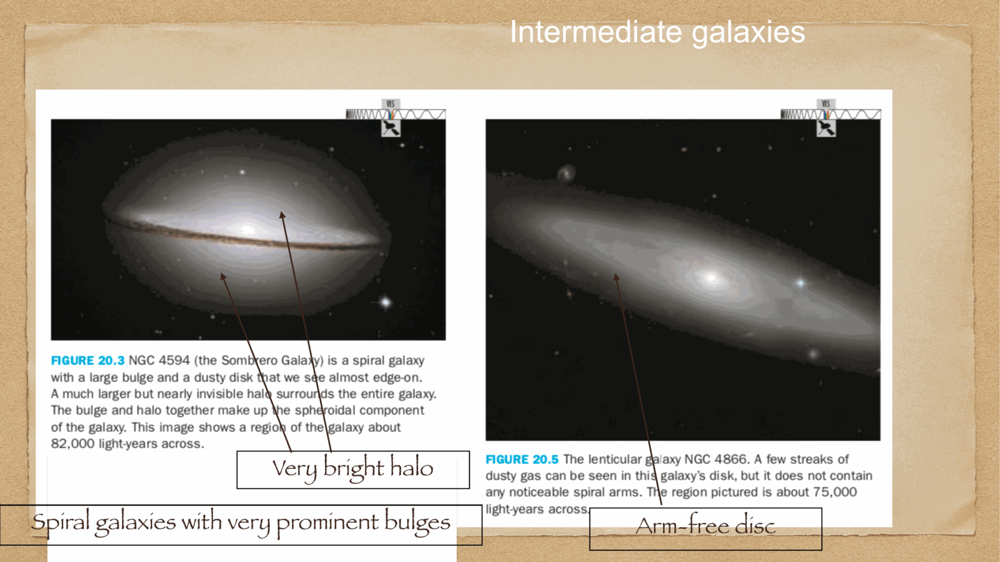
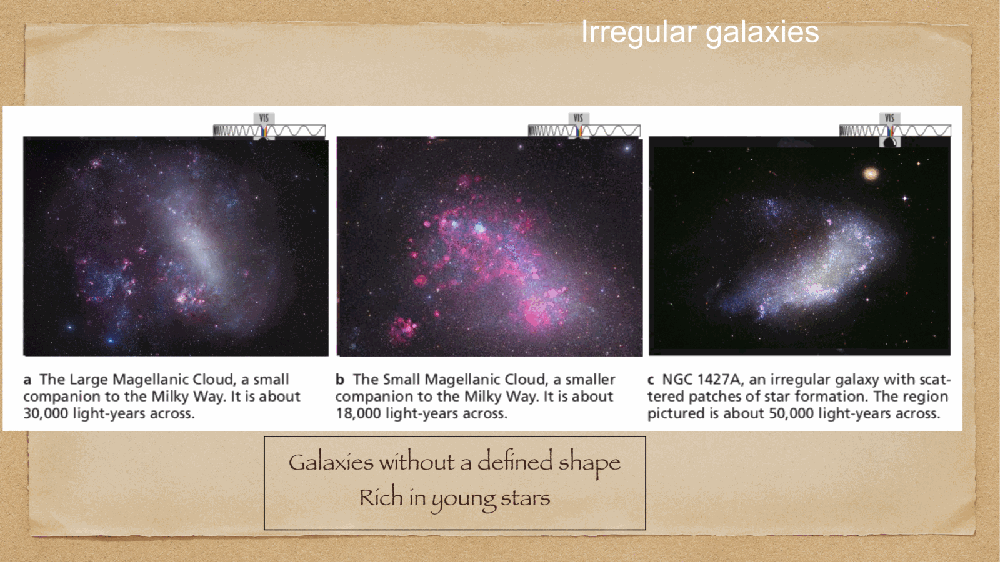
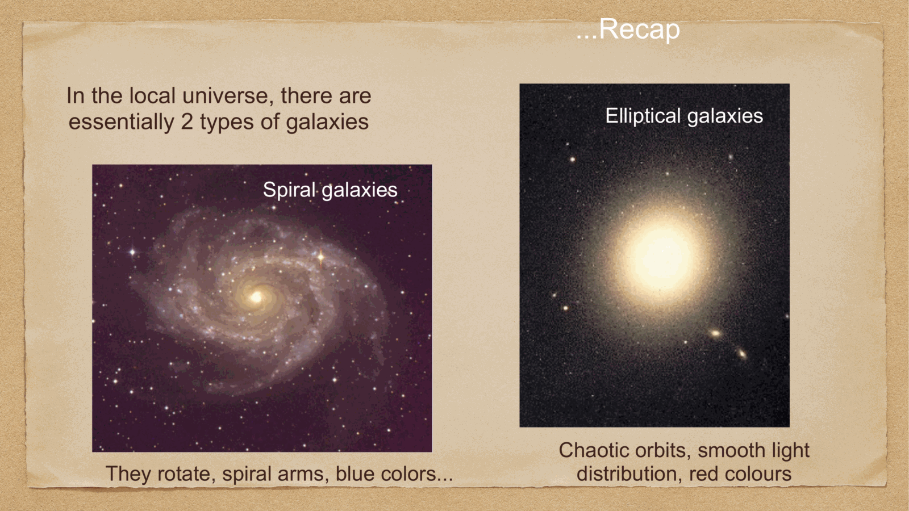


outside the Milky Way lie billions of other galaxies spanning a vast diversity of shapes, masses, luminosities, and evolutionary stages. in the local universe, galaxies divide primarily into two great morphological classes: **spiral galaxies** and **elliptical galaxies**, alongside transitional **lenticular (S0) galaxies** and chaotic **irregular galaxies**.

---

## the view from deep space: the Hubble eXtreme Deep Field (XDF)

the **Hubble eXtreme Deep Field (XDF)**, compiled from 23 days of total exposure time (nearly 3 million seconds of observation) over a decade by the Hubble Space Telescope, represents one of the deepest images of the universe ever captured:
- covers a patch of sky in the constellation Fornax smaller than a pinhead held at arm's length.
- contains approximately **5,500 galaxies** in that tiny field alone!
- looking back across $13.2$ billion years of cosmic time, revealing the dramatic evolutionary transition from small, clumpy proto-galaxies in the early universe to the mature, grand-design galaxies of today.

---

## the primary galaxy types in the local universe

### 1. Spiral Galaxies (Galassie a Spirale)
- **structure**: prominent, rotating thin disk containing spiral arms, surrounded by a central spheroidal bulge and a faint stellar halo.
- **Milky Way analog**: our Galaxy is a typical barred spiral galaxy.
- **content**: rich in cold molecular gas ($H_2$) and atomic neutral hydrogen (HI); active ongoing star formation in spiral arms; dominated by young, blue Population I stars along the arms, with older red stars in the bulge.

### 2. Barred Spiral Galaxies (Spirali Barrate)
- spiral galaxies where spiral arms do not emerge directly from a spherical nucleus, but unwind from the ends of a prominent, linear **stellar bar** cutting across the center.
- over **$60-70\%$ of all spiral galaxies** in the local universe possess a central bar (including the Milky Way, type SBbc).
- **physical origin**: dynamical bar instability in rotating stellar disks; bars act as gravitational funnels, driving interstellar gas inward to fuel central starbursts and supermassive black holes.

### 3. Elliptical Galaxies (Galassie Ellittiche)
- **structure**: smooth, featureless, nearly ellipsoidal light distributions; completely devoid of a disk and spiral arms.
- **content**: virtually devoid of cold gas and dust; negligible current star formation.
- **stellar population**: composed almost exclusively of ancient, red Population II stars ($t > 10$ Gyr).
- **range**: span the largest mass range of any galaxy class—from tiny **dwarf spheroidal galaxies** ($M \sim 10^7 M_\odot$) to colossal **giant central cluster ellipticals (cD galaxies)** with masses $M > 10^{13} M_\odot$.

### 4. Lenticular Galaxies (Galassie Lenticolari, S0 / SB0)
- **morphology**: intermediate between ellipticals and spirals; contain a prominent central bulge and a clear flat disk, but are **completely devoid of spiral arms**.
- **content**: gas-poor, dust-poor, with little to no active star formation ("red and dead disks").
- **evolutionary origin**: likely spiral galaxies that had their interstellar gas stripped away by ram pressure in dense galaxy clusters or through exhaustion by starbursts.

### 5. Irregular Galaxies (Galassie Irregolari)
- **morphology**: asymmetric, chaotic light distributions lacking central symmetry or spiral arms.
- **content**: rich in cold gas and dust; intense, active star formation.
- **examples**: the **Small Magellanic Cloud (SMC)**, starburst galaxy M82 (exploding galaxy).
- **origin**: often the product of violent gravitational tidal interactions or major mergers between galaxies.

---

## summary of the local universe census

in the local volume ($z \approx 0$):
- spiral and irregular galaxies dominate by number in low-density field environments.
- giant ellipticals and S0 galaxies dominate in high-density galaxy clusters.
- spiral disks are active, star-forming, rotation-supported systems.
- ellipticals are passive, quiescent, pressure-supported systems.

---

## see also

- [Fundamentals_Astrophysics_Cosmology_MOC](../../04_Atlas/Fundamentals_Astrophysics_Cosmology_MOC.html)
- [Hubble morphological sequence](./Hubble%20morphological%20sequence.html)
- [Galaxy morphology vs physical properties](./Galaxy%20morphology%20vs%20physical%20properties.html)
- [Galaxies across wavelengths](./Galaxies%20across%20wavelengths.html)
- [Milky Way structure](./Milky%20Way%20structure.html)


  <h4 class="backlinks-title">Linked References (5)</h4>
  <ul class="backlinks-list">
    <li class="backlink-item-wrap"><a href="../../04_Atlas/Fundamentals_Astrophysics_Cosmology_MOC.html" class="backlink-item">Fundamentals_Astrophysics_Cosmology_MOC</a></li>
    <li class="backlink-item-wrap"><a href="./Galaxies%20across%20wavelengths.html" class="backlink-item">Galaxies across wavelengths</a></li>
    <li class="backlink-item-wrap"><a href="./Galaxy%20clusters%20and%20overview%20of%20evolution.html" class="backlink-item">Galaxy clusters and overview of evolution</a></li>
    <li class="backlink-item-wrap"><a href="./Galaxy%20morphology%20vs%20physical%20properties.html" class="backlink-item">Galaxy morphology vs physical properties</a></li>
    <li class="backlink-item-wrap"><a href="./Hubble%20morphological%20sequence.html" class="backlink-item">Hubble morphological sequence</a></li>
  </ul>

