
# galaxy color, density and morphology

up: [Pablo_02_Statistical_properties_of_galaxies](../../02_Literature/Lectures/Observational_Cosmology/Pablo_02_Statistical_properties_of_galaxies.html)

## three correlated axes

galaxies cluster together on three axes that are not independent:

1. **color**: red vs blue (see [Color bimodality of galaxies](./Color%20bimodality%20of%20galaxies.html))
2. **morphology**: early-type (E/S0) vs late-type (Sa/Sb/Sc/Irr)
3. **environment**: high local density (clusters, groups) vs low density (field, voids)

the empirical correlations:

- red galaxies are mostly early-type, blue galaxies are mostly late-type (Strateva 2001, Hogg 2004). color is a good *cheap proxy* for morphology.
- denser environments host more red, more early-type galaxies. Dressler 1980 plotted **morphology-density relation**: $f_E$ rises from $\sim 10\%$ in the field to $\sim 40\%$ in cluster cores; $f_S$ falls correspondingly.
- color-density is even tighter than morphology-density: at fixed $M_*$, the fraction of red galaxies rises smoothly with the local number-density of neighbors (Hogg 2004 fig. 2; Blanton & Moustakas 2009 review).

## blanton & moustakas 2009 summary plot 

 

the canonical figure: a CMD in bins of local density. the red sequence is essentially the same in every density bin, but the *fraction* of galaxies on it grows with density. the blue cloud's *typical color* shifts blueward at low density (Blanton 2009 fig. 5).

## what causes the correlation

two camps:

- **nature**: galaxies in dense regions formed earlier, in higher-mass halos, so they ran out of gas first.
- **nurture**: dense environments physically remove or heat gas (ram pressure, strangulation, harassment, tidal stripping, mergers).

modern view: both, with environment-driven quenching dominating for satellites and mass-driven quenching dominating for centrals.

## why this matters statistically

if you measure a [Luminosity function definition](./Luminosity%20function%20definition.html) in a flux-limited survey without splitting by environment, you average over a huge dynamic range of $f_{\text{red}}$. the **field LF** is bluer and has a steeper faint-end slope than the **cluster LF**.

## connections

- prior: [Color bimodality of galaxies](./Color%20bimodality%20of%20galaxies.html), [Red sequence and blue cloud](./Red%20sequence%20and%20blue%20cloud.html)
- mechanism: [Green valley and quenching tracks](./Green%20valley%20and%20quenching%20tracks.html)
- LF split: [LF by morphology and SED](./LF%20by%20morphology%20and%20SED.html) (Driver 2006 splits LF by morphology)
- galaxy formation big picture: [Halo gravity suppression of galaxy formation](./Halo%20gravity%20suppression%20of%20galaxy%20formation.html)

## key references

- Dressler 1980 (morphology-density relation)
- Hogg et al. 2004, ApJ 601, L29
- Blanton & Moustakas 2009, ARAA 47, 159
- Peng et al. 2010 (mass and environment quenching as separable)

---

## astrophysics of galaxies figures and slides (Prof. Alessandro Pizzella)

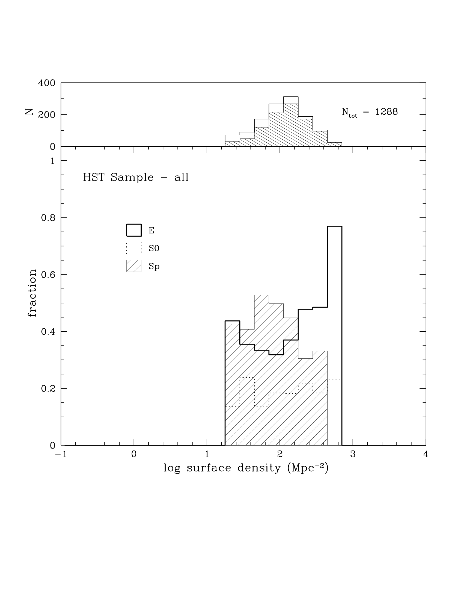
*Morphology-Density Relation from Dressler (1997): fraction of E, S0, and Sp vs local galaxy density.*

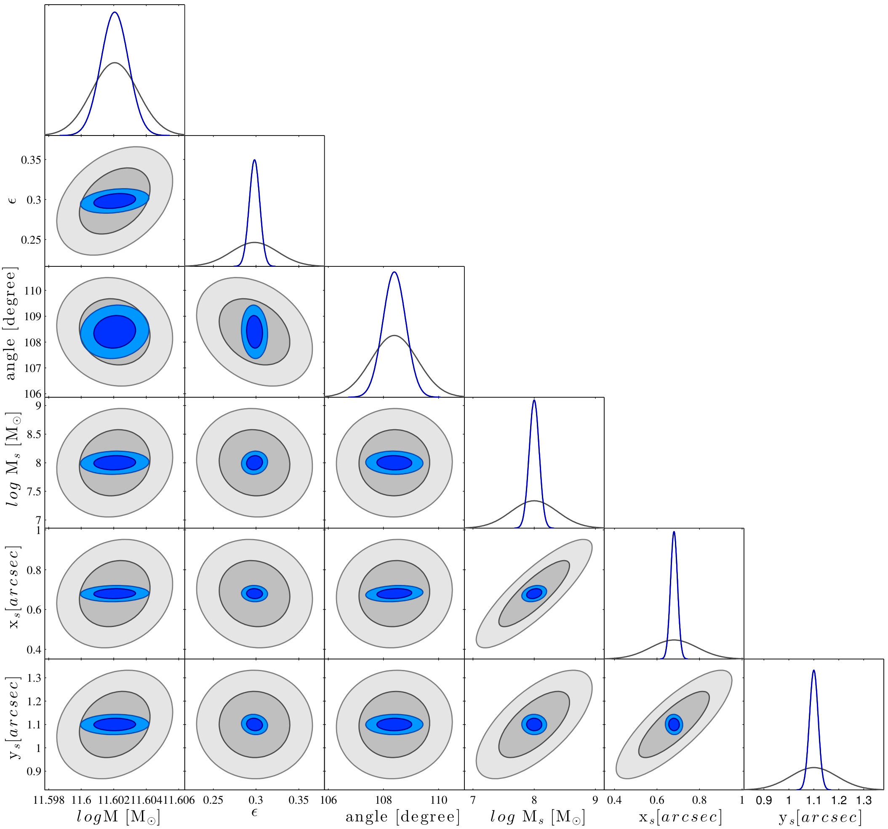
*Evolution of morphological fractions in clusters from Fasano et al. (2012).*

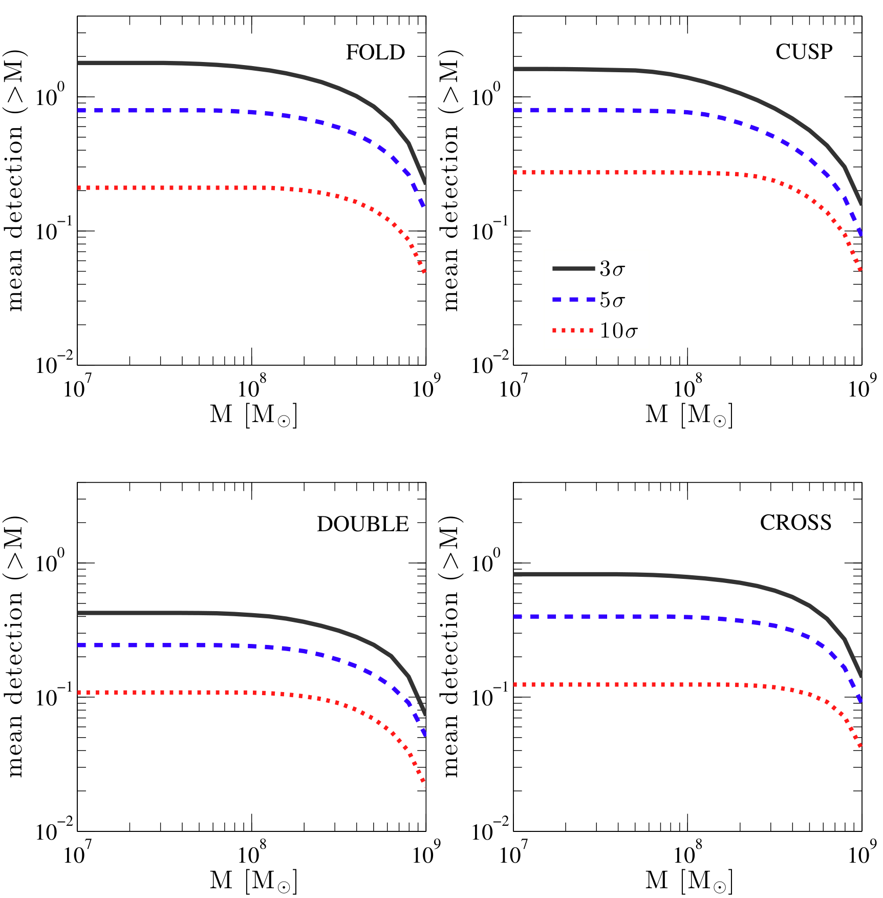
*Morphology-density relation at low vs high redshift (Fasano et al. 2012).*

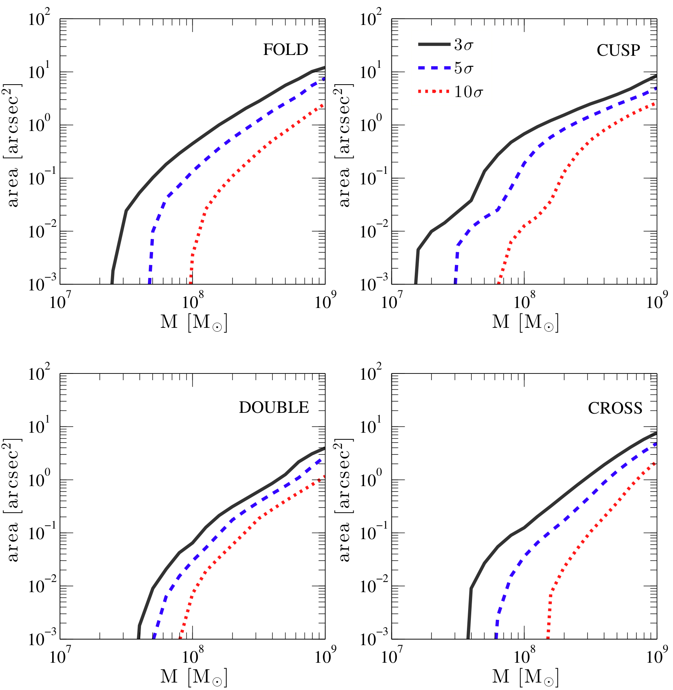
*Morphological fractions as a function of cluster-centric radius.*

---

## lecture slides and reference figures (Prof. Alessandro Pizzella)

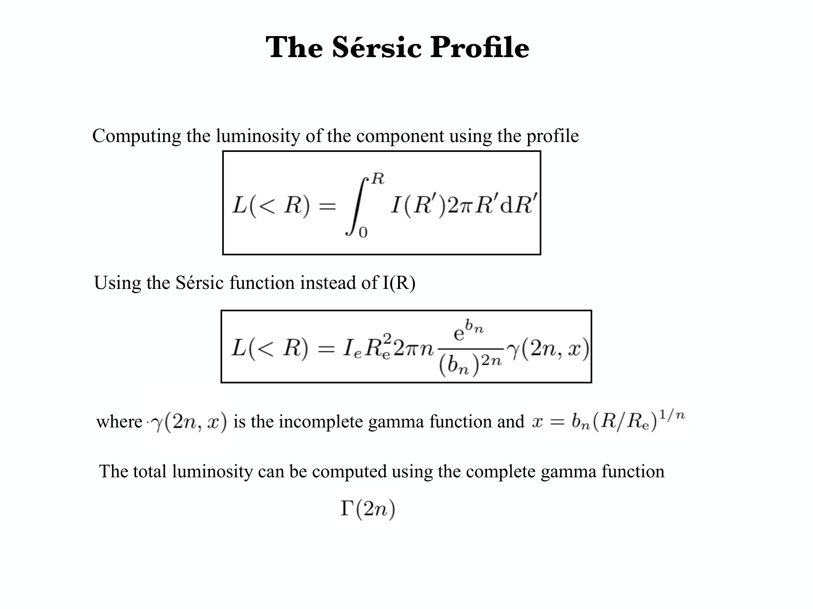

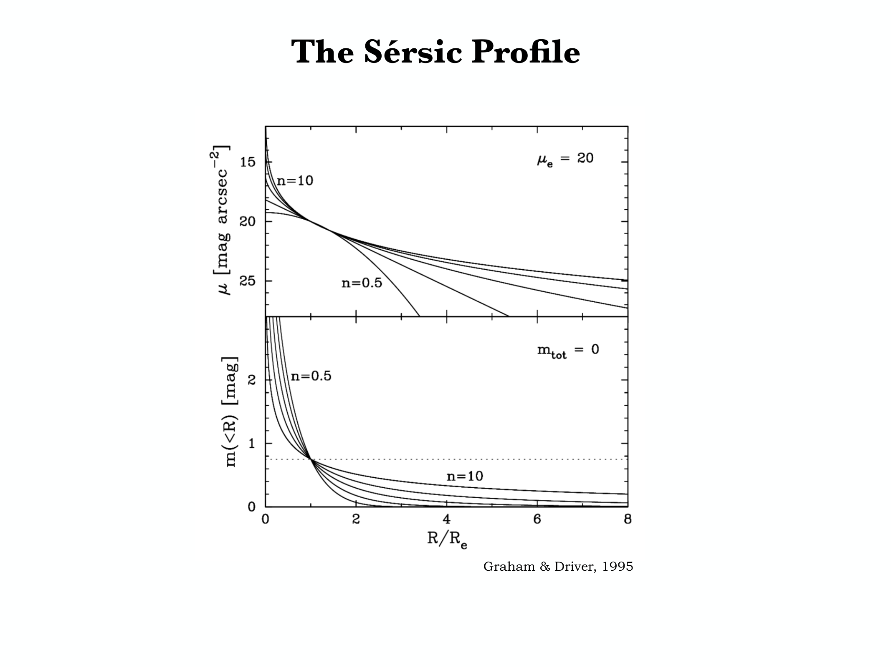

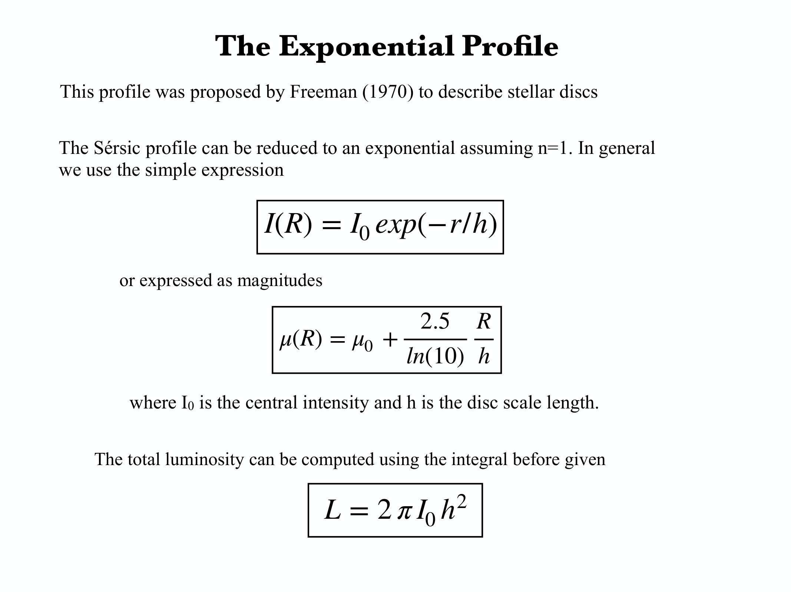

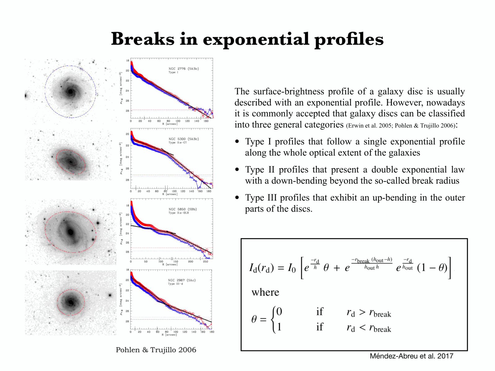

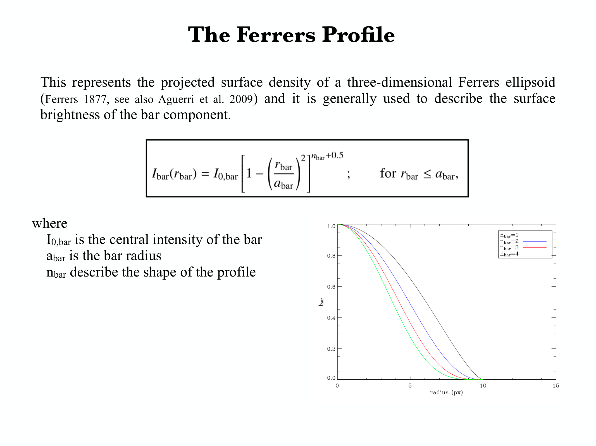

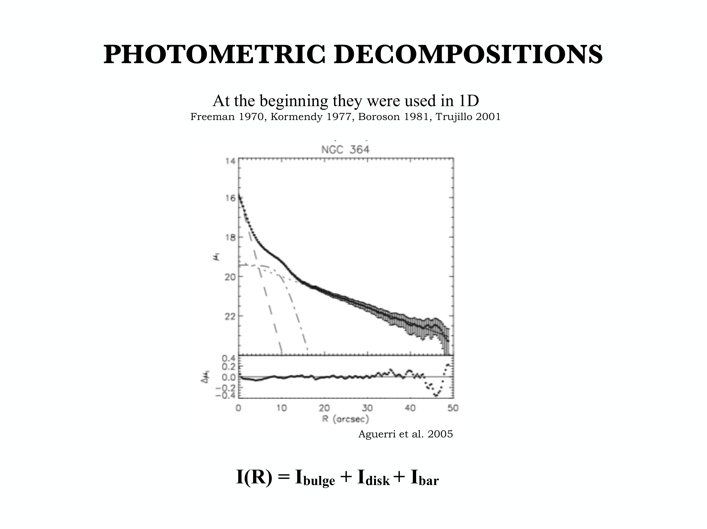

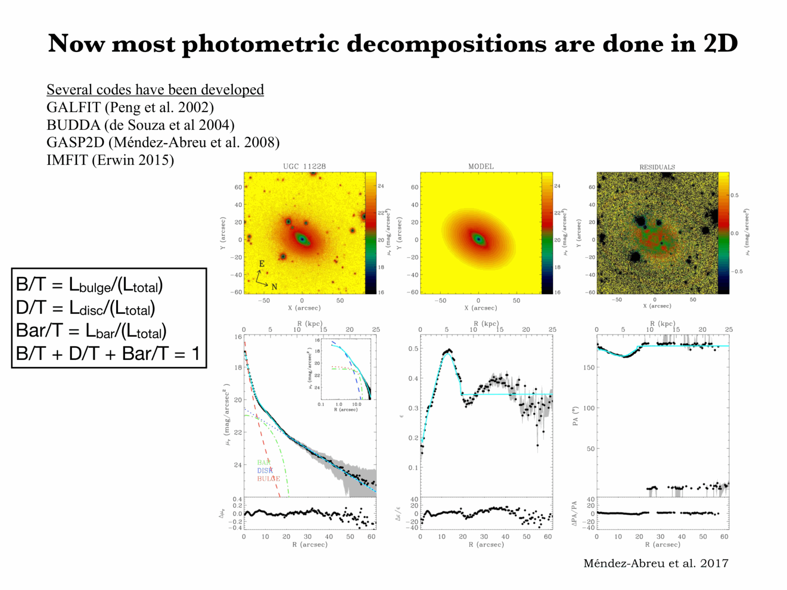

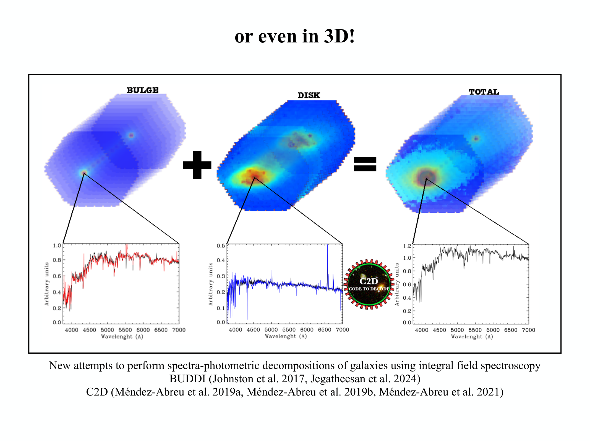

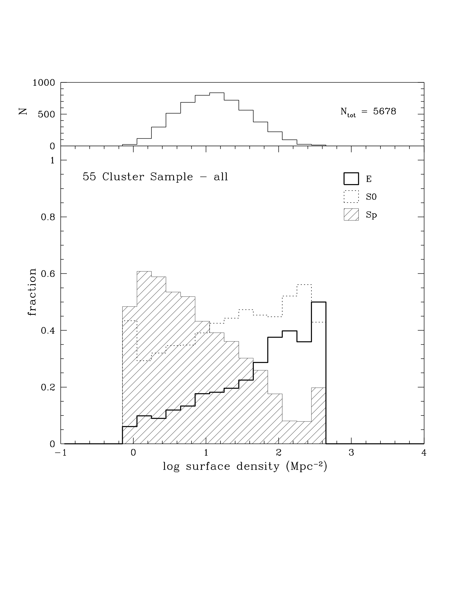


  <h4 class="backlinks-title">Linked References (11)</h4>
  <ul class="backlinks-list">
    <li class="backlink-item-wrap"><a href="../../04_Atlas/Astrophysics_of_Galaxies_MOC.html" class="backlink-item">Astrophysics_of_Galaxies_MOC</a></li>
    <li class="backlink-item-wrap"><a href="./CAS%20galaxy%20classification.html" class="backlink-item">CAS galaxy classification</a></li>
    <li class="backlink-item-wrap"><a href="./Color%20bimodality%20of%20galaxies.html" class="backlink-item">Color bimodality of galaxies</a></li>
    <li class="backlink-item-wrap"><a href="./Galaxy%20mergers%20and%20SF.html" class="backlink-item">Galaxy mergers and SF</a></li>
    <li class="backlink-item-wrap"><a href="./Galaxy%20spectroscopy%20by%20type.html" class="backlink-item">Galaxy spectroscopy by type</a></li>
    <li class="backlink-item-wrap"><a href="./Green%20valley%20and%20quenching%20tracks.html" class="backlink-item">Green valley and quenching tracks</a></li>
    <li class="backlink-item-wrap"><a href="./Halo%20gravity%20suppression%20of%20galaxy%20formation.html" class="backlink-item">Halo gravity suppression of galaxy formation</a></li>
    <li class="backlink-item-wrap"><a href="./LF%20by%20morphology%20and%20SED.html" class="backlink-item">LF by morphology and SED</a></li>
    <li class="backlink-item-wrap"><a href="../../04_Atlas/Observational_Cosmology_MOC.html" class="backlink-item">Observational_Cosmology_MOC</a></li>
    <li class="backlink-item-wrap"><a href="../../02_Literature/Lectures/Observational_Cosmology/Pablo_02_Statistical_properties_of_galaxies.html" class="backlink-item">Pablo_02_Statistical_properties_of_galaxies</a></li>
    <li class="backlink-item-wrap"><a href="./Red%20sequence%20and%20blue%20cloud.html" class="backlink-item">Red sequence and blue cloud</a></li>
  </ul>

