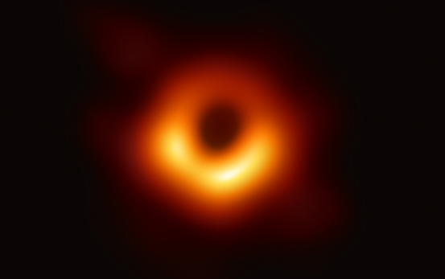


# Geodesic deviation and tidal forces

---

### General Relativity Mathematical & Oral Defense Panel

*Cambridge Lecture Diagram: Light cone structure in Minkowski and curved spacetime, defining past and future causal domains.*


  <h4 class="backlinks-title">Linked References (1)</h4>
  <ul class="backlinks-list">
    <li class="backlink-item-wrap"><a href="../../04_Atlas/General_Relativity_MOC.html" class="backlink-item">General_Relativity_MOC</a></li>
  </ul>

