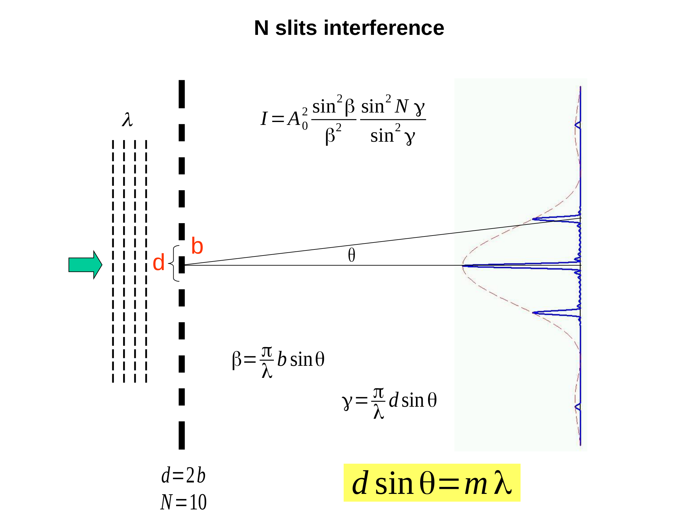
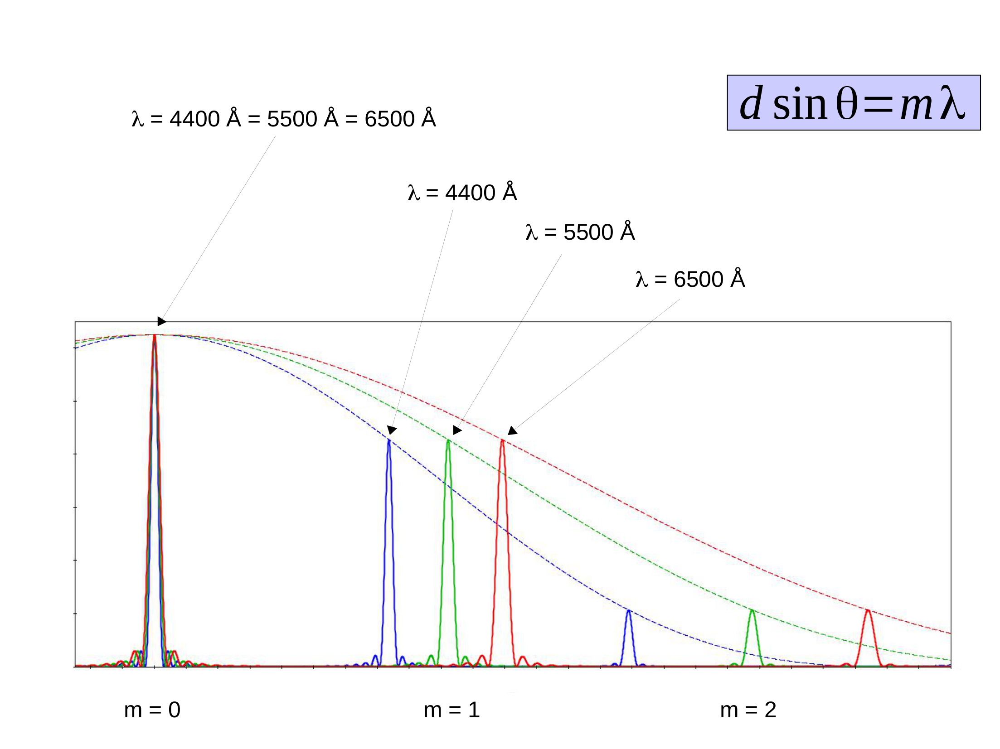


the workhorse equation of every spectrograph. relates the diffraction angle $\theta$, the incidence angle $i$, the groove spacing $d = 1/\rho$, the wavelength $\lambda$, and the diffraction order $m$.

## the general form

$$\boxed{\, \sin\theta + \sin i = \rho\, m\, \lambda \,}$$

where:
- $\theta$ = diffraction angle (measured from the grating normal),
- $i$ = incidence angle (from the same normal),
- $\rho$ = groove density (lines per mm or per Å),
- $m$ = diffraction order ($\ldots, -2, -1, 0, +1, +2, \ldots$),
- $\lambda$ = wavelength.

for normal incidence $i = 0$, this reduces to $\sin\theta = \rho m\lambda$ or equivalently $d\sin\theta = m\lambda$.

the convention: $\theta$ and $i$ are both measured from the grating normal, with the same sign convention for both (both positive on the same side $\to$ Littrow, opposite signs $\to$ standard).

## the spectrum from a single line

a wavelength $\lambda_0$ sent through a grating produces:
- **$m = 0$**: undispersed, all $\lambda$ at the same angle. just a reflection of the slit image, used for alignment.
- **$m = \pm 1$**: first-order spectra on each side of $m = 0$. red diffracted further than blue (since $\sin\theta \propto \lambda$ at fixed $m$).
- **$m = \pm 2, \pm 3, \dots$**: higher orders, more spread, fainter.

so a multi-wavelength source produces a sequence of spectra at successively higher orders, separated by zero-order images.

## order overlap

the danger: at angle $\theta$, multiple wavelengths satisfy the grating equation simultaneously:
$$\rho\sin\theta = 1 \cdot \lambda_1 = 2 \cdot \lambda_2 = 3 \cdot \lambda_3 = \dots$$

so a given pixel contains $\lambda_1$ from $m = 1$ + $\lambda_1/2$ from $m = 2$ + $\lambda_1/3$ from $m = 3$ + .... example: $\lambda_1 = 6000$ Å in $m = 1$ overlaps with $3000$ Å in $m = 2$. need to **block** the unwanted orders.

solutions:
- **order-sorting filters**: bandpass filters that pass only the wanted order in your wavelength range.
- **cross-disperser** (echelle gratings): a second dispersing element perpendicular to the first separates orders in 2D.

## free spectral range

the wavelength range in a single order before it overlaps with the next:
$$\Delta\lambda_{FSR} = \lambda/m$$

at high $m$ (echelle), the FSR is small and orders pile up densely; needs a cross-disperser. at $m = 1$, FSR $= \lambda$, simpler instrument.

## blaze

the diffraction efficiency peaks where the grating's single-slit envelope is centred on the chosen order. a **blazed grating** (sawtooth groove profile) is engineered so the envelope peaks at a chosen wavelength in a chosen order, the **blaze wavelength** $\lambda_B$. see [Blazed gratings](./Blazed%20gratings.html).

## see also

- [Single slit diffraction](./Single%20slit%20diffraction.html)
- [N-slit interference and gratings](./N-slit%20interference%20and%20gratings.html)
- [Blazed gratings](./Blazed%20gratings.html)
- [Dispersion and spectral resolution](./Dispersion%20and%20spectral%20resolution.html)
- [Spectrograph design](./Spectrograph%20design.html)
- [Echelle spectroscopy](./Echelle%20spectroscopy.html)

---

### Astronomical Spectroscopy Diagnostic Panels

*Diffraction grating geometry: optical path difference $\Delta = d(\sin\alpha + \sin\beta) = m\lambda$ between adjacent grooves of spacing $d$.*

*Angular dispersion $\frac{d\beta}{d\lambda} = \frac{m}{d\cos\beta}$ and linear reciprocal dispersion $P = \frac{d\lambda}{dx} = \frac{d\cos\beta}{m f_{\rm cam}}$ at the detector plane.*


  <h4 class="backlinks-title">Linked References (8)</h4>
  <ul class="backlinks-list">
    <li class="backlink-item-wrap"><a href="../../04_Atlas/Astronomical_Spectroscopy_MOC.html" class="backlink-item">Astronomical_Spectroscopy_MOC</a></li>
    <li class="backlink-item-wrap"><a href="./Blazed%20gratings.html" class="backlink-item">Blazed gratings</a></li>
    <li class="backlink-item-wrap"><a href="./Dispersion%20and%20spectral%20resolution.html" class="backlink-item">Dispersion and spectral resolution</a></li>
    <li class="backlink-item-wrap"><a href="./Echelle%20spectroscopy.html" class="backlink-item">Echelle spectroscopy</a></li>
    <li class="backlink-item-wrap"><a href="./N-slit%20interference%20and%20gratings.html" class="backlink-item">N-slit interference and gratings</a></li>
    <li class="backlink-item-wrap"><a href="./Single%20slit%20diffraction.html" class="backlink-item">Single slit diffraction</a></li>
    <li class="backlink-item-wrap"><a href="./Spectrograph%20design.html" class="backlink-item">Spectrograph design</a></li>
    <li class="backlink-item-wrap"><a href="./Spectrograph%20types.html" class="backlink-item">Spectrograph types</a></li>
  </ul>

