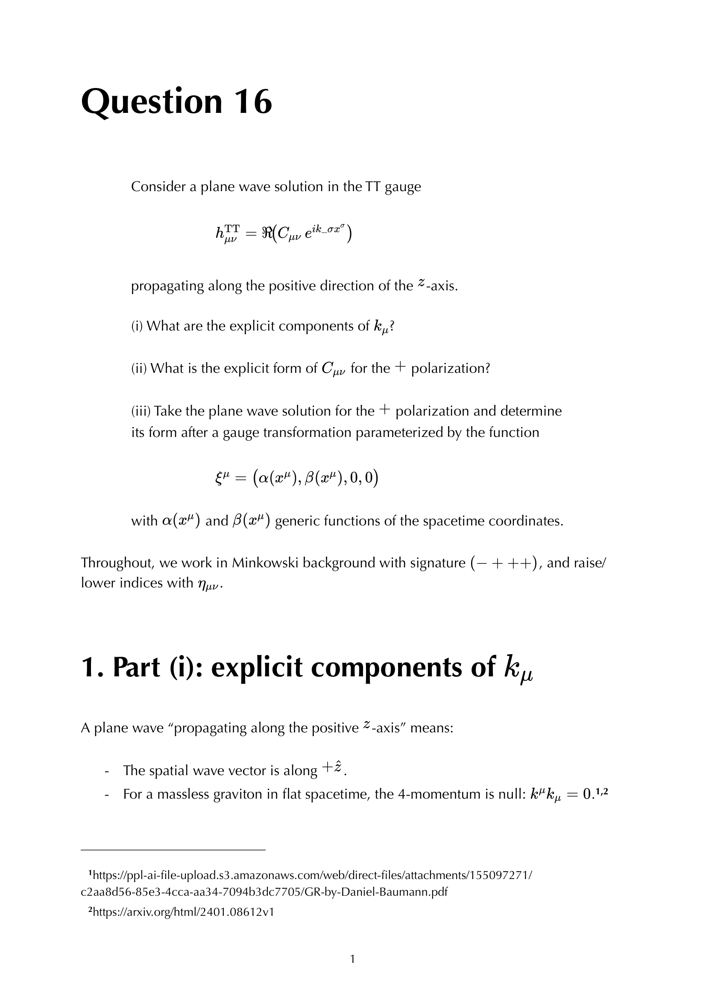
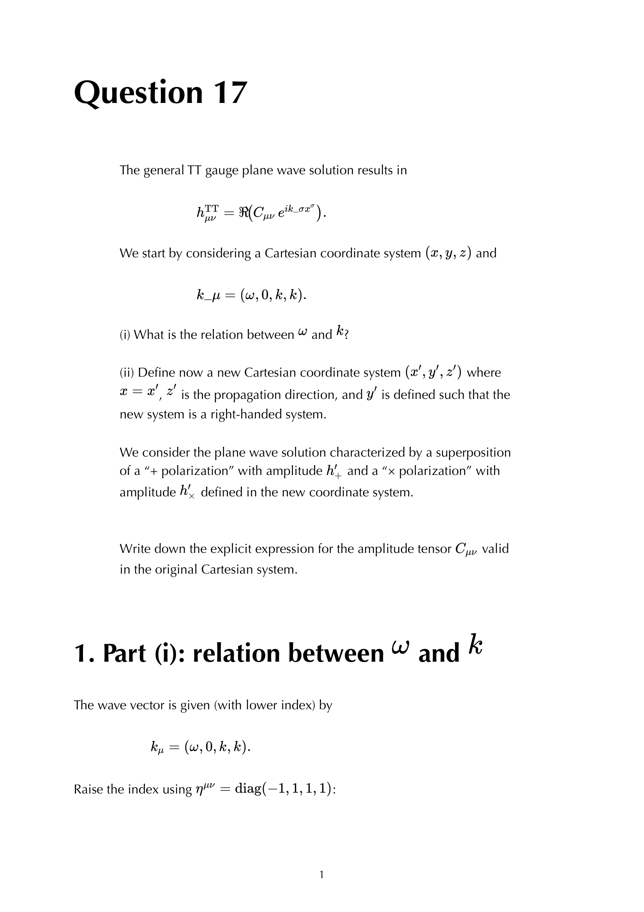
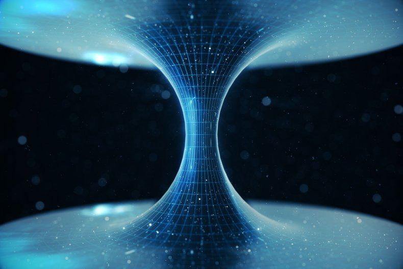

# Gravitational waves in General Relativity

---

### General Relativity Mathematical & Oral Defense Panel

*Question 16 Oral Exam Model Solution: Plane gravitational wave propagation in Transverse-Traceless (TT) gauge, physical degrees of freedom ($h_+, h_\times$), and wave equation $\Box h_{ij}^{\rm TT} = 0$.*

*Question 17 Oral Exam Model Solution: Quadrupolar tidal effect of a gravitational wave on a ring of freely falling test particles, geodesic deviation equation, and differential strain measurement in laser interferometers.*

*Cambridge Lecture Diagram: Gravitational wave quadrupolar distortion of test mass rings for plus (+) and cross (x) polarization states.*

  <h4 class="backlinks-title">Linked References (1)</h4>
  <ul class="backlinks-list">
    <li class="backlink-item-wrap"><a href="../../04_Atlas/General_Relativity_MOC.html" class="backlink-item">General_Relativity_MOC</a></li>
  </ul>

