
# green valley and quenching tracks

up: [Pablo_02_Statistical_properties_of_galaxies](../../02_Literature/Lectures/Observational_Cosmology/Pablo_02_Statistical_properties_of_galaxies.html) · [Color bimodality of galaxies](./Color%20bimodality%20of%20galaxies.html)

## the valley is a transition zone

the under-populated strip between the [Red sequence and blue cloud](./Red%20sequence%20and%20blue%20cloud.html) is called the **green valley**. it is not empty; it is the place galaxies pass *through* on their way from blue cloud to red sequence (and rarely the other way around, via gas-rich mergers reigniting star formation).

the residence time in the green valley is short, on the order of $\lesssim 1$ Gyr in most quenching scenarios. that is why it is a valley and not a third peak.

## faber 2007 evolutionary tracks

Faber et al. 2007 sketched the canonical picture: a galaxy starts in the blue cloud, builds stellar mass, and at some point its star formation is *quenched*. it then slides across the green valley and lands on the red sequence, where it can keep growing in stellar mass only by **dry mergers** (mergers with other passive galaxies, no fresh gas).

two main quenching channels are usually invoked:

1. **mass quenching**: above a halo mass $\sim 10^{12}\,M_\odot$, AGN feedback and virial shock heating prevent gas from cooling onto the disk. this is the high-mass cutoff visible in [Stellar-to-halo mass ratio](./Stellar-to-halo%20mass%20ratio.html).
2. **environment quenching**: in dense regions (groups, clusters), gas is stripped by ram pressure, harassment, or strangulation. this is what drives the [Galaxy color, density and morphology](./Galaxy%20color%2C%20density%20and%20morphology.html) correlation.

faber's tracks then show a roughly horizontal slide in color (blue → red at fixed $M_*$), followed by dry-merger growth along the red sequence (red, brighter).

## why the bridge is short

stellar evolution alone darkens a population by a few tenths of a magnitude in $u-r$ in $\sim 0.3$–$1$ Gyr after star formation stops. so once gas inflow turns off, the galaxy's color crosses the green valley on this timescale. anything slower (e.g. a long, smooth decline of SFR) would *fill* the valley, which is not what we see. so quenching has to be fast.

## what i remember

- the bimodality is a snapshot of a *flow*, not a static population
- "green valley" is defined empirically in $u-r$, $NUV-r$, or sSFR
- the mass scale where this happens cleanly is the same scale that shows up in [Stellar-to-halo mass ratio](./Stellar-to-halo%20mass%20ratio.html): $\sim 10^{12}\,M_\odot$

## connections

- previous: [Color bimodality of galaxies](./Color%20bimodality%20of%20galaxies.html), [Red sequence and blue cloud](./Red%20sequence%20and%20blue%20cloud.html)
- environment: [Galaxy color, density and morphology](./Galaxy%20color%2C%20density%20and%20morphology.html)
- mechanism, halo side: [Halo gravity suppression of galaxy formation](./Halo%20gravity%20suppression%20of%20galaxy%20formation.html)
- the cosmic side: red sequence has been growing since $z \sim 1$ (Bell 2004), consistent with continuous quenching

## key references

- Faber et al. 2007, ApJ 665, 265
- Martin et al. 2007 (NUV-selected GV)
- Schawinski et al. 2014 (two quenching pathways: fast and slow)

---

## astrophysics of galaxies figures and slides (Prof. Alessandro Pizzella)

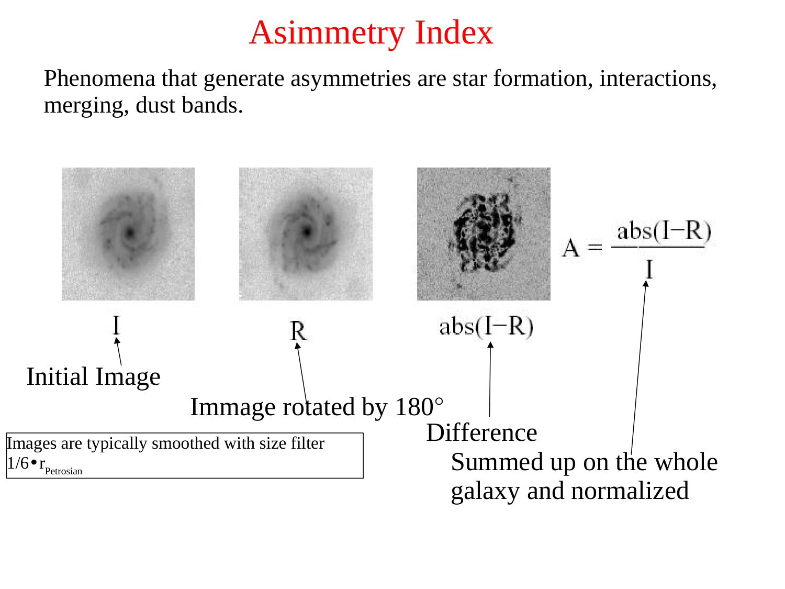
*The Green Valley: sparse intermediate region between Red Sequence and Blue Cloud.*

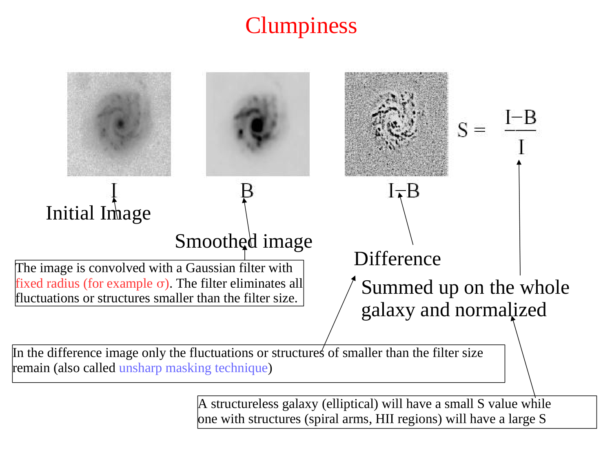
*Galaxy quenching mechanisms: AGN feedback, ram-pressure stripping, halo strangulation, major mergers.*

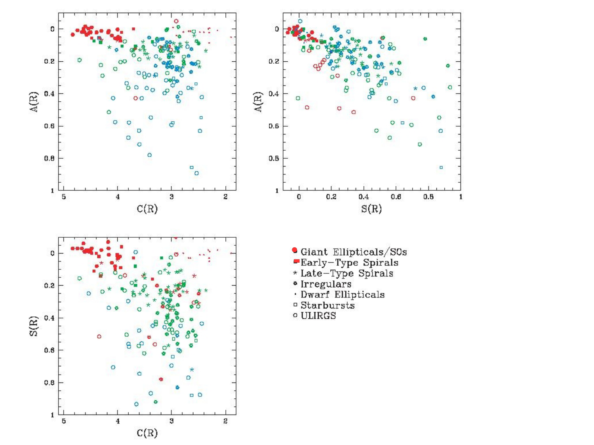
*Fast quenching (merger + starburst + AGN blowout) vs slow quenching (gas starvation).*

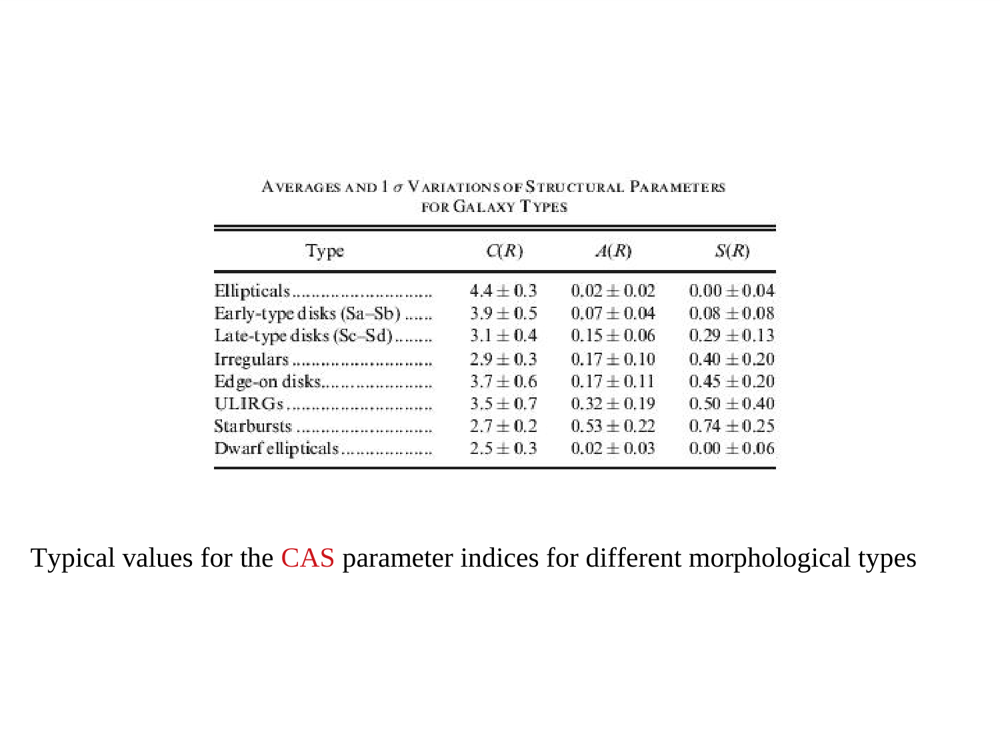
*Transition timescales across the Green Valley (~1-2 Gyr).*

---

## lecture slides and reference figures (Prof. Alessandro Pizzella)

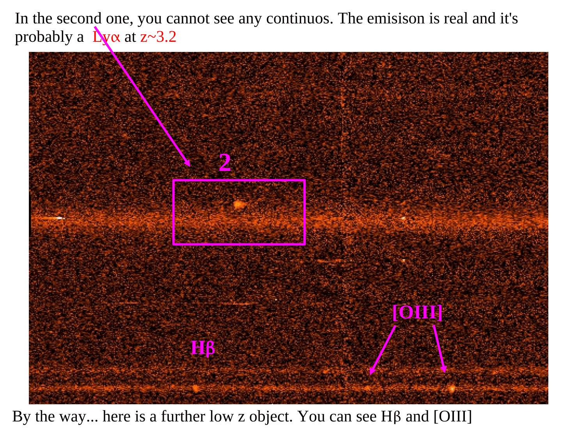

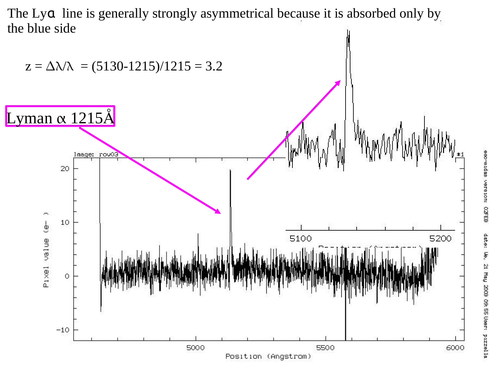

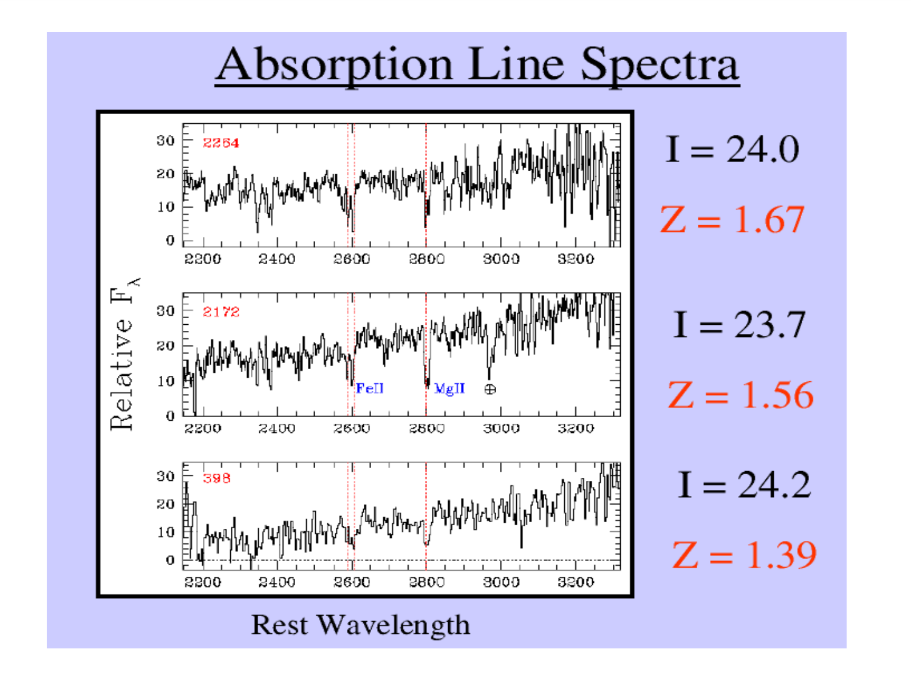

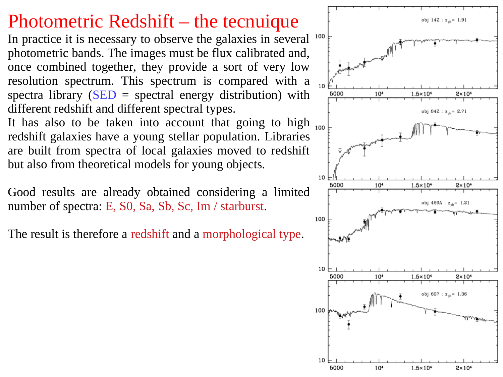

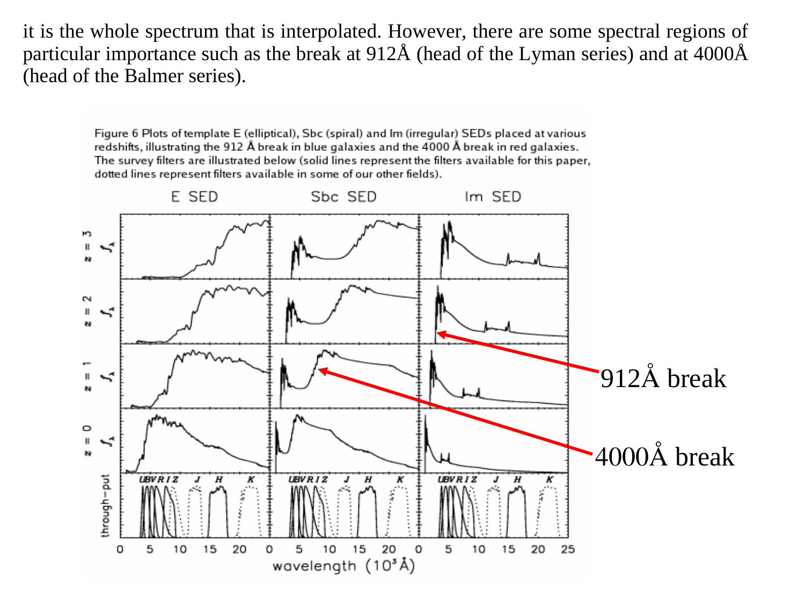

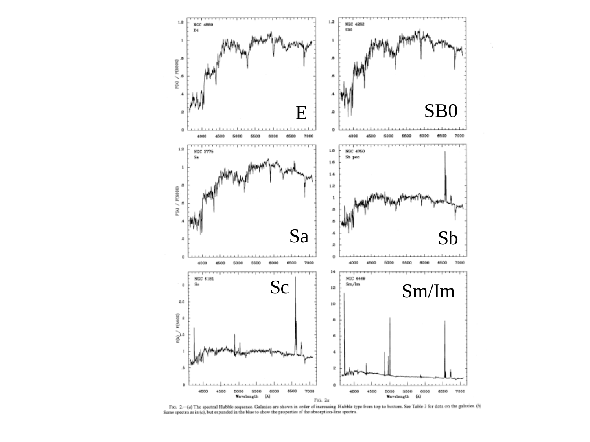

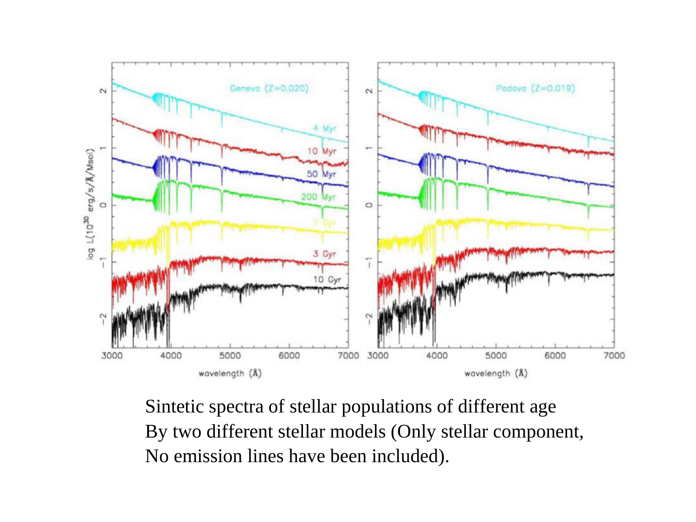

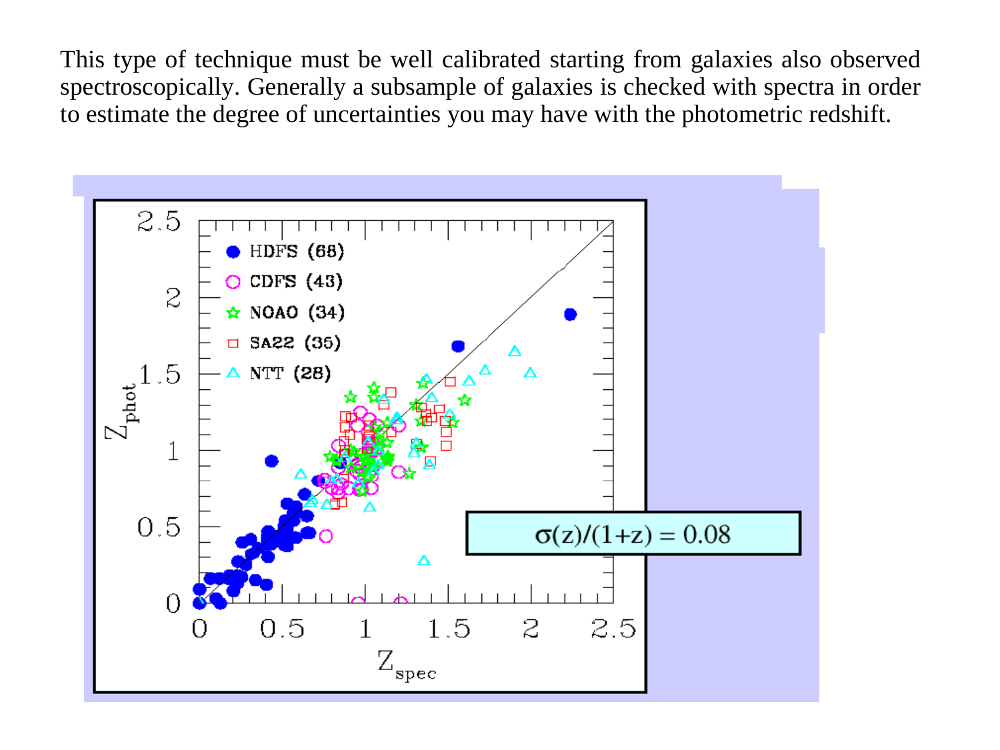

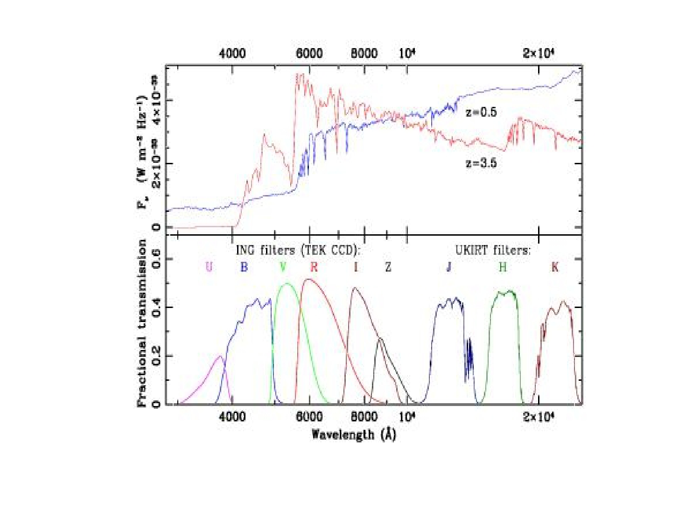

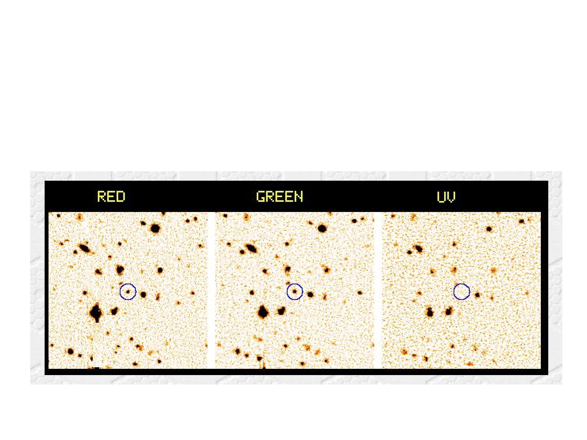


  <h4 class="backlinks-title">Linked References (11)</h4>
  <ul class="backlinks-list">
    <li class="backlink-item-wrap"><a href="../../04_Atlas/Astrophysics_of_Galaxies_MOC.html" class="backlink-item">Astrophysics_of_Galaxies_MOC</a></li>
    <li class="backlink-item-wrap"><a href="./Color%20bimodality%20of%20galaxies.html" class="backlink-item">Color bimodality of galaxies</a></li>
    <li class="backlink-item-wrap"><a href="./Galaxy%20color%2C%20density%20and%20morphology.html" class="backlink-item">Galaxy color, density and morphology</a></li>
    <li class="backlink-item-wrap"><a href="./Galaxy%20mergers%20and%20SF.html" class="backlink-item">Galaxy mergers and SF</a></li>
    <li class="backlink-item-wrap"><a href="./Halo%20gravity%20suppression%20of%20galaxy%20formation.html" class="backlink-item">Halo gravity suppression of galaxy formation</a></li>
    <li class="backlink-item-wrap"><a href="../../04_Atlas/Observational_Cosmology_MOC.html" class="backlink-item">Observational_Cosmology_MOC</a></li>
    <li class="backlink-item-wrap"><a href="../../02_Literature/Lectures/Observational_Cosmology/Pablo_02_Statistical_properties_of_galaxies.html" class="backlink-item">Pablo_02_Statistical_properties_of_galaxies</a></li>
    <li class="backlink-item-wrap"><a href="./Post-starburst%20galaxies.html" class="backlink-item">Post-starburst galaxies</a></li>
    <li class="backlink-item-wrap"><a href="./Quenching%20and%20passive%20galaxies%20at%20high%20z.html" class="backlink-item">Quenching and passive galaxies at high z</a></li>
    <li class="backlink-item-wrap"><a href="./Red%20sequence%20and%20blue%20cloud.html" class="backlink-item">Red sequence and blue cloud</a></li>
    <li class="backlink-item-wrap"><a href="./Stellar%20mass%20function.html" class="backlink-item">Stellar mass function</a></li>
  </ul>

