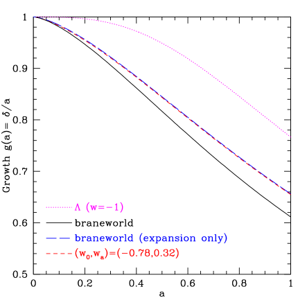
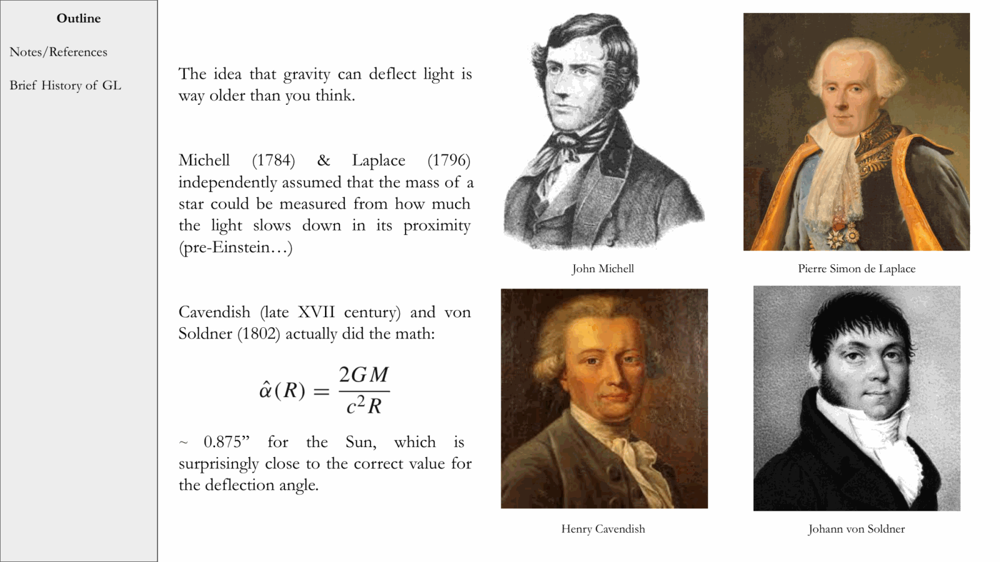
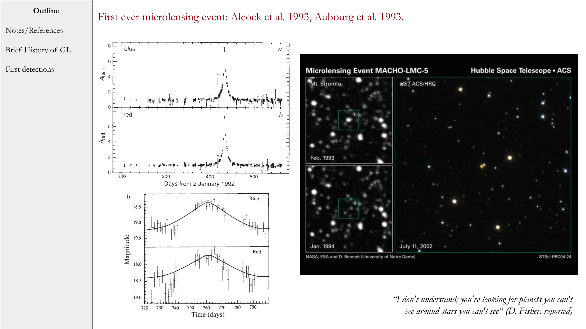
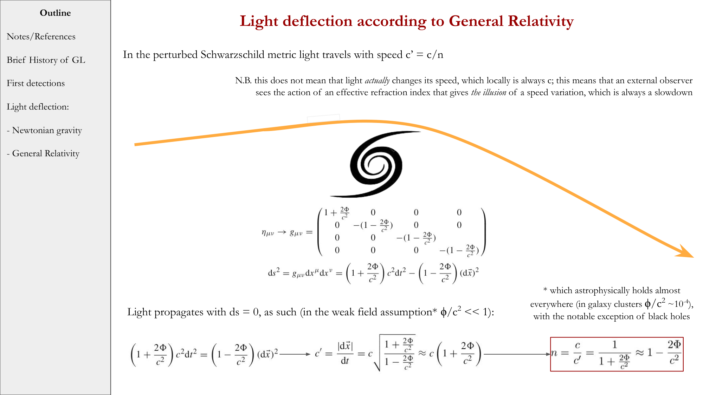
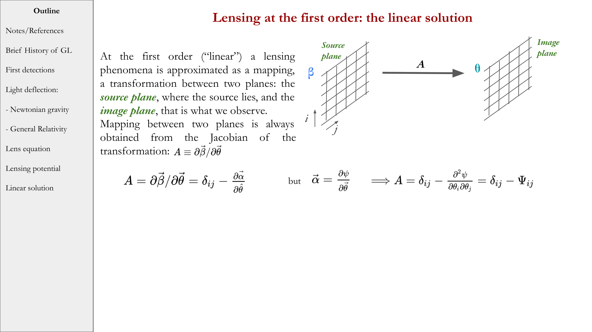


the **growth factor** $D(z)$ describes how the amplitude of a linear matter perturbation grows from some reference time (usually $z = \infty$ or recombination) to redshift $z$:
$$\delta(\vec x, z) = D(z)\, \delta(\vec x, z = z_{\rm ref})$$

it satisfies the master perturbation equation (see [Linear evolution of perturbations in expanding universe](./Linear%20evolution%20of%20perturbations%20in%20expanding%20universe.html)) and depends on the cosmological parameters.

---

## three regimes

### radiation-dominated era ($z \gtrsim 3300$)

dark matter perturbations on sub-horizon scales experience **Meszaros suppression**: only logarithmic growth.
$$D(a) \propto \log(a)$$

(approximately constant.) modes that enter the horizon during radiation domination get this logarithmic stunting; modes that stay outside the horizon don't.

### matter-dominated era ($0.7 \lesssim z \lesssim 3300$)

clean power-law growth:
$$D(a) \propto a$$

at the redshift where $\Omega_m(1+z)^3 = \Omega_\Lambda$ (around $z \sim 0.7$), the universe transitions to Λ-domination.

### Λ-dominated era ($z \lesssim 0.7$)

growth **freezes out** as Λ takes over. $\bar\rho_m \propto a^{-3}$ falls to negligible compared to $\rho_\Lambda$, so the source term in the perturbation equation vanishes. the growing-mode amplitude approaches a constant.

approximate fitting formula (Lahav-Suto):
$$D(a) \propto a \cdot \frac{\Omega_m(z)^{4/7}}{1 + (1 - \Omega_m(z))/2 + (1 + \Omega_m(z)/2)/70 \cdot \dots}$$

or more cleanly, the integral form:
$$D(a) \propto H(a) \int_0^a \frac{da'}{[a' H(a')]^3}$$

(for a flat universe with matter and Λ.)

---

## convention: normalization

usually $D(z = 0) = 1$ today. so $D(z)$ is the ratio of the growing-mode amplitude at $z$ to today. for ΛCDM:
- $D(z = 1100) \approx 1/1280 \approx 7.8 \times 10^{-4}$
  - i.e. perturbations have grown by a factor of $\sim 1280$ since CMB era
- $D(z = 0.7) \approx 0.65$ — growth has slowed

---

## consequences for observations

### CMB amplitude vs galaxy power spectrum

at the CMB era, $\delta \sim 10^{-5}$. by today: $\delta \sim 10^{-5} \times 1280 \approx 10^{-2}$, in linear theory.

but on small scales, $\delta$ has grown nonlinear ($\delta \sim 1$). N-body simulations are needed there. on large scales (BAO, $k \lesssim 0.1\,h\,\text{Mpc}^{-1}$), linear theory still works.

### redshift-space distortions and $f\sigma_8$

galaxy peculiar velocities trace the gradient of the gravitational potential. they are proportional to $\dot\delta = (df/d\ln a)\delta$ where $f = d\ln D/d\ln a$ is the **growth rate**:
$$f(z) \approx \Omega_m(z)^{0.55}$$

(the 0.55 power is an approximation for Λ-dominated universes.) measuring $f$ via redshift-space distortions (RSD) constrains modified gravity, dark energy properties, and so on. this is one of the prime science goals of DESI and Euclid in 2025/2026.

### early dark energy and the Hubble tension

if there is "early dark energy" before recombination, $H$ is higher at that epoch, affecting the sound horizon and CMB peak positions. this changes $D(z)$ and the inferred $H_0$ — proposed as a way to relieve the Hubble tension (see [Hubble constant and deceleration parameter](./Hubble%20constant%20and%20deceleration%20parameter.html)).

---

## why growth factor matters

$D(z)$ encodes how much "room" perturbations had to grow into halos and galaxies. by measuring $D$ at multiple redshifts (via galaxy clustering, weak lensing, RSD, cluster counts), we constrain:
- the matter density $\Omega_m$
- the dark energy equation of state $w$
- modified gravity theories
- neutrino mass (suppresses growth on small scales)

so $D(z)$ is one of the central observables of late-time cosmology, complementary to $H(z)$.

---

## see also

- [Fundamentals_Astrophysics_Cosmology_MOC](../../04_Atlas/Fundamentals_Astrophysics_Cosmology_MOC.html)
- [Linear evolution of perturbations in expanding universe](./Linear%20evolution%20of%20perturbations%20in%20expanding%20universe.html)
- [Jeans analysis in expanding universe](./Jeans%20analysis%20in%20expanding%20universe.html)
- [Spherical collapse](./Spherical%20collapse.html)
- [Matter power spectrum and BAO](./Matter%20power%20spectrum%20and%20BAO.html)
- [Hubble constant and deceleration parameter](./Hubble%20constant%20and%20deceleration%20parameter.html)
- [Cosmic_inventory_dark_energy](./Cosmic_inventory_dark_energy.html)

---

### Observational Cosmology Data Panels & Visual Evidence

*Linder (2005) Linear growth factor $D(z)$ and growth rate $f(z) = d\ln D/d\ln a \approx \Omega_m(z)^\gamma$ with growth index $\gamma \approx 0.55$ for GR vs modified gravity alternatives.*

*Perturbation equation in expanding cosmic fluid: $\ddot{\delta} + 2H\dot{\delta} - 4\pi G \bar{\rho}_m \delta = 0$.*

*Meszaros effect: stagnation of sub-horizon dark matter perturbation growth during the radiation-dominated era ($D(a) \approx 1 + \frac{3}{2}y$).*

*Jeans instability in expanding universe: power-law growth $\delta \propto t^{2/3}$ instead of exponential Newtonian collapse.*

*Exact integral solution for linear growth factor $D(z) \propto H(z) \int_z^\infty \frac{1+z'}{H(z')^3} dz'$.*


  <h4 class="backlinks-title">Linked References (12)</h4>
  <ul class="backlinks-list">
    <li class="backlink-item-wrap"><a href="./Baumann_reference.html" class="backlink-item">Baumann_reference</a></li>
    <li class="backlink-item-wrap"><a href="./Cosmological%20evolution%20of%20perturbations%20in%20the%20cosmic%20fluid.html" class="backlink-item">Cosmological evolution of perturbations in the cosmic fluid</a></li>
    <li class="backlink-item-wrap"><a href="../../04_Atlas/Fundamentals_Astrophysics_Cosmology_MOC.html" class="backlink-item">Fundamentals_Astrophysics_Cosmology_MOC</a></li>
    <li class="backlink-item-wrap"><a href="./Galaxy%20clusters%20and%20overview%20of%20evolution.html" class="backlink-item">Galaxy clusters and overview of evolution</a></li>
    <li class="backlink-item-wrap"><a href="./Jeans%20analysis%20in%20expanding%20universe.html" class="backlink-item">Jeans analysis in expanding universe</a></li>
    <li class="backlink-item-wrap"><a href="./Linear%20evolution%20of%20perturbations%20in%20expanding%20universe.html" class="backlink-item">Linear evolution of perturbations in expanding universe</a></li>
    <li class="backlink-item-wrap"><a href="./Linear%20vs%20nonlinear%20regime.html" class="backlink-item">Linear vs nonlinear regime</a></li>
    <li class="backlink-item-wrap"><a href="./Matter%20power%20spectrum%20and%20BAO.html" class="backlink-item">Matter power spectrum and BAO</a></li>
    <li class="backlink-item-wrap"><a href="../../04_Atlas/Observational_Cosmology_MOC.html" class="backlink-item">Observational_Cosmology_MOC</a></li>
    <li class="backlink-item-wrap"><a href="./Perturbations%20in%20an%20expanding%20universe.html" class="backlink-item">Perturbations in an expanding universe</a></li>
    <li class="backlink-item-wrap"><a href="./Press-Schechter%20halo%20mass%20function.html" class="backlink-item">Press-Schechter halo mass function</a></li>
    <li class="backlink-item-wrap"><a href="./Spherical%20collapse.html" class="backlink-item">Spherical collapse</a></li>
  </ul>

