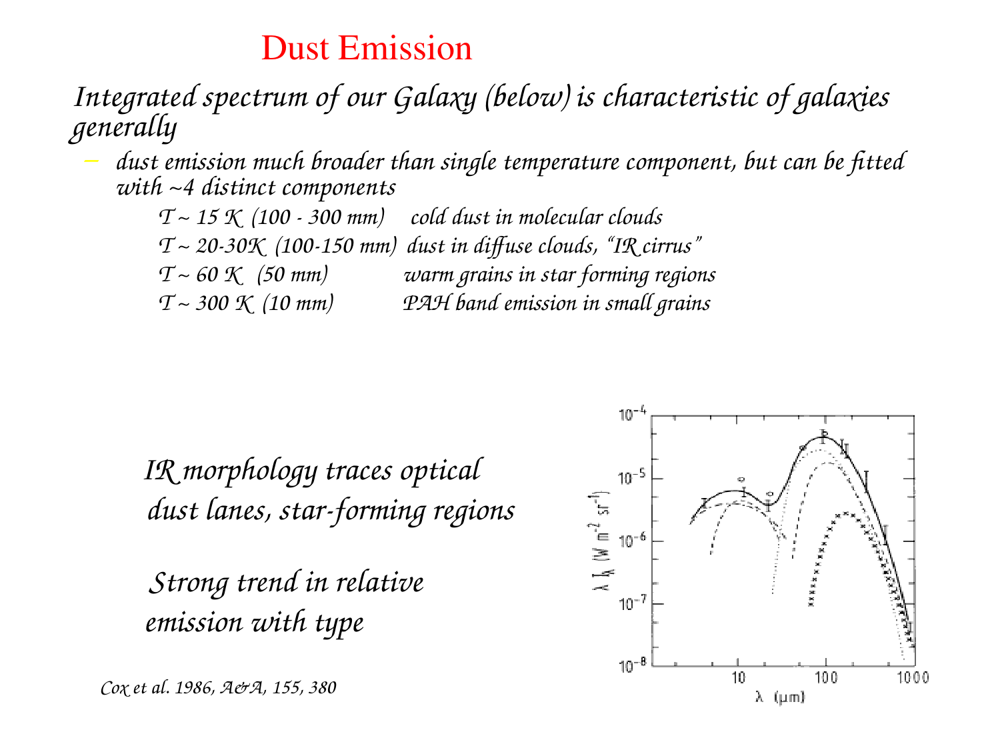
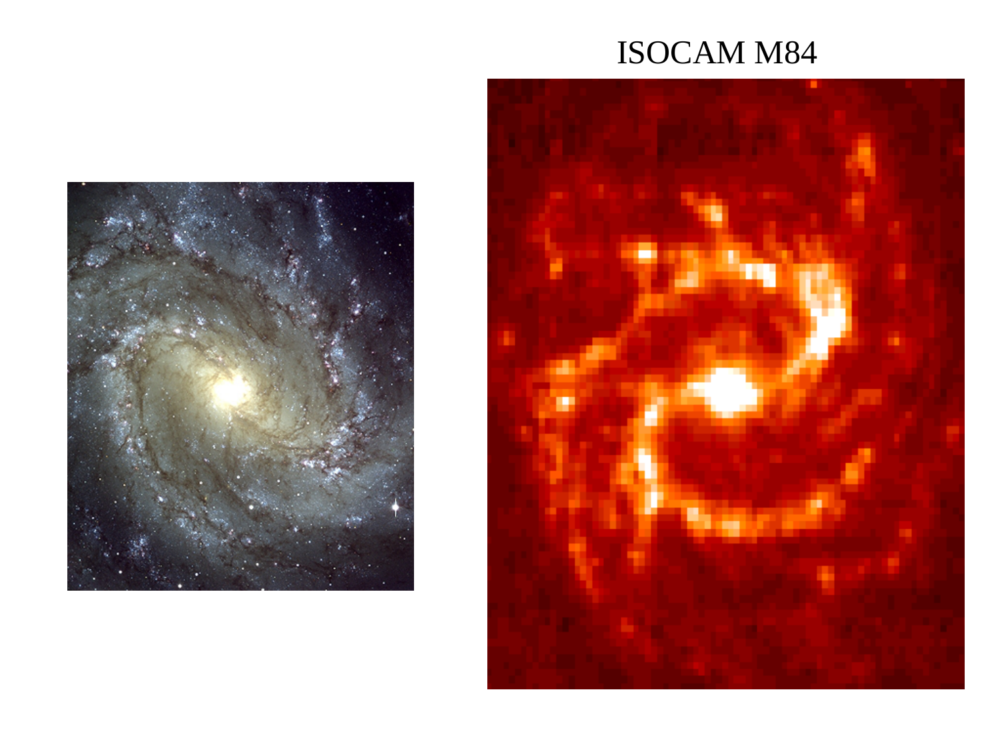
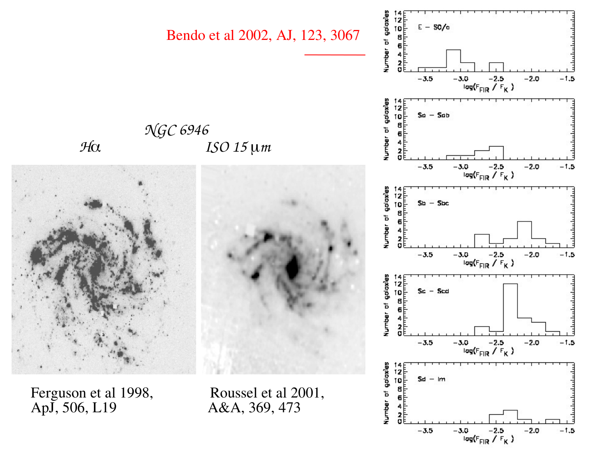
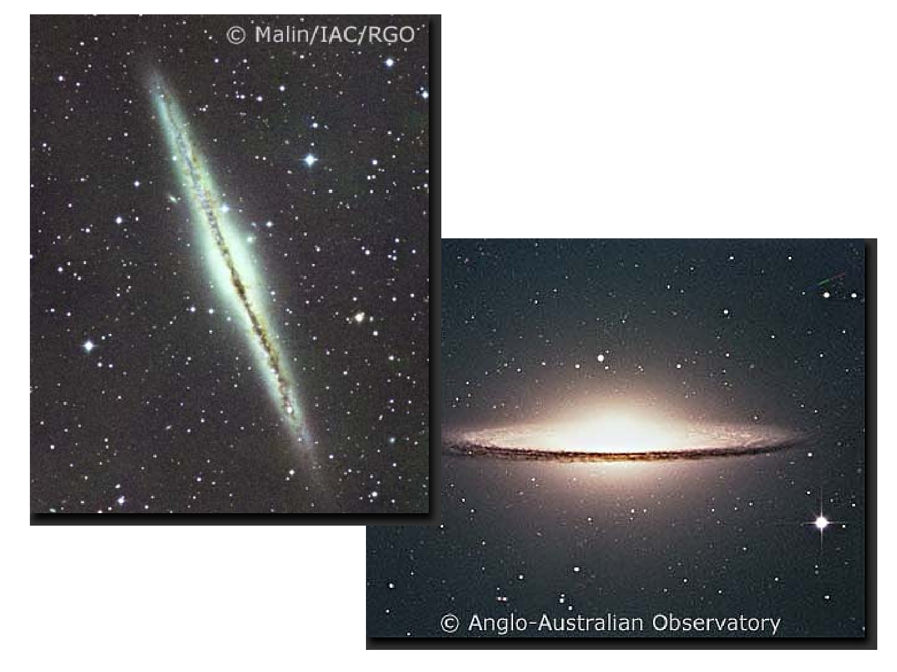
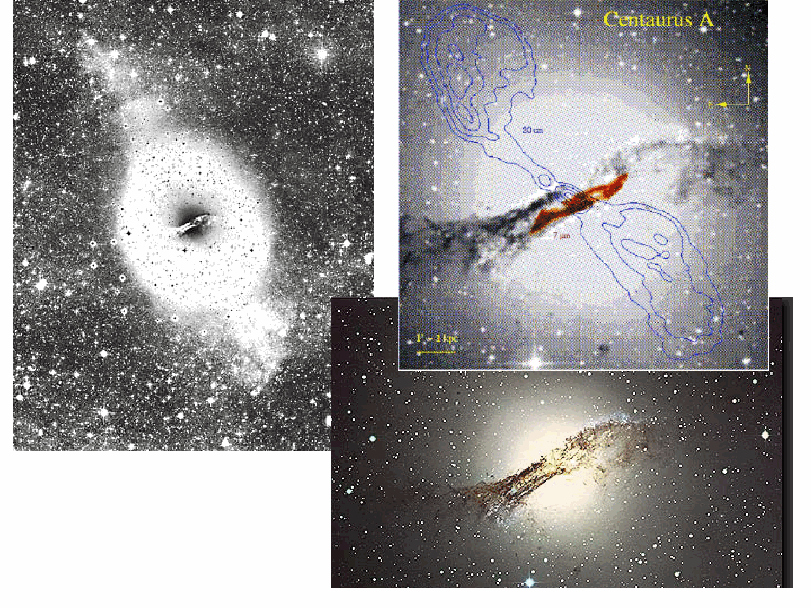

# H I Regions and the 21 cm Line

Parent [Astrophysics_of_Galaxies_MOC](../../04_Atlas/Astrophysics_of_Galaxies_MOC.html) · [Dark matter rotation curves](Dark%20matter%20rotation%20curves.html) · [Tully-Fisher relation](Tully-Fisher%20relation.html)

## 1. Physical Properties and the Two-Phase Neutral Medium

Neutral atomic hydrogen (H I) constitutes the most widespread gaseous reservoir in spiral and irregular galaxies, typically extending radially to two to three times the optical radius of the stellar disk.

### The Two-Phase Interstellar Medium (Field, Goldsmith and Habing 1969)

In thermal and ionization equilibrium, the neutral interstellar medium naturally segregates into two distinct stable phases coexisting in approximate thermal pressure equilibrium ($P_{\text{th}} / k_B = n T \approx 2000 - 4000 \text{ K cm}^{-3}$)

1. Cold Neutral Medium (CNM)
   - Temperature - $T \approx 50 - 100 \text{ K}$.
   - Number density - $n_{\text{H}} \approx 20 - 50 \text{ cm}^{-3}$.
   - Structure - Confined to dense, cold sheets, filaments, and cloudlets concentrated in the galactic midplane (scale height $z_{1/2} \sim 100 \text{ pc}$).
   - Volume filling fraction - $f_V \sim 1\% - 2\%$.
   - Primary cooling channel - Fine-structure emission of ionized carbon [C II] at $\lambda = 157.7 \, \mu\text{m}$.

2. Warm Neutral Medium (WNM)
   - Temperature - $T \approx 6000 - 10000 \text{ K}$.
   - Number density - $n_{\text{H}} \approx 0.2 - 0.5 \text{ cm}^{-3}$.
   - Structure - Diffuse, warm intercloud gas forming an extended disk and halo (scale height $z_{1/2} \sim 400 - 1000 \text{ pc}$).
   - Volume filling fraction - $f_V \sim 30\% - 40\%$.
   - Primary cooling channels - Collisionally excited Lyman-alpha radiation and [O I] $\lambda 63 \, \mu\text{m}$.

Gas at intermediate temperatures ($300 \text{ K} < T < 5000 \text{ K}$) is thermally unstable ($dP/d\rho < 0$) and rapidly transitions into either the cold or warm phase.

## 2. Quantum Mechanical Origin of the 21 cm Hyperfine Transition

The 21 cm transition arises from the magnetic hyperfine interaction between the intrinsic magnetic dipole moment of the proton and that of the orbiting electron in the ground state of neutral hydrogen ($1s \, ^2S_{1/2}$).

### Hyperfine Energy Splitting

The proton possesses nuclear spin angular momentum $\mathbf{I}$ with quantum number $I = 1/2$. The electron possesses spin angular momentum $\mathbf{S}$ with quantum number $S = 1/2$.

The total atomic angular momentum is $\mathbf{F} = \mathbf{I} + \mathbf{S}$.

According to quantum angular momentum addition rules, the total quantum number $F$ takes two values
- Upper state ($F = 1$) - Electron and proton magnetic dipole moments are antiparallel (spins are parallel). Degeneracy $g_1 = 2F + 1 = 3$ (triplet state).
- Lower state ($F = 0$) - Electron and proton magnetic dipole moments are parallel (spins are antiparallel). Degeneracy $g_0 = 2F + 1 = 1$ (singlet state).

The magnetic dipole-dipole Hamiltonian produces an energy splitting
$$\Delta E_{\text{hf}} = 5.8743 \times 10^{-6} \text{ eV} = 9.4117 \times 10^{-25} \text{ J}$$

The corresponding transition frequency is known to extraordinary precision
$$\nu_{21} = \frac{\Delta E_{\text{hf}}}{h} = 1420.4057517667 \text{ MHz}$$

The vacuum rest wavelength is
$$\lambda_{21} = \frac{c}{\nu_{21}} = 21.106114 \text{ cm}$$

The equivalent excitation temperature is
$$T_* \equiv \frac{h \nu_{21}}{k_B} \approx 0.06816 \text{ K}$$

Because $T_* \ll T_k$ across all astrophysical ISM phases ($T \ge 50 \text{ K}$), the hyperfine levels are readily populated and thermalized. The relative population defines the spin temperature $T_s$ via the Boltzmann distribution
$$\frac{n_1}{n_0} = \frac{g_1}{g_0} \exp\left(-\frac{h \nu_{21}}{k_B T_s}\right) = 3 \exp\left(-\frac{T_*}{T_s}\right)$$

Expanding to first order in $T_* / T_s \ll 1$
$$\frac{n_1}{n_0} \approx 3 \left(1 - \frac{T_*}{T_s}\right) \approx 3$$

Therefore, exactly three-quarters of all neutral hydrogen atoms reside in the upper $F=1$ hyperfine level
$$\frac{n_1}{n_{\text{H I}}} = \frac{n_1}{n_0 + n_1} = \frac{3}{1 + 3} = \frac{3}{4} \implies n_1 \approx 0.75 \, n_{\text{H I}}$$

### The Einstein Spontaneous Transition Coefficient

Because the transition violates electric dipole parity selection rules, it occurs strictly via magnetic dipole radiation ($M1$).

The Einstein $A_{10}$ coefficient for magnetic dipole spontaneous decay is
$$A_{10} = \frac{64 \pi^4 \nu_{21}^3}{3 h c^3} |\mu_{10}|^2 = 2.85 \times 10^{-15} \text{ s}^{-1}$$

The spontaneous radiative lifetime of an isolated hydrogen atom in the excited $F=1$ state is
$$\tau_{\text{rad}} = \frac{1}{A_{10}} \approx 3.5 \times 10^{14} \text{ s} \approx 1.1 \times 10^7 \text{ yr}$$

Although an individual atom takes eleven million years to decay radiatively, the astronomical column density of hydrogen along galactic sightlines ($N_{\text{H I}} \sim 10^{20} - 10^{22} \text{ cm}^{-2}$) contains such vast numbers of atoms that the 21 cm line produces readily detectable radio emission.

## 3. Mathematical Derivation of H I Column Density and Total Mass

We now derive the exact equations connecting observed 21 cm radio flux to the column density and total mass of neutral gas.

### Unbroken Derivation of Column Density in the Optically Thin Limit

The linear absorption coefficient $\kappa_\nu$ corrected for stimulated emission is
$$\kappa_\nu = \frac{h \nu_{21}}{4\pi} \left[ n_0 B_{01} - n_1 B_{10} \right] \phi(\nu)$$
where $\phi(\nu)$ is the normalized Doppler line profile ($\int \phi(\nu) d\nu = 1$).

Invoking the Einstein relations $g_0 B_{01} = g_1 B_{10}$ and $A_{10} = \frac{2 h \nu_{21}^3}{c^2} B_{10}$
$$\kappa_\nu = \frac{c^2}{8\pi \nu_{21}^2} A_{10} n_1 \left[ \exp\left(\frac{h\nu_{21}}{k_B T_s}\right) - 1 \right] \phi(\nu)$$

Expanding the exponential for $h\nu_{21} / k_B T_s \ll 1$
$$\exp\left(\frac{h\nu_{21}}{k_B T_s}\right) - 1 \approx \frac{h \nu_{21}}{k_B T_s}$$

Substituting $n_1 \approx \frac{3}{4} n_{\text{H I}}$
$$\kappa_\nu \approx \frac{3 c^2 h}{32\pi \nu_{21} k_B T_s} A_{10} n_{\text{H I}} \phi(\nu)$$

The optical depth across path length $s$ is $\tau_\nu = \int \kappa_\nu ds$. Expressing frequency in terms of radial Doppler velocity $v = -c (\nu - \nu_{21}) / \nu_{21}$, so that $dv = -(c / \nu_{21}) d\nu$, the velocity-integrated optical depth is
$$\int \tau(v) dv = \frac{c}{\nu_{21}} \int \tau_\nu d\nu = \frac{c}{\nu_{21}} \int ds \int \kappa_\nu d\nu = \frac{3 c^3 h A_{10}}{32\pi \nu_{21}^2 k_B T_s} \int n_{\text{H I}} ds = \frac{3 c^3 h A_{10}}{32\pi \nu_{21}^2 k_B T_s} N_{\text{H I}}$$

In the optically thin limit ($\tau(v) \ll 1$), the emergent brightness temperature is $T_b(v) = T_s [1 - e^{-\tau(v)}] \approx T_s \tau(v)$.

Multiplying the integrated optical depth by $T_s$
$$\int T_b(v) dv = T_s \int \tau(v) dv = \frac{3 c^3 h A_{10}}{32\pi \nu_{21}^2 k_B} N_{\text{H I}}$$

Remarkable cancellation - The unknown spin temperature $T_s$ cancels out completely.

Solving for the column density $N_{\text{H I}}$
$$N_{\text{H I}} = \left[ \frac{32\pi \nu_{21}^2 k_B}{3 c^3 h A_{10}} \right] \int T_b(v) dv$$

Evaluating the bracketed constant with fundamental physical constants
$$\frac{32\pi (1.4204 \times 10^9 \text{ s}^{-1})^2 (1.3806 \times 10^{-23} \text{ J K}^{-1})}{3 (2.9979 \times 10^8 \text{ m s}^{-1})^3 (6.6261 \times 10^{-34} \text{ J s}) (2.85 \times 10^{-15} \text{ s}^{-1})} = 1.8224 \times 10^{18} \text{ cm}^{-2} (\text{K km s}^{-1})^{-1}$$

Thus, the fundamental column density equation is
$$N_{\text{H I}} = 1.8224 \times 10^{18} \int T_b(v) dv \quad [\text{cm}^{-2}]$$
where $T_b$ is in Kelvin and $v$ is in $\text{km s}^{-1}$.

### Unbroken Derivation of Total Extragalactic H I Mass

For an unresolved or fully mapped extragalactic source at distance $D$, radio telescopes measure flux density $S(v)$ in Janskys ($1 \text{ Jy} = 10^{-26} \text{ W m}^{-2} \text{ Hz}^{-1}$) rather than brightness temperature.

By the Rayleigh-Jeans relation, flux density relates to brightness temperature integrated over the source solid angle $\Omega$
$$S_\nu = \frac{2 k_B \nu_{21}^2}{c^2} \int T_b d\Omega$$

Integrating over the line profile
$$\int S(v) dv = \frac{2 k_B \nu_{21}^2}{c^2} \iint T_b d\Omega dv$$

The total number of neutral hydrogen atoms in the galaxy is the integral of column density over the physical cross-sectional area $dA = D^2 d\Omega$
$$\mathcal{N}_{\text{H}} = \int N_{\text{H I}} dA = D^2 \int N_{\text{H I}} d\Omega = D^2 \left[ \frac{32\pi \nu_{21}^2 k_B}{3 c^3 h A_{10}} \right] \iint T_b dv d\Omega$$

Substituting $\iint T_b dv d\Omega = \frac{c^2}{2 k_B \nu_{21}^2} \int S(v) dv$
$$\mathcal{N}_{\text{H}} = D^2 \left[ \frac{32\pi \nu_{21}^2 k_B}{3 c^3 h A_{10}} \right] \left[ \frac{c^2}{2 k_B \nu_{21}^2} \right] \int S(v) dv = \left[ \frac{16\pi}{3 h c A_{10}} \right] D^2 \int S(v) dv$$

The total mass of neutral atomic hydrogen is $M_{\text{H I}} = m_{\text{H}} \mathcal{N}_{\text{H}}$
$$M_{\text{H I}} = \left[ \frac{16\pi m_{\text{H}}}{3 h c A_{10}} \right] D^2 \int S(v) dv$$

Evaluating the physical prefactor in astronomical units ($D$ in $\text{Mpc}$, integrated flux $\int S dv$ in $\text{Jy km s}^{-1}$, mass in solar masses $M_\odot$)
$$M_{\text{H I}} = 2.356 \times 10^5 \, M_\odot \left(\frac{D}{\text{Mpc}}\right)^2 \left(\frac{\int S(v) dv}{\text{Jy km s}^{-1}}\right)$$

This elegant formula enables the direct calculation of total neutral hydrogen mass from a single integrated 21 cm spectrum and a known distance.

## 4. Global 21 cm Profile Morphology and Kinematics

When an inclined spiral galaxy is observed with a single-dish radio telescope (such as Arecibo or the Green Bank Telescope), the beam encompasses the entire disk, producing a spatially integrated global velocity profile.

### The Double-Horned Profile

For an axisymmetric rotating thin disk with a flat rotation curve ($v_c(r) = v_{\text{flat}} \approx \text{const}$ for $r > R_{\text{turn}}$), the line-of-sight velocity is
$$v_{\text{LOS}}(r, \theta) = v_{\text{sys}} + v_{\text{flat}} \sin i \cos \theta$$

The amount of gas contributing to an observed velocity channel between $v$ and $v + dv$ is proportional to the area between iso-velocity contours $dA / dv \propto 1 / |\nabla v_{\text{LOS}}|$.

Along the major axis ($\cos \theta = \pm 1$), $\frac{d v_{\text{LOS}}}{d\theta} \propto \sin \theta = 0$. Because the velocity field is stationary with respect to azimuth, large geometric areas of the outer disk project onto the same extreme line-of-sight velocities $v_{\text{sys}} \pm v_{\text{flat}} \sin i$.

This creates two sharp intensity peaks at the approaching and receding edges of the spectrum, producing the classical double-horned profile.

### Linewidth Definitions and the Tully-Fisher Connection

- Full width at $50\%$ peak intensity ($W_{50}$) - Measured between the inner flanks of the two horns at $50\%$ of peak flux.
- Full width at $20\%$ peak intensity ($W_{20}$) - Measured at $20\%$ of peak flux, accounting for turbulent wing broadening.

Correcting for disk inclination $i$ gives the maximum circular rotation speed
$$v_{\text{max}} \approx \frac{W_{50}}{2 \sin i}$$

This kinematic measurement forms the primary empirical backbone of the [Tully-Fisher relation](Tully-Fisher%20relation.html).

### H I Deficiency in Galaxy Clusters

In rich clusters (such as Virgo and Coma), infalling spiral galaxies undergo ram-pressure stripping by the hot intracluster medium.

The neutral gas deficiency parameter is defined as (Haynes and Giovanelli 1984)
$$\text{Def}_{\text{H I}} \equiv \log_{10}\left[ M_{\text{H I,expected}}(D_{\text{opt}}, \text{type}) \right] - \log_{10}\left[ M_{\text{H I,observed}} \right]$$
where $M_{\text{H I,expected}}$ is the mean H I mass of isolated field galaxies of matching optical diameter and morphological type.

Galaxies in the core of the Virgo cluster regularly exhibit $\text{Def}_{\text{H I}} > 0.5 - 1.0 \text{ dex}$, proving that more than $70\% - 90\%$ of their neutral gas has been stripped away.

## 5. Blackboard Observational Graphs and Sketches

### Graph 1. The Global 21 cm Double-Horned Spectral Profile

```
  Flux Density S_v (Jy)
     ^
 1.0 |      Approaching Horn                     Receding Horn
     |         /=======\                             /=======\
 0.8 |        /         \                           /         \
     |       /           \                         /           \
 0.5 | . . . * . . . . . . * . . . . . . . . . . . * . . . . . . * . . .  50% Peak
     |     /  |           | \                   / |             | \
 0.2 | . * .  |           |  . * . . . . . . . *  |             |  . * .  20% Peak
     |   /    |           |    \             /    |             |   \
 0.0 +==*=====+===========+=====*===========*=====+=============+====*==>
              <=== W_50 / 2 ===>      ^     <=== W_50 / 2 ===>
                                      |
                           v_sys (Systemic Velocity)
                               Heliocentric Velocity v (km/s)
```

Blackboard presentation notes
- Symmetric horn heights confirm a balanced, undisturbed gas disk. Asymmetric horns indicate tidal interactions, ram-pressure stripping, or lopsided gas accretion.
- The separation between horns defines $W_{50} = 2 v_{\text{flat}} \sin i$.

### Graph 2. The Field, Goldsmith and Habing (1969) Two-Phase Phase Diagram

```
  log10 P / k_B (K cm^-3)
     ^
 4.0 |      *=================================\ (Unstable branch - dP/drho < 0)
     |       \  Cold Neutral Medium (CNM)       \
 3.5 |        \  T ~ 50 - 100 K                  \  Warm Neutral Medium (WNM)
     |         \  n ~ 20 - 50 cm^-3               \  T ~ 8000 K
 3.0 |          \                                  \=====================*
     |           \                                  n ~ 0.2 - 0.5 cm^-3
 2.5 +============+=================================+====================>
                 -1.0          0.0                +1.0          +2.0
                                log10 n_H (cm^-3)
```

Key quantitative takeaways for the blackboard
- Two stable branches where $dP / d\rho > 0$ - The dense, cold phase (CNM) and the warm, diffuse phase (WNM).
- Between them lies a forbidden, thermally unstable region where runaway heating or cooling drives gas into one of the two stable phases.

## 6. Exact Course Citations and Literature Provenance

- Field, George B., Donald W. Goldsmith, and H. John Habing (1969), Cosmic-Ray Heating of the Interstellar Gas, The Astrophysical Journal, volume 155, pages L149 to L154 - Theoretical foundation of the two-phase neutral ISM.
- Haynes, Martha P., and Riccardo Giovanelli (1984), The Astronomical Journal, volume 89, pages 758 to 800 - Systematic definition of the H I deficiency parameter in cluster galaxies.
- Giovanelli, Riccardo, et al. (2005), The Arecibo Legacy Fast ALFA Survey, The Astronomical Journal, volume 130, pages 2598 to 2612 - Large-scale extragalactic 21 cm blind survey.
- Binney, James, and Michael Merrifield (1998), Galactic Astronomy, Princeton University Press
  - Chapter 8 The Interstellar Medium, Section 8.1 Neutral Gas and the 21 cm Line, pages 420 to 440 - Hyperfine structure, quantum transition rates, optical depth derivations, and mass equations.
- Mo, Houjun, Frank van den Bosch, and Simon White (2010), Galaxy Formation and Evolution, Cambridge University Press
  - Chapter 10 The Interstellar Medium, Section 10.1 Components of the ISM, pages 448 to 455 - H I gas physics, cooling curves, and 21 cm emission.
- Course lecture notes and slides (Prof. Alessandro Pizzella)
  - Slide file Astrophysic_gal_10_ism.pdf (Interstellar Medium)
    - Slide 19 - Neutral hydrogen H I distribution and 21 cm spin-flip transition.
    - Slide 20 - Atomic energy level diagram for the hyperfine splitting.
    - Slide 21 - Derivation of H I column density and mass from 21 cm radio flux.
    - Slide 22 - The global double-horned profile and linewidth measurements ($W_{50}$).
    - Slide 23 - H I deficiency in cluster environments and ram-pressure stripping signatures.

---

## Connections

- Rotation curves - [Dark matter rotation curves](Dark%20matter%20rotation%20curves.html), [Tully-Fisher relation](Tully-Fisher%20relation.html)
- Environmental physics - [Galaxy color, density and morphology](Galaxy%20color%2C%20density%20and%20morphology.html), [Halo gravity suppression of galaxy formation](Halo%20gravity%20suppression%20of%20galaxy%20formation.html)
- ISM and star formation - [Molecular clouds](Molecular%20clouds.html), [Schmidt-Kennicutt law](Schmidt-Kennicutt%20law.html)

---

## Lecture Slides and Reference Figures (Prof. Alessandro Pizzella)











<div class="backlinks-section">
  <h4 class="backlinks-title">Linked References (8)</h4>
  <ul class="backlinks-list">
    <li class="backlink-item-wrap"><a href="H%20II%20region%20spectroscopy.html" class="backlink-item">H II region spectroscopy</a></li>
    <li class="backlink-item-wrap"><a href="Intergalactic%20medium.html" class="backlink-item">Intergalactic medium</a></li>
    <li class="backlink-item-wrap"><a href="Molecular%20clouds.html" class="backlink-item">Molecular clouds</a></li>
    <li class="backlink-item-wrap"><a href="Photodissociation%20regions%20PDRs.html" class="backlink-item">Photodissociation regions PDRs</a></li>
    <li class="backlink-item-wrap"><a href="Stromgren%20sphere.html" class="backlink-item">Stromgren sphere</a></li>
    <li class="backlink-item-wrap"><a href="Virgo%20cluster.html" class="backlink-item">Virgo cluster</a></li>
    <li class="backlink-item-wrap"><a href="../../04_Atlas/Astronomical_Spectroscopy_MOC.html" class="backlink-item">Astronomical_Spectroscopy_MOC</a></li>
    <li class="backlink-item-wrap"><a href="../../04_Atlas/Astrophysics_of_Galaxies_MOC.html" class="backlink-item">Astrophysics_of_Galaxies_MOC</a></li>
  </ul>
</div>

