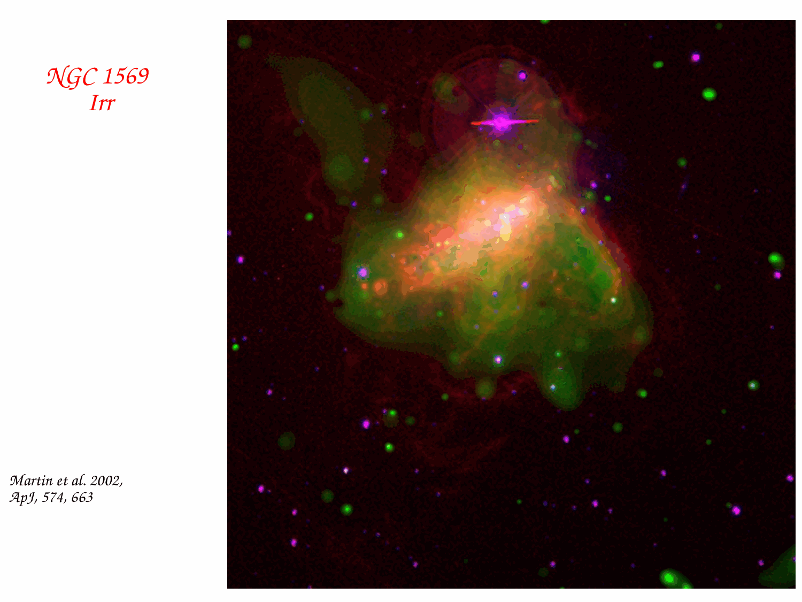


**HII region spectra** are dominated by **strong recombination lines** (especially Balmer Hα, Hβ) and **forbidden emission lines** (especially $[OIII], [NII], [SII], [OII]$) on top of a faint nebular continuum. classical example: the Orion Nebula M42.

## the spectral signature

### emission lines
- **H I Balmer** Hα ($6563$), Hβ ($4861$), Hγ, Hδ, ... in emission.
- **He I** lines like $\lambda 5876$ (D3), $\lambda 6678$. weaker but visible.
- **He II $\lambda 4686$** if a very hot ionising source ($T > 40\,000$ K).
- **$[OIII]\,\lambda 4959, 5007$** very strong, often comparable to Hβ.
- **$[OIII]\,\lambda 4363$** weak but detectable (the auroral line, used for $T_e$).
- **$[OII]\,\lambda 3726, 3729$** doublet.
- **$[NII]\,\lambda 6548, 6584$** flanking Hα.
- **$[SII]\,\lambda 6716, 6731$** doublet.
- **$[NeIII]\,\lambda 3869$**.

### faint continuum
- recombination + free-free + 2-photon, all faint compared to lines.

### no metal absorption
unlike a stellar photosphere, an HII region has no broad metal absorption features. the gas is too thin for absorption to dominate.

## what you can extract

from a single HII region spectrum:

1. **dust extinction** $A_V$: from $H\alpha/H\beta$ via [Balmer decrement](./Balmer%20decrement.html).
2. **electron density** $n_e$: from $[SII]\,\lambda 6716/\lambda 6731$.
3. **electron temperature** $T_e$: from $[OIII]\,\lambda 4363/(\lambda 4959+5007)$.
4. **ionisation parameter** $U$: from $[OIII]/[OII]$ ratio.
5. **abundances**: from emission-line strengths divided by $H\beta$, with $T_e, n_e$ known. mainly $\log(O/H), \log(N/H), \log(S/H), \log(Ne/H)$ via direct method.
6. **kinematics**: from line shifts and widths (radial velocities, internal turbulence).

a **complete plasma diagnosis** of an HII region from one moderate-quality spectrum.

## the canonical examples

### Orion Nebula M42
prototype HII region in the local universe. $\sim 24$ pc across, central $\theta^1$ Ori cluster. very well-studied at all wavelengths. the textbook example.

### M16 Eagle Nebula, M20 Trifid, M17 Omega
similar Galactic HII regions, each with associated young stellar clusters.

### NGC 604 in M33
the largest HII region in the Local Group. luminous, optically resolved.

### 30 Doradus / Tarantula in LMC
the most luminous HII region in the Local Group, around the R136 super-star cluster. major target for stellar wind / WR studies.

## the ionising stars

an HII region is created by the ionising photons from one or more O stars. spectral type of the ionising source determines:
- **size of HII region**: $R_S \propto Q^{1/3}$, so brighter sources $\to$ larger Strömgren spheres.
- **ionisation parameter**: hotter source $\to$ harder spectrum, higher $U$.
- **line ratios**: [OIII]/[OII], He II/H$\beta$, etc., signatures of ionising hardness.

photoionisation modelling (Cloudy, MAPPINGS) recovers source spectrum + gas conditions from observed line ratios.

## see also

- Strömgren sphere
- [Ionisation stratification](./Ionisation%20stratification.html)
- [Forbidden lines](./Forbidden%20lines.html)
- [OIII forbidden lines](./OIII%20forbidden%20lines.html)
- [SII forbidden lines](./SII%20forbidden%20lines.html)
- [Forbidden line diagnostics](./Forbidden%20line%20diagnostics.html)
- [Balmer decrement](./Balmer%20decrement.html)
- [Dust extinction in nebulae](./Dust%20extinction%20in%20nebulae.html)
- [Photoionisation balance](./Photoionisation%20balance.html)
- [Optically thin recombination lines](./Optically%20thin%20recombination%20lines.html)
- [Recombination continuum](./Recombination%20continuum.html)
- [BPT diagram](./BPT%20diagram.html)
- [H-alpha SFR tracer](./H-alpha%20SFR%20tracer.html)

---

## lecture slides and reference figures (Prof. Alessandro Pizzella)



  <h4 class="backlinks-title">Linked References (19)</h4>
  <ul class="backlinks-list">
    <li class="backlink-item-wrap"><a href="../../04_Atlas/Astronomical_Spectroscopy_MOC.html" class="backlink-item">Astronomical_Spectroscopy_MOC</a></li>
    <li class="backlink-item-wrap"><a href="../../04_Atlas/Astrophysics_of_Galaxies_MOC.html" class="backlink-item">Astrophysics_of_Galaxies_MOC</a></li>
    <li class="backlink-item-wrap"><a href="./BPT%20diagram.html" class="backlink-item">BPT diagram</a></li>
    <li class="backlink-item-wrap"><a href="./Balmer%20continuum.html" class="backlink-item">Balmer continuum</a></li>
    <li class="backlink-item-wrap"><a href="./Dust%20extinction%20in%20nebulae.html" class="backlink-item">Dust extinction in nebulae</a></li>
    <li class="backlink-item-wrap"><a href="./Emission%20line%20stars.html" class="backlink-item">Emission line stars</a></li>
    <li class="backlink-item-wrap"><a href="./Free-free%20continuum.html" class="backlink-item">Free-free continuum</a></li>
    <li class="backlink-item-wrap"><a href="./Galaxy%20spectroscopy%20by%20type.html" class="backlink-item">Galaxy spectroscopy by type</a></li>
    <li class="backlink-item-wrap"><a href="./Ionisation%20parameter%20U.html" class="backlink-item">Ionisation parameter U</a></li>
    <li class="backlink-item-wrap"><a href="./Ionisation%20parameter%20and%20ionisation%20state.html" class="backlink-item">Ionisation parameter and ionisation state</a></li>
    <li class="backlink-item-wrap"><a href="./Ionisation%20stratification.html" class="backlink-item">Ionisation stratification</a></li>
    <li class="backlink-item-wrap"><a href="./OIII%20forbidden%20lines.html" class="backlink-item">OIII forbidden lines</a></li>
    <li class="backlink-item-wrap"><a href="./Planetary%20nebula%20spectroscopy.html" class="backlink-item">Planetary nebula spectroscopy</a></li>
    <li class="backlink-item-wrap"><a href="./Recombination%20continuum.html" class="backlink-item">Recombination continuum</a></li>
    <li class="backlink-item-wrap"><a href="./Spectroscopic%20ne%20diagnostics.html" class="backlink-item">Spectroscopic ne diagnostics</a></li>
    <li class="backlink-item-wrap"><a href="./Stromgren%20sphere.html" class="backlink-item">Stromgren sphere</a></li>
    <li class="backlink-item-wrap"><a href="./Stromgren%20sphere%20derivation.html" class="backlink-item">Stromgren sphere derivation</a></li>
    <li class="backlink-item-wrap"><a href="./Supernova%20remnant%20spectroscopy.html" class="backlink-item">Supernova remnant spectroscopy</a></li>
    <li class="backlink-item-wrap"><a href="./Two-photon%20emission.html" class="backlink-item">Two-photon emission</a></li>
  </ul>

