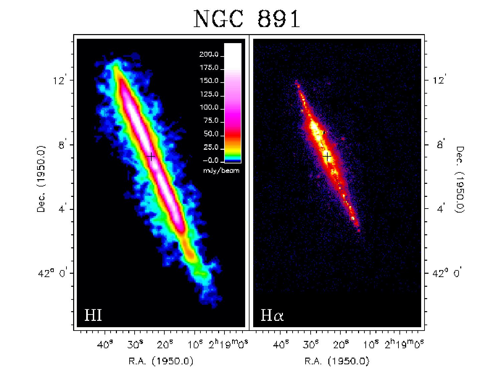
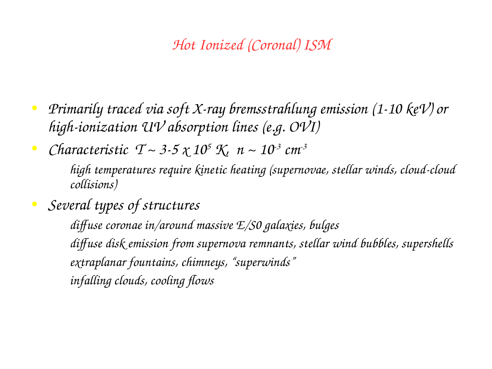
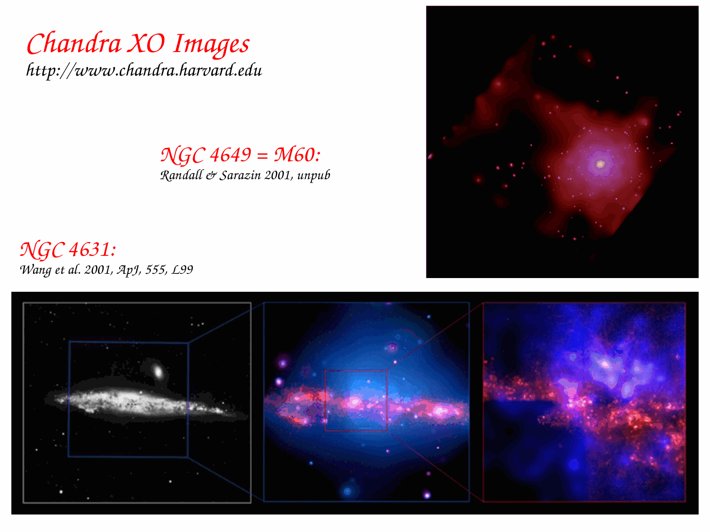

# H II region spectroscopy

H II regions are photoionized nebulae of warm ($T_e \sim 8000 - 15000$ K), low-density ($n_e \sim 10 - 10^4 \text{ cm}^{-3}$) gas surrounding young, massive stars of spectral types O and early B ($M \ge 10 - 20 M_\odot$, $T_{\rm eff} \ge 30000$ K). Their optical spectra are characterized by intense hydrogen and helium recombination lines flanked by prominent collisionally excited forbidden lines of heavier elements (primarily $[\text{O III}]$, $[\text{N II}]$, $[\text{S II}]$, and $[\text{O II}]$) superposed on a faint nebular continuum. Spectroscopic analysis of H II regions serves as a foundational astrophysical tool for mapping chemical abundance gradients across galactic disks, quantifying instantaneous star formation rates, correcting for dust attenuation via the Balmer decrement, and distinguishing stellar photoionization from active galactic nuclei (AGN) excitation using Baldwin-Phillips-Terlevich (BPT) diagnostic diagrams.

---

## 1. Astrophysical Context and Phenomenological Overview

### Formation of Photoionized Nebulae
Massive OB stars emit copious fluxes of Lyman continuum ultraviolet photons with energies exceeding the ionization potential of neutral hydrogen ($h\nu \ge h\nu_0 = 13.6$ eV, or wavelengths $\lambda \le 912$ \AA). When these extreme ultraviolet (EUV) photons propagate into the surrounding neutral interstellar medium, they photoionize neutral hydrogen atoms ($H^0 + h\nu \to H^+ + e^-$). The photoelectrons are ejected with excess kinetic energy $E_{\rm kin} = h\nu - 13.6 \text{ eV}$ and rapidly thermalize with ambient electrons through Coulomb collisions on timescales of days, establishing a Maxwell-Boltzmann velocity distribution characterized by electron temperature $T_e \sim 10^4$ K.
Because the mean free path of a Lyman continuum photon in neutral hydrogen is exceptionally short (typically $\lambda_{\rm mfp} = 1 / (n_H \sigma_0) \sim 0.05$ pc for $n_H \sim 10 \text{ cm}^{-3}$ and threshold photoionization cross section $\sigma_0 \approx 6.30 \times 10^{-18} \text{ cm}^2$), the transition zone between the fully ionized nebula ($H^+$) and the surrounding neutral gas ($H^0$) is remarkably thin ($\Delta r / R_S \sim 0.01$). This sharp ionization front encloses a well-defined ionization bubble known as a Strömgren sphere.

---

## 2. Complete Mathematical Derivation of the Strömgren Sphere

### Ionization-Recombination Equilibrium
Consider an idealized, static, spherically symmetric nebula of pure hydrogen gas with uniform total hydrogen number density $n_H$. A central ionizing star emits $Q(H^0)$ Lyman continuum photons per second
$$Q(H^0) = \int_{\nu_0}^\infty \frac{L_\nu}{h\nu} d\nu$$
where $\nu_0 = 3.29 \times 10^{15}$ Hz ($h\nu_0 = 13.6$ eV).
In steady-state equilibrium, the rate of photoionizations throughout the entire nebular volume $V$ must exactly balance the total rate of radiative recombinations of protons and free electrons back into neutral hydrogen atoms
$$Q(H^0) = \int_V n_e n_p \alpha(T_e) dV$$
Here $n_e$ is the electron number density, $n_p$ is the proton number density, and $\alpha(T_e)$ is the total radiative recombination coefficient.
Inside the ionized volume, hydrogen is virtually completely ionized, so $n_e \approx n_p \approx n_H$.

### Case A versus Case B Recombination
Radiative recombination can occur directly to the ground state ($n=1$) or to any excited state ($n \ge 2$).
1. Case A Recombination - Applicable only to optically thin clouds where all emitted photons escape. Recombinations directly to the ground state ($n=1$) emit a secondary photon with energy $h\nu \ge 13.6$ eV.
2. Case B Recombination (On-the-spot approximation) - In real astrophysical nebulae, the optical depth at the Lyman limit is huge ($	au_0 \gg 1$). Any photon emitted by recombination directly into the ground state has $h\nu \ge 13.6$ eV and is absorbed almost immediately on the spot by a neighboring neutral hydrogen atom, causing a new ionization. Therefore, recombinations to $n=1$ produce zero net destruction of ions.
Only recombinations to excited states ($n \ge 2$) result in net recombination, as the subsequent cascade downward emits Balmer, Paschen, or two-photon continuum photons with $h\nu < 13.6$ eV, which escape the nebula without ionizing hydrogen.

The effective Case B recombination coefficient is the sum over all states with principal quantum number $n \ge 2$
$$\alpha_B(T_e) = \sum_{n=2}^\infty \alpha_n(T_e)$$
At the canonical nebular temperature $T_e = 10000$ K, detailed atomic calculations (Osterbrock & Ferland 2006) give
$$\alpha_B(10^4 \text{ K}) = 2.59 \times 10^{-13} \text{ cm}^3 \text{ s}^{-1}$$
Its temperature dependence follows approximately
$$\alpha_B(T_e) \approx 2.59 \times 10^{-13} \left(\frac{T_e}{10^4 \text{ K}}\right)^{-0.8} \text{ cm}^3 \text{ s}^{-1}$$

### Integration for the Strömgren Radius
Substituting $n_e = n_p = n_H$ and integrating over a sphere of radius $R_S$
$$Q(H^0) = \int_0^{R_S} 4\pi r^2 n_H^2 \alpha_B(T_e) dr = \frac{4}{3}\pi R_S^3 n_H^2 \alpha_B(T_e)$$
Solving explicitly for the Strömgren radius $R_S$
$$R_S = \left[ \frac{3 Q(H^0)}{4\pi n_H^2 \alpha_B(T_e)} \right]^{1/3}$$

#### Numerical Evaluation for an O7V Main-Sequence Star
For a standard galactic O7V star with effective temperature $T_{\rm eff} \approx 37000$ K and luminosity $L \approx 10^5 L_\odot$, stellar atmosphere models yield an ionizing photon production rate of
$$Q(H^0) \approx 1.0 \times 10^{49} \text{ photons s}^{-1}$$
Assuming an ambient interstellar gas density of $n_H = 10 \text{ cm}^{-3}$ at $T_e = 10^4$ K
$$R_S = \left[ \frac{3 \times 10^{49}}{4\pi \times (10 \text{ cm}^{-3})^2 \times (2.59 \times 10^{-13} \text{ cm}^3 \text{ s}^{-1})} \right]^{1/3}$$
Evaluating the denominator
$$\text{Denominator} = 4\pi \times 100 \times (2.59 \times 10^{-13}) \approx 12.566 \times 2.59 \times 10^{-11} \approx 3.255 \times 10^{-10} \text{ cm}^{-1} \text{ s}^{-1}$$
Dividing numerator by denominator
$$\frac{3 \times 10^{49}}{3.255 \times 10^{-10}} \approx 9.217 \times 10^{58} \text{ cm}^3$$
Taking the cube root
$$R_S \approx (9.217 \times 10^{58})^{1/3} \approx 4.517 \times 10^{19} \text{ cm}$$
Converting centimeters to parsecs ($1 \text{ pc} = 3.086 \times 10^{18}$ cm)
$$R_S = \frac{4.517 \times 10^{19} \text{ cm}}{3.086 \times 10^{18} \text{ cm pc}^{-1}} \approx 14.6 \text{ pc}$$
If the ambient gas density is higher, e.g. in a dense molecular cloud core with $n_H = 1000 \text{ cm}^{-3}$, the Strömgren sphere shrinks via the $n_H^{-2/3}$ scaling to $R_S \approx 0.68$ pc (an ultracompact H II region).

---

## 3. Quantum Mechanics of Collisionally Excited Forbidden Lines

In optical spectra of H II regions, the strongest emission lines often belong to forbidden transitions of heavy ions, such as $[\text{O III}]\ \lambda 5007$, $[\text{O III}]\ \lambda 4959$, $[\text{N II}]\ \lambda 6584$, and $[\text{S II}]\ \lambda\lambda 6716, 6731$.

### Atomic Transitions and Selection Rules
Allowed optical transitions (such as hydrogen Balmer lines) occur via electric dipole radiation with transition probabilities $A_{ki} \sim 10^7 - 10^8 \text{ s}^{-1}$, corresponding to radiative lifetimes of nanoseconds.
Forbidden transitions violate electric dipole selection rules ($\Delta S = 0$, $\Delta L = 0, \pm 1$, parity change required) and proceed only via magnetic dipole (M1) or electric quadrupole (E2) radiation. Their radiative transition probabilities are exceptionally small
$$A_{ki} \sim 10^{-4} - 10^0 \text{ s}^{-1}$$
The upper metastable states have spontaneous radiative lifetimes ranging from seconds to hours. In terrestrial laboratory conditions, where gas densities exceed $n \sim 10^{14} \text{ cm}^{-3}$, collision rates are so frequent that excited atoms are de-excited by collisions long before they can radiate spontaneously, completely quenching the forbidden emission.

### Critical Density Formulation
In astrophysical nebulae, the balance between spontaneous radiative decay and collisional de-excitation is governed by the critical density $n_{\rm crit}$.
For an upper level $k$ decaying to lower level $i$, the rate equation in a two-level approximation is
$$n_k \sum_{i < k} A_{ki} + n_k n_e q_{ki} = n_i n_e q_{ik}$$
where $q_{ki}$ is the collisional de-excitation rate coefficient given by
$$q_{ki} = \frac{8.63 \times 10^{-6}}{\sqrt{T_e}} \frac{\Omega(i, k)}{\omega_k} \quad [\text{cm}^3 \text{ s}^{-1}]$$
where $\Omega(i, k)$ is the dimensionless thermally averaged collision strength, and $\omega_k$ is the statistical weight of level $k$.
The critical density is defined as the electron density at which the collisional de-excitation rate equals the spontaneous radiative decay rate
$$n_{\rm crit} \equiv \frac{\sum_{i < k} A_{ki}}{q_{ki}}$$
- Low-density regime ($n_e \ll n_{\rm crit}$) - Collisional de-excitation is negligible. Every collision from the ground state that excites an electron to level $k$ results in the emission of a forbidden line photon. The line cooling rate scales linearly with density squared ($\propto n_e n_{\rm ion}$).
- High-density regime ($n_e \gg n_{\rm crit}$) - Collisional de-excitation dominates. The level populations reach Boltzmann thermal equilibrium ($n_k/n_i \propto e^{-\Delta E / k_B T_e}$), and the line emissivity scales only linearly with density ($\propto n_{\rm ion}$). The line becomes collisionally quenched as a cooling agent.

```
+========================================================================================+
| Spectral Line           | Upper Level | Transition | A_ki (s^-1) | n_crit (cm^-3)      |
+========================================================================================+
| [O III] lambda 5007     | 1D_2        | M1 / E2    | 2.0 x 10^-2 | 6.8 x 10^5          |
| [O III] lambda 4363     | 1S_0        | E2         | 1.6 x 10^0  | 3.3 x 10^7          |
| [N II] lambda 6584      | 1D_2        | M1 / E2    | 3.0 x 10^-3 | 8.6 x 10^4          |
| [S II] lambda 6716      | 2D_5/2      | M1 / E2    | 2.6 x 10^-4 | 1.5 x 10^3          |
| [S II] lambda 6731      | 2D_3/2      | M1 / E2    | 8.8 x 10^-4 | 3.9 x 10^3          |
| [O II] lambda 3726      | 2D_3/2      | M1 / E2    | 1.6 x 10^-4 | 1.6 x 10^4          |
| [O II] lambda 3729      | 2D_5/2      | M1 / E2    | 4.2 x 10^-5 | 3.4 x 10^3          |
+========================================================================================+
```

---

## 4. Spectroscopic Diagnostics of Physical Conditions

### Electron Temperature Diagnostic via $[\text{O III}]$
The doubly ionized oxygen ion ($	ext{O}^{++}$) exhibits a three-level ground configuration ($2p^2$) - ground state $^3P_{0,1,2}$, intermediate metastable level $^1D_2$ (excitation energy $E_2 / k_B \approx 28900$ K), and upper metastable level $^1S_0$ (excitation energy $E_3 / k_B \approx 61900$ K).
- Nebular lines - Transitions from $^1D_2 \to\ ^3P_2$ ($\lambda 5007$) and $^1D_2 \to\ ^3P_1$ ($\lambda 4959$).
- Auroral line - Transition from $^1S_0 \to\ ^1D_2$ ($\lambda 4363$).

Because the excitation energy of the $^1S_0$ level is more than double that of the $^1D_2$ level, the relative collisional excitation rate is exponentially sensitive to electron temperature.
The theoretical flux ratio is given by (Osterbrock & Ferland 2006)
$$\frac{I(\lambda 4959) + I(\lambda 5007)}{I(\lambda 4363)} = \frac{7.9 \exp(3.29 \times 10^4 / T_e)}{1 + 4.5 \times 10^{-4} (n_e / \sqrt{T_e})}$$
In the typical nebular low-density limit ($n_e < 10^4 \text{ cm}^{-3}$), the denominator is approximately unity, yielding a direct analytical relation between the $[\text{O III}]$ line ratio and $T_e$.
A measured ratio of $\approx 100$ corresponds to $T_e \approx 10000$ K. A ratio of $\approx 30$ indicates a much hotter nebula ($T_e \approx 15000$ K, characteristic of low-metallicity gas where metal line cooling is suppressed).

### Electron Density Diagnostic via $[\text{S II}]$
The singly ionized sulfur ion ($	ext{S}^+$) has a ground configuration ($3p^3$) with a $^4S_{3/2}$ ground state and two closely spaced excited levels $^2D_{5/2}$ ($\lambda 6716$) and $^2D_{3/2}$ ($\lambda 6731$).
Because both levels have virtually identical excitation energies ($E/k_B \approx 21400$ K), the ratio of their collisional excitation rates from the ground state depends purely on the ratio of their statistical weights ($\omega = 2J+1$)
$$\frac{q(1 \to 2D_{5/2})}{q(1 \to 2D_{3/2})} = \frac{\omega(2D_{5/2})}{\omega(2D_{3/2})} = \frac{6}{4} = 1.5$$
However, their spontaneous decay rates differ significantly ($A_{6716} = 2.6 \times 10^{-4} \text{ s}^{-1}$ vs $A_{6731} = 8.8 \times 10^{-4} \text{ s}^{-1}$), yielding critical densities of $1.5 \times 10^3 \text{ cm}^{-3}$ and $3.9 \times 10^3 \text{ cm}^{-3}$.
- Low-density limit ($n_e \to 0$) - Every excitation decays radiatively, so the line flux ratio equals the ratio of excitation rates
$$\frac{I(\lambda 6716)}{I(\lambda 6731)} = \frac{\omega_1}{\omega_2} = \frac{6}{4} = 1.50 \quad (\text{observed } \approx 1.45)$$
- High-density limit ($n_e \to \infty$) - Both levels reach thermal equilibrium populations ($n_1/n_2 = \omega_1/\omega_2$). The line flux ratio equals the ratio of transition probabilities times statistical weights
$$\frac{I(\lambda 6716)}{I(\lambda 6731)} = \frac{\omega_1 A_{6716}}{\omega_2 A_{6731}} = \frac{6 \times (2.6 \times 10^{-4})}{4 \times (8.8 \times 10^{-4})} \approx 0.44$$
For densities between $10^2 \text{ cm}^{-3}$ and $10^4 \text{ cm}^{-3}$, the $[\text{S II}]$ ratio provides a sensitive direct probe of electron density $n_e$.

---

## 5. The Baldwin-Phillips-Terlevich (BPT) Diagnostic Diagram

The BPT diagram (Baldwin, Phillips & Terlevich 1981) provides the primary spectroscopic classification tool in extragalactic astronomy, separating normal star-forming galaxies (photoionized by young OB stars) from active galactic nuclei (photoionized by hard power-law radiation from an accretion disk) and shock-excited systems.

### Line Ratios and Mathematical Demarcations
The standard optical BPT diagram plots
- Horizontal axis $x = \log_{10}([\text{N II}]\,\lambda 6584 / H\alpha)$
- Vertical axis $y = \log_{10}([\text{O III}]\,\lambda 5007 / H\beta)$

These specific line pairs are chosen because each pair consists of two lines with very small wavelength separation ($[\text{N II}]$ and $H\alpha$ at $\sim 6570$ \AA; $[\text{O III}]$ and $H\beta$ at $\sim 4950$ \AA). Consequently, the ratios are virtually insensitive to dust reddening and absolute spectrophotometric calibration errors.

Two fundamental demarcation curves divide the BPT plane
1. Theoretical Maximum Starburst Line (Kewley et al. 2001)
   Derived from extensive photoionization models combining stellar population synthesis (Starburst99) and nebular modeling (MAPPINGS III) under extreme assumptions of continuous starbursts and high ionization parameters
   $$y = \frac{0.61}{x - 0.47} + 1.19$$
   Galaxies residing above this line cannot be photoionized by normal stellar populations, requiring a harder ionizing radiation field (AGN or fast shocks).
2. Empirical Star-Forming Boundary (Kauffmann et al. 2003)
   Calibrated using over 100,000 SDSS galaxies to define the upper envelope of pure star-forming galaxies
   $$y = \frac{0.61}{x - 0.05} + 1.30$$

### Physical Classification Zones
- Star-Forming H II Sequence - Occupies a tight, curved locus extending from high $[\text{O III}]/H\beta$ and low $[\text{N II}]/H\alpha$ (low metallicity, high $T_e$) down to low $[\text{O III}]/H\beta$ and higher $[\text{N II}]/H\alpha$ (high metallicity, strong metal cooling).
- Composite Transition Region - Lies between the Kauffmann and Kewley curves. Hosts galaxies with mixed excitation (simultaneous starburst plus weak AGN activity or shock heating).
- Seyfert AGN Branch - Extends upward to high $[\text{O III}]/H\beta \ge 3$ and high $[\text{N II}]/H\alpha > 0.6$. Powered by power-law UV-to-X-ray radiation from the central supermassive black hole.
- LINER Branch (Low-Ionization Nuclear Emission-line Regions) - Extends rightward with lower $[\text{O III}]/H\beta < 3$ but elevated $[\text{N II}]/H\alpha > 0.6$, $[\text{S II}]/H\alpha$, and $[\text{O I}]/H\alpha$. Powered by low-luminosity AGN, post-AGB stellar ionization (HOLMES), or interstellar shock waves.

---

## 6. Blackboard Blueprint and Observational Graph Literacy

```
                  THE OPTICAL BPT DIAGNOSTIC DIAGRAM
   log10 ([O III] 5007 / H-beta)
     +1.5 +                        .-----------.
          |                       /   SEYFERT   \
     +1.0 +                      /     (AGN)     \
          |     STARBURST       |                 |
     +0.5 +     SEQUENCE       /                   \
          |         *         /  COMPOSITE          \
      0.0 +          *       |     ZONE              \    LINERs
          |           *     /                         \  (Shocks /
     -0.5 +            *   |      Kewley 2001         /   p-AGB)
          |             * /     .-------------.      /
     -1.0 +              *     / Kauffmann 2003     /
          |               *   /                    /
     -1.5 +
          +===+===========+==/========+===========+===========+
            -1.5        -1.0        -0.5         0.0        +0.5
                      log10 ([N II] 6584 / H-alpha)

             STRÖMGREN SPHERE RADIAL STRUCTURE SCHEMATIC
      Ionizing Star (O7V)
            (*)  ======> UV Photons (h nu >= 13.6 eV)
             |
             |<---------------- R_S ~ 15 pc ----------------->|
             |                                                |
      [ H+ Zone - Fully Ionized Plasma ]               [ H0 Neutral Envelope ]
      [ T_e ~ 10,000 K, n_e ~ n_p ~ n_H ]              [ T ~ 100 K (CNM/WNM) ]
             |                                                |
             +================================================+
                               Ionization Front
                               (Delta r ~ 0.1 pc)
```

### Blackboard Presentation Script for the Oral Examination
1. Draw the Strömgren sphere radial diagram first. Mark the central O-star, the interior $H^+$ zone with temperature $T_e \approx 10^4$ K, and the extremely sharp ionization front where neutral hydrogen jumps from 0 to 1 over $\Delta r \ll R_S$.
2. State the steady-state equation $Q(H^0) = \frac{4}{3}\pi R_S^3 n_H^2 \alpha_B(T_e)$ and explain clearly why Case B recombination is essential (on-the-spot reabsorption of Lyman continuum photons).
3. Draw the BPT diagram. Label the horizontal axis as $\log_{10}([\text{N II}]\lambda 6584 / H\alpha)$ and vertical axis as $\log_{10}([\text{O III}]\lambda 5007 / H\beta)$.
4. Explain why these line ratios are chosen - their components are close in wavelength, making them immune to dust extinction and flux calibration uncertainties.
5. Draw the star-forming plume bending downward to the right as metallicity increases. Draw the Kauffmann empirical curve and the Kewley theoretical upper boundary.
6. Identify the two upper branches - Seyferts with high ionization parameter and hard radiation, and LINERs with low ionization but enhanced forbidden lines from shocks or evolved stars.

---

## 7. Exact Textbook and Literature Provenance

- Course Dispensa `dispense_DM_2_eng.pdf` (Prof. Alessandro Pizzella)
  - Section 2 - Gas and Interstellar Medium (pages 10-12) - Ionized gas diagnostics, Strömgren sphere derivation, and recombination physics.
- Course Lecture Slides
  - `gal_ism-28..31` - Optical spectra of H II regions, electron density and temperature diagnostics, and BPT diagrams.
- Houjun Mo, Frank van den Bosch, Simon White, *Galaxy Formation and Evolution* (2010)
  - Chapter 9 - Star Formation and the Interstellar Medium (pages 450-455) - Photoionization physics, Strömgren spheres, and emission line diagnostics.
- Donald Osterbrock & Gary Ferland, *Astrophysics of Gaseous Nebulae and Active Galactic Nuclei* (2nd ed. 2006, University Science Books)
  - Chapter 2 - Photoionization Equilibrium (pages 10-36) - Complete Strömgren sphere and Case B recombination mathematics.
  - Chapter 3 - Thermal Equilibrium and Line Diagnostics (pages 37-70) - $[\text{O III}]$ temperature and $[\text{S II}]$ density formulations.
  - Chapter 5 - Active Galactic Nuclei and Diagnostic Diagrams (pages 310-335).
- Primary Literature
  - Baldwin, Phillips & Terlevich (1981, PASP 93, 5) - *Classification parameters for the emission-line spectra of extragalactic objects*.
  - Kewley et al. (2001, ApJ 556, 121) - *Theoretical Modeling of Starburst Galaxies*.
  - Kauffmann et al. (2003, MNRAS 346, 1055) - *The host galaxies of active galactic nuclei*.

---

## 8. Cross-References and Related Notes

- [Photodissociation regions PDRs](Photodissociation%20regions%20PDRs.html) - Neutral and molecular transition layers bordering H II regions
- [Molecular clouds](Molecular%20clouds.html) - Dense star-forming environments and CO chemistry
- [H I regions](H%20I%20regions.html) - 21 cm line emission of neutral atomic hydrogen
- [Schmidt-Kennicutt law](Schmidt-Kennicutt%20law.html) - Empirical relation between gas surface density and star formation rate
- [Ionized gas kinematics](Ionized%20gas%20kinematics.html) - Velocity fields and rotation curves from emission lines
- [Astrophysics_of_Galaxies_MOC](../../04_Atlas/Astrophysics_of_Galaxies_MOC.html) - Master Map of Content for course

---

## 9. Course Slides and Figures


*Figure 1 - Optical emission-line spectrum of a classic H II region showing Balmer lines and forbidden transitions.*


*Figure 2 - Atomic level diagrams for [O III] and [S II] illustrating temperature and density sensitive transitions.*


*Figure 3 - The BPT diagram separating star-forming galaxies, composites, Seyferts, and LINERs.*

<div class="backlinks-section">
  <h4 class="backlinks-title">Linked References (20)</h4>
  <ul class="backlinks-list">
    <li class="backlink-item-wrap"><a href="BPT%20diagram.html" class="backlink-item">BPT diagram</a></li>
    <li class="backlink-item-wrap"><a href="Balmer%20continuum.html" class="backlink-item">Balmer continuum</a></li>
    <li class="backlink-item-wrap"><a href="Dust%20extinction%20in%20nebulae.html" class="backlink-item">Dust extinction in nebulae</a></li>
    <li class="backlink-item-wrap"><a href="Emission%20line%20stars.html" class="backlink-item">Emission line stars</a></li>
    <li class="backlink-item-wrap"><a href="Free-free%20continuum.html" class="backlink-item">Free-free continuum</a></li>
    <li class="backlink-item-wrap"><a href="Galaxy%20spectroscopy%20by%20type.html" class="backlink-item">Galaxy spectroscopy by type</a></li>
    <li class="backlink-item-wrap"><a href="Ionisation%20parameter%20U.html" class="backlink-item">Ionisation parameter U</a></li>
    <li class="backlink-item-wrap"><a href="Ionisation%20parameter%20and%20ionisation%20state.html" class="backlink-item">Ionisation parameter and ionisation state</a></li>
    <li class="backlink-item-wrap"><a href="Ionisation%20stratification.html" class="backlink-item">Ionisation stratification</a></li>
    <li class="backlink-item-wrap"><a href="OIII%20forbidden%20lines.html" class="backlink-item">OIII forbidden lines</a></li>
    <li class="backlink-item-wrap"><a href="Photodissociation%20regions%20PDRs.html" class="backlink-item">Photodissociation regions PDRs</a></li>
    <li class="backlink-item-wrap"><a href="Planetary%20nebula%20spectroscopy.html" class="backlink-item">Planetary nebula spectroscopy</a></li>
    <li class="backlink-item-wrap"><a href="Recombination%20continuum.html" class="backlink-item">Recombination continuum</a></li>
    <li class="backlink-item-wrap"><a href="Spectroscopic%20ne%20diagnostics.html" class="backlink-item">Spectroscopic ne diagnostics</a></li>
    <li class="backlink-item-wrap"><a href="Stromgren%20sphere%20derivation.html" class="backlink-item">Stromgren sphere derivation</a></li>
    <li class="backlink-item-wrap"><a href="Stromgren%20sphere.html" class="backlink-item">Stromgren sphere</a></li>
    <li class="backlink-item-wrap"><a href="Supernova%20remnant%20spectroscopy.html" class="backlink-item">Supernova remnant spectroscopy</a></li>
    <li class="backlink-item-wrap"><a href="Two-photon%20emission.html" class="backlink-item">Two-photon emission</a></li>
    <li class="backlink-item-wrap"><a href="../../04_Atlas/Astronomical_Spectroscopy_MOC.html" class="backlink-item">Astronomical_Spectroscopy_MOC</a></li>
    <li class="backlink-item-wrap"><a href="../../04_Atlas/Astrophysics_of_Galaxies_MOC.html" class="backlink-item">Astrophysics_of_Galaxies_MOC</a></li>
  </ul>
</div>

