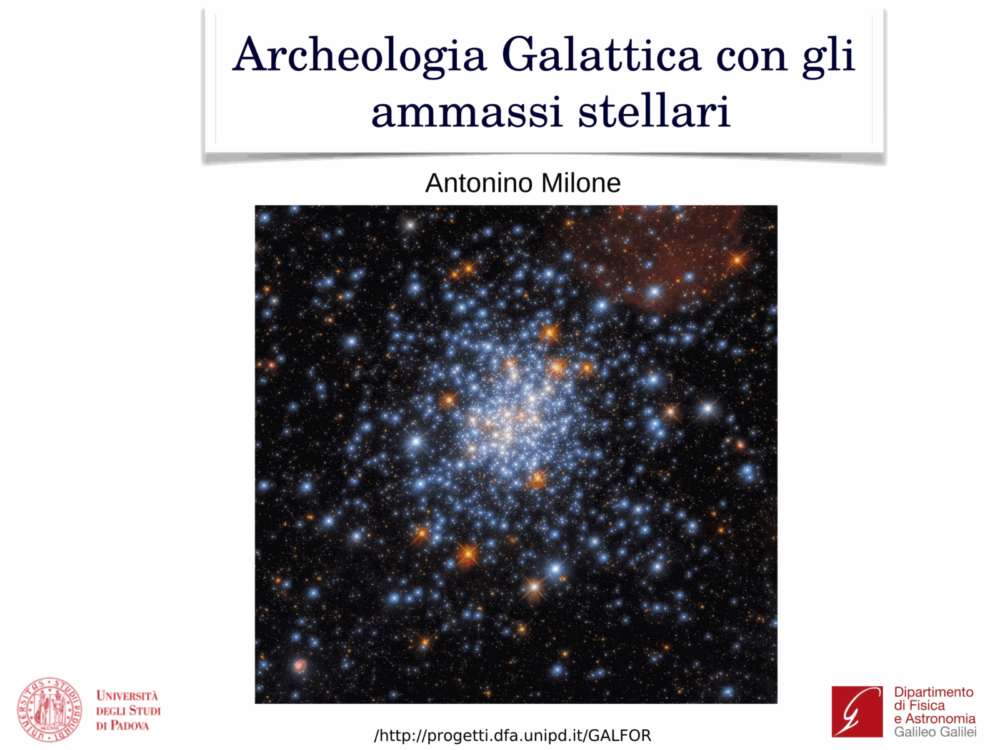

helium is the most important element in the multiple-population story + the hardest to measure. it is the inevitable product of any H-burning polluter, so a chemically peculiar GC must also be helium-spread. quantifying this spread requires indirect methods because helium has no usable photospheric lines in cool stars. the consensus is that 2G stars in massive GCs are enhanced by $\Delta Y$ up to $0.10$-$0.15$, with extreme tails reaching $Y \sim 0.40$ in NGC 2808 + $\omega$ Cen.

## why we cannot measure He directly

helium lines (He I $\lambda 5876, 4471, 10830$) are excitable only in stars with $T_\text{eff} \gtrsim 8500$ K. cool MS + RGB stars have no helium features in their spectra. the only places we can read He directly are:
- hot horizontal branch stars (where measured He shows complex behaviour from gravitational settling + radiative levitation, not the photospheric birth value)
- blue hook stars in extreme HBs

so the inference for cool stars is **structural**: how does adding helium change the star's interior + therefore its position in the [CMD](Color-magnitude%20diagrams%20of%20clusters.html)?

## structural effects of enhanced Y

at fixed total mass, increasing $Y$:
1. raises the mean molecular weight $\mu$, hence raises luminosity $L \propto \mu^4$ on the MS
2. shifts the MS hotter + bluer at fixed mass, but for stars at the same age the He-rich population has lower turn-off mass + reaches the TO in a shorter time
3. shrinks the H-rich envelope on the HB at fixed total mass, leading to **bluer + hotter HB morphology**
4. reduces the RGB lifetime + slightly modifies the RGB bump position

so a He-enhanced 2G shows up in a CMD as:
- a slightly bluer + brighter MS at fixed magnitude
- a fainter sub-giant branch
- a hotter HB

## measuring ΔY from MS splits

the cleanest method is fitting isochrones to a split MS. piotto et al. 2007 in NGC 2808 found three discrete MS branches. the bluest required $Y \sim 0.40$ (vs primordial $Y \sim 0.245$ from [Big Bang nucleosynthesis](Big%20Bang%20nucleosynthesis.html)), giving $\Delta Y \sim 0.15$. the intermediate branch needed $Y \sim 0.32$. all three agreed in age + [Fe/H], so the only free parameter was helium.

milone et al. (2012, 2014, 2018) extended this to many clusters using HST UV+optical photometry. the helium spread is mass-dependent: more massive GCs show larger $\Delta Y$. an empirical scaling roughly:
$$\Delta Y_\text{max} \sim 0.05 + 0.04 \log_{10}(M / 10^5\, M_\odot)$$
with substantial scatter. clusters below $\sim 10^{4.5}\, M_\odot$ often show no measurable He spread.

## measuring ΔY from HB morphology

a complementary diagnostic: the HB morphology in GCs is famously varied + not well predicted by [Fe/H] + age alone (the so-called "second parameter problem"). he-enhanced 2G stars at the He flash retain less envelope mass + populate the blue/hot HB. d'antona, caloi + collaborators showed that the bimodal/extended HBs in NGC 2808, NGC 6388, NGC 6441, $\omega$ Cen are naturally produced if the cluster contains a He-rich subpopulation.

the canonical NGC 2808 HB has three groups:
- red HB: $Y \sim 0.245$ (1G)
- blue HB: $Y \sim 0.32$ (intermediate 2G)
- extreme blue hook: $Y \sim 0.40$ (extreme 2G)

these three match the three MS branches + close the loop.

## the chromosome map vertical axis

in [Photometric chromosome maps](Photometric%20chromosome%20maps.html) the $\Delta_{F275W, F814W}$ axis is essentially a He thermometer. the F275W-F814W baseline is long enough to be sensitive to the temperature shift induced by helium variation, while being only weakly sensitive to N + O via molecular bands (those are picked up in the orthogonal $\Delta_{C\,F275W,F336W,F438W}$ axis). milone's chromosome maps therefore separate populations by both He + N independently.

## why He enhancement is unavoidable

any nuclear polluter that produces Na-O, CN, or MgAl signatures must by stoichiometry also produce $^4\text{He}$. the question is not whether 2G is He-rich but how rich. the observed magnitude of $\Delta Y \sim 0.10$-$0.15$ is one of the tightest constraints on [polluter scenarios](Polluter%20scenarios%20for%20second-generation%20GC%20stars.html):
- AGB hot bottom burning naturally produces $Y \sim 0.36$-$0.38$ in ejecta, marginally enough
- fast-rotating massive stars can reach $Y \sim 0.40$ but with chemistry mismatches
- supermassive stars ($> 10^4\, M_\odot$) reach $Y \sim 0.4$-$0.5$ trivially

the helium constraint, combined with the mass budget, is the single hardest test for any model.

## extreme cases

- $\omega$ Centauri: $Y$ up to $\sim 0.40$, with multiple discrete populations + an iron spread (qualifies as Type II / accreted nucleus, see [Type I and Type II GCs](Type%20I%20and%20Type%20II%20GCs.html))
- NGC 2808: classic three-MS cluster, $\Delta Y \sim 0.15$
- NGC 6441 + NGC 6388: metal-rich but with extended blue HBs implying $\Delta Y \sim 0.05$-$0.07$ despite high [Fe/H]
- 47 Tuc: modest $\Delta Y \sim 0.03$, consistent with mild Na-O extension

## see also

- [Na O anticorrelation](Na%20O%20anticorrelation.html)
- [CN CH MgAl anticorrelations](CN%20CH%20MgAl%20anticorrelations.html)
- [Photometric chromosome maps](Photometric%20chromosome%20maps.html)
- [Multiple populations in GCs discovery](Multiple%20populations%20in%20GCs%20discovery.html)
- [Polluter scenarios for second-generation GC stars](Polluter%20scenarios%20for%20second-generation%20GC%20stars.html)
- [Type I and Type II GCs](Type%20I%20and%20Type%20II%20GCs.html)
- [Color-magnitude diagrams of clusters](Color-magnitude%20diagrams%20of%20clusters.html)
- Horizontal branch morphology
- [Big Bang nucleosynthesis](Big%20Bang%20nucleosynthesis.html)
- [Stellar atmosphere structure](Stellar%20atmosphere%20structure.html)
- [Stellar_Astrophysics_MOC](../../04_Atlas/Stellar_Astrophysics_MOC.html)

---

## Complete Lecture Slide Panels & Observational Evidence (Lecture 16 — Multiple Stellar Populations: Helium Enrichment & Polluters)

> **Context**: *Helium enhancement (Delta Y up to 0.15), MS bluing, hot Horizontal Branch morphology, and candidate polluters (massive AGBs, FRMS, supermassive stars).*

The following slides from Prof. Antonino Milone's lecture series provide the direct observational, photometric, and theoretical foundations for this topic:

*Figure P16-01: LAntonino_p16_01.png — Observational data, CMD morphology, and diagnostics from Lecture 16 — Multiple Stellar Populations: Helium Enrichment & Polluters.*

*Figure P16-02: LAntonino_p16_02.png — Observational data, CMD morphology, and diagnostics from Lecture 16 — Multiple Stellar Populations: Helium Enrichment & Polluters.*

*Figure P16-03: LAntonino_p16_03.png — Observational data, CMD morphology, and diagnostics from Lecture 16 — Multiple Stellar Populations: Helium Enrichment & Polluters.*

*Figure P16-04: LAntonino_p16_04.png — Observational data, CMD morphology, and diagnostics from Lecture 16 — Multiple Stellar Populations: Helium Enrichment & Polluters.*

*Figure P16-05: LAntonino_p16_05.png — Observational data, CMD morphology, and diagnostics from Lecture 16 — Multiple Stellar Populations: Helium Enrichment & Polluters.*

*Figure P16-06: LAntonino_p16_06.png — Observational data, CMD morphology, and diagnostics from Lecture 16 — Multiple Stellar Populations: Helium Enrichment & Polluters.*

*Figure P16-07: LAntonino_p16_07.png — Observational data, CMD morphology, and diagnostics from Lecture 16 — Multiple Stellar Populations: Helium Enrichment & Polluters.*

*Figure P16-08: LAntonino_p16_08.png — Observational data, CMD morphology, and diagnostics from Lecture 16 — Multiple Stellar Populations: Helium Enrichment & Polluters.*

*Figure P16-09: LAntonino_p16_09.png — Observational data, CMD morphology, and diagnostics from Lecture 16 — Multiple Stellar Populations: Helium Enrichment & Polluters.*

*Figure P16-10: LAntonino_p16_10.png — Observational data, CMD morphology, and diagnostics from Lecture 16 — Multiple Stellar Populations: Helium Enrichment & Polluters.*

*Figure P16-11: LAntonino_p16_11.png — Observational data, CMD morphology, and diagnostics from Lecture 16 — Multiple Stellar Populations: Helium Enrichment & Polluters.*

*Figure P16-12: LAntonino_p16_12.png — Observational data, CMD morphology, and diagnostics from Lecture 16 — Multiple Stellar Populations: Helium Enrichment & Polluters.*

*Figure P16-13: LAntonino_p16_13.png — Observational data, CMD morphology, and diagnostics from Lecture 16 — Multiple Stellar Populations: Helium Enrichment & Polluters.*

*Figure P16-14: LAntonino_p16_14.png — Observational data, CMD morphology, and diagnostics from Lecture 16 — Multiple Stellar Populations: Helium Enrichment & Polluters.*

*Figure P16-15: LAntonino_p16_15.png — Observational data, CMD morphology, and diagnostics from Lecture 16 — Multiple Stellar Populations: Helium Enrichment & Polluters.*

*Figure P16-16: LAntonino_p16_16.png — Observational data, CMD morphology, and diagnostics from Lecture 16 — Multiple Stellar Populations: Helium Enrichment & Polluters.*

*Figure P16-17: LAntonino_p16_17.png — Observational data, CMD morphology, and diagnostics from Lecture 16 — Multiple Stellar Populations: Helium Enrichment & Polluters.*

*Figure P16-18: LAntonino_p16_18.png — Observational data, CMD morphology, and diagnostics from Lecture 16 — Multiple Stellar Populations: Helium Enrichment & Polluters.*

*Figure P16-19: LAntonino_p16_19.png — Observational data, CMD morphology, and diagnostics from Lecture 16 — Multiple Stellar Populations: Helium Enrichment & Polluters.*

*Figure P16-20: LAntonino_p16_20.png — Observational data, CMD morphology, and diagnostics from Lecture 16 — Multiple Stellar Populations: Helium Enrichment & Polluters.*

*Figure P16-21: LAntonino_p16_21.png — Observational data, CMD morphology, and diagnostics from Lecture 16 — Multiple Stellar Populations: Helium Enrichment & Polluters.*

*Figure P16-22: LAntonino_p16_22.png — Observational data, CMD morphology, and diagnostics from Lecture 16 — Multiple Stellar Populations: Helium Enrichment & Polluters.*

*Figure P16-23: LAntonino_p16_23.png — Observational data, CMD morphology, and diagnostics from Lecture 16 — Multiple Stellar Populations: Helium Enrichment & Polluters.*

*Figure P16-24: LAntonino_p16_24.png — Observational data, CMD morphology, and diagnostics from Lecture 16 — Multiple Stellar Populations: Helium Enrichment & Polluters.*

*Figure P16-25: LAntonino_p16_25.png — Observational data, CMD morphology, and diagnostics from Lecture 16 — Multiple Stellar Populations: Helium Enrichment & Polluters.*

  <h4 class="backlinks-title">Linked References (15)</h4>
  <ul class="backlinks-list">
    <li class="backlink-item-wrap"><a href="CN%20CH%20MgAl%20anticorrelations.html" class="backlink-item">CN CH MgAl anticorrelations</a></li>
    <li class="backlink-item-wrap"><a href="Extended%20main%20sequence%20turn-off%20eMSTO.html" class="backlink-item">Extended main sequence turn-off eMSTO</a></li>
    <li class="backlink-item-wrap"><a href="GC%20formation%20models%20with%20MPs.html" class="backlink-item">GC formation models with MPs</a></li>
    <li class="backlink-item-wrap"><a href="Mass%20dependence%20of%20multiple%20populations.html" class="backlink-item">Mass dependence of multiple populations</a></li>
    <li class="backlink-item-wrap"><a href="Multiple%20populations%20in%20GCs%20discovery.html" class="backlink-item">Multiple populations in GCs discovery</a></li>
    <li class="backlink-item-wrap"><a href="Multiple%20populations%20in%20extragalactic%20GCs.html" class="backlink-item">Multiple populations in extragalactic GCs</a></li>
    <li class="backlink-item-wrap"><a href="Na%20O%20anticorrelation.html" class="backlink-item">Na O anticorrelation</a></li>
    <li class="backlink-item-wrap"><a href="Origin%20of%20eMSTO%20age%20spread%20or%20rotation.html" class="backlink-item">Origin of eMSTO age spread or rotation</a></li>
    <li class="backlink-item-wrap"><a href="Photometric%20chromosome%20maps.html" class="backlink-item">Photometric chromosome maps</a></li>
    <li class="backlink-item-wrap"><a href="Polluter%20scenarios%20for%20second-generation%20GC%20stars.html" class="backlink-item">Polluter scenarios for second-generation GC stars</a></li>
    <li class="backlink-item-wrap"><a href="Splitting%20of%20the%20upper%20MS%20in%20young%20clusters.html" class="backlink-item">Splitting of the upper MS in young clusters</a></li>
    <li class="backlink-item-wrap"><a href="Stellar%20rotation%20effects%20on%20CMD.html" class="backlink-item">Stellar rotation effects on CMD</a></li>
    <li class="backlink-item-wrap"><a href="Type%20I%20and%20Type%20II%20GCs.html" class="backlink-item">Type I and Type II GCs</a></li>
    <li class="backlink-item-wrap"><a href="eMSTO%20and%20multiple%20populations%20connection.html" class="backlink-item">eMSTO and multiple populations connection</a></li>
    <li class="backlink-item-wrap"><a href="../../04_Atlas/Stellar_Astrophysics_MOC.html" class="backlink-item">Stellar_Astrophysics_MOC</a></li>
  </ul>

