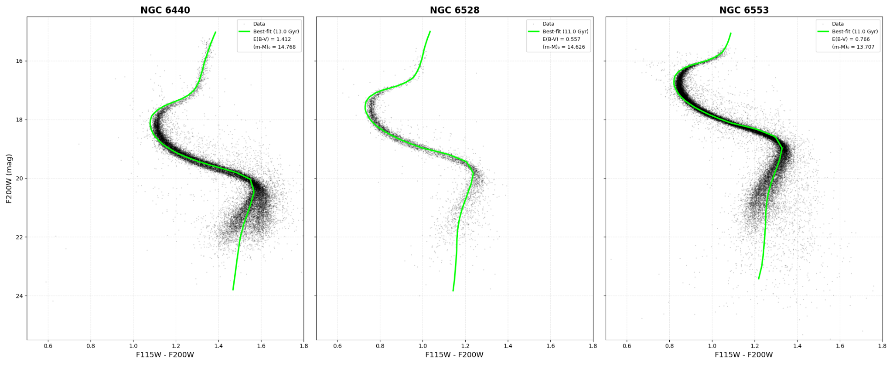
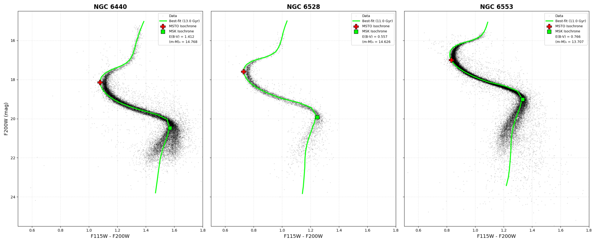
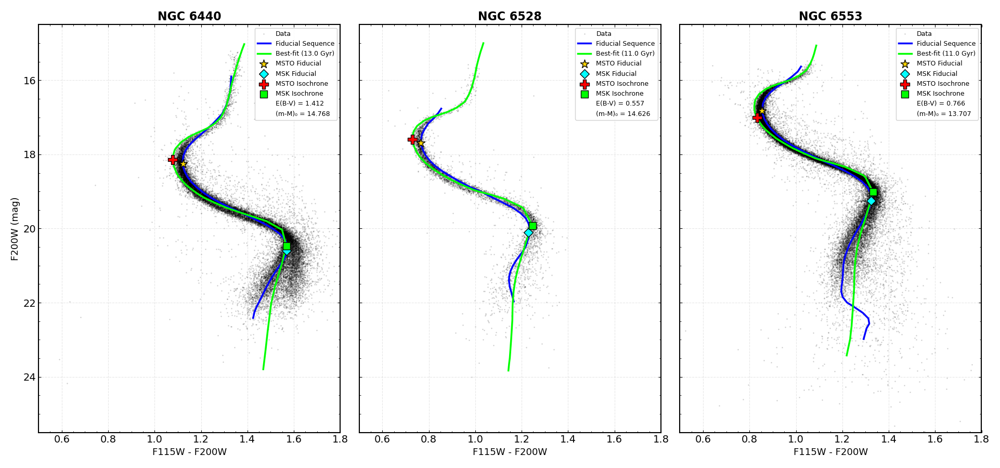

# high-z galaxies with jwst

up: [Observational_Cosmology_MOC](../../04_Atlas/Observational_Cosmology_MOC.html) · [Astrophysics_of_Galaxies_MOC](../../04_Atlas/Astrophysics_of_Galaxies_MOC.html) · [Reionization](Reionization.html)

## instrument capabilities for high redshift

The James Webb Space Telescope (JWST) revolutionizes high-redshift astrophysics through its infrared suite:
- **NIRCam** ($0.6 - 5.0\,\mu$m): wide-field deep imaging across 8 bands, enabling the detection of Lyman-break dropouts at $z > 10$.
- **NIRSpec** ($0.6 - 5.3\,\mu$m): multi-object spectroscopy with Micro-Shutter Arrays (MSA), providing unambiguous spectroscopic confirmation via Lyman breaks, Ly$\alpha$, and rest-frame optical lines ($[\text{O III}]$, $\text{H}\beta$, $\text{H}\alpha$).

## landmark high-z galaxy discoveries

- **JADES-GS-z14-0** ($z = 14.32$): confirmed via NIRSpec spectroscopy by the JADES team (Carniani et al. 2024), observed just $\sim 290$ Myr after the Big Bang. Luminous ($M_{\rm UV} \approx -20.8$), surprisingly extended ($r_e \sim 260$ pc), and displaying significant dust and nebular emission.
- **JADES-GS-z14-1** ($z = 13.90$) and **GLASS-z12** ($z = 12.11$).
- **GN-z11** ($z = 10.60$): extremely luminous galaxy with evidence of dense gas and possible early nitrogen enrichment.

## the "too many massive galaxies" puzzle

Initial NIRCam observations indicated a space density of UV-bright galaxies at $z > 10$ exceeding standard $\Lambda$CDM predictions based on constant star formation efficiency $\epsilon \approx 0.1$:
- **proposed resolutions**:
  - *top-heavy IMF*: zero-metallicity Pop III or low-metallicity stars emit substantially more UV luminosity per unit stellar mass ($M/L_{\rm UV}$ decreases).
  - *bursty star formation*: stochastic bursts of star formation cause galaxies to fluctuate into visibility during peak phases without requiring excessive halo masses (Sun et al. 2023).
  - *low dust attenuation*: rapid clearing of dust out of star-forming regions by radiation pressure.
  - *AGN contamination*: central black holes contributing significant rest-frame UV continuum.

## early supermassive black holes

JWST has confirmed overmassive SMBHs at $z > 7 - 10$ (e.g., UHZ1 at $z = 10.1$ with $M_{\rm BH}/M_* \sim 0.1 - 1$):
- Standard Eddington accretion from stellar-remnant seeds ($M_{\rm seed} \sim 100 M_\odot$) cannot explain $10^7 - 10^8 M_\odot$ black holes in $\lesssim 450$ Myr without super-Eddington accretion.
- Strongly favors **direct collapse black holes (DCBH)** from primordial gas clouds forming seeds with $M_{\rm seed} \sim 10^4 - 10^6 M_\odot$.

## connections

- survey context: [Surveys to remember](Surveys%20to%20remember.html)
- epoch: [Reionization](Reionization.html), [Population III stars](Population%20III%20stars.html)
- passive counterparts: [Quenching and passive galaxies at high z](Quenching%20and%20passive%20galaxies%20at%20high%20z.html)

## JWST Spectroscopic and Photometric Diagnostics

*Figure JWST-05: UV luminosity function measurements at $z \sim 10-14$, demonstrating an overabundance of luminous galaxies compared to standard halo mass function predictions.*

*Figure JWST-06: BPT emission line diagnostic ratios ($[\mathrm{O\ III}]/\mathrm{H}\beta$ vs $[\mathrm{N\ II}]/\mathrm{H}\alpha$) at $z > 6$ indicating low gas-phase metallicity and high ionization parameters.*

*Figure JWST-07: Mass-metallicity relation at cosmic dawn showing rapid metal enrichment and efficient star formation in the first gigayear of cosmic time.*

  <h4 class="backlinks-title">Linked References (5)</h4>
  <ul class="backlinks-list">
    <li class="backlink-item-wrap"><a href="Madau%20plot.html" class="backlink-item">Madau plot</a></li>
    <li class="backlink-item-wrap"><a href="Protocluster%20detection%20techniques.html" class="backlink-item">Protocluster detection techniques</a></li>
    <li class="backlink-item-wrap"><a href="Quenching%20and%20passive%20galaxies%20at%20high%20z.html" class="backlink-item">Quenching and passive galaxies at high z</a></li>
    <li class="backlink-item-wrap"><a href="Space%20and%20ground%20facilities%20relevant%20for%20OC.html" class="backlink-item">Space and ground facilities relevant for OC</a></li>
    <li class="backlink-item-wrap"><a href="Starburst%20galaxies.html" class="backlink-item">Starburst galaxies</a></li>
  </ul>

