
at $z \gtrsim 0.01$, peculiar velocities are small compared to cosmic recession, and **Hubble's law** $v = H_0 d$ becomes the dominant relation between redshift and distance. this is the top rung of the distance ladder. answer to `obs2.pdf` part 3.

## the redshift definition

observed wavelength shift of a known emission/absorption line:
$$\boxed{\, z = \frac{\lambda_{\rm obs} - \lambda_{\rm rest}}{\lambda_{\rm rest}} \,}$$

at small $z$, $v \approx cz$ (low-velocity Doppler). example: $H\alpha$ rest at $656.3$ nm observed at $721.9$ nm gives $z = 0.10$, $v \approx 30\,000$ km/s.

## Hubble's law (low $z$)

$$v = H_0\, d \quad\Rightarrow\quad d \approx \frac{cz}{H_0}$$

with current values $H_0 \approx 67$ to $73$ km/s/Mpc (a $\sim 7\%$ tension; see [Cepheid period-luminosity relation](./Cepheid%20period-luminosity%20relation.html) and [Type Ia supernovae as standard candles](./Type%20Ia%20supernovae%20as%20standard%20candles.html)).

worked example: $z = 0.10$, $H_0 = 70$ km/s/Mpc:
$$d \approx \frac{(3 \times 10^5)(0.10)}{70} = 429\,\text{Mpc}$$

## the Hubble diagram

plot of recession velocity (or $cz$) vs distance:
- slope = $H_0$ in the low-$z$ linear regime.
- at higher $z$, deviations from linear give $\Omega_m, \Omega_\Lambda, w$.

historical: Hubble's original 1929 plot reached $\sim 2$ Mpc with very large scatter. modern Hubble diagrams reach $z \sim 1.5$ with SN Ia.

## the three regimes

### low-$z$ ($z \lesssim 0.01$, $\sim 50$ Mpc)
**peculiar velocities dominate**. typical galaxy peculiar velocity $\sim 300$ km/s, comparable to cosmic recession at $z = 0.001$. the simple $v = cz$ relation has $\gtrsim 30\%$ scatter from peculiar motion.
- workaround: **average over many galaxies** to beat down peculiar velocities.
- alternative: use Tully-Fisher, fundamental plane, or SN Ia for individual distances at $z < 0.05$.

### moderate $z$ ($0.01 \lesssim z \lesssim 0.1$)
**Hubble's law works directly**. $d \approx cz/H_0$ with $\sim$few-percent precision per galaxy. workhorse for measuring $H_0$.

### high $z$ ($z \gtrsim 0.1$)
**cosmology matters**. the simple Doppler $v = cz$ breaks. proper relation:
$$d_L(z) = (1+z)\,\frac{c}{H_0}\int_0^z \frac{dz'}{\sqrt{\Omega_m(1+z')^3 + \Omega_\Lambda}}\quad\text{(flat $\Lambda$CDM)}$$

so $d_L$ now depends on $\Omega_m, \Omega_\Lambda, w$, the very things we want to measure. SN Ia at $z \sim 1$ provide the cosmological constraints.

K-correction also kicks in: the observed band samples a different rest-frame wavelength. see [K-correction](./K-correction.html).

## the velocity-redshift confusion

at small $z$, "$v = cz$" is fine. at high $z$, the relation breaks; the observed redshift is no longer a Doppler velocity but the integrated effect of cosmic expansion along the photon path. *recession velocity* in cosmology is ambiguous; better to talk about scale factor: $1 + z = a_0/a_{\rm em}$.

at $z = 1$, naive $v = cz = c$ would suggest the source is moving at the speed of light. it isn't; the scale factor has just doubled since emission. the photon was redshifted by the expansion, no super-luminal motion required.

## peculiar velocities and the Hubble flow frame

the **Hubble flow** is the smooth expansion-only velocity field. observed velocities deviate by the **peculiar velocity**:
$$v_{\rm obs} = H_0 d + v_{\rm pec}$$

peculiar velocities reflect the gravitational potential of the local universe (large-scale structure pulling galaxies). the Local Group, in particular, falls toward the Virgo cluster (and the Great Attractor) at $\sim 600$ km/s.

corrections: published catalogues (Tully-Fisher, EDD, Cosmicflows-3) provide peculiar-velocity field maps to subtract from observed redshifts before computing Hubble distances.

## what about $H_0$?

the Hubble constant is itself the slope of the Hubble flow. measuring it requires:
1. local-ladder distances calibrated by Cepheids/TRGB to galaxies in the Hubble flow ($z = 0.005$ to $0.05$).
2. Hubble diagram of SN Ia in those galaxies.
3. fit $cz = H_0 d$ to the bridge.

CMB-derived $H_0$ comes from a totally different chain: sound horizon at recombination + angular size of acoustic peaks $\to$ $H_0$ assuming $\Lambda$CDM. the two should agree if standard cosmology is right; they don't, by $\sim 5\sigma$.

## see also

- [Distance ladder derivations](./Distance%20ladder%20derivations.html)
- [Hubble's law and cosmological redshift](./Hubble%27s%20law%20and%20cosmological%20redshift.html)
- [Hubble law derivation low-z](./Hubble%20law%20derivation%20low-z.html)
- [Hubble law exact form](./Hubble%20law%20exact%20form.html)
- [Hubble constant and deceleration parameter](./Hubble%20constant%20and%20deceleration%20parameter.html)
- [Cosmological redshift](./Cosmological%20redshift.html)
- [Luminosity distance](./Luminosity%20distance.html)
- [K-correction](./K-correction.html)
- [Type Ia supernovae as standard candles](./Type%20Ia%20supernovae%20as%20standard%20candles.html)
- [Cepheid period-luminosity relation](./Cepheid%20period-luminosity%20relation.html)

---

## observational astrophysics course slides (Prof. Paolo Cassata)

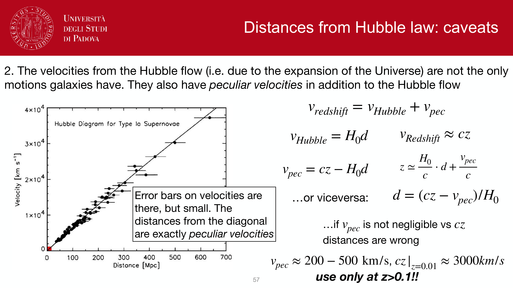
*Edwin Hubble 1929: linear velocity-distance relation v = H_0 * d.*

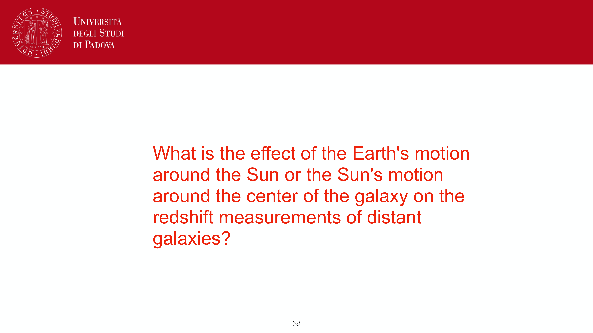
*Hubble constant H_0: expansion rate of the local universe in km/s/Mpc.*

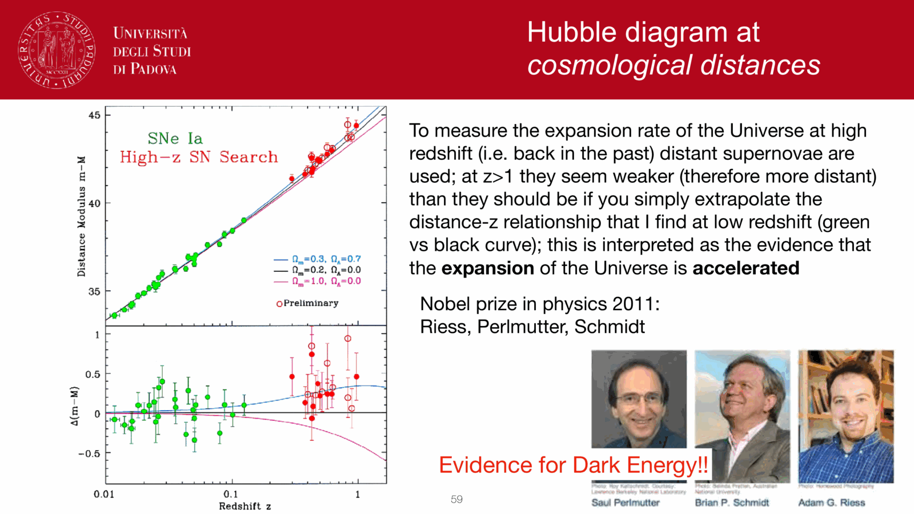
*Cosmological redshift z = (lambda_obs - lambda_rest) / lambda_rest.*

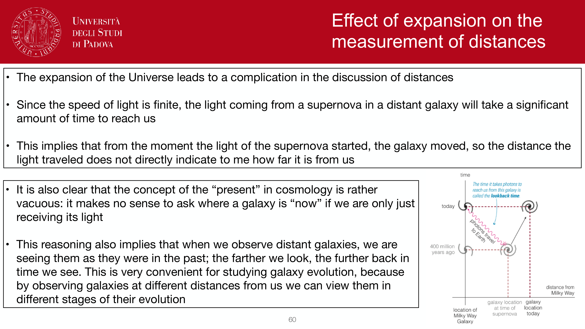
*Linear Hubble law regime: d = c * z / H_0 for z << 1.*

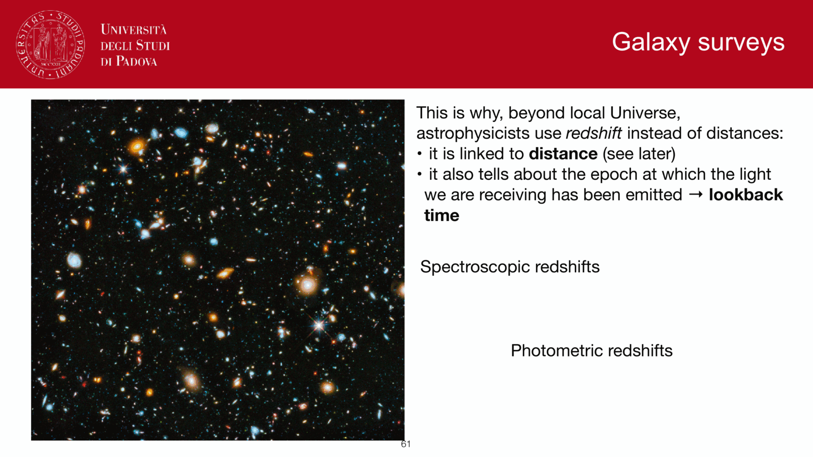
*Peculiar velocity v_pec contamination at low redshifts (z < 0.02).*

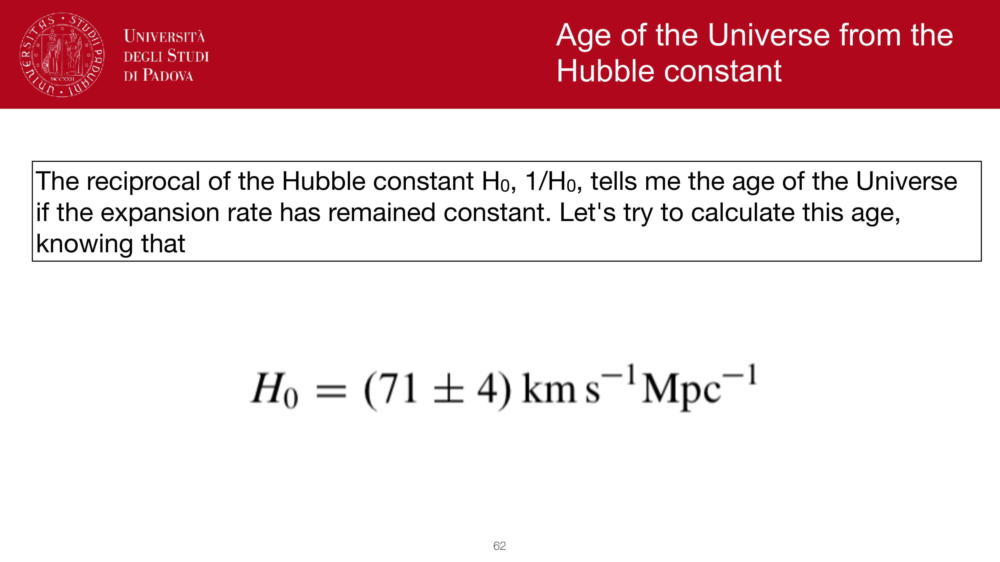
*Virgo-centric infall and Great Attractor bulk flow corrections.*

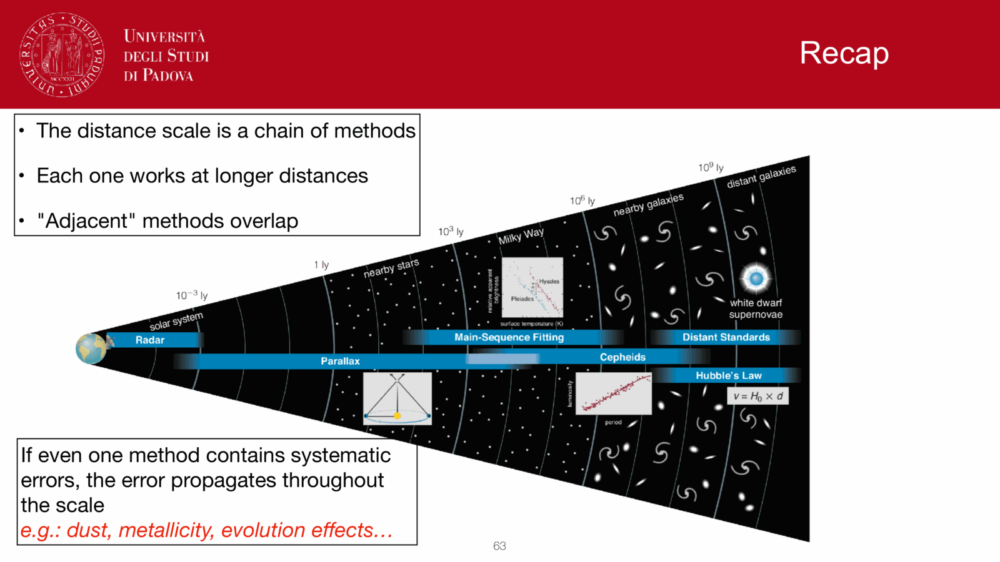
*Cosmological luminosity distance d_L(z) in FLRW metric.*

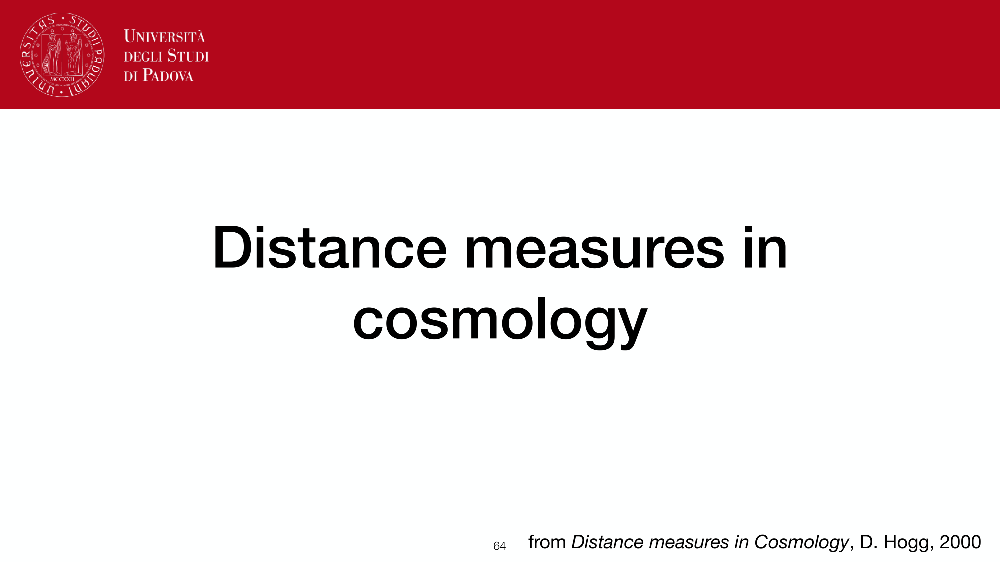
*Modern Hubble tension: SH0ES distance ladder (H_0 = 73.04 km/s/Mpc) vs Planck CMB (H_0 = 67.4 km/s/Mpc).*

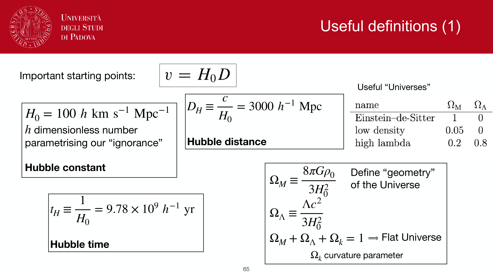
*Obs2 exam question: Detailed model answer on Hubble flow and cosmological distance determination.*

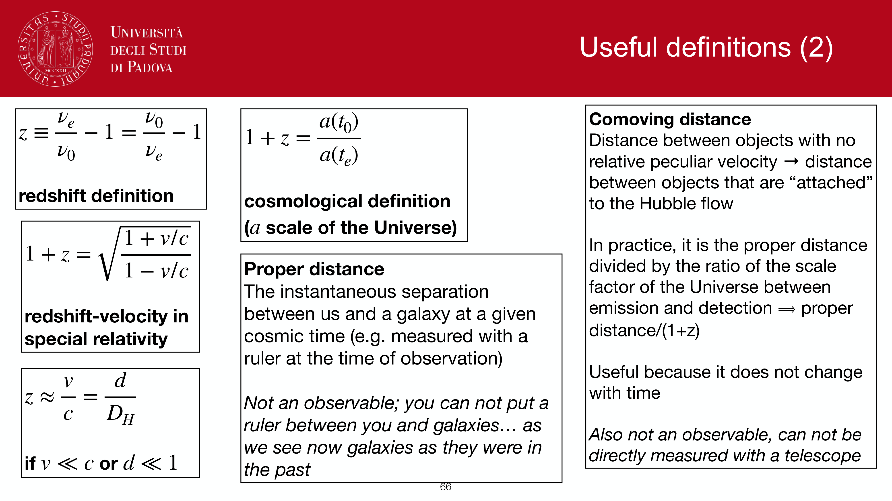
*Lookback time and cosmic expansion history.*

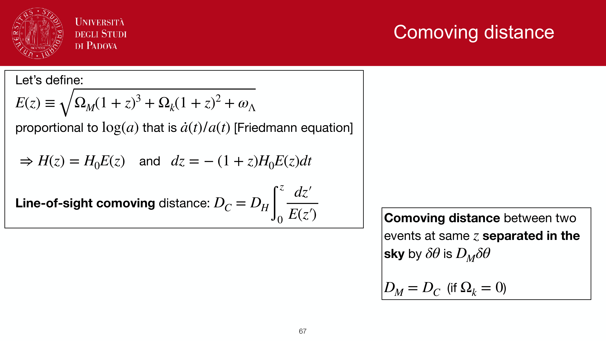
*Angular diameter distance d_A(z) = d_L(z) / (1 + z)^2.*

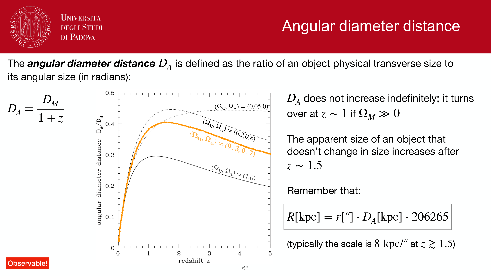
*Distance measures summary across cosmological epochs.*


  <h4 class="backlinks-title">Linked References (7)</h4>
  <ul class="backlinks-list">
    <li class="backlink-item-wrap"><a href="./Cepheid%20period-luminosity%20relation.html" class="backlink-item">Cepheid period-luminosity relation</a></li>
    <li class="backlink-item-wrap"><a href="./Hubble%20law.html" class="backlink-item">Hubble law</a></li>
    <li class="backlink-item-wrap"><a href="../../04_Atlas/Observational_Astrophysics_MOC.html" class="backlink-item">Observational_Astrophysics_MOC</a></li>
    <li class="backlink-item-wrap"><a href="./Peculiar%20velocities%20of%20galaxies%20and%20structures.html" class="backlink-item">Peculiar velocities of galaxies and structures</a></li>
    <li class="backlink-item-wrap"><a href="./Supernova%20Hubble%20diagram.html" class="backlink-item">Supernova Hubble diagram</a></li>
    <li class="backlink-item-wrap"><a href="./Surface%20brightness%20dimming.html" class="backlink-item">Surface brightness dimming</a></li>
    <li class="backlink-item-wrap"><a href="./TRGB%20tip%20of%20the%20red%20giant%20branch.html" class="backlink-item">TRGB tip of the red giant branch</a></li>
  </ul>

