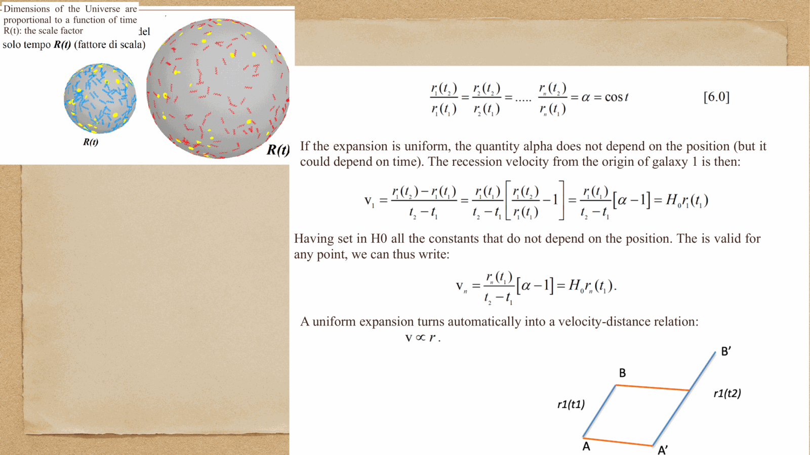
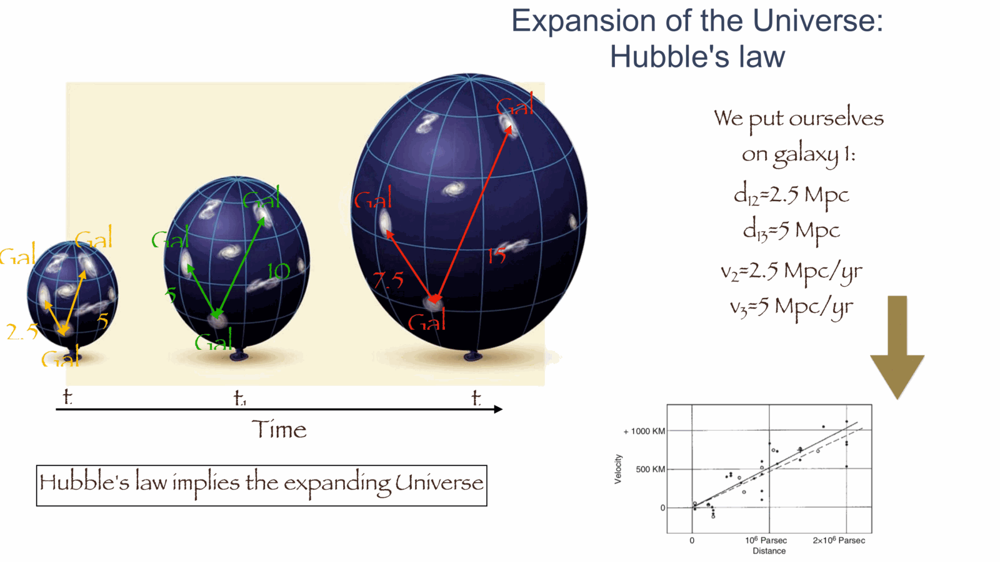
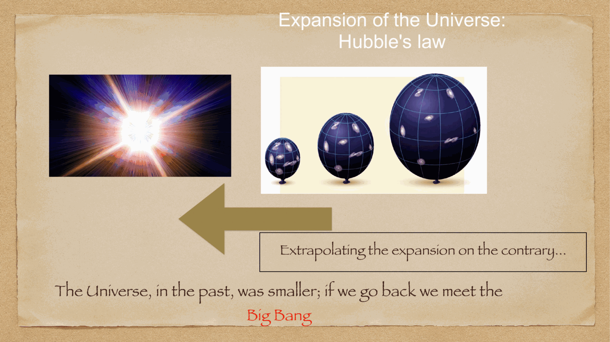
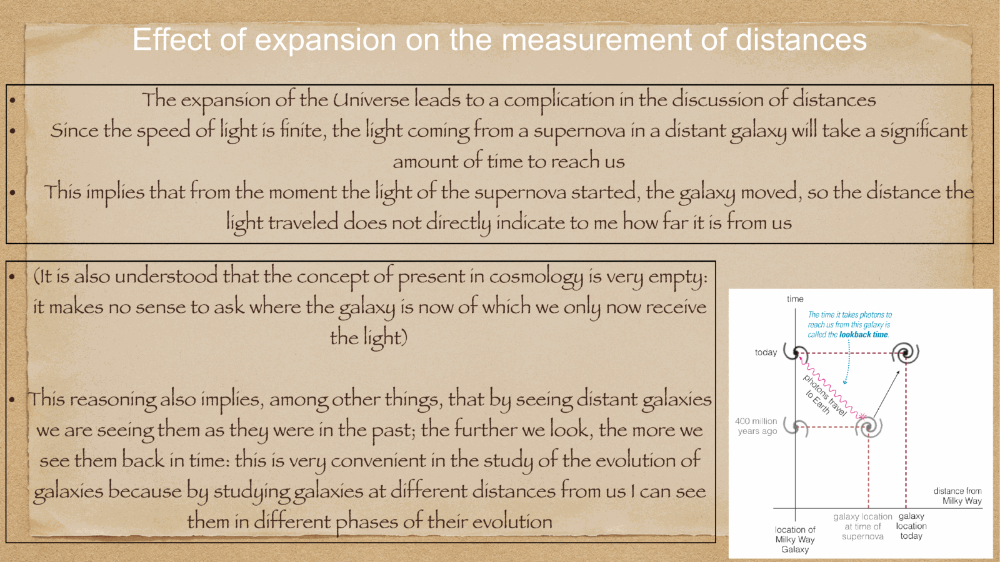
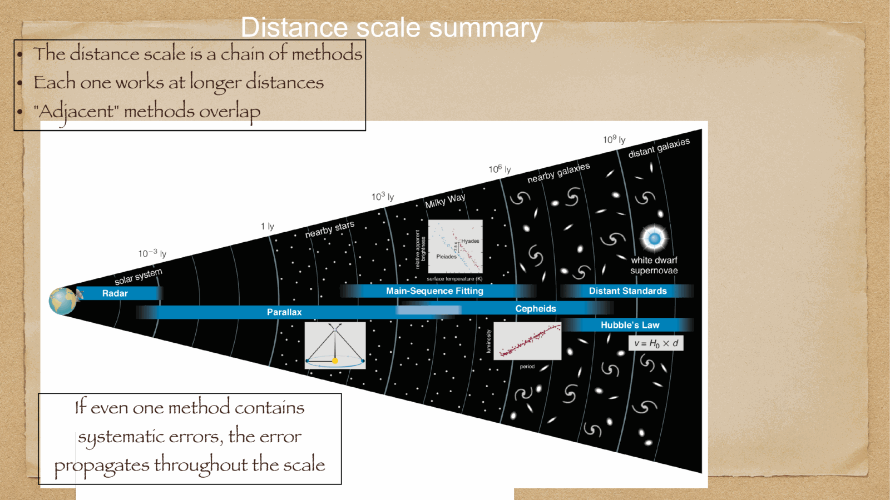


in 1929, combining Vesto Slipher's spectroscopic measurements of galaxy radial velocities with Henrietta Leavitt's and Edwin Hubble's Cepheid-calibrated distances, **Edwin Hubble** announced that galaxies are receding from Earth with velocities directly proportional to their distances: **Hubble's Law**.

---

## the empirical law: $v = H_0 d$

plotting galaxy recession velocity $v$ (in km/s) against distance $d$ (in Mpc):

$$\boxed{\, v = H_0 \, d \,}$$

where $H_0$ is the **Hubble Constant** (la costante di Hubble), representing the current expansion rate of the universe.

### modern values of $H_0$ and the Hubble Tension:
- **Planck CMB (Early Universe, $\Lambda$CDM model)**:
  $$H_0 = 67.4 \pm 0.5 \text{ km s}^{-1}\text{ Mpc}^{-1}$$
- **SH0ES / SN Ia (Late Universe, local distance ladder)**:
  $$H_0 = 73.04 \pm 1.04 \text{ km s}^{-1}\text{ Mpc}^{-1}$$
this persistent $> 5\sigma$ discrepancy between early-universe and local determinations is the famous **Hubble Tension**.

---

## physical interpretation: the expansion of space

Hubble's law does **not** describe galaxies flying through static space away from Earth (Earth is not at any unique cosmic center). 
instead, general relativity reveals that **the fabric of spacetime itself is expanding uniformly in all directions**:
- the physical coordinate $\vec{r}(t)$ between two galaxies separated by comoving coordinate $\vec{x}$ is:
  $$\vec{r}(t) = a(t) \, \vec{x}$$
  where $a(t)$ is the dimensionless **scale factor** of the universe (normalized to $a(t_0) = 1$ today).
- differentiating with respect to cosmic time $t$:
  $$\vec{v} = \frac{d\vec{r}}{dt} = \dot{a}(t) \, \vec{x} = \frac{\dot{a}(t)}{a(t)} \, \vec{r}(t) = H(t) \, \vec{r}$$
yielding Hubble's law with $H(t) \equiv \frac{\dot{a}}{a}$.

### the Hubble time $t_H$:
extrapolating the expansion backwards in time: if expansion were constant, all galaxies would have been on top of each other at time $t_H$:
$$t_H \equiv \frac{1}{H_0} = \frac{1}{70 \text{ km s}^{-1}\text{ Mpc}^{-1}} = \frac{3.086 \times 10^{19}\text{ km}}{70 \text{ km/s}} \approx 4.41 \times 10^{17} \text{ s} \approx 14.0 \text{ billion years}$$
this provides the foundational observational evidence that our universe had a finite beginning: the **Big Bang**.

---

## cosmological redshift $z$

cosmological redshift is **not** a classical Doppler shift: it is caused by the physical stretching of photon wavelengths as they propagate through expanding spacetime:

$$\boxed{\, 1 + z = \frac{\lambda_{\text{obs}}}{\lambda_{\text{emit}}} = \frac{a(t_{\text{obs}})}{a(t_{\text{emit}})} = \frac{1}{a(t_{\text{emit}})} \,}$$

- when light was emitted by a galaxy at $z = 1$, the universe was half its present size ($a = 0.5$).
- when the CMB was emitted at $z \approx 1100$, the universe was $1/1100$ of its present size ($a \approx 9 \times 10^{-4}$).

at low redshift ($z \ll 1$), Taylor expansion recovers the familiar linear Doppler approximation: $v \approx c z = H_0 d$.

---

## master summary of the Cosmic Distance Ladder

| rung | technique | physical basis | typical range | calibrated by |
|---|---|---|---|---|
| **1** | Radar ranging | speed of light reflection ($d = c\Delta t / 2$) | $< 10^{-4}$ pc (Solar System) | direct timing |
| **2** | Trigonometric parallax | orbital baseline ($d = 1/p$) | $< 10$ kpc (Milky Way) | 1 AU baseline |
| **3** | Main sequence fitting | HR diagram isochrone matching | $< 50$ kpc (Star Clusters) | Gaia parallax |
| **4** | Cepheid variables | Period-Luminosity relation ($M_V \propto \log P$) | $< 30-40$ Mpc (Local Group & Virgo) | Gaia parallax |
| **5** | Type Ia Supernovae | standardizable candle (Phillips relation) | $> 3000$ Mpc ($z > 1.5$) | HST Cepheids in host galaxies |
| **6** | Hubble Flow | metric expansion of space ($v = H_0 d$) | $> 100$ Mpc to horizon | SNe Ia & BAO |

---

## see also

- [Fundamentals_Astrophysics_Cosmology_MOC](../../04_Atlas/Fundamentals_Astrophysics_Cosmology_MOC.html)
- [Parallax and standard candles](./Parallax%20and%20standard%20candles.html)
- [Cepheids and supernovae](./Cepheids%20and%20supernovae.html)
- [Type Ia supernovae as standard candles](./Type%20Ia%20supernovae%20as%20standard%20candles.html)
- [Robertson-Walker metric](./Robertson-Walker%20metric.html)
- [Cosmological distances](./Cosmological%20distances.html)
- [Cosmic_inventory_overview](./Cosmic_inventory_overview.html)


  <h4 class="backlinks-title">Linked References (9)</h4>
  <ul class="backlinks-list">
    <li class="backlink-item-wrap"><a href="./Cepheid%20period-luminosity%20relation.html" class="backlink-item">Cepheid period-luminosity relation</a></li>
    <li class="backlink-item-wrap"><a href="./Cepheids%20and%20supernovae.html" class="backlink-item">Cepheids and supernovae</a></li>
    <li class="backlink-item-wrap"><a href="./Cosmological%20redshift.html" class="backlink-item">Cosmological redshift</a></li>
    <li class="backlink-item-wrap"><a href="../../04_Atlas/Fundamentals_Astrophysics_Cosmology_MOC.html" class="backlink-item">Fundamentals_Astrophysics_Cosmology_MOC</a></li>
    <li class="backlink-item-wrap"><a href="./Hubble%20flow%20distances.html" class="backlink-item">Hubble flow distances</a></li>
    <li class="backlink-item-wrap"><a href="./Hubble%20law.html" class="backlink-item">Hubble law</a></li>
    <li class="backlink-item-wrap"><a href="./Parallax%20and%20standard%20candles.html" class="backlink-item">Parallax and standard candles</a></li>
    <li class="backlink-item-wrap"><a href="./Spectroscopic%20redshift%20from%20line%20shifts.html" class="backlink-item">Spectroscopic redshift from line shifts</a></li>
    <li class="backlink-item-wrap"><a href="./Type%20Ia%20supernovae%20as%20standard%20candles.html" class="backlink-item">Type Ia supernovae as standard candles</a></li>
  </ul>

