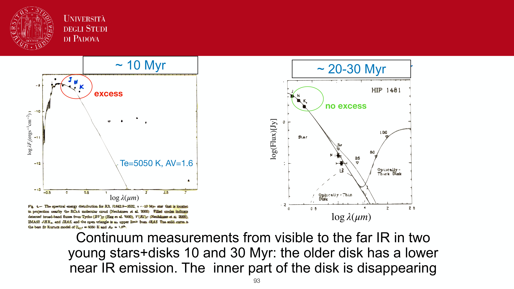
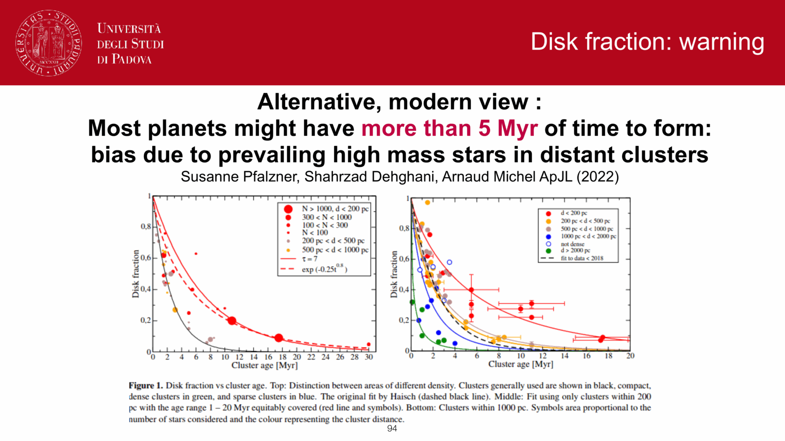
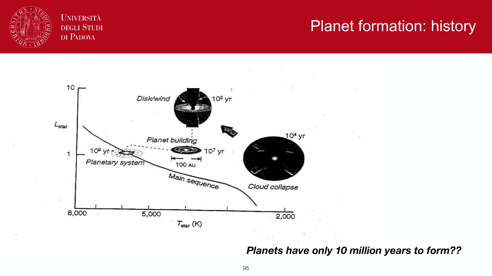
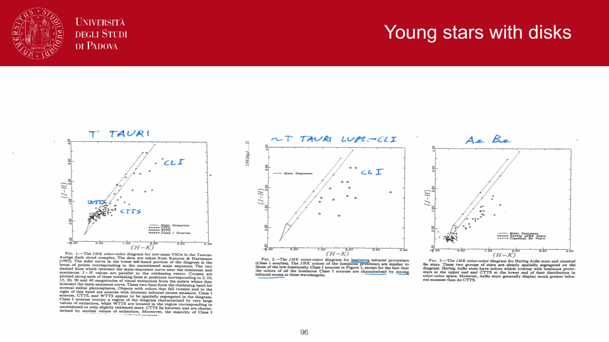
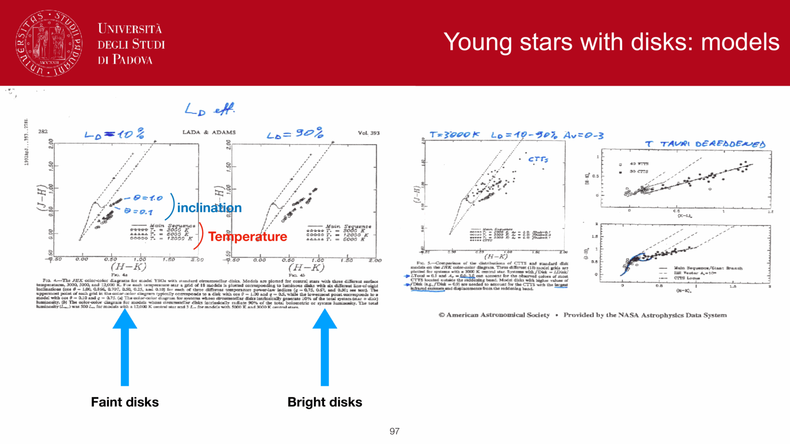
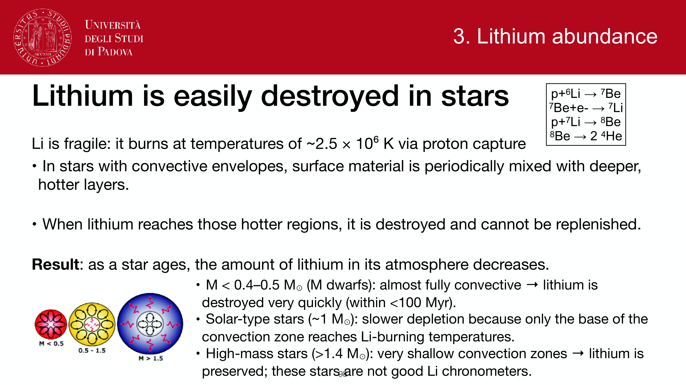
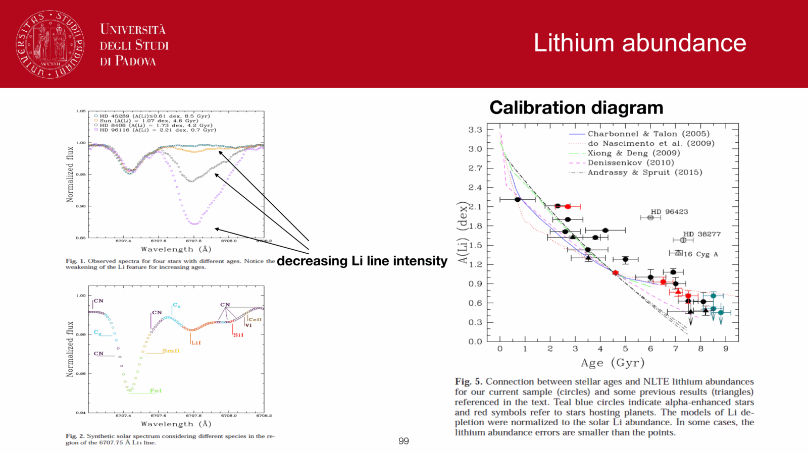
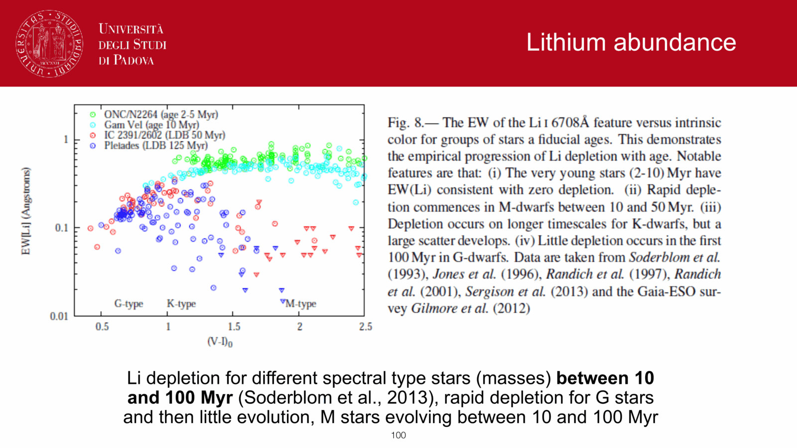

the **initial mass function (IMF)**, denoted $\xi(M)$, is the empirical or theoretical probability distribution of stellar birth masses in a single coeval star-formation event. it is the single most consequential foundational prior in observational astrophysics and galaxy evolution: it dictates the ratio of luminous to dark mass, the production rate of ionizing UV photons, the core-collapse supernova rate, and the chemical enrichment yields of the universe.

## formal mathematical definition

the linear mass function is defined such that:
$$dN = \xi(M)\,dM$$
represents the number of stars formed with masses in the interval $[M, M + dM]$. the total stellar mass formed in the population is:
$$M_{\rm tot} = \int_{M_{\rm low}}^{M_{\rm high}} M\,\xi(M)\,dM$$
where standard integration bounds span $M_{\rm low} \approx 0.08\,M_\odot$ (the hydrogen-burning limit) to $M_{\rm high} \approx 100\text{--}150\,M_\odot$ (the Eddington radiation-pressure stability limit).

in logarithmic mass coordinates:
$$dN = \xi_L(\log_{10} M)\,d\log_{10} M \implies \xi_L(\log_{10} M) = \ln(10)\,M\,\xi(M)$$
a single power-law $\xi(M) \propto M^{-\alpha}$ corresponds to $\xi_L(\log_{10} M) \propto M^{-\Gamma}$ with index $\Gamma = \alpha - 1$.

## canonical analytical forms

### 1. Salpeter (1955) single power-law
the foundational empirical benchmark, derived from local solar-neighborhood field stars ($0.4 \le M/M_\odot \le 10$):
$$\xi(M) = A\,M^{-\alpha} \quad \text{with} \quad \alpha = 2.35 \quad (\Gamma = 1.35)$$
- **limitation**: extrapolating $\alpha = 2.35$ down to $0.08\,M_\odot$ severely overpredicts the count of low-mass M-dwarfs, inflating the mass-to-light ratio $\Upsilon$ by roughly a factor of two relative to modern constraints.

### 2. Kroupa (2001) broken power-law
corrects the low-mass overprediction by introducing three distinct mass regimes across Galactic open clusters and field populations:
$$\xi(M) \propto \begin{cases} M^{-0.3} & 0.01 \le M/M_\odot < 0.08 \quad (\text{substellar / brown dwarf regime}) \\ M^{-1.3} & 0.08 \le M/M_\odot < 0.5 \quad (\text{low-mass flattening}) \\ M^{-2.3} & M/M_\odot \ge 0.5 \quad (\text{Salpeter-like high-mass slope}) \end{cases}$$

### 3. Chabrier (2003) log-normal + power-law
combines a log-normal distribution at the sub-solar peak with a Salpeter power-law tail for massive stars. currently the universal standard in cosmological simulations and SED-fitting pipelines (FAST, Prospector, BAGPIPES, CIGALE):
$$\xi_L(\log_{10} M) \propto \begin{cases} \exp\!\left[-\frac{(\log_{10} M - \log_{10} M_c)^2}{2\,\sigma^2}\right] & M \le 1.0\,M_\odot \\ M^{-1.3} & M > 1.0\,M_\odot \end{cases}$$
with characteristic mass $M_c \approx 0.08\,M_\odot$ (or $0.20\,M_\odot$ for single stars) and dispersion $\sigma \approx 0.55\text{--}0.69$.

## IMF vs PDMF distinction

a critical conceptual boundary in stellar populations:
- **initial mass function (IMF)**: the birth distribution at $t = 0$.
- **present-day mass function (PDMF)**: the mass distribution observed today.

for a stellar system of age $t$:
1. **nuclear death**: all stars with $M > M_{\rm TO}(t)$ have evolved off the MS into white dwarfs, neutron stars, or black holes, truncating the MS PDMF at $M_{\rm TO}$.
2. **dynamical evaporation**: in star clusters, two-body relaxation drives energy equipartition; low-mass stars acquire high velocities and escape via tidal stripping, making the cluster PDMF flatter (bottom-light) than the birth IMF (see [[Initial vs present-day mass function]]).

## why the IMF choice governs observational astrophysics

1. **stellar mass estimates ($M_*$)**:
   because low-mass stars contribute virtually all the mass but almost none of the light, the assumed low-mass turnover dictates the stellar mass-to-light ratio:
   $$\Upsilon_{\rm Salpeter} \approx 1.6\text{--}1.8\,\Upsilon_{\rm Chabrier} \implies \log_{10} M_{*,{\rm Salpeter}} \approx \log_{10} M_{*,{\rm Chabrier}} + 0.24\,\text{dex}$$
   every published galaxy stellar mass is strictly conditional on the assumed IMF.
2. **star formation rate calibrations**:
   the ionizing photon production rate ($h\nu > 13.6$ eV) is generated almost exclusively by O-stars ($M \gtrsim 20\,M_\odot$). for a Salpeter IMF ($0.1\text{--}100\,M_\odot$):
   $$Q(\mathrm{H\,I}) \approx 9 \times 10^{46}\,\text{photons/s per } M_\odot/\text{yr}$$
   switching to a Chabrier IMF increases the number of O stars per solar mass formed, lowering the inferred SFR for a given observed $\mathrm{H}\alpha$ flux: $\mathrm{SFR}_{\rm Chabrier} \approx 0.63\,\mathrm{SFR}_{\rm Salpeter}$.
3. **chemical enrichment & supernova rates**:
   the high-mass slope sets the number of core-collapse supernovae per solar mass formed:
   $$k_{\rm CC} = \frac{\int_{8}^{100} \xi(M)\,dM}{\int_{0.1}^{100} M \xi(M)\,dM} \approx 0.007\text{--}0.010\,\mathrm{SNe}/M_\odot$$
   controlling cosmic metal enrichment rates.

## universality vs environmental variation

while the IMF appears remarkably universal across the solar neighborhood, young clusters, and field stars, systematic variations are active frontiers:
- **massive early-type galaxies**: gravitational lensing (Treu et al. 2010) and gravity-sensitive wing absorption features (Na I doublet, Wing-Ford FeH band; van Dokkum & Conroy 2010) indicate a **bottom-heavy** IMF ($\alpha \approx 2.8\text{--}3.0$) in the dense cores of massive ellipticals.
- **extreme starbursts & high-$z$**: intense radiation fields and high cosmic-microwave-background temperatures ($T_{\rm CMB} \propto 1+z$) raise the Jeans mass, favoring a **top-heavy** IMF.
- **Population III**: pristine zero-metallicity gas lacking metal-line cooling predicts characteristic masses $M_{\rm char} \sim 10\text{--}100\,M_\odot$.
- **open cluster segmentation**: Gaia DR3 analysis of 78 open clusters reveals a segmented IMF ($dN/dM \propto M^{-2.5}$ for $M > 1\,M_\odot$ and $M^{-1.5}$ for $M < 1\,M_\odot$; Cordoni et al. 2023).

## see also

- [[Observational_Astrophysics_MOC]]
- [[Stellar_Astrophysics_MOC]]
- [[Stellar mass function xi(M)]]
- [[Salpeter Kroupa Chabrier IMFs]]
- [[Initial vs present-day mass function]]
- [[Mass-luminosity relation]]
- [[Stellar population synthesis]]
- [[Single stellar population SSP]]
- [[H-alpha SFR tracer]]
- [[UV SFR tracer]]

---

## observational astrophysics course slides (Prof. Paolo Cassata)

*Initial Mass Function (IMF) definition: xi(M) dM = number of stars born per unit mass interval.*

*Edwin Salpeter 1955 single power-law IMF: xi(M) proportional to M^(-2.35) (alpha = 2.35).*

*Present Day Mass Function (PDMF) vs IMF: correction for stellar evolutionary lifetimes.*

*Pavel Kroupa (2001) broken power-law IMF: alpha = 0.3 for M < 0.08 M_Sun, 1.3 for 0.08-0.5, 2.3 for M > 0.5.*

*Gilles Chabrier (2003) log-normal IMF for low-mass stars combined with power-law tail.*

*Top-heavy vs bottom-heavy IMFs and universality of the IMF across environments.*

*Total stellar mass integral and mass-to-light ratio M/L sensitivity to IMF low-mass cut-off.*

*Ionizing photon production rate Q(H0) sensitivity to IMF high-mass slope.*

## Linked References

- [[Chemical evolution of galaxies]]
- [[Color-magnitude diagrams of clusters]]
- [[H-alpha SFR tracer]]
- [[IR SFR tracer]]
- [[Mass-luminosity relation]]
- [[Planck law Wien Stefan-Boltzmann]]
- [[Resolved vs unresolved stellar populations]]
- [[SFR tracers from population synthesis]]
- [[SPS code families]]
- [[Single stellar population SSP]]
- [[Star formation history of a population]]
- [[Star formation history parametrizations]]
- [[Stellar mass estimation in unresolved populations]]
- [[Stellar population synthesis]]
- [[Surface brightness fluctuations]]
- [[UV SFR tracer]]
- [[Why hot massive stars dominate luminosity]]
- [[Observational_Astrophysics_MOC]]
- [[Observational_Cosmology_MOC]]

