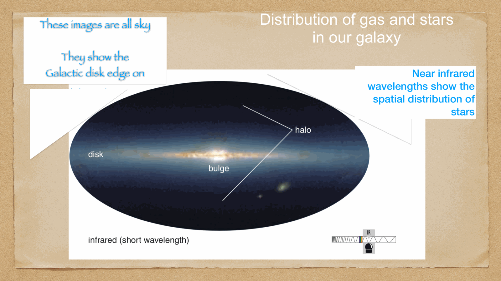
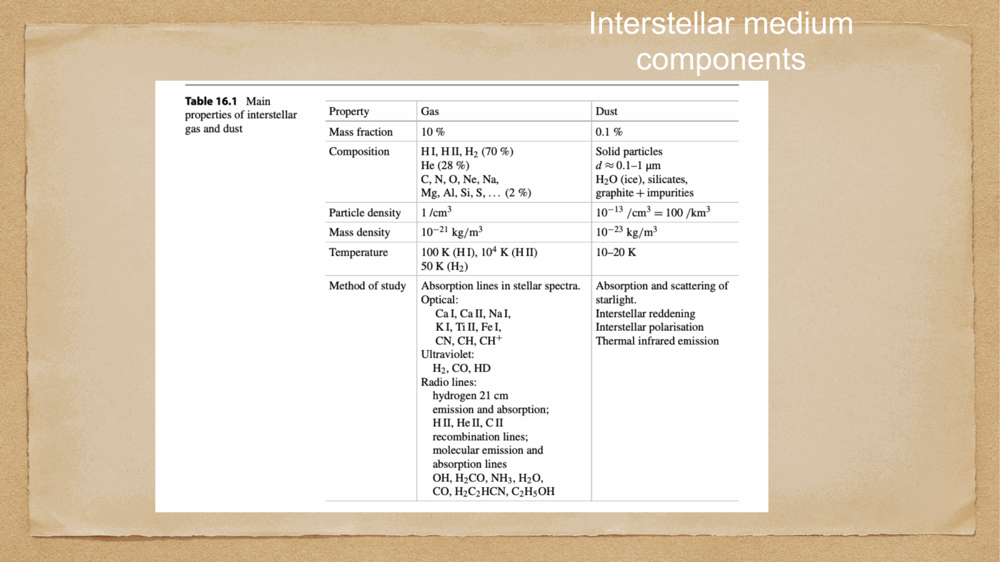
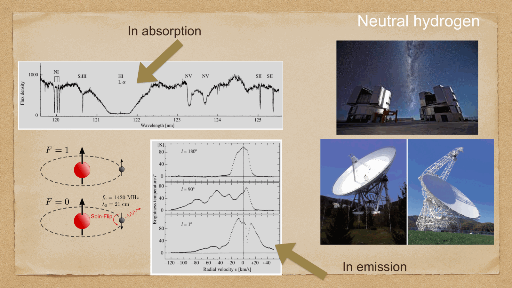
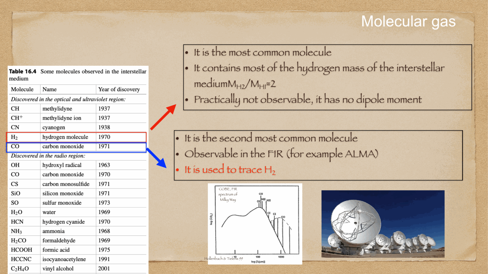
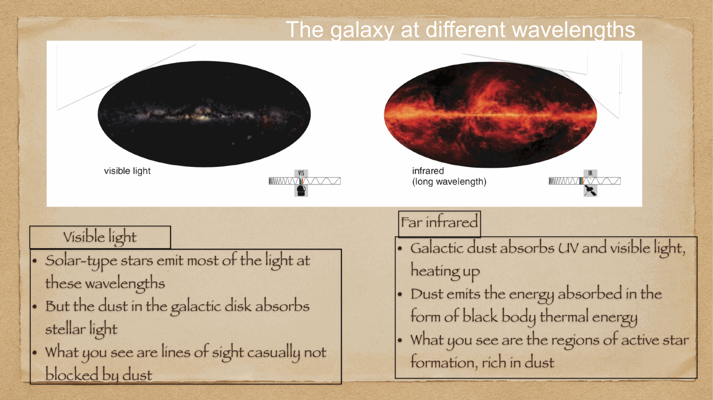
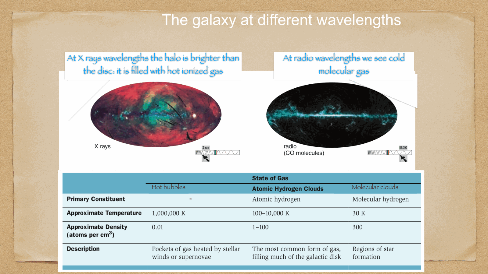
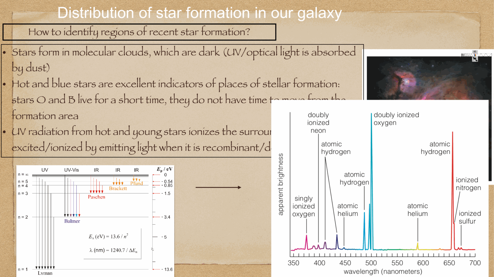
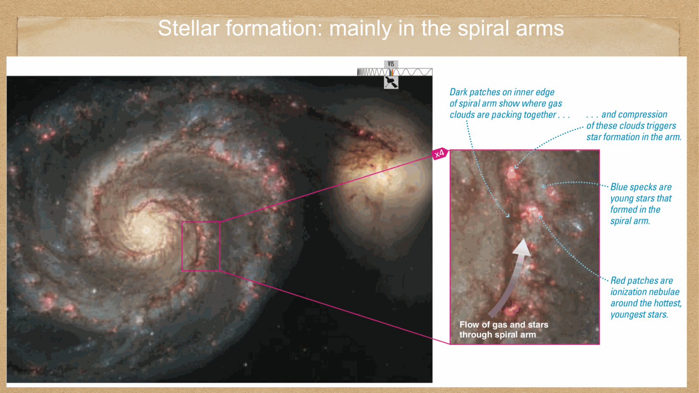
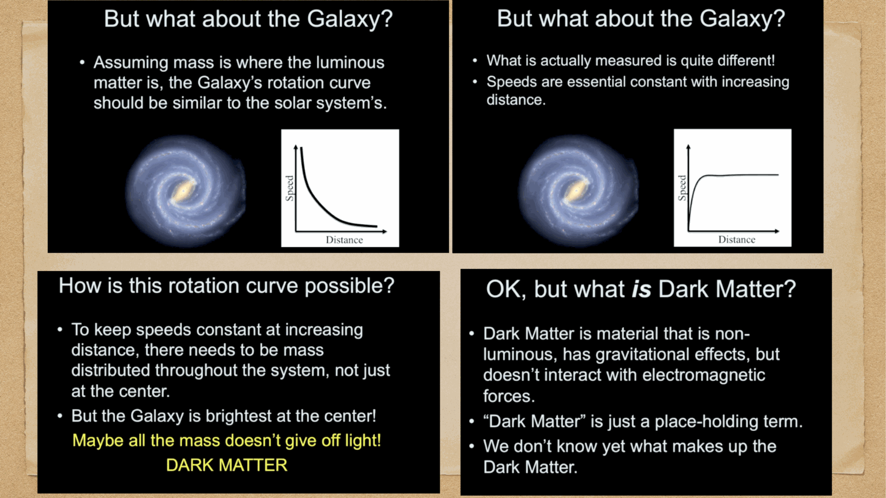
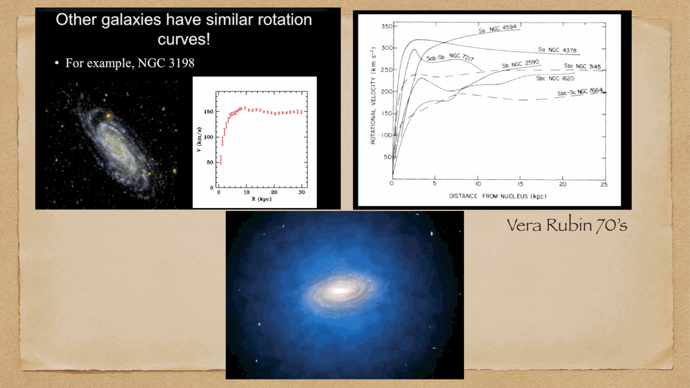

the space between the stars in the Galactic disk is filled with gas and dust known collectively as the **Interstellar Medium (ISM)**. while comprising only $\sim 10-15\%$ of the baryonic mass of the Galactic disk, the ISM is the crucial reservoir where stars are born and where dying stars deposit newly synthesized chemical elements.

---

## the Star-Gas-Star cycle

star formation and stellar death establish a continuous cosmic recycling loop:
$$\text{Cold Molecular Clouds} \;\xrightarrow{\text{collapse}}\; \text{Protostars} \;\xrightarrow{\text{fusion}}\; \text{Main Sequence Stars}$$
$$\downarrow$$
$$\text{Enriched ISM} \;\xleftarrow{\text{SN, planetary nebulae, winds}}\; \text{Evolved Stars (RGB, AGB, SN)}$$

in each cycle, $\sim 70-80\%$ of the gas is locked up in long-lived low-mass stars or compact corpses (white dwarfs, neutron stars, black holes), while $\sim 20-30\%$ is returned to the ISM enriched in metals (C, N, O, Fe).

---

## the four phases of the Interstellar Medium

the ISM is in rough thermal and mechanical pressure equilibrium ($P/k_B \sim 10^3 - 10^4 \text{ K cm}^{-3}$), partitioning into four distinct physical phases:

### 1. Cold Molecular Clouds (GMCs):
- **temperature**: $T \sim 10 - 30$ K.
- **density**: $n_H \sim 10^2 - 10^6 \text{ cm}^{-3}$.
- **composition**: molecular hydrogen ($H_2$), Helium, dust grains, and trace molecules (CO, HCN, $H_2O$, $NH_3$).
- **observational tracer**: $H_2$ lacks a permanent electric dipole moment, so it cannot emit at cold temperatures. molecular gas is mapped via the **carbon monoxide rotational transition** $^{12}\text{CO}(J=1\to 0)$ at $\lambda = 2.6$ mm ($115$ GHz) using millimetric radio telescopes (IRAM, ALMA).
- **astrophysical role**: the exclusive sites of active star formation.

### 2. Cold Neutral Medium (CNM) and the 21 cm HI line:
- **temperature**: $T \sim 50 - 100$ K.
- **density**: $n_H \sim 20 - 50 \text{ cm}^{-3}$.
- **composition**: neutral atomic hydrogen (HI).

#### the 21 cm hyperfine spin-flip transition:
in the ground state of neutral atomic hydrogen ($1s$), the electron and proton spins can be either parallel ($F=1$, triplet) or antiparallel ($F=0$, singlet). the energy difference between these states corresponds to a photon of:
$$\Delta E = 5.874 \times 10^{-6} \text{ eV} \implies \nu_0 = 1420.405751 \text{ MHz} \implies \boxed{\, \lambda_0 = 21.106 \text{ cm} \,}$$

the transition probability is extremely small: Einstein $A_{10} \approx 2.85 \times 10^{-15} \text{ s}^{-1}$ (spontaneous decay half-life $t_{1/2} \approx 11$ million years). 

**why it is revolutionary**: despite the tiny transition probability, the cosmic abundance of neutral hydrogen is colossal. 21 cm radio photons pass completely unattenuated through interstellar dust, allowing radio astronomers (using Arecibo, Effelsberg, VLA, FAST) to map the neutral gas spiral structure and kinematics across the entire Milky Way disk!

### 3. Warm Neutral and Ionized Medium (WNM / WIM) & HII regions:
- **temperature**: $T \sim 6000 - 10,000$ K.
- **density**: $n_H \sim 0.1 - 10^3 \text{ cm}^{-3}$.
- **HII regions (Stromgren spheres)**: photoionized plasma surrounding hot O and B stars ($T_{\text{eff}} > 30,000$ K) emitting Lyman continuum photons ($h\nu > 13.6$ eV). 
- **observational tracers**: luminous hydrogen recombination lines (**$H\alpha$ at $656.3$ nm**) and collisionally excited forbidden lines (**[O III] at $500.7$ nm**, [N II], [S II]).

### 4. Hot Ionized Coronal Medium (HIM):
- **temperature**: $T \sim 10^6$ K.
- **density**: $n_H \sim 10^{-3} - 10^{-2} \text{ cm}^{-3}$ (extremely rarefied).
- **origin**: shock waves driven by core-collapse supernova explosions and high-velocity stellar winds from OB associations.
- **observational tracers**: diffuse soft X-ray emission and UV absorption lines from highly stripped ions (O VI, C IV, N V).

---

## superbubbles, galactic chimneys, and the galactic fountain

when multiple supernovae detonate within a young OB association, their individual shock waves merge into an expanding **superbubble** with diameters of hundreds of parsecs:
1. the bubble expands until its radius exceeds the scale height of the gas disk ($R > h_z \sim 300$ pc).
2. the superbubble bursts through the disk into the lower-density halo, blowing a **galactic chimney**.
3. hot, metal-enriched gas vents upward into the Galactic halo at hundreds of km/s.
4. in the halo, the gas cools radiatively over $\sim 10^7-10^8$ years, condenses into neutral clouds, and rains back gravitationally onto the disk: the **Galactic Fountain**. this process homogenizes chemical enrichment across the Galactic disk.

---

## see also

- [Fundamentals_Astrophysics_Cosmology_MOC](../../04_Atlas/Fundamentals_Astrophysics_Cosmology_MOC.html)
- [Milky Way structure](Milky%20Way%20structure.html)
- [Stellar populations I II III](Stellar%20populations%20I%20II%20III.html)
- [Spiral arm kinematics](Spiral%20arm%20kinematics.html)
- [Jeans theory and protostellar formation](Jeans%20theory%20and%20protostellar%20formation.html)
- [Interstellar absorption](Interstellar%20absorption.html)

  <h4 class="backlinks-title">Linked References (10)</h4>
  <ul class="backlinks-list">
    <li class="backlink-item-wrap"><a href="Galactic%20coordinate%20system.html" class="backlink-item">Galactic coordinate system</a></li>
    <li class="backlink-item-wrap"><a href="Galaxies%20across%20wavelengths.html" class="backlink-item">Galaxies across wavelengths</a></li>
    <li class="backlink-item-wrap"><a href="Interstellar%20absorption.html" class="backlink-item">Interstellar absorption</a></li>
    <li class="backlink-item-wrap"><a href="Milky%20Way%20structure.html" class="backlink-item">Milky Way structure</a></li>
    <li class="backlink-item-wrap"><a href="Molecular%20clouds.html" class="backlink-item">Molecular clouds</a></li>
    <li class="backlink-item-wrap"><a href="Multi-phase%20structure%20of%20the%20interstellar%20medium.html" class="backlink-item">Multi-phase structure of the interstellar medium</a></li>
    <li class="backlink-item-wrap"><a href="Spiral%20arm%20kinematics.html" class="backlink-item">Spiral arm kinematics</a></li>
    <li class="backlink-item-wrap"><a href="Stellar%20populations%20I%20II%20III.html" class="backlink-item">Stellar populations I II III</a></li>
    <li class="backlink-item-wrap"><a href="../../04_Atlas/Astrophysics_of_the_Interstellar_Medium_MOC.html" class="backlink-item">Astrophysics_of_the_Interstellar_Medium_MOC</a></li>
    <li class="backlink-item-wrap"><a href="../../04_Atlas/Fundamentals_Astrophysics_Cosmology_MOC.html" class="backlink-item">Fundamentals_Astrophysics_Cosmology_MOC</a></li>
  </ul>

