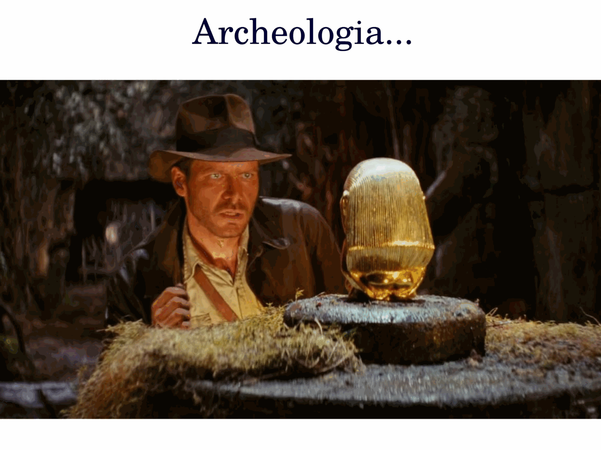
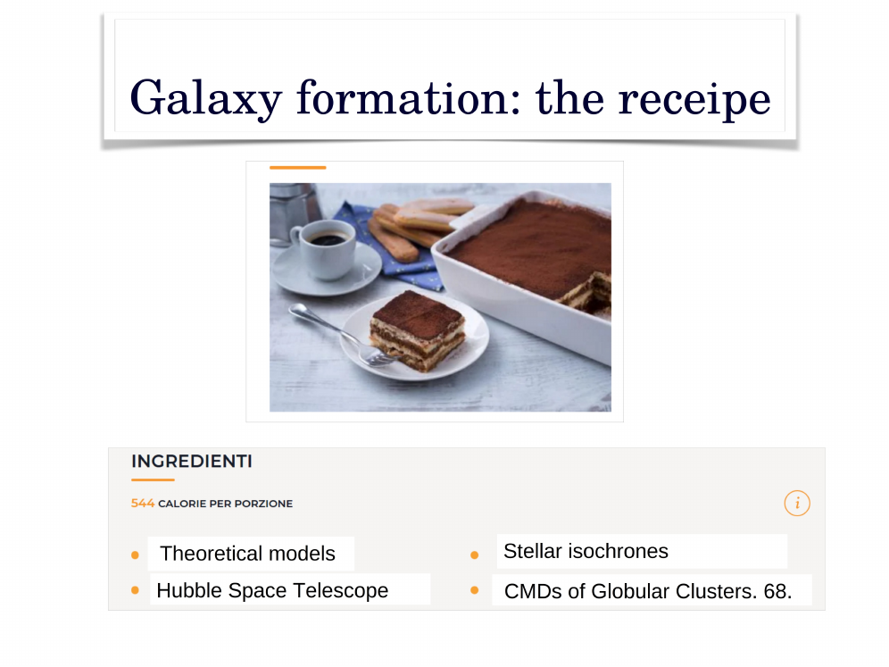
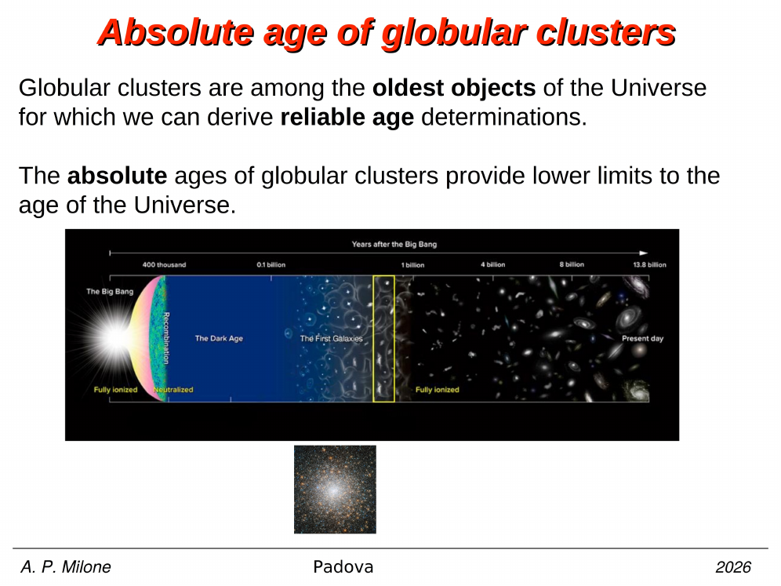
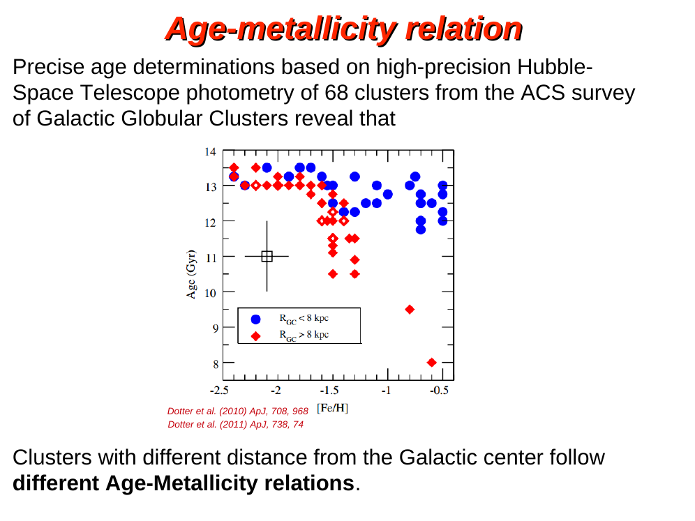
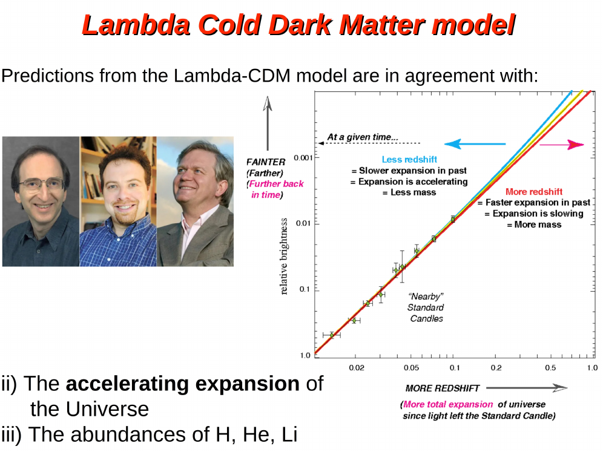
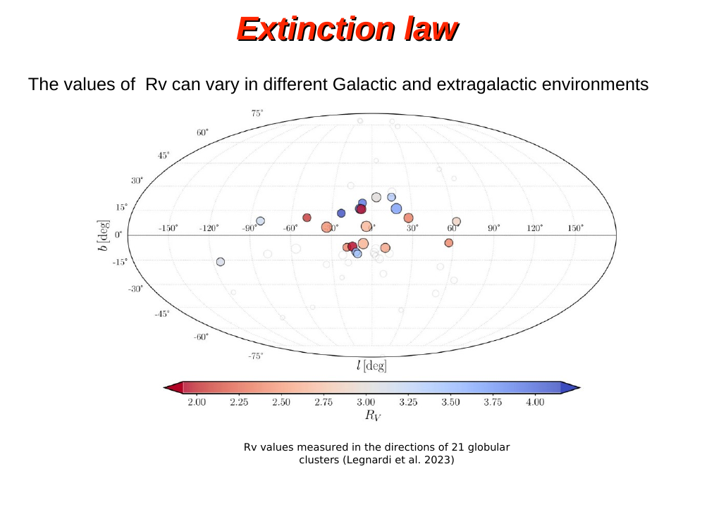
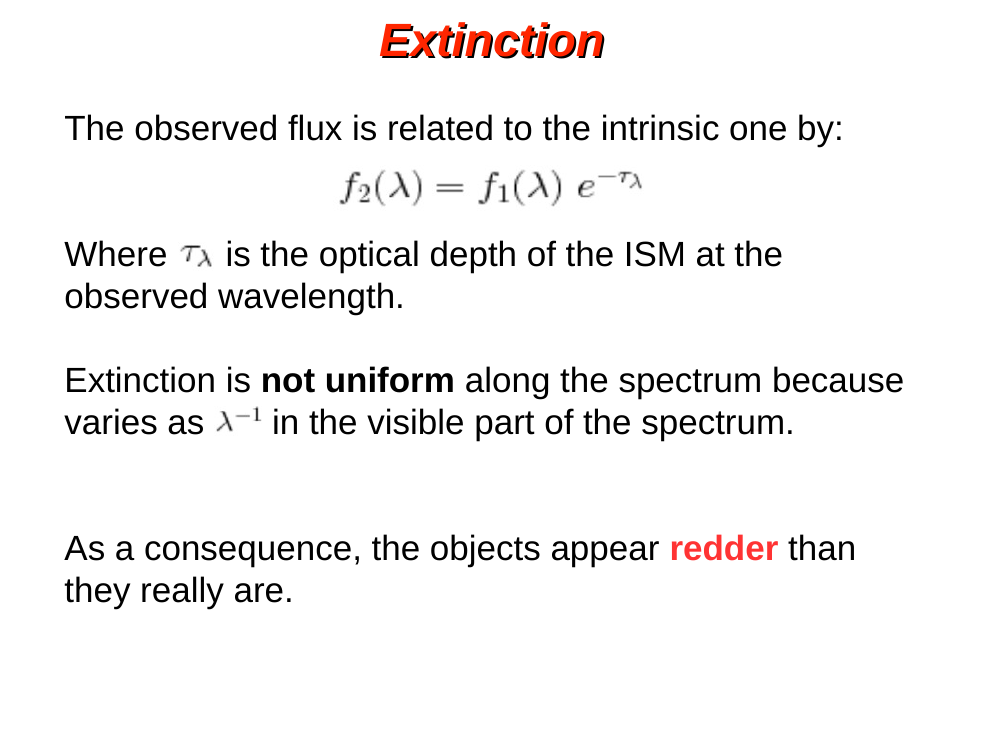


reddening is what happens when starlight passes through interstellar dust on its way to us. dust grains scatter and absorb blue photons more efficiently than red ones, so the star ends up looking both fainter (extincted) and redder (reddened) than it actually is. the colour excess is defined as

$$E(B-V) = (B-V)_{\text{observed}} - (B-V)_{\text{intrinsic}} = A_B - A_V$$

so the colour excess is just the difference of extinctions in two bands. positive $E(B-V)$ means more attenuation in $B$ than in $V$, which is exactly what dust does in the optical.

the total-to-selective extinction ratio is

$$R_V = \frac{A_V}{E(B-V)}$$

and on a colour-magnitude diagram (see [Color-magnitude diagrams of clusters](./Color-magnitude%20diagrams%20of%20clusters.html)), this ratio is the slope of the **reddening vector**. if you plot $V$ vs $(B-V)$, an unreddened star at intrinsic position $(V_0, (B-V)_0)$ shifts to

$$V = V_0 + A_V, \quad (B-V) = (B-V)_0 + E(B-V)$$

so the displacement vector has horizontal component $\Delta(B-V) = E(B-V)$ and vertical component $\Delta V = A_V = R_V \cdot E(B-V)$. the slope on the CMD is therefore $R_V$ itself. typical $R_V \approx 3.1$ in diffuse ISM means a unit colour shift to the red corresponds to about 3 magnitudes of dimming in $V$.

practically, this means a reddened cluster CMD looks just like an unreddened one but slid down and to the right along the reddening vector. if you know the direction of that vector you can fit a fiducial sequence and slide it back to zero reddening, recovering the intrinsic CMD. this is the standard de-reddening procedure for galactic globular clusters and open clusters.

a few subtleties:

- differential reddening: across the face of a cluster, $E(B-V)$ can vary spatially, smearing the CMD perpendicular to the reddening vector. correcting this star-by-star (using nearby reference stars or extinction maps) sharpens the CMD and recovers narrow sub-giant branches.
- the reddening vector direction depends on the photometric system. in $(V, B-V)$ the slope is $R_V \approx 3.1$, but in $(V, V-I)$ the slope changes because $A_V/E(V-I) \approx 2.45$ for the same dust law.
- reddening is not the same as extinction alone. extinction is the total flux loss; reddening is the differential effect across wavelengths. you can have heavy extinction with little reddening if the dust law is grey, but in the standard ISM both go together.

reddening is a key systematic in distance and age determinations. the [Distance modulus](./Distance%20modulus.html) becomes the apparent distance modulus $(m-M)_V = (m-M)_0 + A_V$, and getting $A_V$ wrong propagates directly into the inferred distance and any age inferred from main-sequence-turnoff fitting (see [Single stellar population SSP](./Single%20stellar%20population%20SSP.html)). for galactic globular clusters in the bulge, where reddening can be $E(B-V) \gtrsim 1$ and highly variable, this is one of the dominant error sources.

see also [Interstellar absorption](./Interstellar%20absorption.html), [Extinction law and Rv](./Extinction%20law%20and%20Rv.html), [HR diagram](./HR%20diagram.html), [Stellar_Astrophysics_MOC](../../04_Atlas/Stellar_Astrophysics_MOC.html)

---

## Complete Lecture Slide Panels & Observational Evidence (Lecture 04 — Interstellar Reddening & Galactic Assembly)

> **Context**: *Extinction laws, Cardelli Rv=3.1, reddening vectors in CMDs, Dotter et al. (2011) age-metallicity relation, and accreted dwarf galaxies (Gaia-Enceladus, Sagittarius).*

The following slides from Prof. Antonino Milone's lecture series provide the direct observational, photometric, and theoretical foundations for this topic:

*Figure P04-01: L04I_p05_reddening-05.png — Observational data, CMD morphology, and diagnostics from Lecture 04 — Interstellar Reddening & Galactic Assembly.*

*Figure P04-02: LAntonino_p04_01.png — Observational data, CMD morphology, and diagnostics from Lecture 04 — Interstellar Reddening & Galactic Assembly.*

*Figure P04-03: LAntonino_p04_02.png — Observational data, CMD morphology, and diagnostics from Lecture 04 — Interstellar Reddening & Galactic Assembly.*

*Figure P04-04: LAntonino_p04_03.png — Observational data, CMD morphology, and diagnostics from Lecture 04 — Interstellar Reddening & Galactic Assembly.*

*Figure P04-05: LAntonino_p04_04.png — Observational data, CMD morphology, and diagnostics from Lecture 04 — Interstellar Reddening & Galactic Assembly.*

*Figure P04-06: LAntonino_p04_05.png — Observational data, CMD morphology, and diagnostics from Lecture 04 — Interstellar Reddening & Galactic Assembly.*

*Figure P04-07: LAntonino_p04_06.png — Observational data, CMD morphology, and diagnostics from Lecture 04 — Interstellar Reddening & Galactic Assembly.*

*Figure P04-08: LAntonino_p04_07.png — Observational data, CMD morphology, and diagnostics from Lecture 04 — Interstellar Reddening & Galactic Assembly.*

*Figure P04-09: LAntonino_p04_08.png — Observational data, CMD morphology, and diagnostics from Lecture 04 — Interstellar Reddening & Galactic Assembly.*

*Figure P04-10: LAntonino_p04_09.png — Observational data, CMD morphology, and diagnostics from Lecture 04 — Interstellar Reddening & Galactic Assembly.*

*Figure P04-11: LAntonino_p04_10.png — Observational data, CMD morphology, and diagnostics from Lecture 04 — Interstellar Reddening & Galactic Assembly.*

*Figure P04-12: LAntonino_p04_11.png — Observational data, CMD morphology, and diagnostics from Lecture 04 — Interstellar Reddening & Galactic Assembly.*

*Figure P04-13: LAntonino_p04_12.png — Observational data, CMD morphology, and diagnostics from Lecture 04 — Interstellar Reddening & Galactic Assembly.*

*Figure P04-14: LAntonino_p04_13.png — Observational data, CMD morphology, and diagnostics from Lecture 04 — Interstellar Reddening & Galactic Assembly.*

*Figure P04-15: LAntonino_p04_14.png — Observational data, CMD morphology, and diagnostics from Lecture 04 — Interstellar Reddening & Galactic Assembly.*

*Figure P04-16: LAntonino_p04_15.png — Observational data, CMD morphology, and diagnostics from Lecture 04 — Interstellar Reddening & Galactic Assembly.*

*Figure P04-17: LAntonino_p04_16.png — Observational data, CMD morphology, and diagnostics from Lecture 04 — Interstellar Reddening & Galactic Assembly.*

*Figure P04-18: LAntonino_p04_17.png — Observational data, CMD morphology, and diagnostics from Lecture 04 — Interstellar Reddening & Galactic Assembly.*

*Figure P04-19: LAntonino_p04_18.png — Observational data, CMD morphology, and diagnostics from Lecture 04 — Interstellar Reddening & Galactic Assembly.*

*Figure P04-20: LAntonino_p04_19.png — Observational data, CMD morphology, and diagnostics from Lecture 04 — Interstellar Reddening & Galactic Assembly.*

*Figure P04-21: LAntonino_p04_20.png — Observational data, CMD morphology, and diagnostics from Lecture 04 — Interstellar Reddening & Galactic Assembly.*

*Figure P04-22: LAntonino_p04_21.png — Observational data, CMD morphology, and diagnostics from Lecture 04 — Interstellar Reddening & Galactic Assembly.*

*Figure P04-23: LAntonino_p04_22.png — Observational data, CMD morphology, and diagnostics from Lecture 04 — Interstellar Reddening & Galactic Assembly.*

*Figure P04-24: LAntonino_p04_23.png — Observational data, CMD morphology, and diagnostics from Lecture 04 — Interstellar Reddening & Galactic Assembly.*

*Figure P04-25: LAntonino_p04_24.png — Observational data, CMD morphology, and diagnostics from Lecture 04 — Interstellar Reddening & Galactic Assembly.*

*Figure P04-26: LAntonino_p04_25.png — Observational data, CMD morphology, and diagnostics from Lecture 04 — Interstellar Reddening & Galactic Assembly.*

*Figure P04-27: Lecture04pII_p15-15.png — Observational data, CMD morphology, and diagnostics from Lecture 04 — Interstellar Reddening & Galactic Assembly.*

*Figure P04-28: Lecture04pII_p25-25.png — Observational data, CMD morphology, and diagnostics from Lecture 04 — Interstellar Reddening & Galactic Assembly.*

*Figure P04-29: Lecture04pII_p35-35.png — Observational data, CMD morphology, and diagnostics from Lecture 04 — Interstellar Reddening & Galactic Assembly.*

*Figure P04-30: Lecture04pII_p5-05.png — Observational data, CMD morphology, and diagnostics from Lecture 04 — Interstellar Reddening & Galactic Assembly.*

*Figure P04-31: Lecture04pI_p15-15.png — Observational data, CMD morphology, and diagnostics from Lecture 04 — Interstellar Reddening & Galactic Assembly.*

*Figure P04-32: Lecture04pI_p5-05.png — Observational data, CMD morphology, and diagnostics from Lecture 04 — Interstellar Reddening & Galactic Assembly.*


  <h4 class="backlinks-title">Linked References (9)</h4>
  <ul class="backlinks-list">
    <li class="backlink-item-wrap"><a href="../../04_Atlas/Astrophysics_of_the_Interstellar_Medium_MOC.html" class="backlink-item">Astrophysics_of_the_Interstellar_Medium_MOC</a></li>
    <li class="backlink-item-wrap"><a href="./Bulge%20CMD%20complications.html" class="backlink-item">Bulge CMD complications</a></li>
    <li class="backlink-item-wrap"><a href="./Cardelli-Clayton-Mathis%20CCM%20extinction%20law.html" class="backlink-item">Cardelli-Clayton-Mathis CCM extinction law</a></li>
    <li class="backlink-item-wrap"><a href="../../02_Literature/Lectures/Interstellar_Medium/Carraro_05_Interstellar_Dust_and_Extinction.html" class="backlink-item">Carraro_05_Interstellar_Dust_and_Extinction</a></li>
    <li class="backlink-item-wrap"><a href="./Differential%20reddening%20maps.html" class="backlink-item">Differential reddening maps</a></li>
    <li class="backlink-item-wrap"><a href="./Effects%20of%20differential%20reddening%20on%20CMD%20analysis.html" class="backlink-item">Effects of differential reddening on CMD analysis</a></li>
    <li class="backlink-item-wrap"><a href="./Extinction%20law%20and%20Rv.html" class="backlink-item">Extinction law and Rv</a></li>
    <li class="backlink-item-wrap"><a href="../../04_Atlas/Stellar_Astrophysics_MOC.html" class="backlink-item">Stellar_Astrophysics_MOC</a></li>
    <li class="backlink-item-wrap"><a href="./Trumpler%20discovery%20of%20interstellar%20extinction.html" class="backlink-item">Trumpler discovery of interstellar extinction</a></li>
  </ul>

