how do stars form from diffuse gas? star formation begins inside cold, dense **Giant Molecular Clouds (GMCs)** in the interstellar medium ($T \sim 10-20$ K, number density $n \sim 10^2 - 10^6 \text{ cm}^{-3}$, mass $M \sim 10^4 - 10^6 M_\odot$). 

Sir James Jeans (1902) formulated the classical theory of **gravitational instability**: under what conditions does an infinitesimal density perturbation in a self-gravitating gas cloud grow exponentially, overcoming thermal gas pressure and causing the cloud to collapse into protostars?

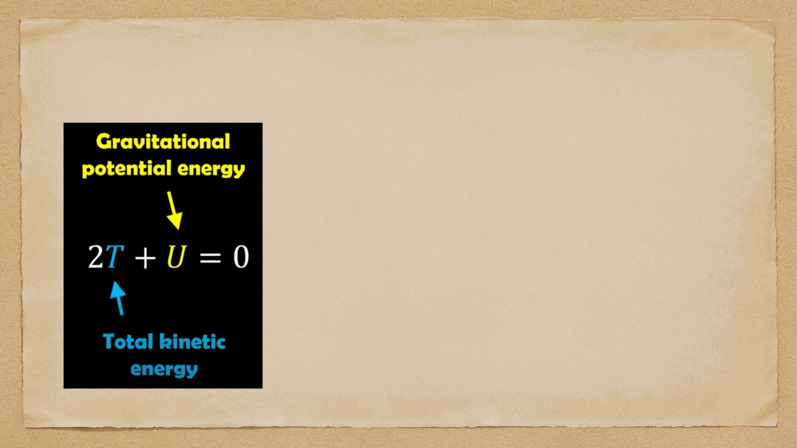

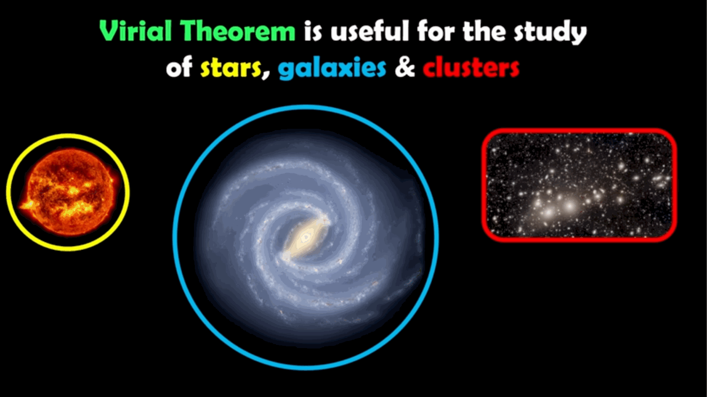

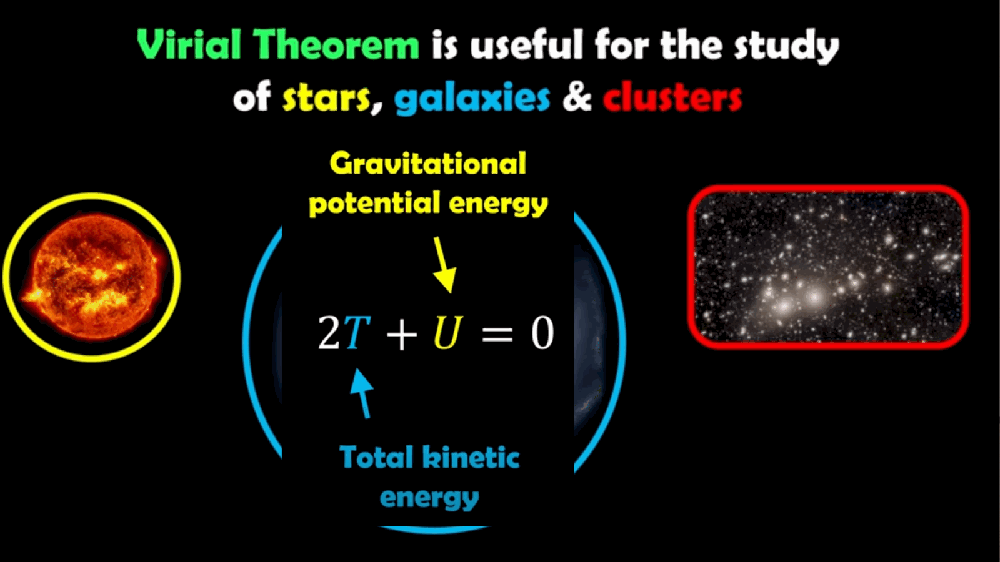

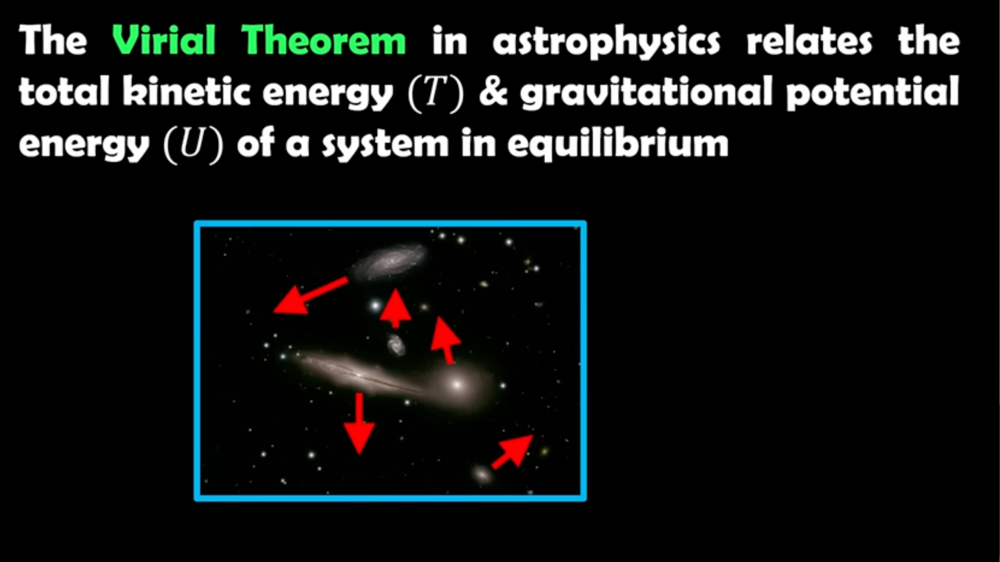

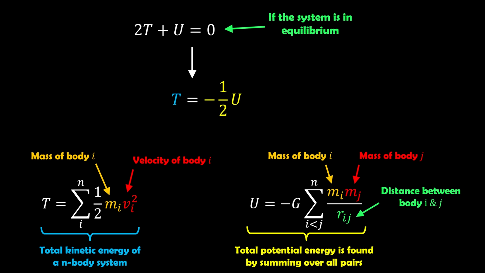

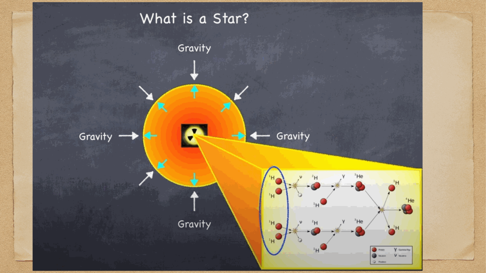

---

## mathematical derivation: small perturbation analysis of fluid equations

consider an infinite, homogeneous, static, ideal gas of uniform density $\rho_0$, pressure $P_0$, and velocity $\vec{v}_0 = 0$. 

the system is governed by the three fundamental equations of hydrodynamics:
1. **Continuity equation (mass conservation)**:
   $$\frac{\partial\rho}{\partial t} + \vec{\nabla}\cdot(\rho\vec{v}) = 0$$
2. **Euler equation (momentum conservation)**:
   $$\frac{\partial\vec{v}}{\partial t} + (\vec{v}\cdot\vec{\nabla})\vec{v} = -\frac{1}{\rho}\vec{\nabla}P - \vec{\nabla}\Phi$$
3. **Poisson equation (Newtonian gravity)**:
   $$\nabla^2\Phi = 4\pi G\rho$$
4. **Equation of state (adiabatic/isothermal)**:
   $$P = P(\rho) \implies dP = c_s^2 \, d\rho, \qquad c_s = \sqrt{\frac{\gamma k_B T}{\mu m_H}}$$
   where $c_s$ is the acoustic sound speed.

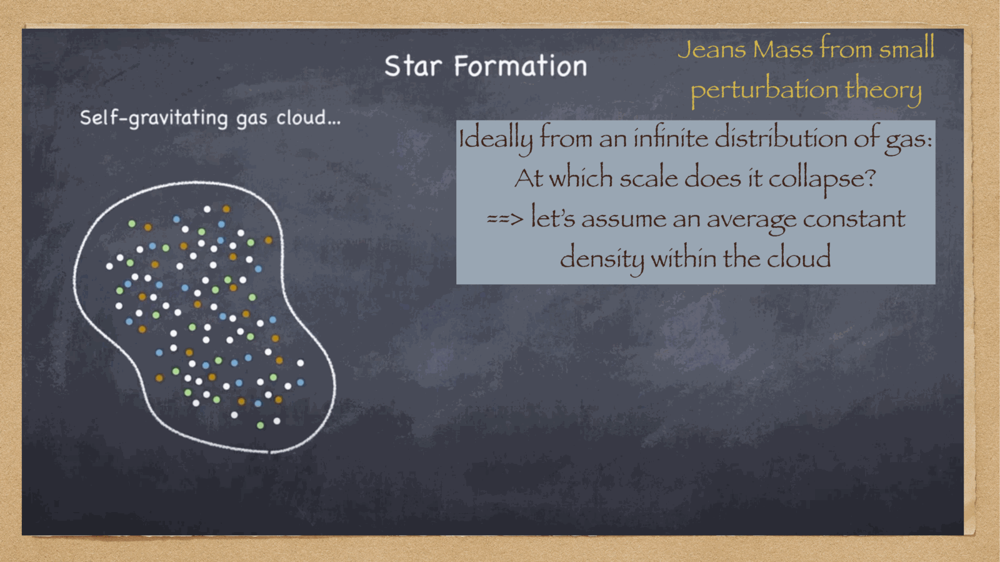

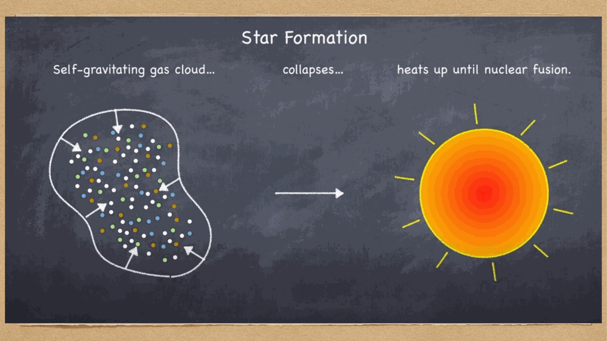

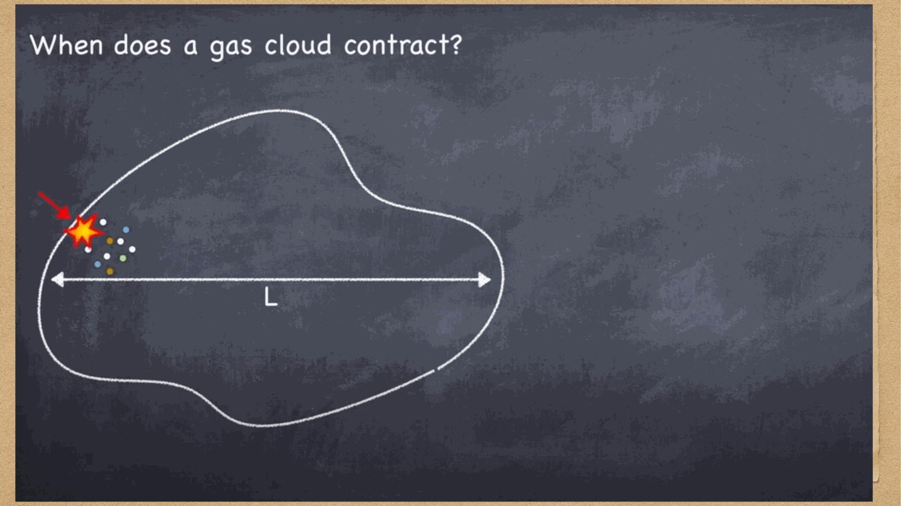

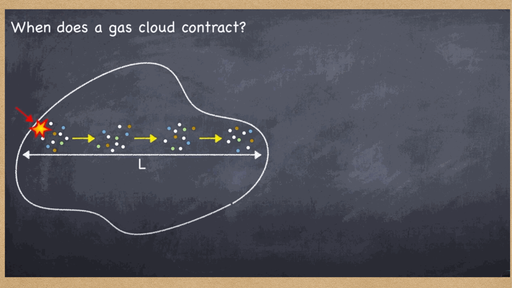

---

## timescales: sound crossing time vs free-fall time

two competing physical timescales govern the cloud:
1. **sound crossing time** $t_s$: the time required for thermal pressure waves to cross a region of size $\lambda$ and push back against compression:
   $$t_s \approx \frac{\lambda}{c_s}$$
2. **free-fall time** $t_{\text{ff}}$: the time required for a pressureless sphere of density $\rho_0$ to collapse to a point under self-gravity:
   $$t_{\text{ff}} = \sqrt{\frac{3\pi}{32 G \rho_0}}$$

- if $t_s < t_{\text{ff}}$: pressure communicates faster than gravity can pull $\implies$ stable acoustic oscillations (sound waves).
- if $t_{\text{ff}} < t_s$: gravity pulls faster than pressure can respond $\implies$ runaway gravitational collapse!

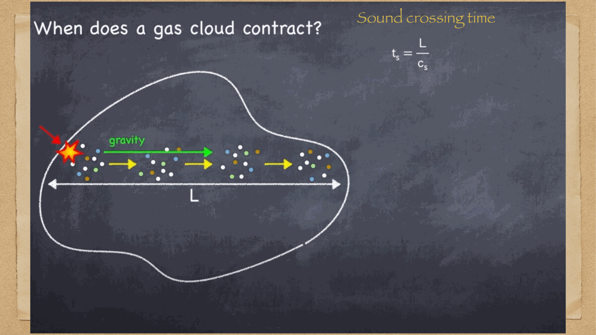

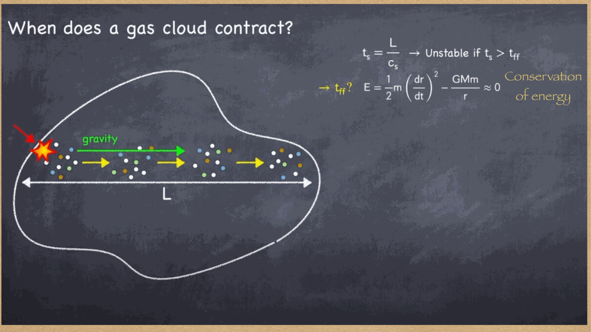

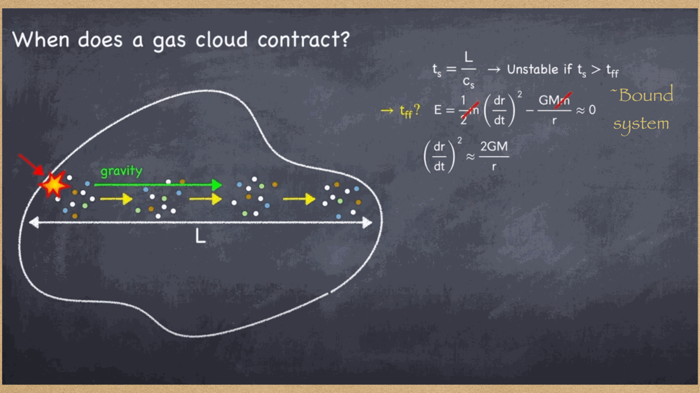

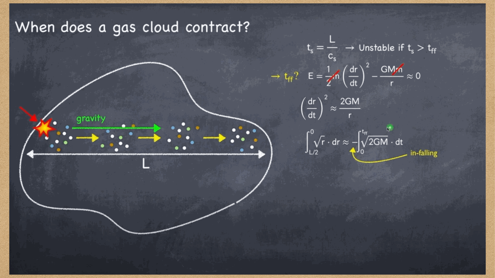

---

## linearization and the dispersion relation

introduce first-order perturbations:
$$\rho(\vec{r}, t) = \rho_0 + \rho_1(\vec{r}, t), \quad \vec{v}(\vec{r}, t) = 0 + \vec{v}_1(\vec{r}, t), \quad P(\vec{r}, t) = P_0 + c_s^2 \rho_1, \quad \Phi(\vec{r}, t) = \Phi_0 + \Phi_1(\vec{r}, t)$$
with $\lvert \rho_1\rvert \ll \rho_0$.

substituting into the fluid equations and neglecting second-order terms:
1. $\frac{\partial\rho_1}{\partial t} + \rho_0 \vec{\nabla}\cdot\vec{v}_1 = 0$
2. $\frac{\partial\vec{v}_1}{\partial t} = -\frac{c_s^2}{\rho_0}\vec{\nabla}\rho_1 - \vec{\nabla}\Phi_1$
3. $\nabla^2\Phi_1 = 4\pi G \rho_1$ *(using the "Jeans swindle": $\vec{\nabla}\Phi_0 = 0$)*

taking the time derivative of (1) and divergence of (2):
$$\frac{\partial^2\rho_1}{\partial t^2} = -\rho_0 \vec{\nabla}\cdot\left(\frac{\partial\vec{v}_1}{\partial t}\right) = -\rho_0 \vec{\nabla}\cdot\left(-\frac{c_s^2}{\rho_0}\vec{\nabla}\rho_1 - \vec{\nabla}\Phi_1\right) = c_s^2 \nabla^2\rho_1 + \rho_0 \nabla^2\Phi_1$$

substituting the Poisson equation $\nabla^2\Phi_1 = 4\pi G \rho_1$ yields the **master wave equation for self-gravitating perturbations**:
$$\boxed{\, \frac{\partial^2\rho_1}{\partial t^2} - c_s^2 \nabla^2\rho_1 - 4\pi G \rho_0 \rho_1 = 0 \,}$$

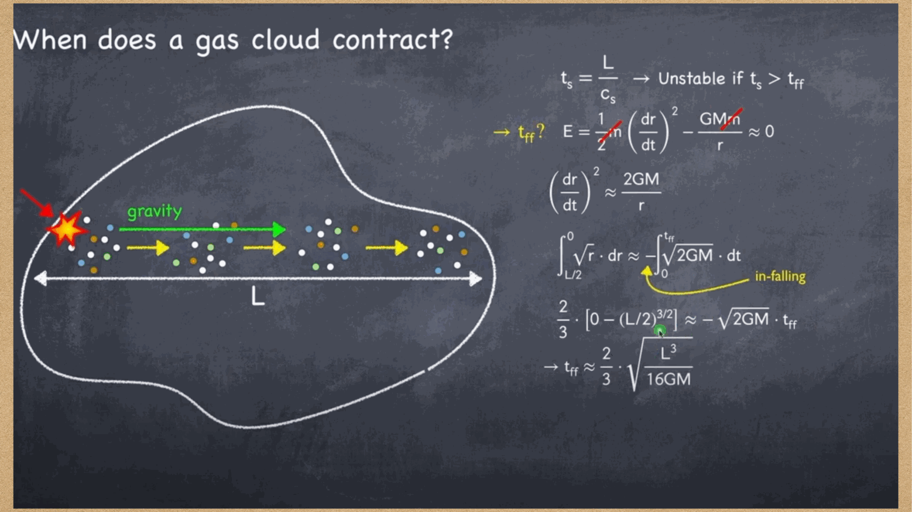

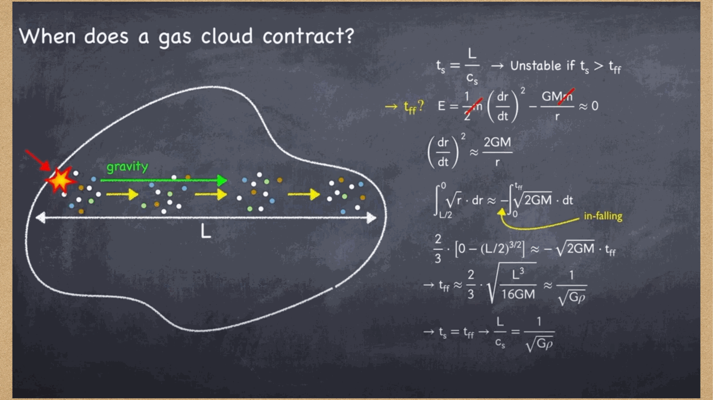

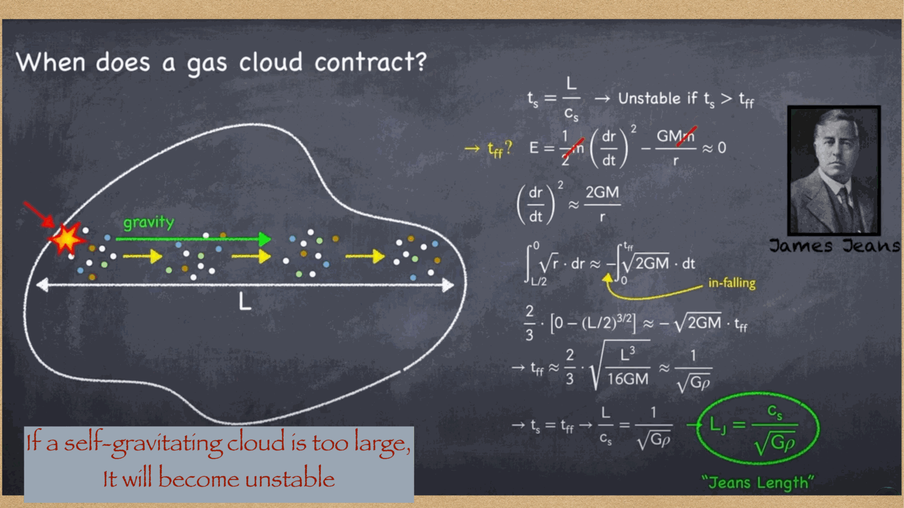

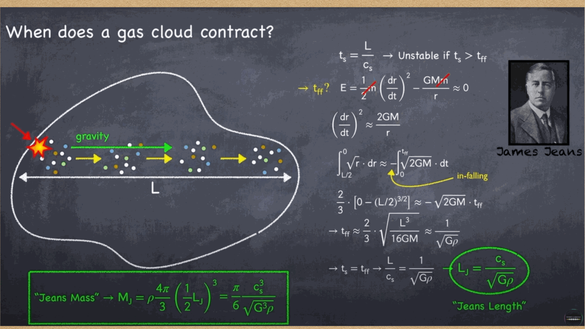

### the plane-wave solution:
substituting a Fourier plane-wave mode $\rho_1(\vec{r}, t) = A \, e^{i(\vec{k}\cdot\vec{r} - \omega t)}$:
$$-\omega^2 + c_s^2 k^2 - 4\pi G \rho_0 = 0$$

yielding the famous **Jeans dispersion relation**:
$$\boxed{\, \omega^2 = k^2 c_s^2 - 4\pi G \rho_0 \,}$$

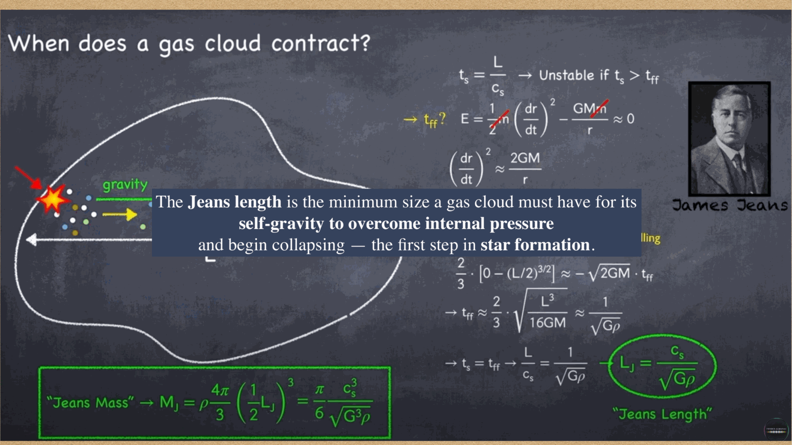

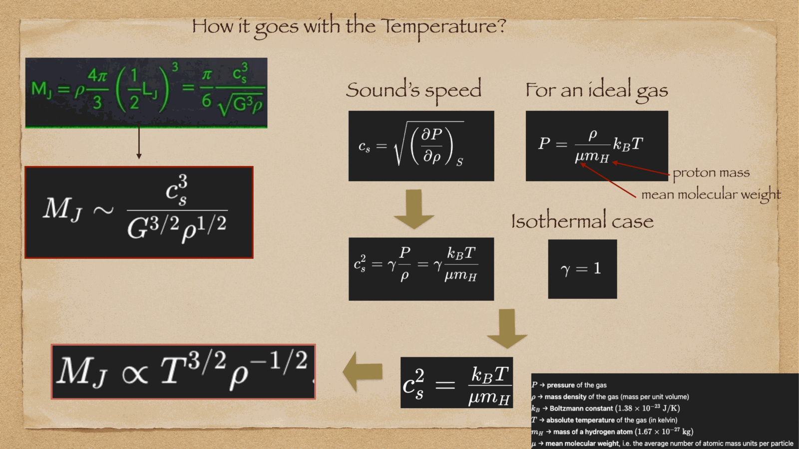

---

## physical interpretation: stability vs collapse

setting $\omega^2 = 0$ defines the critical **Jeans wavevector** $k_J$:
$$k_J = \frac{\sqrt{4\pi G \rho_0}}{c_s}$$

1. **stable regime ($k > k_J$, small scales / short wavelengths $\lambda < \lambda_J$)**:
   $\omega^2 > 0 \implies \omega = \pm\sqrt{k^2 c_s^2 - 4\pi G\rho_0}$ is purely real.
   the perturbation oscillates as an ordinary acoustic sound wave modified by gravity. thermal pressure successfully resists collapse.
2. **unstable regime ($k < k_J$, large scales / long wavelengths $\lambda > \lambda_J$)**:
   $\omega^2 < 0 \implies \omega = \pm i \Gamma$ is purely imaginary, where $\Gamma = \sqrt{4\pi G\rho_0 - k^2 c_s^2}$.
   the density perturbation exhibits exponential growth:
   $$\rho_1(t) \propto e^{+\Gamma t}$$
   self-gravity completely overwhelms thermal pressure, triggering runaway gravitational collapse!

---

## the Jeans Length $\lambda_J$ and Jeans Mass $M_J$

the critical spatial scale is the **Jeans length**:
$$\boxed{\, \lambda_J = \frac{2\pi}{k_J} = c_s \sqrt{\frac{\pi}{G\rho_0}} = \sqrt{\frac{\pi \gamma k_B T}{G \mu m_H \rho_0}} \,}$$

the mass enclosed within a sphere of diameter equal to the Jeans length is the **Jeans mass**:
$$M_J = \frac{4\pi}{3} \rho_0 \left(\frac{\lambda_J}{2}\right)^3 = \frac{\pi}{6} \rho_0 \lambda_J^3 = \frac{\pi}{6} \rho_0 \left(c_s \sqrt{\frac{\pi}{G\rho_0}}\right)^3$$

$$\boxed{\, M_J = \frac{\pi^{5/2}}{6} \left(\frac{k_B T}{G \mu m_H}\right)^{3/2} \rho_0^{-1/2} \propto T^{3/2} \, \rho_0^{-1/2} \,}$$

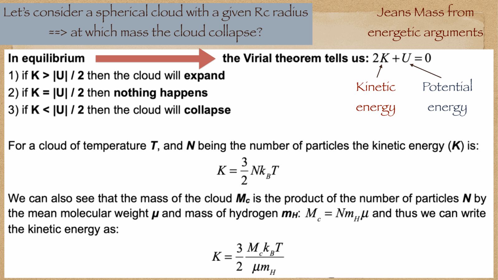

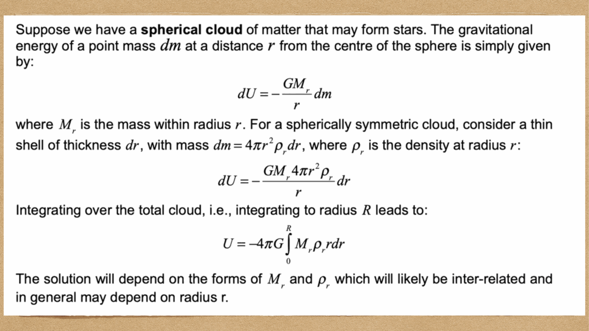

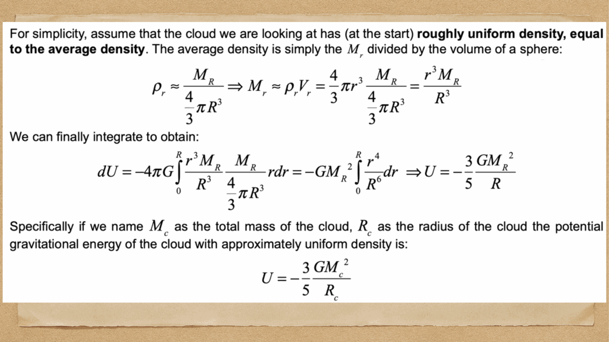

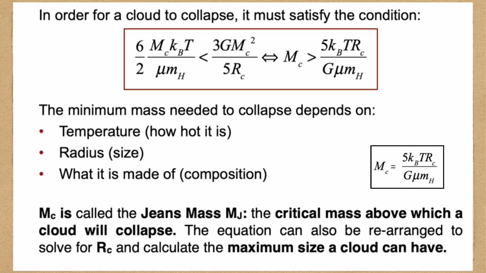

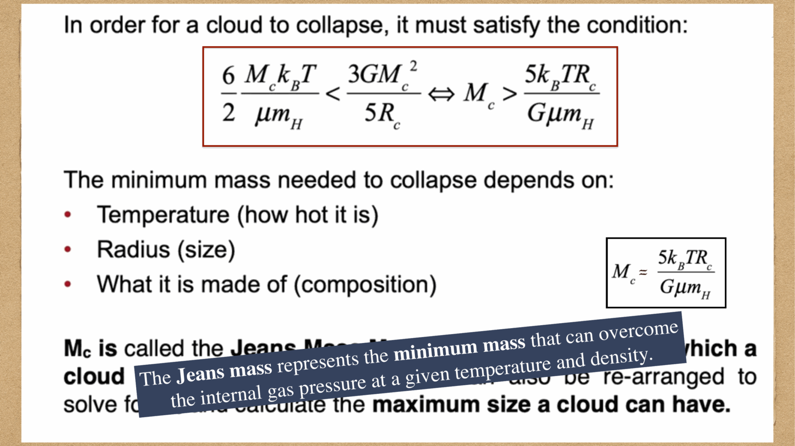

---

## energetic derivation via the Virial Theorem

the exact same result emerges from energetic arguments using the **Virial Theorem**:
$$2K + U = 0 \quad (\text{equilibrium})$$
where thermal kinetic energy is $K = \frac{3}{2} N k_B T = \frac{3}{2} \frac{M}{\mu m_H} k_B T$, and self-gravitational potential energy of a uniform sphere of radius $R$ is $U = -\frac{3}{5}\frac{G M^2}{R}$.

the condition for gravitational collapse is:
$$2K < \lvert U\rvert \implies 3 \frac{M}{\mu m_H} k_B T < \frac{3}{5} \frac{G M^2}{R} \implies M > \frac{5 k_B T R}{G \mu m_H}$$

substituting $R = \left(\frac{3M}{4\pi\rho_0}\right)^{1/3}$ yields $M > M_J \propto T^{3/2} \rho_0^{-1/2}$ (up to a factor of order unity).

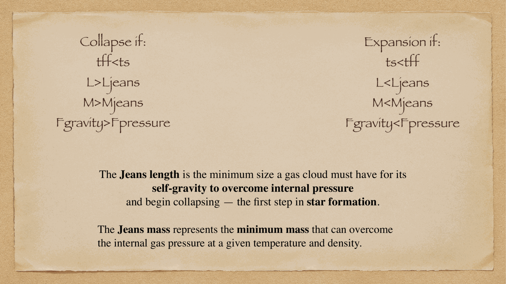

---

## hierarchical fragmentation and ALMA observations

as a giant molecular cloud collapses ($M_{\text{cloud}} \sim 10^4 M_\odot \gg M_J \sim 10^2 M_\odot$), density $\rho$ increases. as long as the gas remains optically thin to dust cooling, temperature $T$ stays constant ($T \sim 10$ K, isothermal collapse).

because $M_J \propto \rho^{-1/2}$, **the Jeans mass decreases as density increases!**
consequence: sub-regions within the collapsing cloud exceed their local, smaller Jeans mass and collapse independently. this process—**hierarchical fragmentation**—breaks a colossal molecular cloud into hundreds of solar-mass protostellar cores, naturally explaining why stars form in clusters.

fragmentation terminates when the density becomes high enough that the core becomes optically thick to its own dust emission: radiative cooling is trapped, compression becomes adiabatic ($P \propto \rho^{5/3}$), temperature rises, and $M_J \propto T^{3/2} \rho^{-1/2} \propto \rho^0 = \text{const}$, halting fragmentation at the minimum stellar mass ($M_{\text{min}} \sim 0.01 - 0.08 M_\odot$).

modern sub-millimeter interferometers like **ALMA** directly image these collapsing cores and their circumstellar protoplanetary disks both face-on and edge-on.

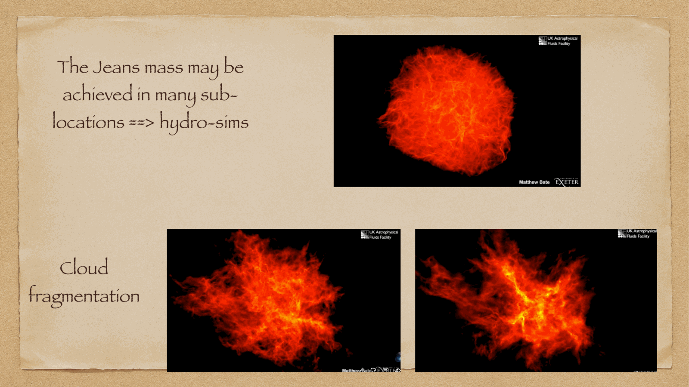

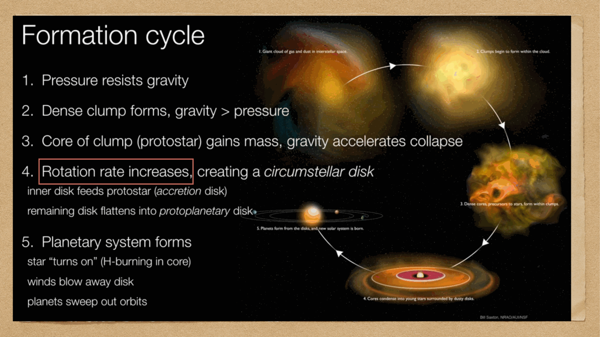

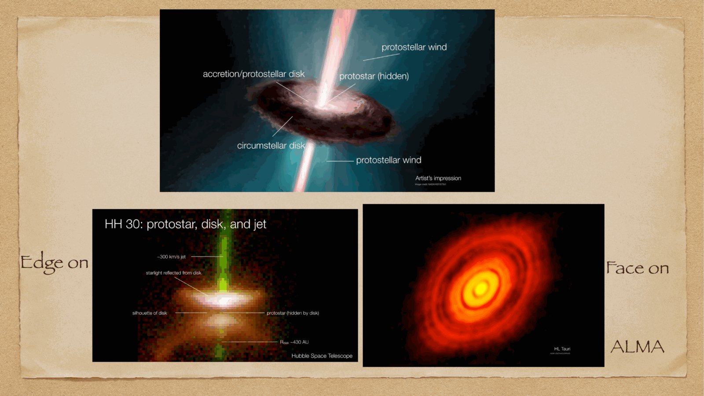

---

## connection to modified gravity (Arbuzova et al. 2014)

in modified gravity theories such as $f(R)$ gravity (see Arbuzova, Dolgov, & Reverberi 2014, *Phys. Lett. B* 739, 279), the effective gravitational coupling acquires a scale-dependent Yukawa correction:
$$G_{\text{eff}}(k) = G \left(1 + \frac{1}{3} \frac{k^2}{k^2 + m_R^2}\right)$$
on astrophysical scales ($k \ll m_R$), $G_{\text{eff}} \to G$, recovering standard Newtonian Jeans collapse; on intermediate scales, the enhanced gravity lowers the Jeans mass, accelerating early structure collapse.

---

## see also

- [Fundamentals_Astrophysics_Cosmology_MOC](../../04_Atlas/Fundamentals_Astrophysics_Cosmology_MOC.html)
- [Pre-main sequence evolution and protostars](Pre-main%20sequence%20evolution%20and%20protostars.html)
- [Stellar structure equations](Stellar%20structure%20equations.html)
- [Linear evolution of perturbations in expanding universe](Linear%20evolution%20of%20perturbations%20in%20expanding%20universe.html)
- [Jeans analysis in expanding universe](Jeans%20analysis%20in%20expanding%20universe.html)

  <h4 class="backlinks-title">Linked References (4)</h4>
  <ul class="backlinks-list">
    <li class="backlink-item-wrap"><a href="Interstellar%20medium%20components%20and%20gas%20cycle.html" class="backlink-item">Interstellar medium components and gas cycle</a></li>
    <li class="backlink-item-wrap"><a href="Jeans%20analysis%20in%20expanding%20universe.html" class="backlink-item">Jeans analysis in expanding universe</a></li>
    <li class="backlink-item-wrap"><a href="Pre-main%20sequence%20evolution%20and%20protostars.html" class="backlink-item">Pre-main sequence evolution and protostars</a></li>
    <li class="backlink-item-wrap"><a href="../../04_Atlas/Fundamentals_Astrophysics_Cosmology_MOC.html" class="backlink-item">Fundamentals_Astrophysics_Cosmology_MOC</a></li>
  </ul>

