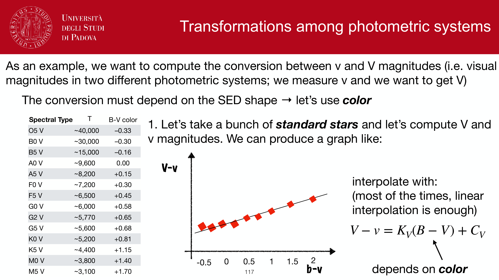
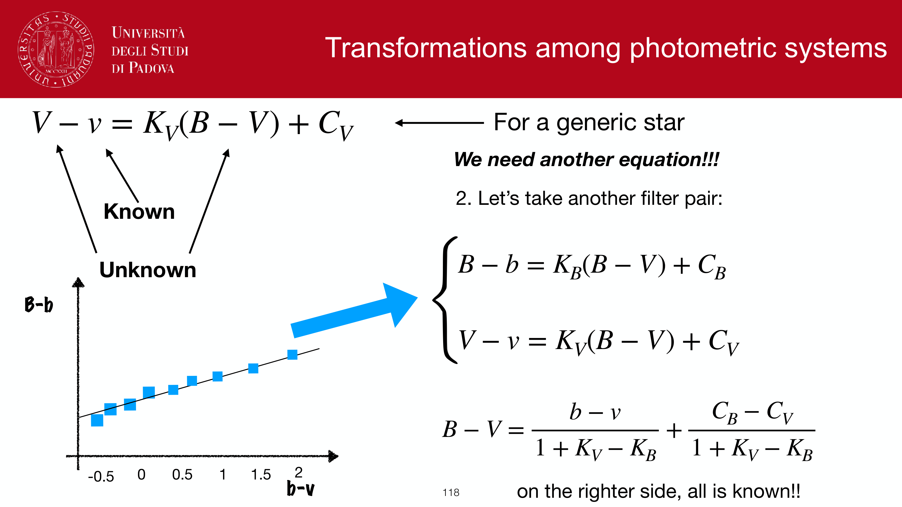
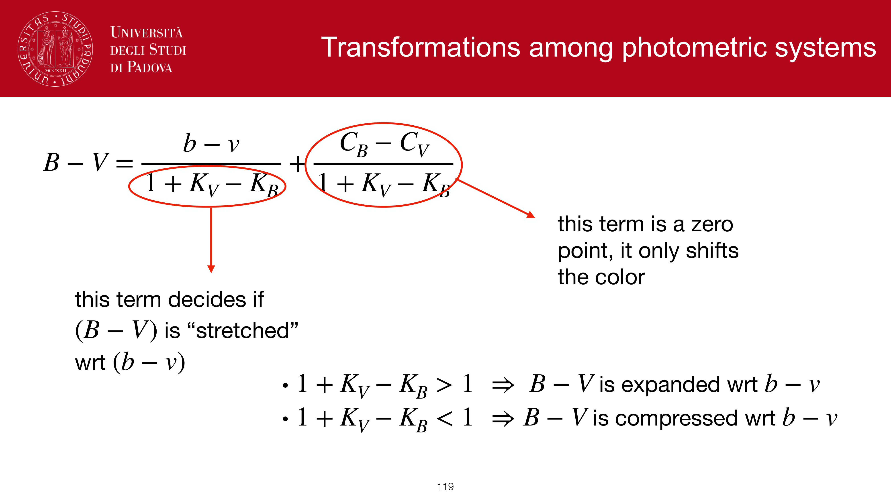
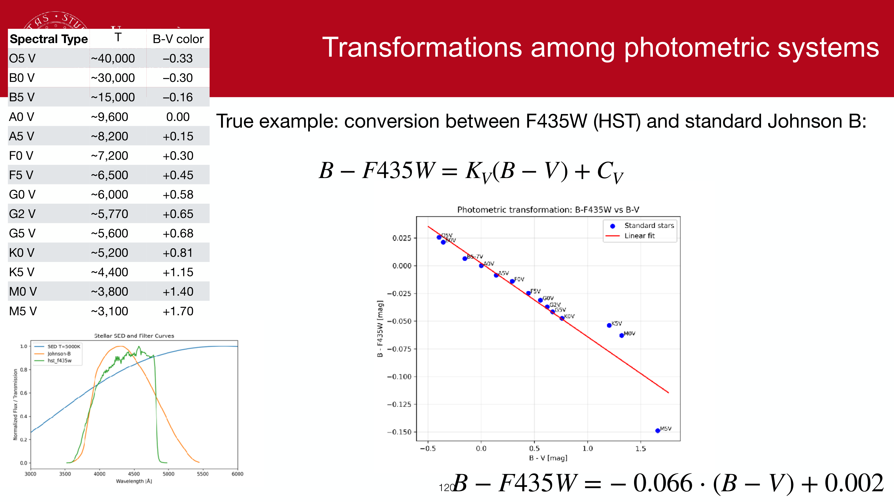
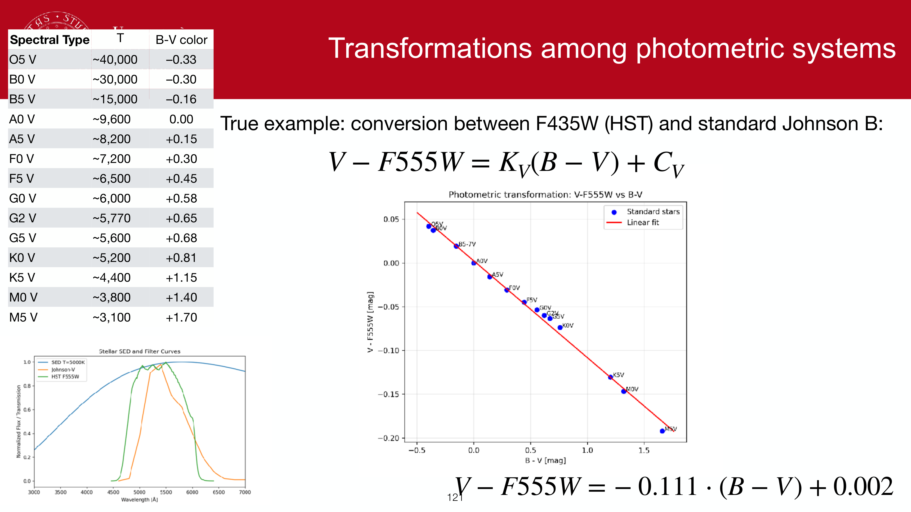
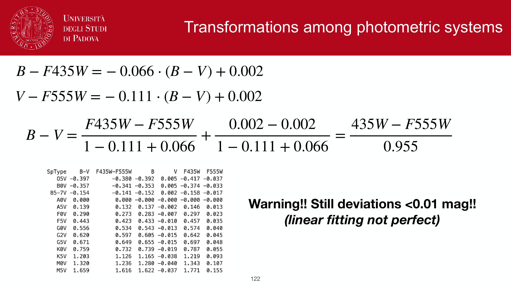
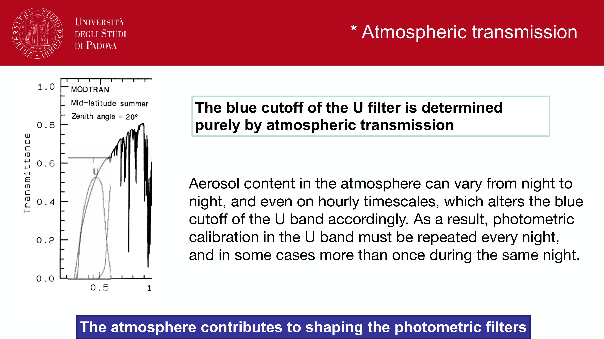

at non-zero redshift, photons measured in a fixed-band filter at the observer were emitted at a different rest-frame wavelength. the **K-correction** translates between observed-band and rest-frame magnitudes so that distances and luminosities can be inferred consistently.

## the problem

I observe a galaxy in the V-band at $z = 0.5$. the photons hitting my detector at $\lambda_{\rm obs} = 550$ nm were emitted at
$$\lambda_{\rm em} = \lambda_{\rm obs}/(1+z) = 550\,\text{nm}/1.5 = 367\,\text{nm}$$

so my V-band magnitude is sampling the source's **near-UV** spectrum, not its V-band rest-frame spectrum. if I want to compare with a low-$z$ V-band absolute magnitude, I need a correction.

## the cosmological distance modulus with K-correction

the magnitude relation becomes
$$\boxed{\, m = M + 5\log_{10}(d_L/10\,\text{pc}) + K(z)\,}$$

where $d_L$ is the luminosity distance ([Luminosity distance](Luminosity%20distance.html)) and $K(z)$ is the K-correction in the chosen band.

in band $X$ at redshift $z$:
$$K_X(z) = -2.5 \log_{10}\!\left[\frac{(1+z)\int F(\lambda) T_X(\lambda)\, d\lambda}{\int F(\lambda/(1+z)) T_X(\lambda)\, d\lambda}\right]$$

(or similar, depending on whether you use $F_\nu$ or $F_\lambda$ formalism). the factor $(1+z)$ at the top accounts for the bandpass narrowing.

## what does $K(z)$ depend on?

- **the source SED**: a featureless power-law and an emission-line galaxy K-correct very differently.
- **the filter**: which part of the SED is being sampled changes with $z$, and the relevant SED feature evolves.
- **the redshift**: through $\lambda_{\rm em} = \lambda_{\rm obs}/(1+z)$.

so $K(z)$ is **not a single function**; it must be computed per-source per-filter, ideally from a fit to the multi-band SED.

## sign and behaviour

in optical bands $K(z) > 0$ at most $z$, meaning the source looks **fainter** in $m$ than the inverse-square law alone would predict, because the filter samples a less luminous part of the SED.

example: the Sun's SED. observed V-band at $z = 0.5$ samples rest-frame near-UV, which is dimmer than rest-frame V (the Wien-side suppression). so $K_V > 0$ for solar-type galaxies at modest $z$.

## the famous sub-mm exception

at sub-mm wavelengths ($\sim 850\,\mu$m, SCUBA-2), the negative slope of the Wien tail of the warm-dust greybody means moving the source to higher $z$ samples a *brighter* part of the rest-frame SED. the K-correction can be **strongly negative**:
$$K(z) < 0\quad\text{at sub-mm for } z \in [1, 10]$$

consequence: dusty star-forming galaxies have **roughly constant flux** at $850\,\mu$m from $z \sim 1$ to $z \sim 10$. the sub-mm is the only optical-NIR-radio band where increasing $z$ does not fade the source. this is what enables ALMA/SCUBA surveys for high-$z$ dusty galaxies. see [K-correction in optical vs sub-mm](K-correction%20in%20optical%20vs%20sub-mm.html).

## practical computation

three approaches:
1. **template fitting**: take a galaxy template (BC03, IRGAL, Polletta library), fit to the multi-band photometry, integrate the best-fit redshifted spectrum through the filter.
2. **empirical recipes**: published $K(z)$ curves for galaxy types (Coleman-Wu-Weedman, Poggianti 1997, Blanton & Roweis 2007 *kcorrect* code).
3. **photometric-redshift codes**: BPZ, EAZY, Le Phare. they fit redshift and galaxy type simultaneously, returning a per-source $K$.

the python package `kcorrect` (Blanton) is the standard tool for SDSS-derived K-corrections.

## see also

- [Distance modulus](Distance%20modulus.html)
- [K-correction in optical vs sub-mm](K-correction%20in%20optical%20vs%20sub-mm.html)
- [Luminosity distance](Luminosity%20distance.html)
- [Distance ladder derivations](Distance%20ladder%20derivations.html)
- [Photometric redshifts](Photometric%20redshifts.html)
- [Filter systems and bandpasses](Filter%20systems%20and%20bandpasses.html)
- [Cosmic star formation history](Cosmic%20star%20formation%20history.html)
- [Cosmological redshift](Cosmological%20redshift.html)

---

## observational astrophysics course slides (Prof. Paolo Cassata)

*K-correction concept: observing redshifted rest-frame spectrum through fixed bandpass.*

*Mathematical definition: m_obs(z) = M_rest + 5 log10(d_L / 10 pc) + K(z).*

*Filter bandpass compression factor (1 + z) in frequency.*

*K-correction across different galaxy spectral types (E/S0 vs Spiral vs Starburst).*

*Color-dependent K-correction curves in SDSS ugriz passbands.*

*Negative K-correction in sub-millimeter astronomy: Rayleigh-Jeans to Wien slope matching (1 + z)^4.*

*Sub-mm flux density remaining almost constant from z = 1 to z = 8.*

  <h4 class="backlinks-title">Linked References (12)</h4>
  <ul class="backlinks-list">
    <li class="backlink-item-wrap"><a href="1Vmax%20estimator.html" class="backlink-item">1Vmax estimator</a></li>
    <li class="backlink-item-wrap"><a href="Distance%20ladder%20derivations.html" class="backlink-item">Distance ladder derivations</a></li>
    <li class="backlink-item-wrap"><a href="Distance%20modulus.html" class="backlink-item">Distance modulus</a></li>
    <li class="backlink-item-wrap"><a href="Galaxy%20counts%20at%20different%20wavelengths.html" class="backlink-item">Galaxy counts at different wavelengths</a></li>
    <li class="backlink-item-wrap"><a href="Galaxy%20number%20counts%20N%28m%29.html" class="backlink-item">Galaxy number counts N(m)</a></li>
    <li class="backlink-item-wrap"><a href="Hubble%20flow%20distances.html" class="backlink-item">Hubble flow distances</a></li>
    <li class="backlink-item-wrap"><a href="K-correction%20in%20optical%20vs%20sub-mm.html" class="backlink-item">K-correction in optical vs sub-mm</a></li>
    <li class="backlink-item-wrap"><a href="Luminosity%20distance.html" class="backlink-item">Luminosity distance</a></li>
    <li class="backlink-item-wrap"><a href="Redshift%20distribution%20of%20flux-limited%20samples.html" class="backlink-item">Redshift distribution of flux-limited samples</a></li>
    <li class="backlink-item-wrap"><a href="Surface%20brightness%20dimming.html" class="backlink-item">Surface brightness dimming</a></li>
    <li class="backlink-item-wrap"><a href="../../04_Atlas/Observational_Astrophysics_MOC.html" class="backlink-item">Observational_Astrophysics_MOC</a></li>
    <li class="backlink-item-wrap"><a href="../../04_Atlas/Observational_Cosmology_MOC.html" class="backlink-item">Observational_Cosmology_MOC</a></li>
  </ul>

