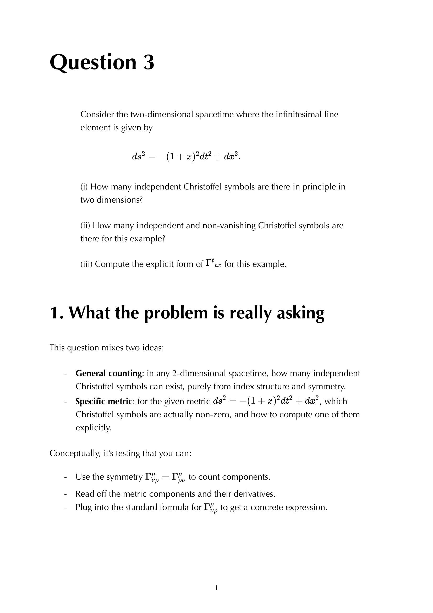

# Killing vectors and symmetries

---

### General Relativity Mathematical & Oral Defense Panel

*Question 3 Oral Exam Model Solution: Symmetries and Killing vectors in 2D spacetime $ds^2 = -(1+x^2)dt^2 + dx^2$, Killing equation $\nabla_\mu \xi_\nu + \nabla_\nu \xi_\mu = 0$, and conserved quantities along geodesics.*

## Linked References

- [[General_Relativity_MOC]]

