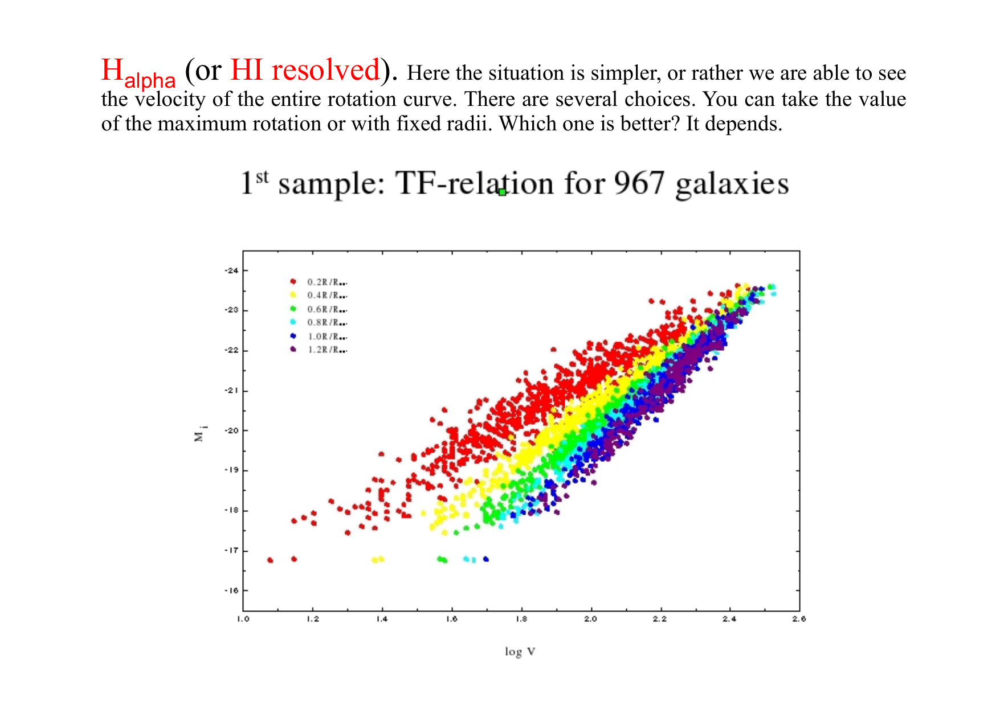
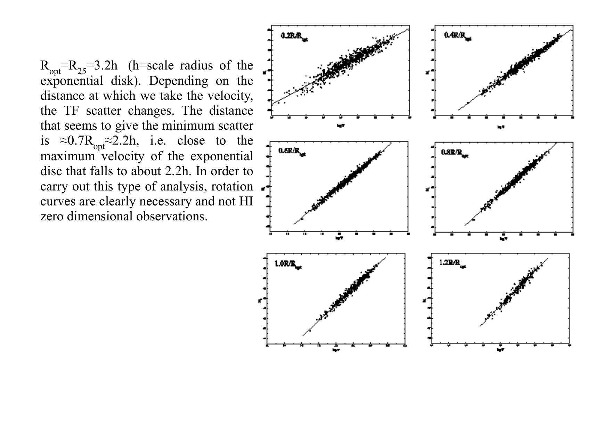
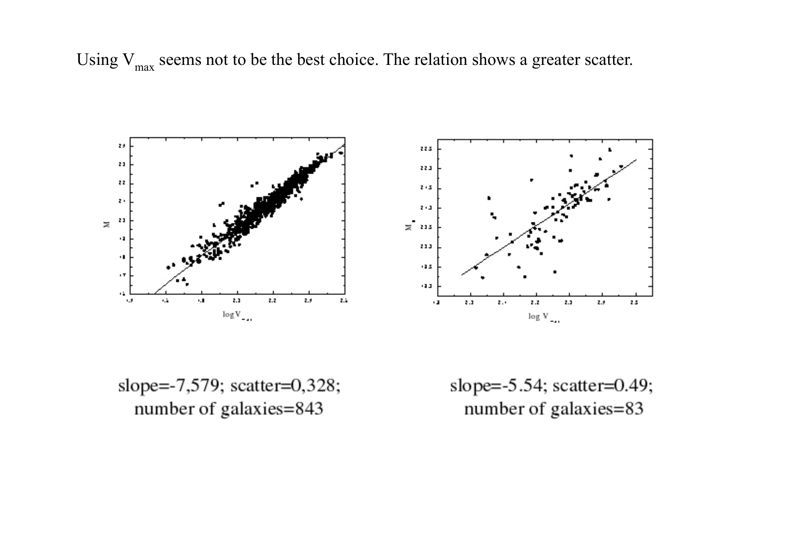
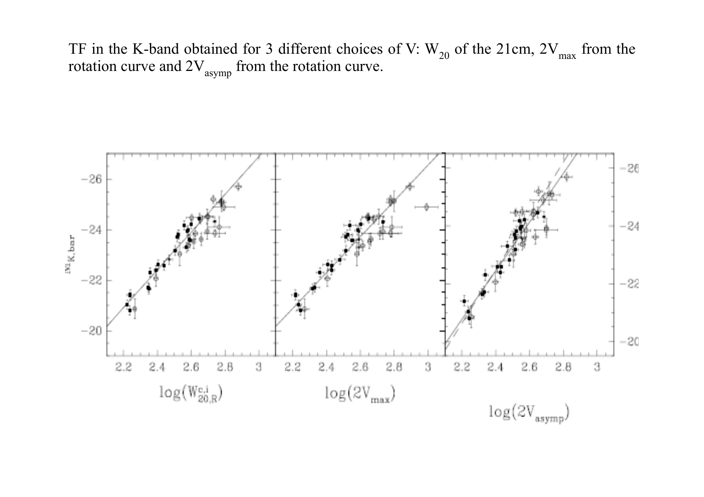
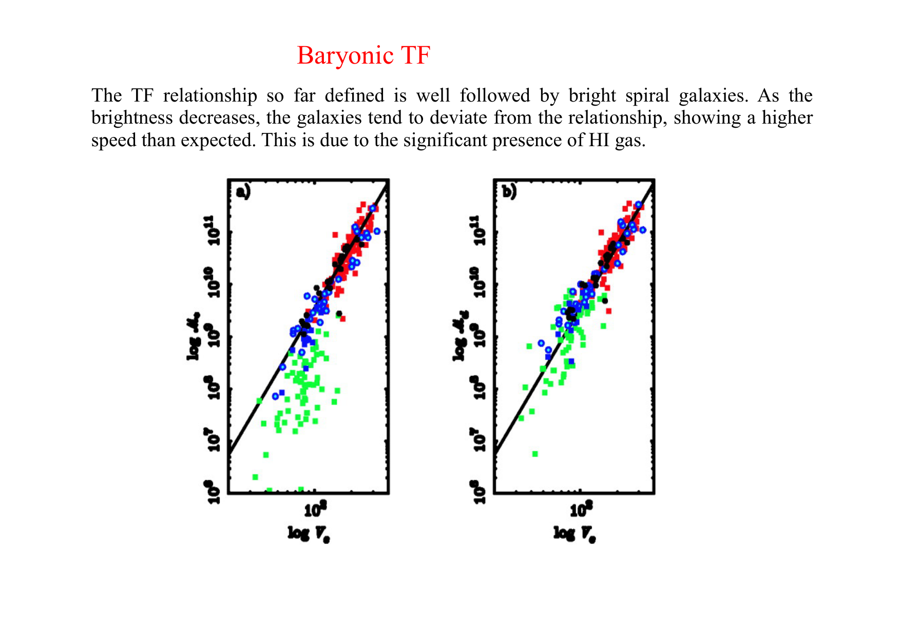
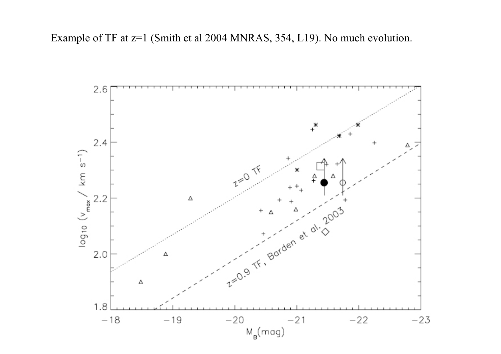
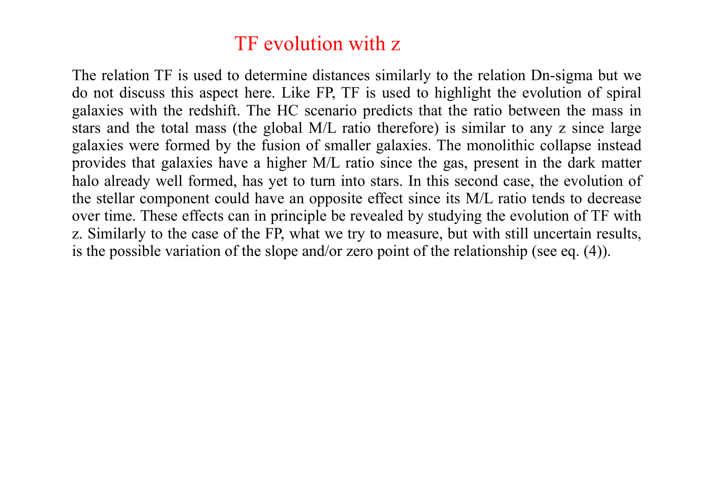
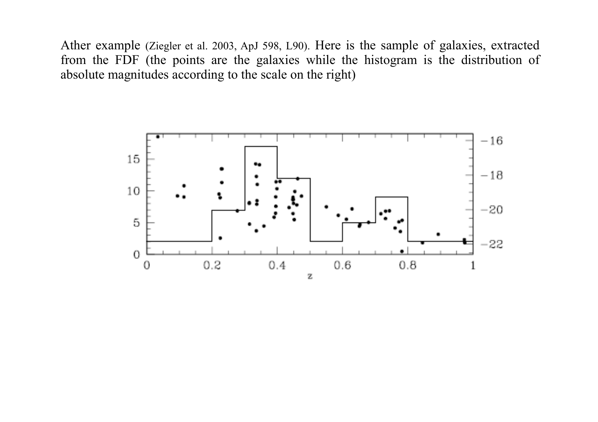
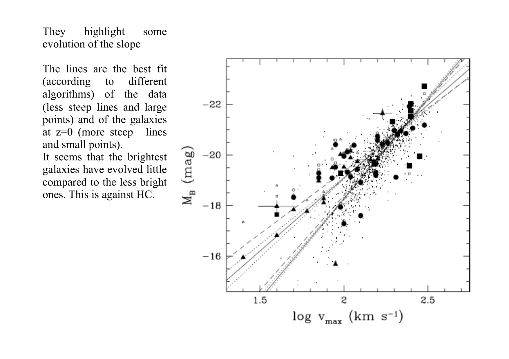
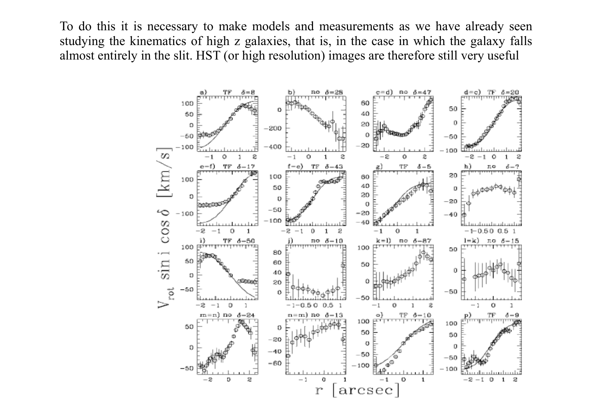

# The Kormendy Relation

## 1. Empirical Formulation

The **Kormendy relation** (Kormendy 1977) is the fundamental photometric scaling relation for early-type galaxies, connecting the effective half-light radius $R_e$ to the mean surface brightness $\langle \mu \rangle_e$ enclosed within $R_e$.

$$\boxed{\langle \mu \rangle_e = a \log_{10}\left(\frac{R_e}{\mathrm{kpc}}\right) + b}$$

In the optical B-band (Hamabe & Kormendy 1987).

$$\langle \mu \rangle_e(B) = (2.94 \pm 0.10) \log_{10}\left(\frac{R_e}{\mathrm{kpc}}\right) + 19.48$$

In the V-band (for Coma cluster ellipticals; Jorgensen et al. 1996).

$$\langle \mu \rangle_e(V) \approx 3.02 \log_{10}\left(\frac{R_e}{\mathrm{kpc}}\right) + 19.72$$

Here.
- $\langle \mu \rangle_e$ is the mean surface brightness within the effective radius $R_e$ in astronomical units of $\mathrm{mag\,arcsec^{-2}}$
- $R_e$ is the effective radius in kiloparsecs enclosing $50\%$ of the total light
- The slope $a \approx 3.0$ indicates that larger elliptical galaxies have systematically fainter mean surface brightnesses (larger numerical magnitudes)

---

## 2. Unbroken Mathematical Derivation - Surface Intensity and Luminosity Scaling

### Step 1 - Converting from Magnitudes to Physical Surface Intensity
Astronomical surface brightness in magnitudes relates to physical surface intensity $\langle I \rangle_e$ (in units of $L_\odot\,\mathrm{pc}^{-2}$) via Pogson's equation.

$$\langle \mu \rangle_e = -2.5 \log_{10} \langle I \rangle_e + C$$

Substitute this definition into the empirical Kormendy equation.

$$-2.5 \log_{10} \langle I \rangle_e + C = a \log_{10} R_e + b$$

Rearrange to isolate $\log_{10} \langle I \rangle_e$.

$$\log_{10} \langle I \rangle_e = -\frac{a}{2.5} \log_{10} R_e + \frac{C - b}{2.5}$$

Exponentiating with base $10$.

$$\langle I \rangle_e \propto R_e^{-a / 2.5}$$

For the observed slope $a \approx 3.0$.

$$-\frac{a}{2.5} = -\frac{3.0}{2.5} = -1.2 \implies \boxed{\langle I \rangle_e \propto R_e^{-1.2}}$$

(or taking $a \approx 2.08$ from near-infrared calibrations yields $\langle I \rangle_e \propto R_e^{-0.83}$).

### Step 2 - The Luminosity-Radius Relation
The total luminosity $L$ of an elliptical galaxy is defined by the surface brightness integral.

$$L = 2\pi R_e^2 \langle I \rangle_e$$

Substitute the physical Kormendy scaling $\langle I \rangle_e \propto R_e^{-1.2}$ into the luminosity equation.

$$L \propto R_e^2 \cdot R_e^{-1.2} \propto R_e^{0.8}$$

Inverting this proportionality to express radius as a function of luminosity.

$$\boxed{R_e \propto L^{1.25}}$$

### Physical Consequence on the Oral Exam
In early-type galaxies, effective radius grows **faster than linearly** with luminosity ($R_e \propto L^{1.25}$).
Because volume scales as $V \propto R_e^3 \propto L^{3.75}$, the mean spatial luminosity density scales as.

$$\rho_L \sim \frac{L}{R_e^3} \propto \frac{L}{L^{3.75}} \propto L^{-2.75}$$

This proves that giant, luminous elliptical galaxies are substantially **more diffuse and puffed up** than lower-luminosity ellipticals.

---

## 3. The Kormendy Relation as a Projection of the Fundamental Plane

The Fundamental Plane of elliptical galaxies (Djorgovski & Davis 1987; Dressler et al. 1987) is a tight two-dimensional manifold in the three-dimensional space of $(\log_{10} R_e, \log_{10} \sigma, \langle \mu \rangle_e)$.

$$\log_{10} R_e = \alpha \log_{10} \sigma + \beta \langle \mu \rangle_e + \gamma$$

where $\alpha \approx 1.24$ and $\beta \approx 0.33$ (in r-band).
The Kormendy relation is the **purely photometric 2D projection** of the Fundamental Plane onto the $(\log_{10} R_e, \langle \mu \rangle_e)$ plane, obtained by integrating over the third parameter (stellar velocity dispersion $\sigma$).
Because velocity dispersion correlates with luminosity through the Faber-Jackson relation ($L \propto \sigma^4$), galaxies with larger $R_e$ systematically possess larger $\sigma$. Projecting onto the photometric plane introduces an intrinsic scatter of $\sim 0.35\,\mathrm{mag}$, which collapses to $\sim 0.08\,\mathrm{dex}$ when $\sigma$ is included in the full Fundamental Plane.

---

## 4. Morphological Diagnostic - Classical Bulges Versus Pseudobulges

The Kormendy relation serves as an observational test for galaxy assembly history.

### Classical Bulges and Normal Ellipticals
- Formed through dissipationless (dry) major mergers and violent relaxation
- Follow the Kormendy relation tightly with slope $a \approx 3.0$
- Energy conservation and virialization during dry mergers naturally puff up the outer stellar envelope, increasing $R_e$ and reducing mean surface brightness

### Pseudobulges
- Formed through slow, dissipative, internal secular disk evolution (bar-driven gas inflows and quiet central star formation)
- Lie systematically **below and to the left** of the Kormendy relation (typically by $1.0$ to $2.0\,\mathrm{mag\,arcsec^{-2}}$)
- For a given effective radius, pseudobulges possess much higher surface brightness than classical bulges, reflecting their dissipative gas-rich origins

---

## 5. The Dichotomy - Giant Ellipticals Versus Dwarf Spheroidals

A critical discovery in galaxy photometry (Kormendy 1985; Kormendy et al. 2009) is that dwarf spheroidal galaxies (dSph) and dwarf ellipticals (dE) do **not** follow the Kormendy relation of giant ellipticals.

```text
       Mean Surface Brightness <mu>_e [mag/arcsec^2]
         ^ (Faint)
      26 |                                         * (cD Galaxies)
         |                                       *
      24 |      * Dwarf Spheroidals            *   GIANT ELLIPTICALS
         |        (dE / dSph)                *     Slope a ~ 3.0
      22 |          *                      *       <mu>_e ~ 3 log R_e + 19.5
         |            *                  *
      20 |              *              *
         |                *          *
      18 |                  *      * (Compact Ellipticals like M32)
         |                    *  *
      16 |                      *   <=== Ultra-Compact Dwarfs (UCDs)
         |
      14 |  * Globular Clusters (R_e ~ 3 pc = const)
         +=========+=========+=========+=========+=========+======> log10(R_e / kpc)
        -3        -2        -1         0         1         2
      (1 pc)   (10 pc)   (100 pc)   (1 kpc)   (10 kpc)  (100 kpc)
```

### The Two Distinct Branches
1. **The Giant Elliptical Branch** - Extends from intermediate ellipticals ($M_V \approx -18, R_e \approx 1\,\mathrm{kpc}$) to giant cD galaxies ($M_V \approx -24, R_e \approx 50\,\mathrm{kpc}$). Here, radius grows as surface brightness dims ($d\langle\mu\rangle_e / d\log R_e > 0$).
2. **The Dwarf Spheroidal Branch** - Runs in the **opposite direction**. For dwarf spheroidals, as luminosity increases, surface brightness brightens ($d\langle\mu\rangle_e / d\log R_e < 0$) while radius remains roughly constant ($R_e \sim 0.2 - 1.0\,\mathrm{kpc}$).
3. **Globular Clusters (GCs)** - Occupy an isolated locus at tiny radii ($R_e \approx 3\,\mathrm{pc}$) spanning four orders of magnitude in surface brightness at near-constant size.

This structural divergence proves that giant ellipticals and dwarf spheroidals are fundamentally different physical classes formed by distinct mechanisms (merger-driven violent relaxation vs gas stripping and supernova feedback).

---

## 6. Textbook and Course Citations

- **Prof. Alessandro Pizzella Course Dispensa**
  - File - `Notes_FP_2_0eng.pdf`
  - Pages 1-6 (Kormendy relation definition, photometric projection of the Fundamental Plane, Coma cluster observations).
- **Mo, van den Bosch & White (2010), *Galaxy Formation and Evolution***
  - File - `Houjun Mo, Frank van den Bosch, Simon White - Galaxy Formation and Evolution (2010, Cambridge University Press) - libgen.li.pdf`
  - Chapter 2, Section 2.3.4 "Elliptical Galaxies", pages 79-81 (Kormendy relation, dwarf spheroidal dichotomy).
- **Binney & Merrifield (1998), *Galactic Astronomy***
  - File - `Binney J., Merrifield M. - Galactic Astronomy (1998, Princeton).pdf`
  - Chapter 4, Section 4.3.4 "Scaling Relations", pages 204-208.
- **Peter Schneider (2015), *Extragalactic Astronomy and Cosmology***
  - File - `Extrag_Astro_144-171.pdf`
  - Chapter 3, Section 3.7.2 "The Kormendy Relation", pages 144-150.
- **Primary Literature References**
  - Kormendy, J. 1977, ApJ, 218, 333.
  - Hamabe, M., & Kormendy, J. 1987, IAU Symp. 127, 379.
  - Kormendy, J., et al. 2009, ApJS, 182, 216.

---

## 7. See Also

- [Fundamental plane of ellipticals](Fundamental%20plane%20of%20ellipticals.html)
- [Faber-Jackson relation](Faber-Jackson%20relation.html)
- [De Vaucouleurs and exponential profiles](De%20Vaucouleurs%20and%20exponential%20profiles.html)
- [Sersic profile](Sersic%20profile.html)
- [Astrophysics_of_Galaxies_MOC](../../04_Atlas/Astrophysics_of_Galaxies_MOC.html)

---

## 8. Astrophysics of Galaxies Figures and Slides (Prof. Alessandro Pizzella)


*John Kormendy (1977) - projection of the Fundamental Plane on the (log R_e, <mu>_e) photometric plane.*


*Relation - <mu>_e = 3.02 * log R_e + 19.72 (brighter ellipticals have larger R_e and fainter surface brightness).*

---

## 9. Lecture Slides and Reference Figures (Prof. Alessandro Pizzella)





















<div class="backlinks-section">
  <h4 class="backlinks-title">Linked References (2)</h4>
  <ul class="backlinks-list">
    <li class="backlink-item-wrap"><a href="Faber-Jackson%20relation.html" class="backlink-item">Faber-Jackson relation</a></li>
    <li class="backlink-item-wrap"><a href="../../04_Atlas/Astrophysics_of_Galaxies_MOC.html" class="backlink-item">Astrophysics_of_Galaxies_MOC</a></li>
  </ul>
</div>

