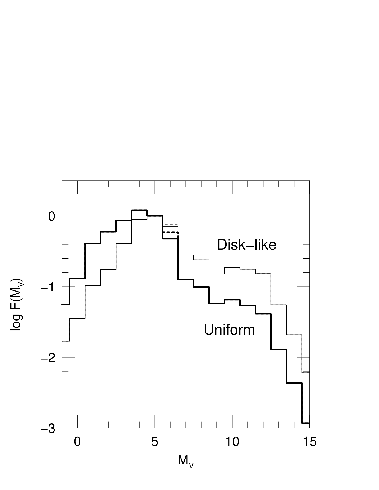
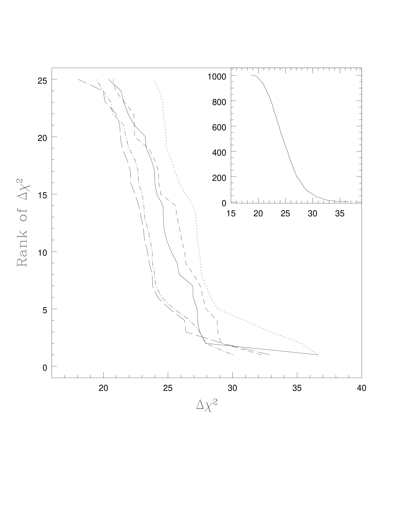

# Line-of-Sight Velocity Distribution (LOSVD)

## 1. Mathematical Definition and Convolution Principle

The **Line-of-Sight Velocity Distribution (LOSVD)**, denoted $\mathcal{L}(v)$, is the normalized probability density function that a star located at a projected sky position $(x, y)$ in a galaxy possesses a line-of-sight velocity in the interval $[v, v + dv]$.

$$\int_{-\infty}^\infty \mathcal{L}(v) \, dv = 1$$

Each star in the galaxy emits a stellar spectrum Doppler-shifted by its individual line-of-sight velocity $v$. The observed integrated galaxy spectrum $G(\lambda)$ is the flux-weighted convolution of an unbroadened stellar template spectrum $T(\lambda)$ with the LOSVD.

$$G(\lambda) = [T * \mathcal{L}](\lambda) = \int_{-\infty}^\infty T\left(\lambda \left[1 - \frac{v}{c}\right]\right) \mathcal{L}(v) \, dv$$

In logarithmic wavelength coordinates $x \equiv \ln \lambda$, the Doppler shift is a pure translation $\Delta x \approx v/c$, turning the integral into a standard linear convolution.

$$G(x) = \int_{-\infty}^\infty T(x - s) \, \mathcal{L}(c \cdot s) \, ds$$

---

## 2. Unbroken Mathematical Formulation - The Gauss-Hermite Series Expansion

Real galaxies rarely possess purely Gaussian velocity distributions due to orbital anisotropy, rotating disks, triaxiality, and central mass concentrations. To quantify subtle non-Gaussian shapes, the LOSVD is expanded as a Gauss-Hermite series (van der Marel & Franx 1993; Gerhard 1993).

$$\boxed{\mathcal{L}(v) = \frac{\gamma}{\sqrt{2\pi}\sigma} \exp\left(-\frac{y^2}{2}\right) \left[ 1 + \sum_{m=3}^M h_m H_m(y) \right]}$$

where the dimensionless velocity coordinate is.

$$y \equiv \frac{v - V}{\sigma}$$

Here.
- $V$ is the centroid velocity (mean line-of-sight velocity)
- $\sigma$ is the line-of-sight velocity dispersion
- $\gamma$ is the total line strength normalization
- $H_m(y)$ are orthogonal Hermite polynomials
- $h_m$ are dimensionless Gauss-Hermite moment coefficients

### Orthonormality Condition
The Hermite polynomials are normalized such that they form an orthonormal set with respect to the Gaussian weight function $w(y) = \frac{1}{\sqrt{2\pi}} e^{-y^2/2}$.

$$\frac{1}{\sqrt{2\pi}} \int_{-\infty}^\infty e^{-y^2/2} H_m(y) H_n(y) \, dy = \delta_{mn}$$

### Explicit Polynomial Definitions
The lowest-order polynomials are explicitly.

$$H_0(y) = 1$$

$$H_1(y) = \sqrt{2} y$$

$$H_2(y) = \frac{1}{\sqrt{2}} (2y^2 - 1)$$

$$H_3(y) = \frac{1}{\sqrt{6}} (2\sqrt{2} y^3 - 3\sqrt{2} y)$$

$$H_4(y) = \frac{1}{\sqrt{24}} (4y^4 - 12y^2 + 3)$$

### The Zero Conditions for $h_1$ and $h_2$
In practical kinematic fits, the parameters $V$ and $\sigma$ are chosen precisely such that they optimize the centroid and width of the best-fitting Gaussian profile. Consequently.

$$h_1 \equiv 0, \qquad h_2 \equiv 0$$

The lowest-order non-trivial shape deviations are therefore completely parameterized by the third moment $h_3$ and the fourth moment $h_4$.

---

## 3. Physical Meaning of the Kinematic Moments

### The Skewness Moment $h_3$ (Asymmetry)
The third coefficient $h_3$ measures the asymmetric skewness of the velocity distribution.
- $h_3 > 0$ denotes a distribution with an extended tail toward velocities higher than $V$
- $h_3 < 0$ denotes a distribution with an extended tail toward velocities lower than $V$
- In rotating galaxy bulges and disks, observations consistently uncover an anti-correlation between rotation velocity and skewness ($V \cdot h_3 < 0$). This physical signature arises when an embedded, rapidly rotating cold stellar disk is superposed on a slowly rotating, pressure-supported spheroidal bulge. The peak of the distribution reflects the cold rotating disk, while the tail stretches back toward the galaxy systemic velocity.

### The Kurtosis Moment $h_4$ (Peakiness and Wings)
The fourth coefficient $h_4$ measures the symmetric tail heaviness and central peakiness (kurtosis).
- $h_4 > 0$ (Leptokurtic) - Indicates a distribution that is more sharply peaked than a Gaussian with broader, extended power-law wings. Physically, positive $h_4$ indicates radial stellar orbit anisotropy ($\beta \equiv 1 - \sigma_\theta^2/\sigma_r^2 > 0$) or the gravitational presence of a central supermassive black hole cusp.
- $h_4 < 0$ (Platykurtic) - Indicates a distribution that is flat-topped with steep cutoff wings. Physically, negative $h_4$ indicates tangential stellar orbit anisotropy ($\beta < 0$) or an inclined rotating disk.

### The Observational Danger of Naive Gaussian Fitting
If a galaxy profile exhibits positive kurtosis ($h_4 > 0$), fitting a single simple Gaussian forces the algorithm to compromise between the narrow central peak and the extended wings.
1. The fitted Gaussian width overestimates the peak width but underestimates the true extent of the wings.
2. The inferred central velocity dispersion $\sigma$ is systematically distorted.
3. Dynamical modeling (Jeans modeling or Schwarzschild orbit superposition) requires unbiased higher moments. Neglecting $h_3$ and $h_4$ biases dynamical black hole mass determinations by up to a factor of two.

---

## 4. Extraction Technique - Penalized Pixel-Fitting (pPXF)

Modern stellar kinematics are extracted from galaxy spectra using the **pPXF** method (Cappellari & Emsellem 2004; Cappellari 2017).
1. A linear combination of optimal stellar population templates is constructed to eliminate template mismatch.
2. The templates are convolved with a Gauss-Hermite parameterized LOSVD.
3. The fit minimizes a penalized chi-squared.
   $$\chi_{\rm pen}^2 = \chi^2 \left( 1 + \lambda^2 \sum_{m=3}^M h_m^2 \right)$$
   where the penalty parameter $\lambda$ biases the higher moments toward zero when the observational signal-to-noise ratio is insufficient to justify non-zero skewness or kurtosis.

---

## 5. Blackboard Observational Blueprint

When illustrating LOSVD profiles on the blackboard.

```text
       L(v)
        |
        |              *             === Pure Gaussian (h3=0, h4=0)
        |             / \            ... Leptokurtic (h4 > 0). Sharp peak + broad wings
        |            /   \           === Platykurtic (h4 < 0). Flat top + steep cutoff
        |           /  |  \
        |          /   |   \
        |         /    |    \
        +========+=====+=====+=========> v
                 -1    0    +1
                       y = (v - V)/sigma

   Asymmetric Skewness (h3).
        |             *
        |            / \
        |           /   \
        |          /     \.......    h3 > 0 - High-velocity tail extends to the right
        +=========+======-+======+=====> v
                 -1       0     +1
```

### Key Blackboard Features
- **Horizontal Axis** - Dimensionless velocity $y = (v - V)/\sigma$ centered at $0$
- **Vertical Axis** - Probability density $\mathcal{L}(v)$
- **Gaussian Comparison** - Draw the standard bell curve ($h_3 = 0, h_4 = 0$) as reference
- **Kurtosis Features** - Draw $h_4 > 0$ with a sharper central peak and higher tails at $|y| > 2$; draw $h_4 < 0$ with a rounded/flattened top and rapid decay
- **Skewness Features** - Draw $h_3 > 0$ with a steep left edge and a long right-hand trailing wing

---

## 6. Textbook and Course Citations

- **Prof. Alessandro Pizzella Course Dispensa**
  - File - `dispense_smbh_20_eng.pdf`
  - Chapter 2, Section 2.3 "The Line-of-Sight Velocity Distribution", pages 17-20 (complete mathematical derivation of the Gauss-Hermite expansion, orthogonality proofs, and physical meaning of $h_3, h_4$).
- **Student Synthesis Document**
  - File - `SMBH_in_Galaxies.tex`
  - Section 8 "Stellar Kinematics and LOSVD", pages 10-12 (Gauss-Hermite formulas, pPXF implementation, orbit anisotropy connection).
- **Binney & Tremaine (2008), *Galactic Dynamics***
  - File - `Binney, Tremaine - Galactic Dynamics 2ed.pdf`
  - Chapter 4, Section 4.5 "Stellar Kinematics", pages 340-355 (Jeans modeling, line-of-sight velocity distributions, Gauss-Hermite moments).
- **Primary Literature Reference**
  - van der Marel, R. P., & Franx, M. 1993, ApJ, 407, 525.
  - Cappellari, M., & Emsellem, E. 2004, PASP, 116, 138.

---

## 7. See Also

- [[Velocity dispersion from line width]]
- [[Stellar dynamics SMBH masses]]
- [[M sigma relation]]
- [[Fundamental plane of ellipticals]]
- [[Faber-Jackson relation]]
- [[MaNGA survey]]
- [[Integral-field spectroscopy IFU]]
- [[Astrophysics_of_Galaxies_MOC]]

---

## 8. Astrophysics of Galaxies Figures and Slides (Prof. Alessandro Pizzella)


*Kinematic mapping of line-of-sight velocity distribution (LOSVD) from Cappellari et al. (2002).*


*Gauss-Hermite kinematic moments (v, sigma, h3, h4) across elliptical galaxy centers.*


*Line-of-Sight Velocity Distribution (LOSVD) definition - probability density of stellar velocities along line of sight.*


## Linked References

- [[Dark matter in elliptical galaxies]]
- [[Faber-Jackson relation]]
- [[Integral-field spectroscopy IFU]]
- [[MaNGA survey]]
- [[Stellar dynamics SMBH masses]]
- [[Stellar kinematics measurements]]
- [[Astrophysics_of_Galaxies_MOC]]


