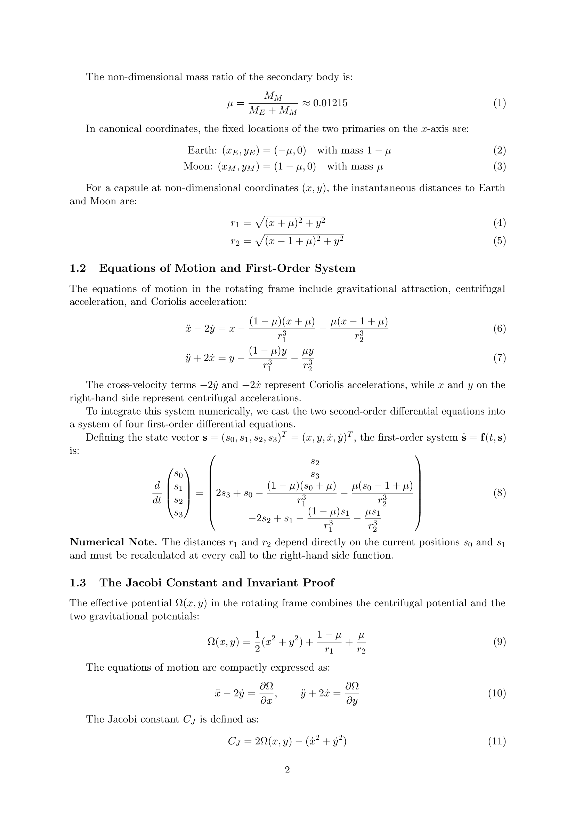
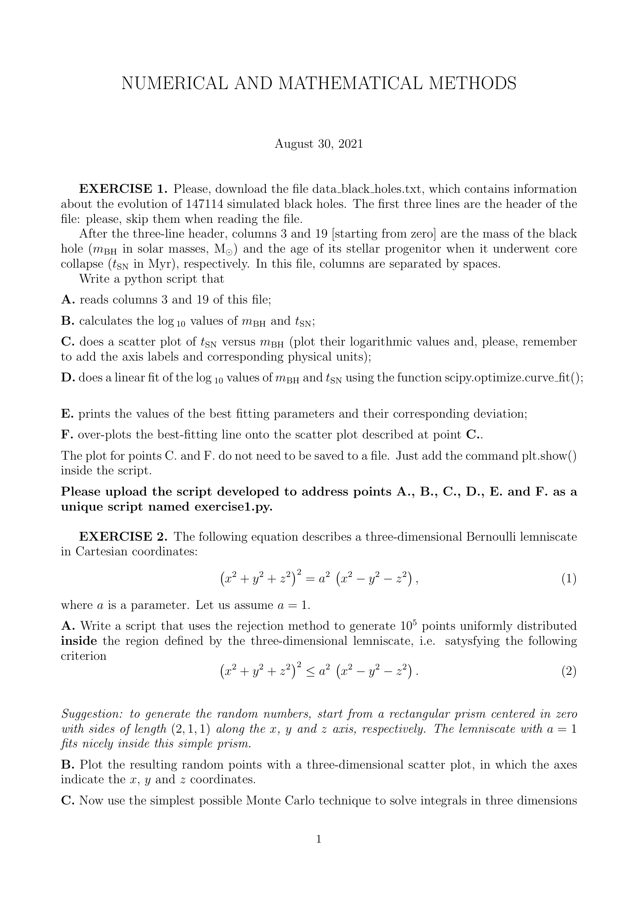


# Leapfrog integrator

a second-order, **symplectic** integrator for Hamiltonian systems. positions and velocities are evolved on staggered (interleaved) time grids — they "leap over" each other. for Hamiltonian dynamics it is the gold standard for long-time integrations because it does not have the secular energy drift of RK methods.

## the equations

for the standard Hamiltonian system $\dot{\mathbf{r}} = \mathbf{v}$, $\dot{\mathbf{v}} = \mathbf{a}(\mathbf{r})$ (force depends only on position), the **drift-kick-drift** form is:

$$\mathbf{r}_{n+1/2} = \mathbf{r}_n + \tfrac{h}{2} \mathbf{v}_n$$
$$\mathbf{v}_{n+1} = \mathbf{v}_n + h\, \mathbf{a}(\mathbf{r}_{n+1/2})$$
$$\mathbf{r}_{n+1} = \mathbf{r}_{n+1/2} + \tfrac{h}{2} \mathbf{v}_{n+1}$$

three operations per step. the equivalent **kick-drift-kick** form swaps the order:

$$\mathbf{v}_{n+1/2} = \mathbf{v}_n + \tfrac{h}{2}\mathbf{a}(\mathbf{r}_n)$$
$$\mathbf{r}_{n+1} = \mathbf{r}_n + h\,\mathbf{v}_{n+1/2}$$
$$\mathbf{v}_{n+1} = \mathbf{v}_{n+1/2} + \tfrac{h}{2}\mathbf{a}(\mathbf{r}_{n+1})$$

both forms are mathematically equivalent and second-order accurate.

## why "leapfrog"

if I track *only the half-step quantities*, the formulas become:

$$\mathbf{r}_{n+1} = \mathbf{r}_n + h \mathbf{v}_{n+1/2}$$
$$\mathbf{v}_{n+3/2} = \mathbf{v}_{n+1/2} + h \mathbf{a}(\mathbf{r}_{n+1})$$

so $\mathbf{r}$ lives on integer time steps $\{0, 1, 2, \ldots\}$ and $\mathbf{v}$ on half-integer steps $\{1/2, 3/2, 5/2, \ldots\}$. they leap over each other in time. this staggered structure is what makes leapfrog symplectic.

## what symplectic means in practice

symplectic integrators preserve a *modified* Hamiltonian $\tilde H = H + h^p \tilde V + \cdots$, not the true $H$. but $\tilde H - H$ is bounded, so:

- **the energy oscillates around the true value** with bounded amplitude $O(h^p)$
- **there is no secular drift**: integrating for $10^6$ orbits gives the same energy error as integrating for 10 orbits
- **other invariants** (angular momentum, in problems with rotational symmetry) are also preserved exactly or to high order

contrast with non-symplectic integrators (Euler, RK4):

| integrator | energy after $N$ steps |
|---|---|
| Euler | exponentially growing (orbit spirals out) |
| RK4 | linearly drifting (small but accumulates) |
| **leapfrog** | **bounded oscillation, no drift** |

this is *the* reason leapfrog is the integrator of choice for the solar system, for cosmological N-body, for molecular dynamics, for any long-time Hamiltonian simulation.

## python implementation (drift-kick-drift)

```python
def leapfrog(a_func, r0, v0, t0, t_end, h):
    """a_func(r, t) returns acceleration. r0, v0 are initial position and velocity."""
    n_steps = int((t_end - t0) / h)
    r = np.zeros((n_steps + 1, len(r0)))
    v = np.zeros((n_steps + 1, len(v0)))
    t = np.zeros(n_steps + 1)
    r[0], v[0], t[0] = r0, v0, t0
    for i in range(n_steps):
        r_half = r[i] + 0.5 * h * v[i]
        a_half = a_func(r_half, t[i] + 0.5*h)
        v[i+1] = v[i] + h * a_half
        r[i+1] = r_half + 0.5 * h * v[i+1]
        t[i+1] = t[i] + h
    return t, r, v
```

## limitations

- **only works for separable Hamiltonians** $H = T(\mathbf{p}) + V(\mathbf{q})$. velocity-dependent forces (magnetic, drag) need a more general scheme
- **fixed timestep is constraining**: adapting timestep breaks the symplectic property unless done carefully (variable-step symplectic schemes exist but are more complex)
- **second-order only**: for very high accuracy, fourth-order or higher symplectic schemes (Forest-Ruth, Yoshida) trade more cost for higher order

## comparison plot — the canonical demonstration

run a Kepler orbit ($\mathbf{a} = -GM\hat{\mathbf{r}}/r^2$) for 100 periods with three integrators at the same timestep:

- **Euler**: orbit spirals outward, energy grows exponentially, plot $E(t)$ on a *log scale* to see it
- **RK4**: orbit slowly drifts, energy linearly creeps
- **leapfrog**: orbit closes on itself, energy oscillates with bounded amplitude

this is *the* standard exam demonstration for "why symplectic matters." for an exam exercise asking to integrate an N-body system, leapfrog is almost always the right choice if symplecticity is mentioned or implied.

## relation to Verlet integration

in molecular dynamics, the same algorithm is called **Verlet integration**:

$$\mathbf{r}_{n+1} = 2\mathbf{r}_n - \mathbf{r}_{n-1} + h^2 \mathbf{a}(\mathbf{r}_n)$$

this is leapfrog with the velocity eliminated (it is recoverable from differences of positions). algebraically equivalent, sometimes preferred for thermodynamic accuracy.

## astrophysics use cases

- **N-body simulations**, both collisional (globular clusters) and collisionless (galaxies, cosmology)
- **planetary system integration** over Gyr timescales
- **WKB-method approximate quantum dynamics**
- **solar-system longitude planet positions** (modern ephemerides)

## see also

- [Euler method](./Euler%20method.html)
- [Runge-Kutta 4 method](./Runge-Kutta%204%20method.html)
- [Energy conservation as a diagnostic](./Energy%20conservation%20as%20a%20diagnostic.html)
- [Astrophysical N-body problem formulation](./Astrophysical%20N-body%20problem%20formulation.html)
- [Fourth-order Hermite predictor-corrector](./Fourth-order%20Hermite%20predictor-corrector.html) — symplectic-ish, higher-order
- [Mathematical_Numerical_Methods_MOC](../../04_Atlas/Mathematical_Numerical_Methods_MOC.html)

---

### Numerical Methods & Algorithmic Diagnostics


*Exam Model Solution: Kick-Drift-Kick (KDK) and Drift-Kick-Drift (DKD) Leapfrog formulations, time-reversibility, and symplectic phase space volume preservation (Liouville theorem).*



*Official Exam Paper (30 Aug 2021): Symplectic integrator properties and derivation of bounded energy oscillations without secular secular drift.*


<div class="backlinks-section">
  <h4 class="backlinks-title">Linked References (12)</h4>
  <ul class="backlinks-list">
    <li class="backlink-item-wrap"><a href="./Astrophysical%20N-body%20problem%20formulation.html" class="backlink-item">Astrophysical N-body problem formulation</a></li>
    <li class="backlink-item-wrap"><a href="./Bulirsch-Stoer%20extrapolation.html" class="backlink-item">Bulirsch-Stoer extrapolation</a></li>
    <li class="backlink-item-wrap"><a href="./Collisional%20vs%20collisionless%20N-body.html" class="backlink-item">Collisional vs collisionless N-body</a></li>
    <li class="backlink-item-wrap"><a href="./Energy%20conservation%20as%20a%20diagnostic.html" class="backlink-item">Energy conservation as a diagnostic</a></li>
    <li class="backlink-item-wrap"><a href="./Euler%20method.html" class="backlink-item">Euler method</a></li>
    <li class="backlink-item-wrap"><a href="./Fourth-order%20Hermite%20predictor-corrector.html" class="backlink-item">Fourth-order Hermite predictor-corrector</a></li>
    <li class="backlink-item-wrap"><a href="./Initial%20value%20vs%20boundary%20value%20problems.html" class="backlink-item">Initial value vs boundary value problems</a></li>
    <li class="backlink-item-wrap"><a href="../../04_Atlas/Mathematical_Numerical_Methods_MOC.html" class="backlink-item">Mathematical_Numerical_Methods_MOC</a></li>
    <li class="backlink-item-wrap"><a href="./N-body%20with%20Euler%20vs%20midpoint%20vs%20leapfrog.html" class="backlink-item">N-body with Euler vs midpoint vs leapfrog</a></li>
    <li class="backlink-item-wrap"><a href="./Runge-Kutta%202%20midpoint%20method.html" class="backlink-item">Runge-Kutta 2 midpoint method</a></li>
    <li class="backlink-item-wrap"><a href="./Runge-Kutta%204%20method.html" class="backlink-item">Runge-Kutta 4 method</a></li>
    <li class="backlink-item-wrap"><a href="./Systems%20of%20ODEs%20and%20higher-order%20ODEs.html" class="backlink-item">Systems of ODEs and higher-order ODEs</a></li>
  </ul>
</div>
