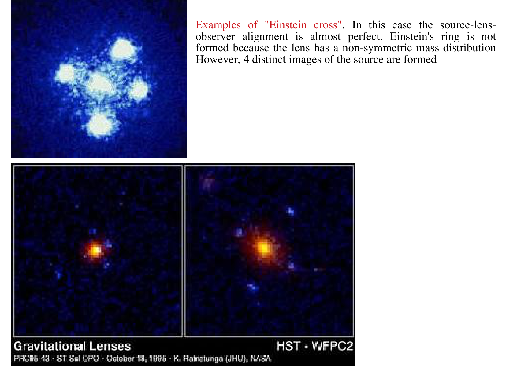
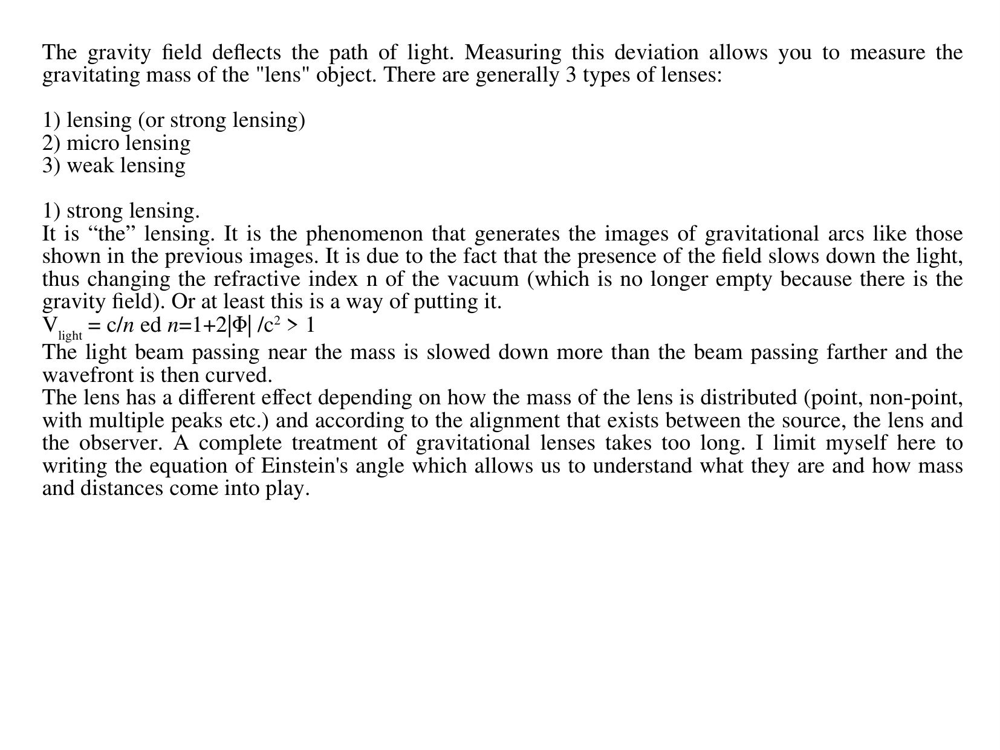
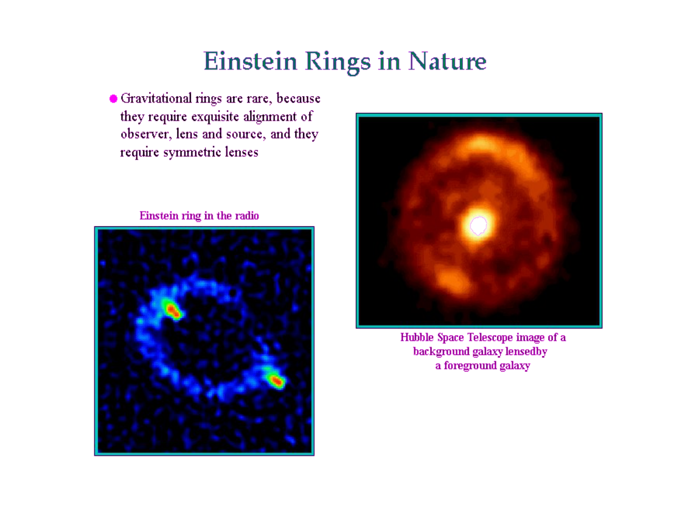
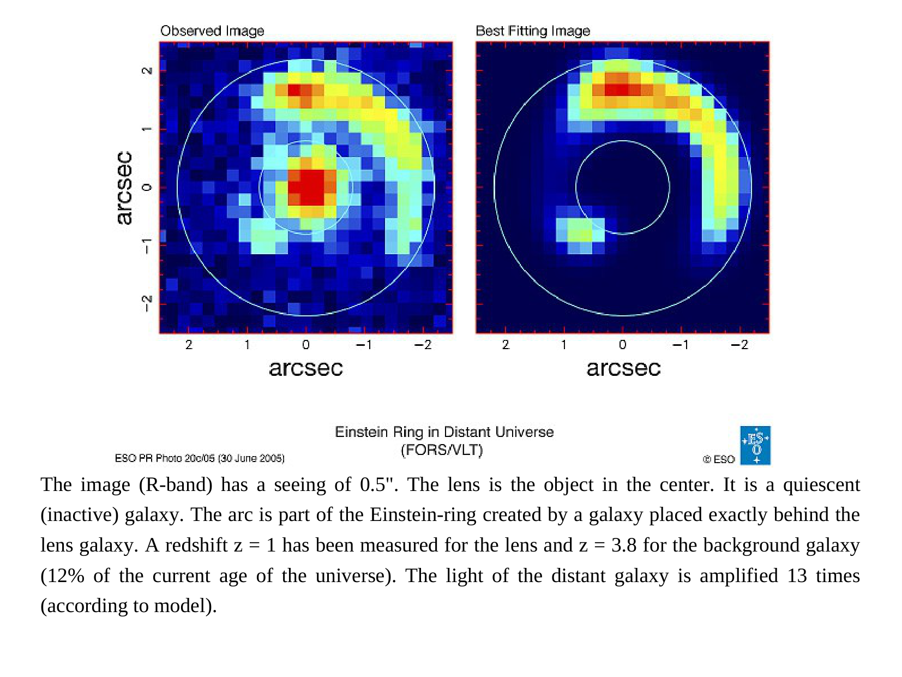
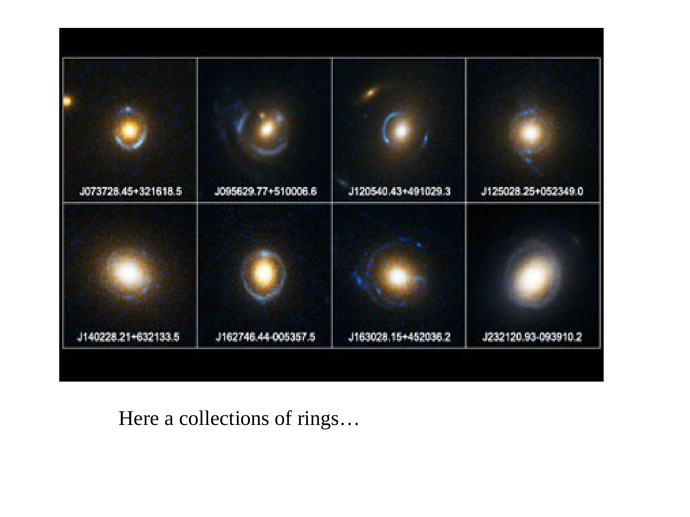
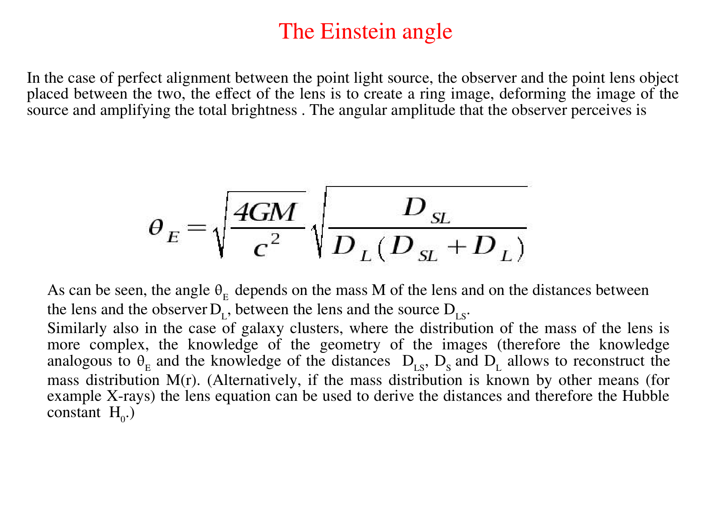
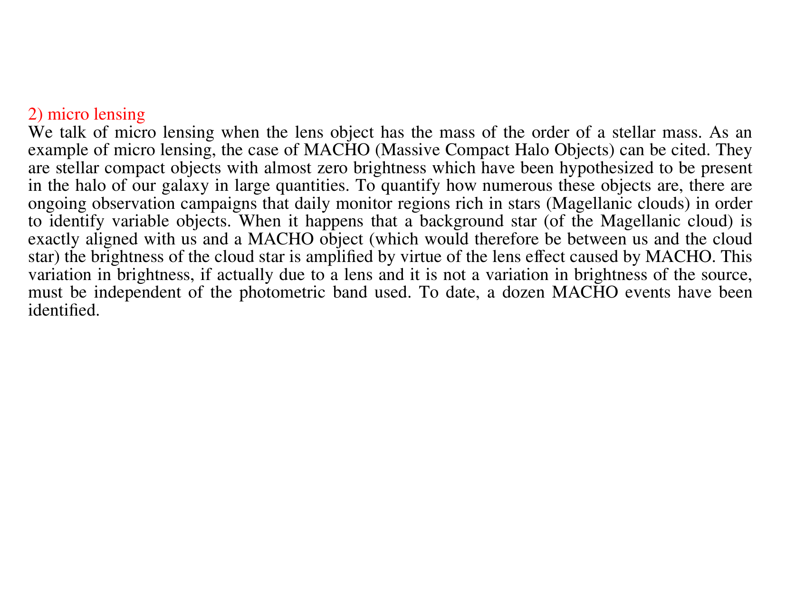
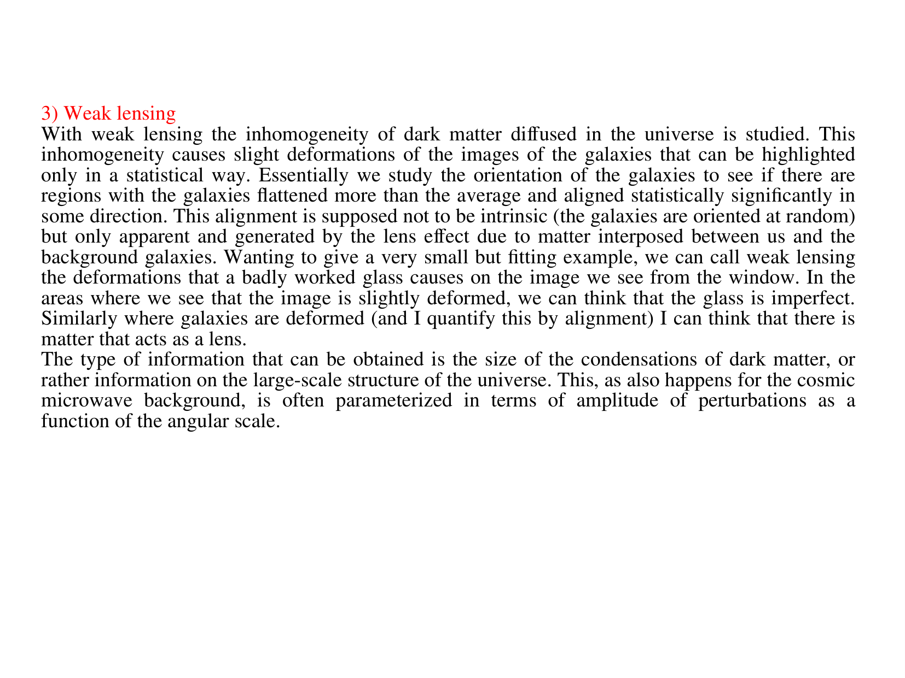


gravitational lensing is a key cosmological probe of **dark matter**, **dark energy**, and **$H_0$**. independent of (and complementary to) CMB and galaxy clustering. depending on regime + observable, it constrains different physics.

## what lensing measures

### dark matter
since lensing depends on **total mass** (not just luminous matter), it directly measures **dark matter** distribution. classic example: the **Bullet Cluster** (1E 0657-558). collision of two clusters separated baryonic gas (X-ray emitting) from the dark matter halos (lensing-detected). gas at the centre, dark matter offset to either side. **direct evidence** for collisionless dark matter.

### large-scale structure
weak-lensing surveys map the **dark matter distribution** on cosmological scales. constraints on:
- $\Omega_m$ (matter density).
- $\sigma_8$ (clustering amplitude on $8\,h^{-1}$ Mpc scales).
- $S_8 \equiv \sigma_8\sqrt{\Omega_m/0.3}$, the lensing-tightest combination.

current values from DES + KiDS: $S_8 \approx 0.78$ to $0.80$, slightly **lower** than Planck $\Lambda$CDM $S_8 \approx 0.83$. modest tension (the "$S_8$ tension"), an unresolved issue in cosmology.

### dark energy + dark matter ratios
weak-lensing tomography slices the universe into redshift bins. lensing strength at each redshift depends on $\Omega_m, \Omega_\Lambda, w$. fitting all bins constrains the dark-energy equation of state.

### $H_0$ via time delays

multiply-lensed quasars produce **time delays** between images, since photons take different paths through the lens. delays scale as:
$$\Delta t \propto d_L^{-1}\,(1+z_L)\,(\text{geometric factor})$$

with $d_L$ proportional to $1/H_0$. so $\Delta t \propto 1/H_0$. measuring $\Delta t$ + lens model gives $H_0$.

modern: **TDCOSMO** consortium uses 6+ lensed quasars, gives $H_0 = 73 \pm 2$ km/s/Mpc, consistent with the local SH0ES value but in tension with Planck.

### CMB lensing
the CMB itself is gravitationally lensed by the intervening LSS! observable as **B-mode polarisation** + spectral distortions. Planck + ACT + SPT measure this. constrains $\sigma_8$ + $\sum m_\nu$.

## strong-lens cosmology: the time-delay $H_0$

procedure:
1. measure time delay $\Delta t$ between multiple images.
2. construct a detailed lens model from image positions + galaxy mass profile.
3. compute $H_0$.

precision: per-system $\sim 10\%$, ensemble $\sim 2\%$ to $3\%$. competitive with CMB-anchored values.

## weak-lens cosmology

procedure:
1. observe $\sim 10^9$ galaxies in deep imaging.
2. measure each galaxy's ellipticity (sheared by intervening LSS).
3. compute shear power spectrum $C_\ell^{\gamma\gamma}$ as a function of angular scale.
4. fit cosmological model to recover $\Omega_m, \sigma_8, w$.

major surveys: DES, KiDS, HSC. soon: Euclid, LSST, Roman.

## the science cases

- **dark-matter mapping**: lensing reveals where dark matter is, how it's distributed, whether it's clumpy or smooth.
- **dark-energy constraints**: lensing tomography sensitive to $w(z)$.
- **modified gravity**: lensing is sensitive to the deflection of null geodesics; comparison with growth-of-structure tests $\sim$ scalar / tensor modifications.
- **galaxy formation**: lensing of high-$z$ galaxies by foreground clusters magnifies and reveals otherwise-invisible early galaxies (Hubble Frontier Fields, JWST).

## see also

- Gravitational lensing — intro
- [Strong vs weak lensing](./Strong%20vs%20weak%20lensing.html)
- [Light deflection](./Light%20deflection.html)
- [Cosmic_inventory_dark_matter](./Cosmic_inventory_dark_matter.html)
- [Cosmic_inventory_dark_energy](./Cosmic_inventory_dark_energy.html)
- [ΛCDM current parameters](./%CE%9BCDM%20current%20parameters.html)
- [CMB power spectrum](./CMB%20power%20spectrum.html)
- [Hubble law](./Hubble%20law.html)
- [Observational_Cosmology_MOC](../../04_Atlas/Observational_Cosmology_MOC.html)

---

## lecture slides and reference figures (Prof. Alessandro Pizzella)



  <h4 class="backlinks-title">Linked References (9)</h4>
  <ul class="backlinks-list">
    <li class="backlink-item-wrap"><a href="../../04_Atlas/Astrophysics_of_Galaxies_MOC.html" class="backlink-item">Astrophysics_of_Galaxies_MOC</a></li>
    <li class="backlink-item-wrap"><a href="./Bullet%20Cluster%20and%20dark%20matter%20mapping.html" class="backlink-item">Bullet Cluster and dark matter mapping</a></li>
    <li class="backlink-item-wrap"><a href="./Dark%20matter%20in%20elliptical%20galaxies.html" class="backlink-item">Dark matter in elliptical galaxies</a></li>
    <li class="backlink-item-wrap"><a href="./Dark%20matter%20rotation%20curves.html" class="backlink-item">Dark matter rotation curves</a></li>
    <li class="backlink-item-wrap"><a href="./Gravitational%20lensing%20-%20intro.html" class="backlink-item">Gravitational lensing - intro</a></li>
    <li class="backlink-item-wrap"><a href="./Light%20deflection.html" class="backlink-item">Light deflection</a></li>
    <li class="backlink-item-wrap"><a href="./MOND.html" class="backlink-item">MOND</a></li>
    <li class="backlink-item-wrap"><a href="../../04_Atlas/Observational_Cosmology_MOC.html" class="backlink-item">Observational_Cosmology_MOC</a></li>
    <li class="backlink-item-wrap"><a href="./Strong%20vs%20weak%20lensing.html" class="backlink-item">Strong vs weak lensing</a></li>
  </ul>

