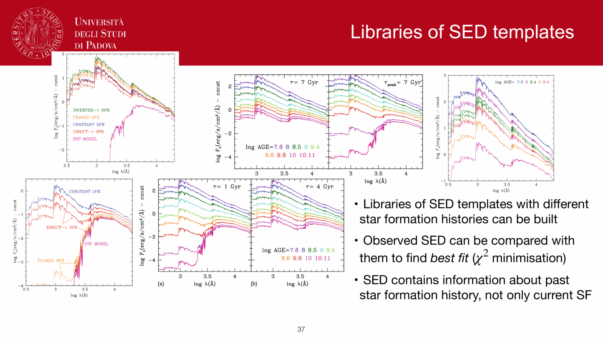
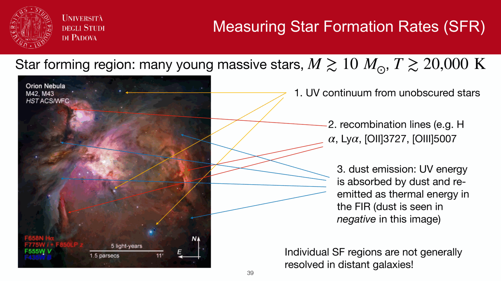
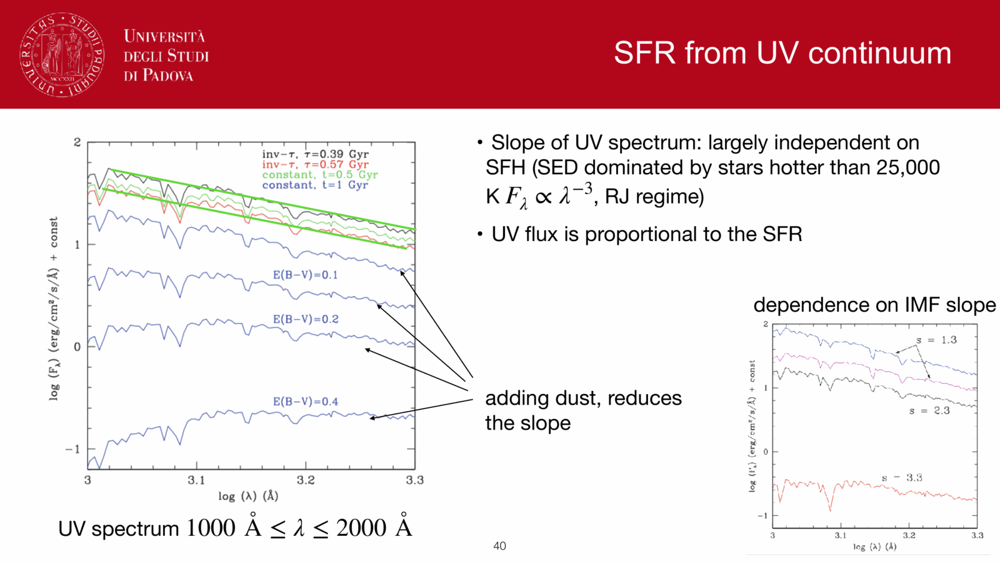

the **Lick/IDS index system** (Burstein et al. 1984; Worthey et al. 1994; Worthey & Ottaviani 1997) is a standardized set of narrow-band spectral indices measuring atomic absorption lines and molecular bands in integrated stellar and galaxy spectra. By targeting features with distinct physical sensitivities, Lick indices decouple the **age-metallicity degeneracy** that plagues broadband photometry of early-type galaxies and globular clusters.

---

### mathematical definition

a Lick index is measured using a central **feature bandpass** $[\lambda_1, \lambda_2]$ flanked by two adjacent **pseudo-continuum bandpasses**: a blue band $[\lambda_{B1}, \lambda_{B2}]$ and a red band $[\lambda_{R1}, \lambda_{R2}]$.

the local pseudo-continuum flux $F_{\rm cont}(\lambda)$ across the feature is established by linear interpolation between the mean fluxes in the two continuum windows:

$$F_B = \frac{1}{\lambda_{B2} - \lambda_{B1}} \int_{\lambda_{B1}}^{\lambda_{B2}} F(\lambda)\,d\lambda, \qquad F_R = \frac{1}{\lambda_{R2} - \lambda_{R1}} \int_{\lambda_{R1}}^{\lambda_{R2}} F(\lambda)\,d\lambda$$

indices are expressed in two distinct units depending on whether they measure atomic lines or broad molecular absorption:

1. **atomic absorption lines (equivalent width in Å)**:
   $$\mathrm{EW} = \int_{\lambda_1}^{\lambda_2} \left( 1 - \frac{F_{\rm obs}(\lambda)}{F_{\rm cont}(\lambda)} \right) d\lambda$$

2. **molecular bands (magnitudes)**:
   $$\mathrm{Index} = -2.5 \log_{10} \left[ \frac{1}{\lambda_2 - \lambda_1} \int_{\lambda_1}^{\lambda_2} \frac{F_{\rm obs}(\lambda)}{F_{\rm cont}(\lambda)} \, d\lambda \right]$$

---

### primary diagnostic indices

over 25 classical indices (and modern extensions like higher-order Balmer lines) are cataloged:

| index | central window (Å) | units | physical sensitivity | astrophysical diagnostic role |
|---|---|---|---|---|
| **$\mathrm{H}\beta$** | $4847.875\text{--}4876.625$ | Å | **age** | Peaks in A-type turn-off stars ($T_{\rm eff} \sim 9000$ K); insensitive to metallicity |
| **$\mathrm{H}\delta_A, \mathrm{H}\delta_F$** | $4083.50\text{--}4122.25$ | Å | **age** | Higher-order Balmer line; ideal for post-starburst / A-star identification |
| **$\mathrm{H}\gamma_A, \mathrm{H}\gamma_F$** | $4319.75\text{--}4363.50$ | Å | **age** | Higher-order Balmer line; less sensitive to nebular emission infill than $\mathrm{H}\beta$ |
| **$\mathrm{Mg}_b$** | $5160.125\text{--}5192.625$ | Å | **$\alpha$-elements** (Mg) | Dominant triplet in cool giant atmospheres; sensitive to $[\alpha/\mathrm{Fe}]$ |
| **$\mathrm{Mg}_2$** | $5154.125\text{--}5196.625$ | mag | **$\alpha$-elements** + total $Z$ | Molecular $\mathrm{MgH} + \mathrm{Mg}_b$ blend; strong in metal-rich systems |
| **$\mathrm{Fe5270}$** | $5245.65\text{--}5285.65$ | Å | **iron peak** (Fe) | Pure Fe-peak tracker; insensitive to $\alpha$-enhancement |
| **$\mathrm{Fe5335}$** | $5312.125\text{--}5352.125$ | Å | **iron peak** (Fe) | Pure Fe-peak tracker; paired with $\mathrm{Fe5270}$ |
| **$\mathrm{G4300}$** | $4281.375\text{--}4316.375$ | Å | Carbon / CH molecular band | Traces carbon abundance and intermediate-age stars |

---

### breaking the age-metallicity degeneracy

in optical colors, an old, metal-poor population matches a young, metal-rich population (Worthey's $3/2$ rule). In Lick index space, this degeneracy is resolved because:
- **Balmer lines ($\mathrm{H}\beta, \mathrm{H}\gamma, \mathrm{H}\delta$)** depend primarily on the effective temperature of the main-sequence turnoff, tracking **age** with minimal dependence on metallicity.
- **Metal lines ($\mathrm{Mg}_b, \mathrm{Fe5270}, \mathrm{Fe5335}$)** depend primarily on line opacity in cool giant atmospheres, tracking **metallicity**.

#### composite metallicity indices and $[\alpha/\mathrm{Fe}]$

because elliptical galaxies show non-solar $[\alpha/\mathrm{Fe}] > 0$ ratios, individual Fe or Mg indices give discordant metallicities. Thomas, Maraston & Bender (2003) defined the composite index $[\mathrm{MgFe}]'$:

$$[\mathrm{MgFe}]' \equiv \sqrt{\mathrm{Mg}_b \cdot (0.72\,\mathrm{Fe5270} + 0.28\,\mathrm{Fe5335})}$$

$[\mathrm{MgFe}]'$ is completely independent of $[\alpha/\mathrm{Fe}]$ variations and serves as an unbiased proxy for total metallicity $[Z/\mathrm{H}]$.

plotting $\mathrm{H}\beta$ against $[\mathrm{MgFe}]'$ produces an orthogonal model grid of SSP tracks:
- horizontal lines correspond to constant SSP age ($1, 2, 4, 8, 12$ Gyr).
- vertical lines correspond to constant total metallicity $[Z/\mathrm{H}]$ ($-1.3, -0.33, 0.0, +0.35$).
- measuring the location of an unresolved galaxy on this grid simultaneously yields its luminosity-weighted age and total metallicity.

---

### observational challenges and corrections

to compare observed galaxy spectra to Lick/IDS models, three systematic corrections are mandatory:
1. **spectral resolution matching**:
   - original Lick/IDS spectra had wavelength-dependent resolution FWHM $\approx 8.4\text{--}11.5$ Å.
   - modern higher-resolution spectra (e.g., SDSS at $\sim 2.5$ Å FWHM) must be smoothed by a Gaussian kernel with $\sigma_{\rm smooth}(\lambda) = \sqrt{\sigma_{\rm Lick}^2(\lambda) - \sigma_{\rm obs}^2(\lambda)}$.
2. **velocity dispersion broadening ($\sigma_*$)**:
   - stellar random motions in early-type galaxies Doppler-broaden absorption lines, smearing flux out of the central index window and lowering the measured EW.
   - spectra are corrected via kinematic broadening calibration curves derived by convolving stellar templates with a range of velocity dispersions $\sigma_*$.
3. **nebular emission infill**:
   - ionized gas in star-forming galaxies, LINERs, or cooling flows produces $\mathrm{H}\beta$ emission that directly cancels the stellar $\mathrm{H}\beta$ absorption trough, falsely making the population appear ancient.
   - infill is corrected by spectral fitting (e.g., using **gandalf** or **pPXF**) to measure and subtract pure gas emission lines before computing indices.

---

## see also

- [[Observational_Astrophysics_MOC]]
- [[Stellar_Astrophysics_MOC]]
- [[Age-metallicity degeneracy]]
- [[Stellar population synthesis]]
- [[Single stellar population SSP]]
- [[SPS code families]]
- [[Metallicity and chemical evolution]]
- [[Stellar spectra and spectral classification]]
- [[SED fitting basics]]
- [[Age estimation in unresolved populations]]

---

## observational astrophysics course slides (Prof. Paolo Cassata)

*Lick/IDS index system (Burstein, Faber, Worthey 1984-1994).*

*Definition of pseudo-continuum bandpasses and central feature bandpass.*

*Atomic indices in equivalent width (A) vs molecular indices in magnitudes.*

*Key Lick indices: H-beta (age sensitive), Mg_b (alpha sensitive), Fe5270 and Fe5335 (iron sensitive).*

## Linked References

- [[Age estimation in unresolved populations]]
- [[Age-metallicity degeneracy]]
- [[Metallicity and chemical evolution]]
- [[Single stellar population SSP]]
- [[Stellar population synthesis]]
- [[Observational_Astrophysics_MOC]]

