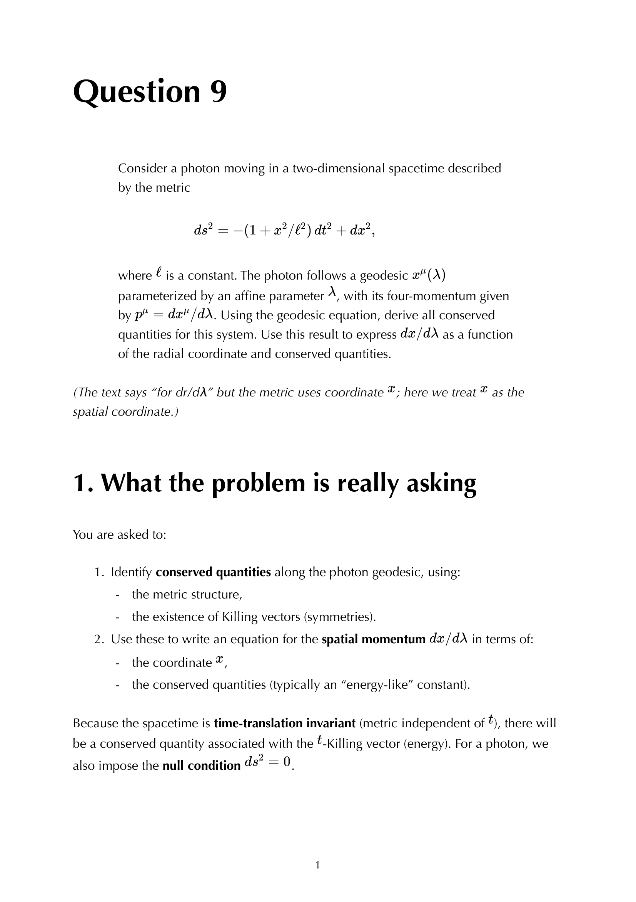
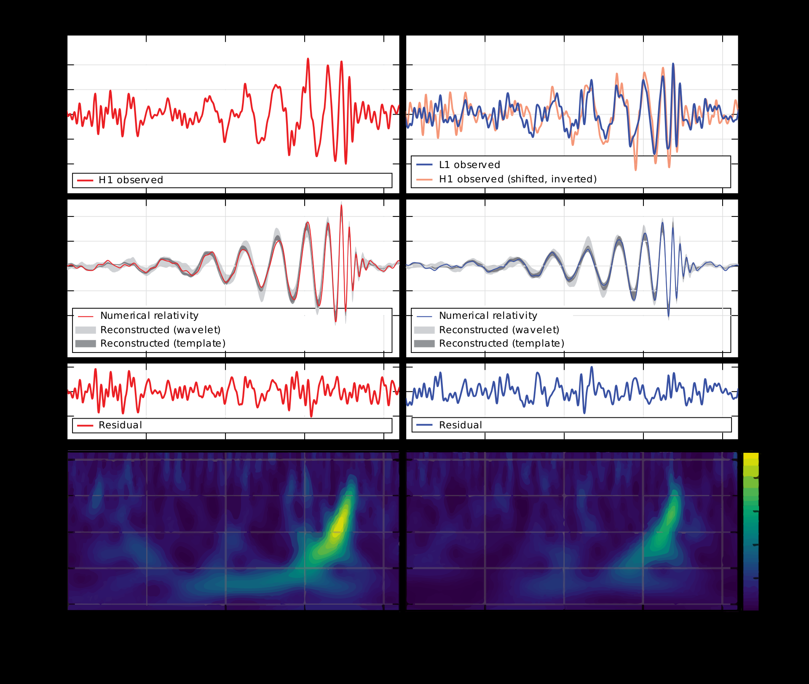

# Light deflection in Schwarzschild

---

### General Relativity Mathematical & Oral Defense Panel

*Question 9 Oral Exam Model Solution: Null geodesics and coordinate speed of light in 2D spacetime $ds^2 = -(1+x^2/\ell^2)dt^2 + dx^2$, integration of coordinate travel time, and horizon formation.*

*Question 13 Oral Exam Model Solution: Schwarzschild photon sphere at $r=3GM$, impact parameter $b_{\rm crit} = 3\sqrt{3}GM$, and weak deflection angle derivation $\Delta\phi = \frac{4GM}{c^2 b}$.*

*Cambridge Lecture Diagram: Light deflection by a massive body and gravitational lensing geometry.*

  <h4 class="backlinks-title">Linked References (1)</h4>
  <ul class="backlinks-list">
    <li class="backlink-item-wrap"><a href="../../04_Atlas/General_Relativity_MOC.html" class="backlink-item">General_Relativity_MOC</a></li>
  </ul>

