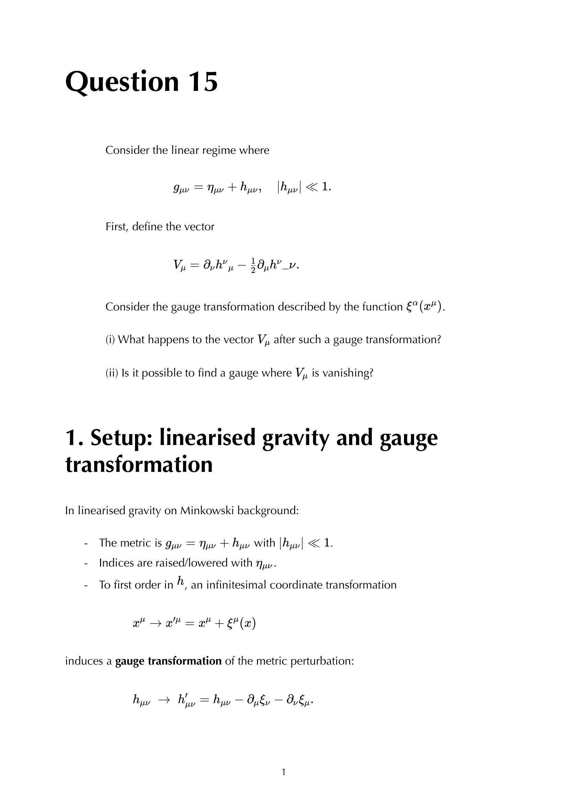

# Linearized gravity and gravitational waves

---

### General Relativity Mathematical & Oral Defense Panel

*Question 15 Oral Exam Model Solution: Linearized Einstein field equations $g_{\mu\nu} = \eta_{\mu\nu} + h_{\mu\nu}$, gauge transformations $h_{\mu\nu} \to h_{\mu\nu} - \partial_\mu \xi_\nu - \partial_\nu \xi_\mu$, trace-reversed perturbation $\bar{h}_{\mu\nu}$, and Lorenz gauge condition $\partial_\mu \bar{h}^{\mu\nu} = 0$.*

  <h4 class="backlinks-title">Linked References (1)</h4>
  <ul class="backlinks-list">
    <li class="backlink-item-wrap"><a href="../../04_Atlas/General_Relativity_MOC.html" class="backlink-item">General_Relativity_MOC</a></li>
  </ul>

