
the **Local Group** is the gravitationally bound system of $\sim 100$ galaxies surrounding the Milky Way + Andromeda. dominated by 3 large spirals, surrounded by dozens of dwarf satellites. our nearest cosmological laboratory.

## the major members

### Milky Way + Andromeda
the **two large spirals**, $\sim 800$ kpc apart, on a collision course in $\sim 4$ Gyr. each $\sim 10^{12}\,M_\odot$ total (including dark halos).

### M33 (Triangulum)
the **third spiral**, smaller ($\sim 5 \times 10^{10}\,M_\odot$). likely a satellite of M31 or independent.

### Magellanic Clouds (LMC, SMC)
**dwarf irregular satellites** of the Milky Way, $\sim 50$ + $60$ kpc away. SMC is undergoing tidal disruption; LMC is on its first infall (recent discovery, $\sim 2010$ via proper motions).

### dwarf spheroidals (dSph)
$\sim 30$+ tiny systems orbiting the MW (Sculptor, Fornax, Carina, Draco, Sextans, Leo I/II, Sagittarius, etc.) + similar number around M31.

each $\sim 10^5$ to $10^7\,M_\odot$ in stars, but **dark-matter-dominated** with $M/L \sim 100$ to $1000$ (vs $\sim 10$ for the MW).

### ultra-faint dwarfs
discovered in SDSS + DES + LSST. $\sim 30$ to $100$ known. some have $M_V > -3$, fainter than a single bright star. all very dark-matter-dominated.

## the major dwarfs

| galaxy | distance (kpc) | $M_V$ | type |
|---|---|---|---|
| LMC | 50 | $-18$ | dIrr |
| SMC | 60 | $-17$ | dIrr |
| Sgr dSph | 16 | $-13$ | dSph (disrupting) |
| Sculptor dSph | 86 | $-11$ | dSph |
| Fornax dSph | 138 | $-13$ | dSph |
| Leo I | 250 | $-12$ | dSph |
| Carina dSph | 100 | $-9$ | dSph |
| Sextans dSph | 86 | $-9$ | dSph |
| Draco dSph | 76 | $-9$ | dSph |
| Bootes I | 60 | $-6$ | UFD |
| Segue 1 | 23 | $-1.5$ | UFD |

(UFD = ultra-faint dwarf.)

## the dynamics

the Local Group is **gravitationally bound** + dynamically active:
- **MW + M31 collision** in $\sim 4$ Gyr. mass distribution will rearrange.
- **dSph orbits** mostly chaotic + radially elongated.
- **stellar streams**: tidal debris from disrupted dwarfs (Sagittarius stream, GD-1, ATLAS, etc.) traced across the sky.
- **dynamical mass**: $M_{LG} \sim 5 \times 10^{12}\,M_\odot$, dominated by halos.

## the importance: a calibrator

the Local Group is the **only place** where we can:
- resolve stellar populations of galaxies in detail (CMDs, individual stellar abundances).
- measure proper motions of dwarf-galaxy stars.
- get precise distances (TRGB, RR Lyrae, eclipsing binaries).
- study dwarf galaxies as **fundamental tests of $\Lambda$CDM**: predicted satellite count ("missing satellites" + "too big to fail").

so the LG is a high-precision calibration sample for cosmology.

## the missing-satellites problem

$\Lambda$CDM N-body simulations predict $\sim 1000$ dark-matter sub-halos around the MW. only $\sim 60$ are observed as luminous dwarfs.

possible solutions:
- **baryonic feedback**: most sub-halos fail to form stars (suppressed by reionisation + supernova feedback).
- **alternative DM**: warm dark matter + self-interacting DM produce fewer sub-halos.
- **observational incompleteness**: more UFDs to be discovered (likely correct).

modern view: combination of all three. JWST + SKA + LSST will help resolve.

## the too-big-to-fail problem

even after baryonic feedback corrections, $\Lambda$CDM predicts $\sim 10$ dwarf galaxies more massive than observed. interpretation contested. resolution: maybe scatter in baryon-DM coupling, or alternative DM.

## the local stellar streams

tidal debris from past dwarf accretions:
- **Sagittarius stream**: from the Sagittarius dwarf, wrapping the entire MW.
- **GD-1, ATLAS, Pal 5 stream**: from globular cluster disruption.
- **Magellanic stream**: trailing the LMC + SMC.

each stream is a fossil record of the MW's accretion history. use Gaia + spectroscopy to trace.

## see also

- [Milky Way structure](./Milky%20Way%20structure.html)
- [Galactic Center Sgr A and S-stars](interf/Galactic%20Center%20Sgr%20A%20and%20S-stars.html)
- [Galaxy clusters and overview of evolution](./Galaxy%20clusters%20and%20overview%20of%20evolution.html)
- [Stellar populations I II III](./Stellar%20populations%20I%20II%20III.html)
- [Cosmic_inventory_dark_matter](./Cosmic_inventory_dark_matter.html)
- [Hubble morphological sequence](./Hubble%20morphological%20sequence.html)
- [Dark matter in dwarf galaxies](./Dark%20matter%20in%20dwarf%20galaxies.html)
- [Astrophysics_of_Galaxies_MOC](../../04_Atlas/Astrophysics_of_Galaxies_MOC.html)

---

## astrophysics of galaxies figures and slides (Prof. Alessandro Pizzella)

*Lecture 5: The Local Group (Prof. Alessandro Pizzella).*

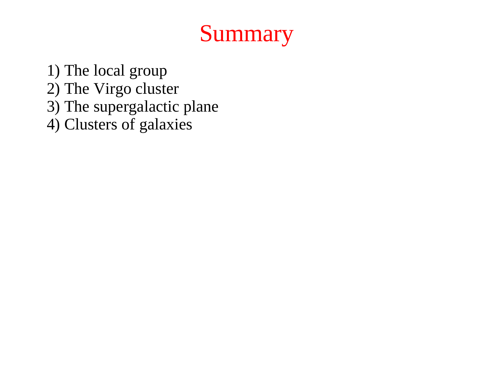
*Architecture of the Local Group: Milky Way and M31 (Andromeda) as dominant spirals.*

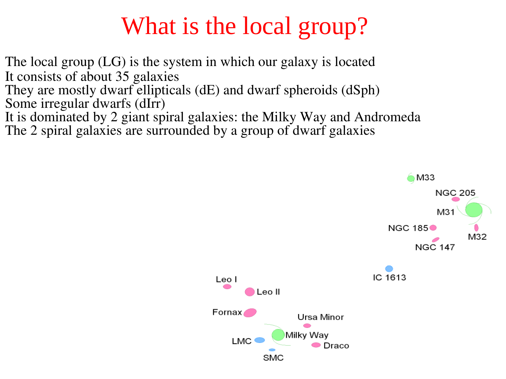
*M33 (Triangulum) and satellite dwarf galaxies (LMC, SMC, Fornax, Sculptor).*

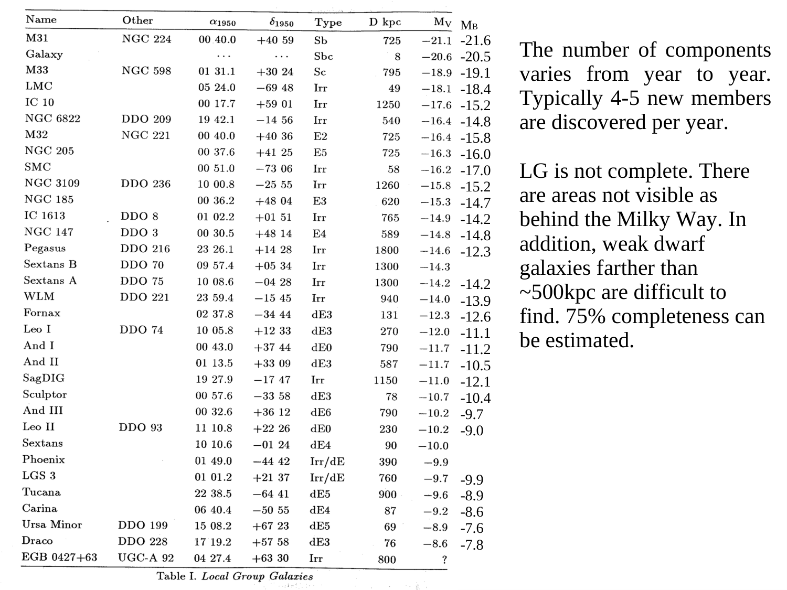
*Local Group dynamics: timing argument for total mass of MW + M31 system (~3-5 x 10^12 M_Sun).*

---

## lecture slides and reference figures (Prof. Alessandro Pizzella)

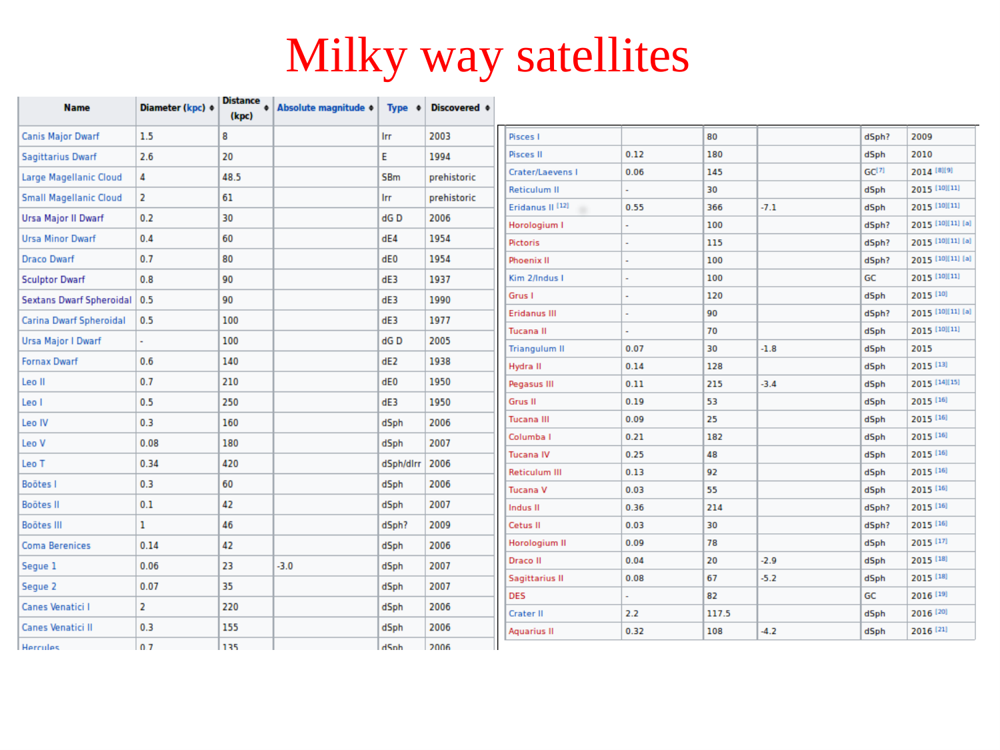

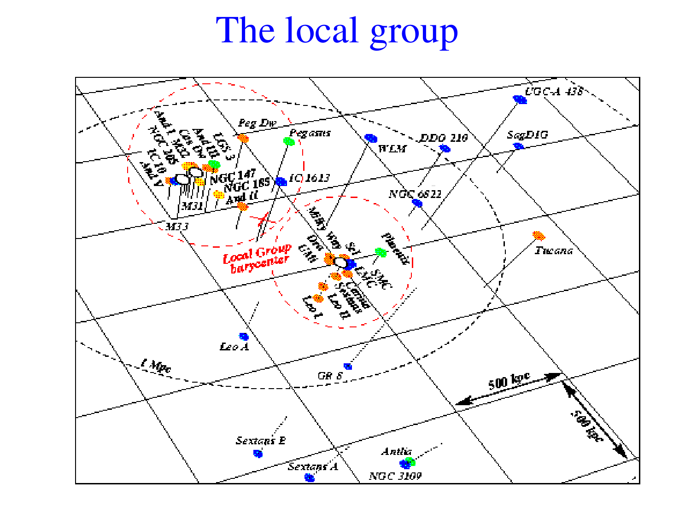

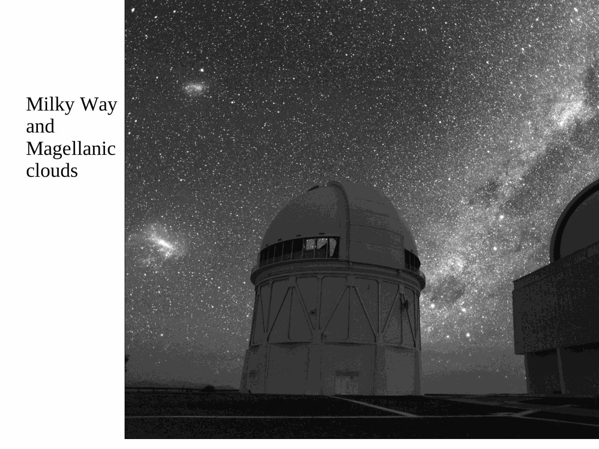

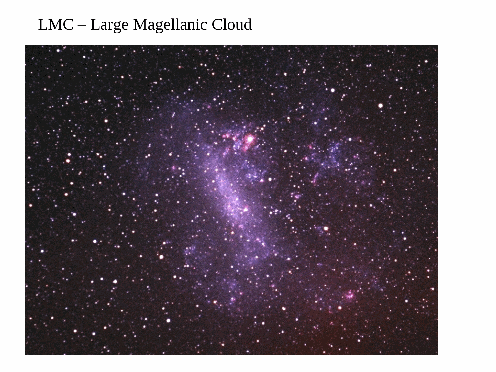

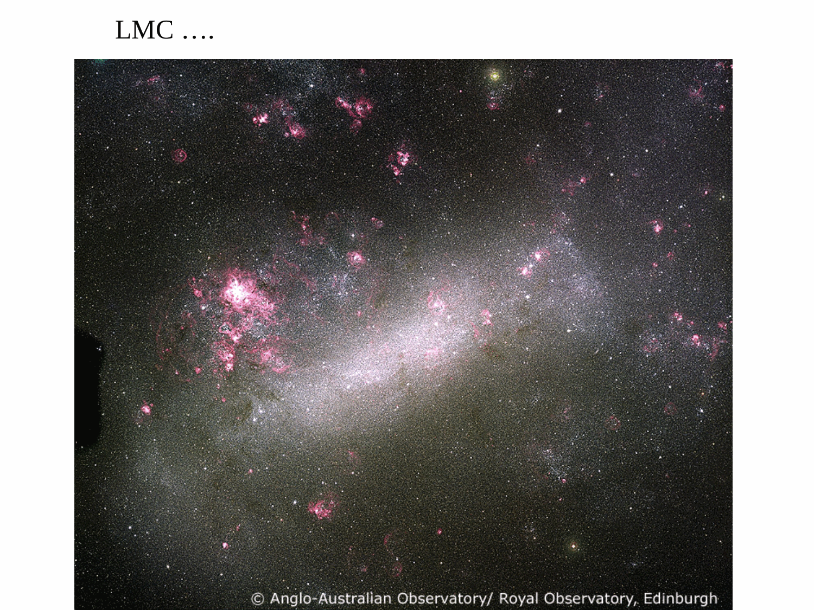

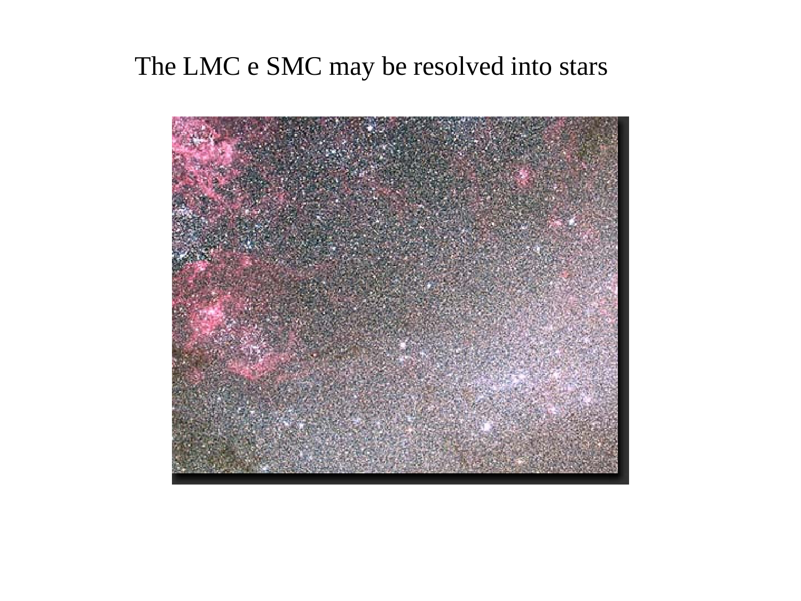

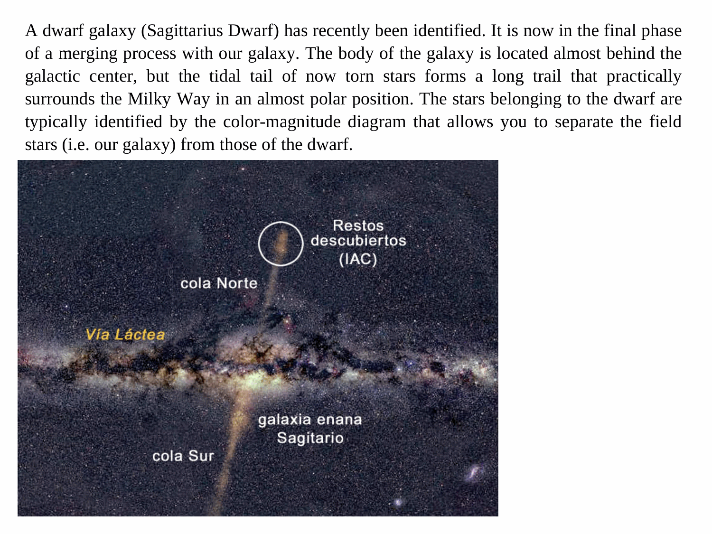

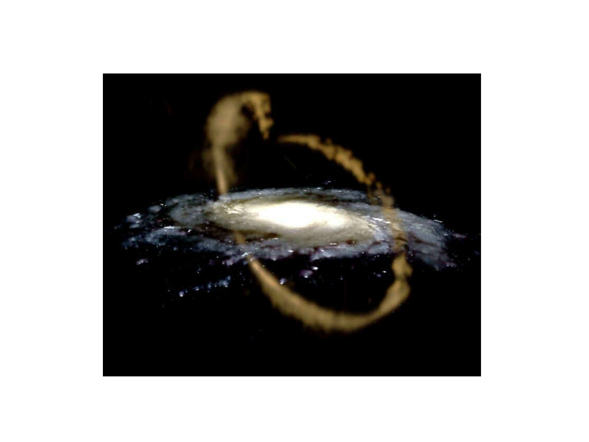

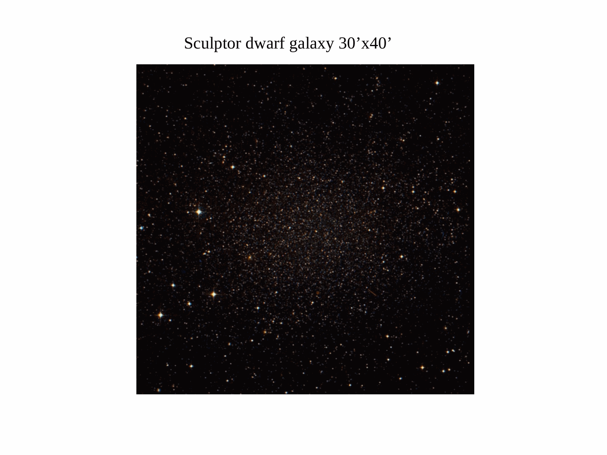

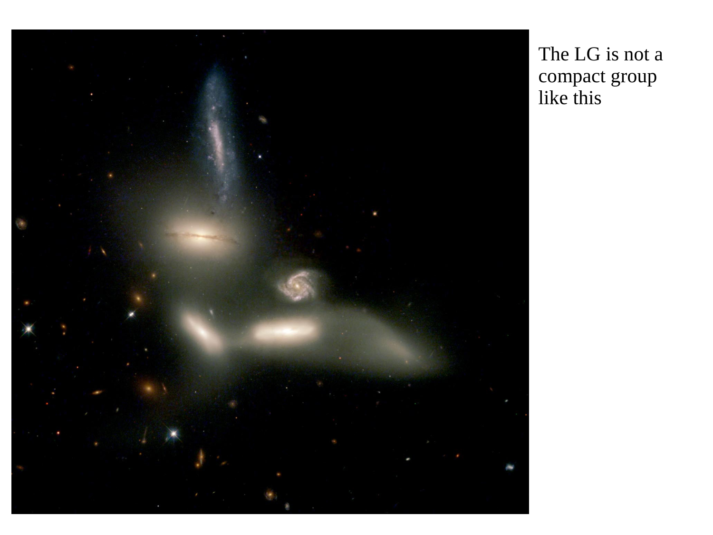


  <h4 class="backlinks-title">Linked References (2)</h4>
  <ul class="backlinks-list">
    <li class="backlink-item-wrap"><a href="../../04_Atlas/Astrophysics_of_Galaxies_MOC.html" class="backlink-item">Astrophysics_of_Galaxies_MOC</a></li>
    <li class="backlink-item-wrap"><a href="./Dark%20matter%20in%20dwarf%20galaxies.html" class="backlink-item">Dark matter in dwarf galaxies</a></li>
  </ul>

