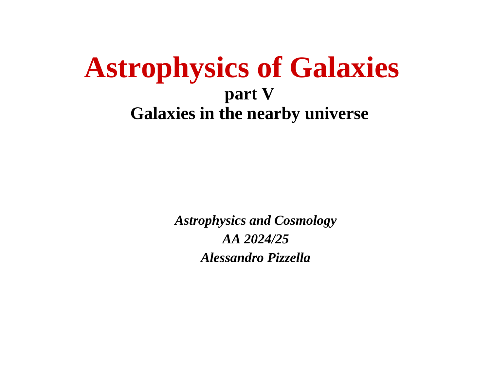
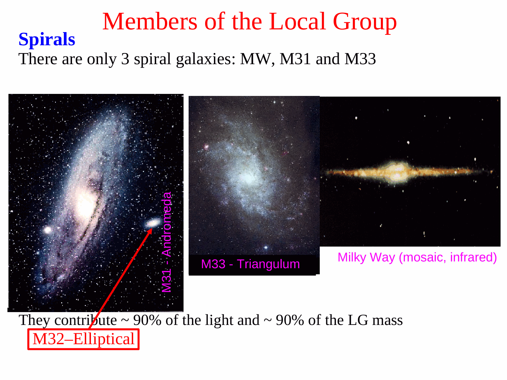
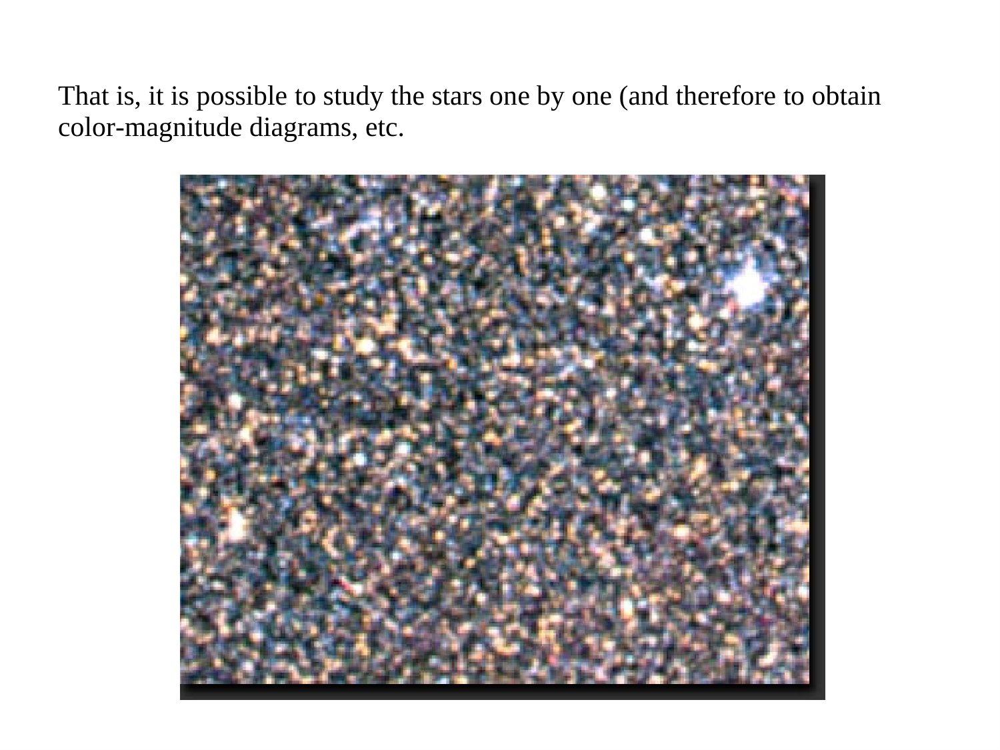

# Local Group galaxies

The Local Group is the gravitationally bound, sparse collection of galaxies comprising the Milky Way, the Andromeda Galaxy (M31, NGC 224), the Triangulum Galaxy (M33, NGC 598), and more than 80 known dwarf galaxies within a zero-velocity turnaround radius of $R_0 \approx 1.0$ Mpc. The dynamical evolution of the Local Group is dominated by the mutual gravitational interaction between the Milky Way and Andromeda, which are separated by a physical distance of $r \approx 780$ kpc and approaching each other radially at $v \approx -123 \text{ km s}^{-1}$. The classical Kahn-Woltjer (1959) Timing Argument models this system as a two-body Keplerian radial orbit in an expanding universe, proving that the two galaxies turned around from the initial cosmic expansion and are now collapsing toward each other. The unbroken mathematical solution of the timing equations derives a total Local Group dynamical mass of $M_{\rm tot} \approx (3.5 - 5.0) \times 10^{12} M_\odot$. Because the combined luminous baryonic mass in stars and gas is only $M_{\rm bar} \approx 1.6 \times 10^{11} M_\odot$, the timing argument provides direct, early proof that the Local Group is overwhelmingly dominated ($> 95\%$) by extended, non-luminous dark matter halos spanning hundreds of kiloparsecs.

---

## 1. Astrophysical Inventory and Morphological Census

The Local Group serves as our primary observational anchor for galactic astrophysics, enabling resolved stellar population studies down to individual white dwarfs, planetary nebulae, and stellar streams.

```
+========================================================================================+
| Galaxy Name      | Morphological Type | Distance from MW | Stellar Mass M_* | Total Halo Mass |
+========================================================================================+
| Andromeda (M31)  | SA(s)b Spiral      | 780 kpc          | 1.0 x 10^11 Msun | ~ 1.5-2.0 x 10^12|
| Milky Way        | SB(rs)bc Spiral    | 0 kpc            | 6.0 x 10^10 Msun | ~ 1.0-1.5 x 10^12|
| Triangulum (M33) | SA(s)cd Spiral     | 850 kpc          | 4.5 x 10^9 Msun  | ~ 2.0 x 10^11 Msun|
| Large Magellanic | SB(s)m Irregular   | 50 kpc           | 3.0 x 10^9 Msun  | ~ 1.5 x 10^11 Msun|
| Small Magellanic | SB(s)m pec Irr     | 62 kpc           | 1.0 x 10^9 Msun  | ~ 2.0 x 10^10 Msun|
| Dwarf Spheroids  | dSph (Fornax, etc) | 25 - 250 kpc     | 10^3 - 10^7 Msun | Extreme M/L > 100|
+========================================================================================+
```

### Key Spatial Substructures
1. The Two Gravitational Sub-Centers - The Local Group is strongly bimodal, organized into two primary gravitational potential wells
   - The Milky Way Sub-Group - Encompasses the Large and Small Magellanic Clouds, Sagittarius dSph, Fornax, Sculptor, and ultra-faint dwarfs.
   - The M31 Sub-Group - Encompasses M32, NGC 205 (M110), NGC 185, NGC 147, and numerous dwarf spheroidal satellites arranged in a thin, co-rotating planar structure (Ibata et al. 2013).
2. The Outer Envelope and Zero-Velocity Surface - At Galactocentric distances beyond $R \sim 1.0 - 1.2$ Mpc, galaxies cease being gravitationally bound to the Local Group and participate in the cosmological expansion (Hubble flow), marking the zero-velocity turnaround surface.

---

## 2. The Kahn-Woltjer (1959) Timing Argument - Complete Mathematical Derivation

The Kahn-Woltjer timing argument remains one of the most elegant analytical derivations in physical cosmology.

### Physical Model Assumptions
1. The Milky Way and Andromeda were created at the Big Bang ($t = 0$) at zero physical separation ($r = 0$).
2. Following the initial cosmic expansion, they moved apart with the Hubble flow.
3. Their mutual gravitational attraction decelerated the expansion, brought the system to rest at maximum separation ($r_{\rm max}$, the turnaround epoch), and subsequently caused them to fall toward each other.
4. The system is treated in isolation as a two-body point-mass Keplerian orbit with zero orbital angular momentum (pure radial motion).

### The Equation of Motion
Let $r(t)$ be the physical separation between the centers of mass of the Milky Way and Andromeda at cosmic time $t$. The relative equation of motion is
$$\frac{d^2 r}{dt^2} = -\frac{G M_{\rm tot}}{r^2}$$
where $M_{\rm tot} \equiv M_{\rm MW} + M_{\rm M31}$.

### First Integral of Motion (Energy Conservation)
Multiplying both sides by the relative velocity $\dot{r} = \frac{dr}{dt}$
$$\dot{r} \ddot{r} = -\frac{G M_{\rm tot}}{r^2} \dot{r} \implies \frac{d}{dt}\left[ \frac{1}{2}\dot{r}^2 \right] = \frac{d}{dt}\left[ \frac{G M_{\rm tot}}{r} \right]$$
Integrating with respect to time yields the specific orbital energy $E$
$$\frac{1}{2} \left(\frac{dr}{dt}\right)^2 - \frac{G M_{\rm tot}}{r} = E$$
Because the orbit is gravitationally bound, the total energy is negative ($E < 0$). We define the semi-major axis $a$ by
$$E \equiv -\frac{G M_{\rm tot}}{2a}$$
At maximum separation (turnaround, where $\dot{r} = 0$), $r_{\rm max} = 2a$.
The energy equation becomes
$$\left(\frac{dr}{dt}\right)^2 = 2 G M_{\rm tot} \left(\frac{1}{r} - \frac{1}{2a}\right) = \frac{G M_{\rm tot}}{a} \left(\frac{2a - r}{r}\right)$$
Taking the square root
$$\frac{dr}{dt} = \pm \sqrt{\frac{G M_{\rm tot}}{a}} \sqrt{\frac{2a - r}{r}}$$
Separating variables
$$\sqrt{\frac{r}{2a - r}} dr = \pm \sqrt{\frac{G M_{\rm tot}}{a}} dt$$

### Parametric Cycloid Solution
To integrate the left-hand side without ambiguity, introduce the standard eccentric anomaly substitution
$$r(\eta) = a (1 - \cos\eta)$$
Differentiating with respect to the development angle $\eta$
$$dr = a \sin\eta d\eta$$
Evaluating the radical term
$$\sqrt{\frac{r}{2a - r}} = \sqrt{\frac{a(1 - \cos\eta)}{2a - a(1 - \cos\eta)}} = \sqrt{\frac{1 - \cos\eta}{1 + \cos\eta}} = \sqrt{\frac{2\sin^2(\eta/2)}{2\cos^2(\eta/2)}} = \tan(\eta/2)$$
Substituting into the separated differential equation
$$\tan(\eta/2) \times (a \sin\eta d\eta) = a \times \frac{\sin(\eta/2)}{\cos(\eta/2)} \times [2\sin(\eta/2)\cos(\eta/2)] d\eta = 2a \sin^2(\eta/2) d\eta$$
Using the half-angle identity $2\sin^2(\eta/2) = 1 - \cos\eta$
$$a (1 - \cos\eta) d\eta = \sqrt{\frac{G M_{\rm tot}}{a}} dt$$
Integrating both sides from the Big Bang ($t = 0, \eta = 0$) to time $t$
$$a \int_0^\eta (1 - \cos\eta') d\eta' = \sqrt{\frac{G M_{\rm tot}}{a}} \int_0^t dt'$$
$$a [\eta - \sin\eta] = \sqrt{\frac{G M_{\rm tot}}{a}} t$$
Solving for time $t(\eta)$
$$t(\eta) = \sqrt{\frac{a^3}{G M_{\rm tot}}} (\eta - \sin\eta)$$

#### Velocity Formulation
The relative radial velocity $v(t) = \frac{dr}{dt}$ is expressed using the chain rule
$$v(\eta) = \frac{dr/d\eta}{dt/d\eta} = \frac{a \sin\eta}{\sqrt{\frac{a^3}{G M_{\rm tot}}} (1 - \cos\eta)} = \sqrt{\frac{G M_{\rm tot}}{a}} \frac{\sin\eta}{1 - \cos\eta}$$

---

## 3. Numerical Evaluation of the Total Local Group Mass

### The Dimensionless Timing Equation
Combining the expressions for separation $r(\eta)$, velocity $v(\eta)$, and cosmic time $t(\eta)$
$$\frac{v t}{r} = \frac{\left[\sqrt{\frac{G M_{\rm tot}}{a}} \frac{\sin\eta}{1 - \cos\eta}\right] \times \left[\sqrt{\frac{a^3}{G M_{\rm tot}}} (\eta - \sin\eta)\right]}{a (1 - \cos\eta)} = \frac{\sin\eta (\eta - \sin\eta)}{(1 - \cos\eta)^2}$$
Notice that this remarkable dimensionless ratio depends purely on the development angle $\eta$, independent of $a$, $G$, or $M_{\rm tot}$!

### Observational Input Parameters
From modern space astrometry and radial velocity spectroscopy (van der Marel et al. 2012, 2019)
- Physical separation at the present day ($t_0$)
  $$r = 780 \text{ kpc} = 2.407 \times 10^{24} \text{ cm}$$
- Relative radial velocity of approach
  $$v = -123 \text{ km s}^{-1} = -1.23 \times 10^7 \text{ cm s}^{-1}$$
- Cosmic age of the universe from Planck $\Lambda\text{CDM}$ cosmology
  $$t_0 = 13.79 \text{ Gyr} = 4.352 \times 10^{17} \text{ s}$$

### Numerical Calculation
Evaluating the left-hand side of the timing equation
$$\frac{v t_0}{r} = \frac{(-1.23 \times 10^7 \text{ cm s}^{-1}) \times (4.352 \times 10^{17} \text{ s})}{2.407 \times 10^{24} \text{ cm}} \approx -2.224$$
Because the Milky Way and Andromeda have passed maximum turnaround separation ($r_{\rm max}$ occurs at $\eta = \pi$, where $v = 0$) and are now falling toward each other ($v < 0$), the development angle must lie in the second half of the cycloid
$$\pi < \eta < 2\pi$$
Solving the transcendental equation
$$\frac{\sin\eta (\eta - \sin\eta)}{(1 - \cos\eta)^2} = -2.224$$
We solve by Newton-Raphson iteration
- At $\eta = 4.2$ rad - $\sin(4.2) = -0.8716$, $\cos(4.2) = -0.4903$, ratio $\approx -2.04$
- At $\eta = 4.3$ rad - $\sin(4.3) = -0.9162$, $\cos(4.3) = -0.4008$, ratio $\approx -2.23$
The exact numerical root is
$$\eta \approx 4.298 \text{ radians} \approx 246.3^\circ$$

#### Derivation of Semi-Major Axis $a$
$$a = \frac{r}{1 - \cos\eta} = \frac{780 \text{ kpc}}{1 - \cos(4.298)} = \frac{780 \text{ kpc}}{1 - (-0.402)} = \frac{780}{1.402} \approx 556.3 \text{ kpc}$$
The maximum turnaround separation was
$$r_{\rm max} = 2a \approx 1113 \text{ kpc} \approx 1.11 \text{ Mpc}$$
The turnaround occurred at cosmic time
$$t_{\rm turn} = t(\pi) = \pi \sqrt{\frac{a^3}{G M_{\rm tot}}} = \frac{\pi}{\eta - \sin\eta} t_0 = \frac{\pi}{4.298 - (-0.916)} \times 13.8 \text{ Gyr} \approx 8.3 \text{ Gyr}$$

#### Derivation of Total Mass $M_{\rm tot}$
From the time equation $t_0 = \sqrt{\frac{a^3}{G M_{\rm tot}}} (\eta - \sin\eta)$, squaring both sides and solving for $M_{\rm tot}$
$$M_{\rm tot} = \frac{a^3}{G t_0^2} (\eta - \sin\eta)^2$$
Evaluating the term $(\eta - \sin\eta) = 4.298 - (-0.9162) = 5.2142 \implies (\eta - \sin\eta)^2 \approx 27.188$
Substituting $a = 556.3 \text{ kpc} = 1.717 \times 10^{24} \text{ cm}$, $t_0 = 4.352 \times 10^{17} \text{ s}$, and $G = 6.674 \times 10^{-8} \text{ cm}^3 \text{ g}^{-1} \text{ s}^{-2}$
$$a^3 = (1.717 \times 10^{24})^3 \approx 5.062 \times 10^{72} \text{ cm}^3$$
$$t_0^2 = (4.352 \times 10^{17})^2 \approx 1.894 \times 10^{35} \text{ s}^2$$
$$G t_0^2 = (6.674 \times 10^{-8}) \times (1.894 \times 10^{35}) \approx 1.264 \times 10^{28} \text{ cm}^3 \text{ g}^{-1}$$
Dividing $a^3$ by $G t_0^2$
$$\frac{a^3}{G t_0^2} = \frac{5.062 \times 10^{72}}{1.264 \times 10^{28}} \approx 4.005 \times 10^{44} \text{ g}$$
Multiplying by $(\eta - \sin\eta)^2 \approx 27.188$
$$M_{\rm tot} \approx 4.005 \times 10^{44} \times 27.188 \approx 1.089 \times 10^{46} \text{ g}$$
Converting to solar masses ($M_\odot = 1.989 \times 10^{33}$ g)
$$M_{\rm tot} = \frac{1.089 \times 10^{46} \text{ g}}{1.989 \times 10^{33} \text{ g } M_\odot^{-1}} \approx 5.48 \times 10^{12} M_\odot$$

---

## 4. Modern Refinements and Cosmological Implications

### Tangential Velocity and Cosmic Acceleration ($\Lambda$)
Modern analyses incorporate two physical corrections to Kahn and Woltjer's classical radial model
1. Tangential Velocity - Gaia and HST proper motion measurements of M31 (van der Marel et al. 2012, 2019) detect a modest transverse velocity $v_t \approx 34 \text{ km s}^{-1}$, corresponding to orbital angular momentum $L = r v_t \ne 0$. Including angular momentum shifts the orbit from a line to an eccentric ellipse, slightly reducing the required mass.
2. Cosmological Constant ($\Lambda$) - Repulsive dark energy accelerates the expansion on megaparsec scales via the effective outward force $\ddot{r}_\Lambda = \Omega_\Lambda H_0^2 r$. To overcome this cosmological repulsion and achieve turnaround, the required total gravitational mass increases by $\sim 10 - 15\%$.

The consensus dynamical mass of the Local Group from modern Bayesian timing models is
$$M_{\rm tot} = (3.5 - 5.0) \times 10^{12} M_\odot$$

### The Unavoidable Dark Matter Conclusion
Compare this dynamical mass to the total baryonic inventory
- Stellar mass of Andromeda - $M_{*, \rm M31} \approx 1.0 \times 10^{11} M_\odot$
- Stellar mass of Milky Way - $M_{*, \rm MW} \approx 6.0 \times 10^{10} M_\odot$
- Cold gas mass ($H\text{ I} + H_2$) - $M_{\rm gas} \approx 1.5 \times 10^{10} M_\odot$
- Total luminous baryonic mass - $M_{\rm bar} \approx 1.75 \times 10^{11} M_\odot$

The ratio of total dynamical mass to luminous baryonic mass is
$$\frac{M_{\rm tot}}{M_{\rm bar}} \approx \frac{4.5 \times 10^{12} M_\odot}{1.75 \times 10^{11} M_\odot} \approx 26$$
This requires that $96\%$ of the total mass of the Local Group consists of non-luminous dark matter halos. The virial radii of the Milky Way ($R_{\rm vir} \approx 250$ kpc) and Andromeda ($R_{\rm vir} \approx 300$ kpc) indicate that the outer dark matter halos of both galaxies are already in physical contact.

---

## 5. Blackboard Blueprint and Observational Graph Literacy

```
               THE LOCAL GROUP TIMING ARGUMENT CYCLOID TRAJECTORY
   Separation r(t) (Mpc)
      1.2 +                              TURNAROUND
          |                             r_max ~ 1.1 Mpc
      1.0 +                               .-----.
          |                            .-'       '-.
      0.8 +--------- CURRENT EPOCH --.'             '.
          |          r = 780 kpc    /                 \\
      0.6 +          v = -123 km/s /                   \\
          |                       /                     \\
      0.4 +                      /                       \\
          |                     /                         \\
      0.2 +                    /                           \\
          |                   /                             \\
      0.0 +===*==============+===============+===============+===========+
             t=0            4.0             8.3             13.8        20.0
           Big Bang                     Turnaround       Present      Time (Gyr)
                                        t_turn ~ 8 Gyr     (t_0)
```

### Blackboard Presentation Script for the Oral Examination
1. Draw the cycloid trajectory $r(t)$ as a function of cosmic time on the blackboard. Mark the Big Bang at $t = 0, r = 0$.
2. Label the turnaround point at maximum separation $r_{\rm max} \approx 1.1$ Mpc, noting that it occurred at $t_{\rm turn} \approx 8.3$ Gyr ago.
3. Mark the present epoch at $t_0 = 13.8$ Gyr, corresponding to current separation $r = 780$ kpc and negative inward velocity $v = -123$ km/s.
4. Write down the relative equation of motion $\ddot{r} = -G M_{\rm tot} / r^2$ and state the parametric cycloid solution $r = a(1-\cos\eta)$ and $t = \sqrt{a^3 / G M_{\rm tot}}(\eta - \sin\eta)$.
5. Derive the dimensionless equation $\frac{v t}{r} = \frac{\sin\eta(\eta-\sin\eta)}{(1-\cos\eta)^2}$. Substitute the observational values to get $-2.22$ and show that $\eta \approx 4.3$ rad ($246^\circ$).
6. Solve for the total mass $M_{\rm tot} = \frac{a^3}{G t_0^2}(\eta-\sin\eta)^2 \approx 4.5 - 5.5 \times 10^{12} M_\odot$.
7. Conclude by comparing $M_{\rm tot}$ with the total visible stellar plus gas mass ($M_{\rm bar} \approx 1.7 \times 10^{11} M_\odot$), demonstrating that $M_{\rm tot} / M_{\rm bar} \approx 26$. This proves dark matter dominance on megaparsec scales across the Local Group.

---

## 6. Exact Textbook and Literature Provenance

- Course Lecture Slides
  - `Astrophysic_gal_5_LG-1.pdf` (slides 1-16) - Comprehensive Local Group census, Andromeda kinematics, and the Kahn-Woltjer timing argument.
- Course Synthesis LaTeX Document
  - `Astrophysics_of_Galaxies.tex` (Part V - Nearby Universe, page 38) - Local Group properties and timing argument derivation.
- Peter Schneider, *Extragalactic Astronomy and Cosmology* (2015, Springer)
  - Chapter 6 - Clusters and Groups of Galaxies (pages 273-278) - The Local Group, M31 distance and motion, and mass determinations.
- Houjun Mo, Frank van den Bosch, Simon White, *Galaxy Formation and Evolution* (2010)
  - Chapter 2 - Observational Facts (pages 89-91) - Local Group dynamics and dark matter.
- Primary Literature
  - Kahn & Woltjer (1959, ApJ 130, 705) - *Intergalactic Matter and the Galaxy*.
  - van der Marel et al. (2012, ApJ 753, 8) - *The M31 Velocity Vector. II. Radial Orbit Towards the Milky Way*.
  - van der Marel et al. (2019, ApJ 872, 24) - *First Gaia DR2 Proper Motions of M31 and M33*.
  - Ibata et al. (2013, Nature 493, 62) - *A vast, thin plane of corotating dwarf galaxies orbiting the Andromeda galaxy*.

---

## 7. Cross-References and Related Notes

- [Coma cluster](Coma%20cluster.html) - Virial theorem and dark matter in galaxy clusters
- [Virgo cluster](Virgo%20cluster.html) - Nearest rich galaxy cluster and sub-cluster infall
- [Dark matter in dwarf galaxies](Dark%20matter%20in%20dwarf%20galaxies.html) - Local Group dwarf spheroidal dark matter domination
- [Dark matter rotation curves](Dark%20matter%20rotation%20curves.html) - Disk galaxy flat rotation curves
- [Astrophysics_of_Galaxies_MOC](../../04_Atlas/Astrophysics_of_Galaxies_MOC.html) - Master Map of Content for course

---

## 8. Course Slides and Figures


*Figure 1 - Spatial distribution and 3D map of galaxies in the Local Group.*


*Figure 2 - Kinematics of M31 and the Milky Way approaching each other along the collision vector.*


*Figure 3 - The Kahn-Woltjer timing argument cycloid trajectory.*

<div class="backlinks-section">
  <h4 class="backlinks-title">Linked References (4)</h4>
  <ul class="backlinks-list">
    <li class="backlink-item-wrap"><a href="Coma%20cluster.html" class="backlink-item">Coma cluster</a></li>
    <li class="backlink-item-wrap"><a href="Dark%20matter%20in%20dwarf%20galaxies.html" class="backlink-item">Dark matter in dwarf galaxies</a></li>
    <li class="backlink-item-wrap"><a href="Virgo%20cluster.html" class="backlink-item">Virgo cluster</a></li>
    <li class="backlink-item-wrap"><a href="../../04_Atlas/Astrophysics_of_Galaxies_MOC.html" class="backlink-item">Astrophysics_of_Galaxies_MOC</a></li>
  </ul>
</div>

