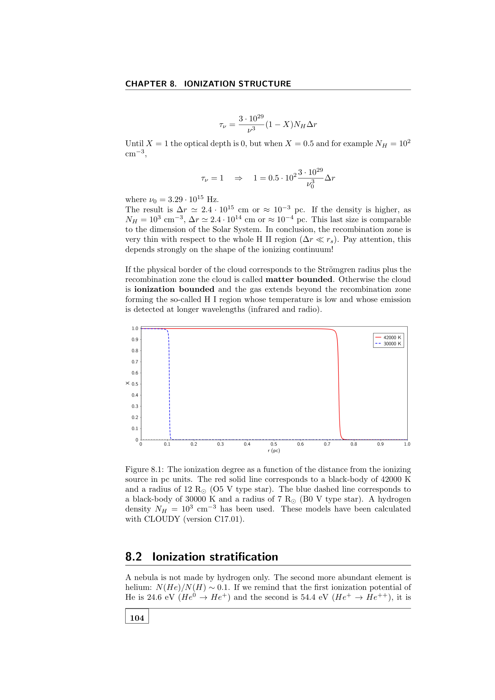

**local thermodynamic equilibrium (LTE)** assumes that, even in a non-uniform medium, the populations of energy levels at any local point follow the Boltzmann + Saha equations at the **local temperature** $T(r)$. radiation and collisions both maintain detailed balance.

## what LTE buys you

with LTE:
- level populations from [[Boltzmann equation in spectroscopy]] at local $T$.
- ionisation populations from [[Saha ionisation equation]] at local $T$.
- source function $S_\nu = B_\nu(T)$ at local $T$ ([[Source function]]).
- emission and absorption coefficients self-consistent.

so the only "input" for the radiative-transfer problem is the temperature profile $T(\tau)$, which itself is constrained by global energy conservation. enormous simplification.

## the key assumption: collisions $>$ radiation

LTE holds when **collisions are fast compared to radiative processes**. then collisional excitation/de-excitation enforces a Boltzmann distribution at the local kinetic $T$, regardless of the radiation field passing through.

quantitatively: collisional excitation rate $C_{lu} \propto n_e \langle\sigma v\rangle_{lu}$. for this to dominate over the radiative pumping, you need
$$n_e \gtrsim 10^{15} \text{ to } 10^{17}\,\text{cm}^{-3}$$
(scaling with line and species). at lower densities, departures grow.

## where LTE works well

- **deep stellar photospheres**: $\tau > 0.1$, dense layers, frequent collisions. accurate to $\lesssim 5\%$ for most lines and species in solar-type stars.
- **stellar interiors**: ridiculously LTE.
- **dense cool flows, brown-dwarf atmospheres**: LTE OK.

## where LTE breaks

- **chromospheres / coronae**: $T$ rises but density falls; radiation rates dominate collisions. NLTE essential.
- **stellar winds and accretion disks**: violent motions and out-of-equilibrium radiation field.
- **HII regions and planetary nebulae**: low density, photoionisation-driven; **never LTE** for any meaningful line. statistical equilibrium needed.
- **AGN narrow-line regions, galactic outflows**: same.
- **protostellar accretion shocks, supernova ejecta**: NLTE.

so for stellar photospheres LTE is mostly fine; for everything else, NLTE.

## NLTE corrections

even where LTE is "OK," small corrections matter for precision work. typical NLTE departures:
- in the Sun (solar abundance work), $\sim 0.05$ to $0.2$ dex shifts in elemental abundances.
- in metal-poor stars (Galactic Archaeology), corrections can reach $\sim 0.5$ dex for some species (Fe II, Na I, etc.).

modern abundance pipelines (LIME, MULTI, MULTI3D, NESSY) solve NLTE for the most-used species.

## detailed balance

at LTE, every microscopic process is balanced by its inverse:
- collisional excitation $\leftrightarrow$ collisional de-excitation.
- radiative absorption $\leftrightarrow$ stimulated + spontaneous emission.

so the rates of both directions are equal. this is what enforces $S_\nu = B_\nu$. break detailed balance (e.g. by a dilute radiation field) and LTE breaks.

## see also

- [[Boltzmann equation in spectroscopy]]
- [[Saha ionisation equation]]
- [[Source function]]
- [[Equation of radiative transfer]]
- [[Statistical equilibrium equations]]
- [[Two-level atom]]
- [[Optical depth]]
- [[Stellar atmosphere structure]]
- [[Thermal equilibrium in the early universe]] — cosmological-scale LTE

---

### Astronomical Spectroscopy Diagnostic Panels

*Emission line plasma diagnostics: $[{\rm O\,III}]\,(\lambda 4959 + \lambda 5007)/\lambda 4363$ electron temperature diagnostic and $[{\rm S\,II}]\,\lambda 6716/\lambda 6731$ electron density diagnostic.*

## Linked References

- [[Atmospheric parameters Teff log g feh vmicro]]
- [[Boltzmann equation in spectroscopy]]
- [[Dilution factor]]
- [[Eddington-Barbier approximation]]
- [[Element abundance patterns]]
- [[Equation of radiative transfer]]
- [[Source function]]
- [[Spectroscopic determination of Teff]]
- [[Spectroscopic determination of log g]]
- [[Spectroscopic determination of metallicity]]
- [[Statistical equilibrium equations]]
- [[Stellar atmosphere structure]]
- [[Astronomical_Spectroscopy_MOC]]

