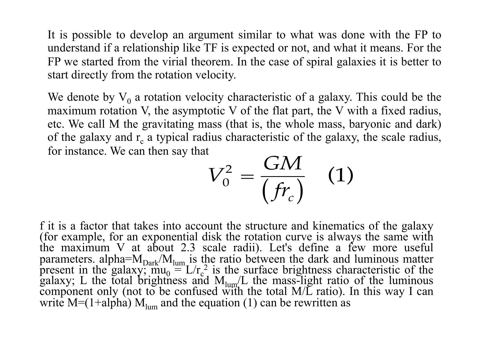
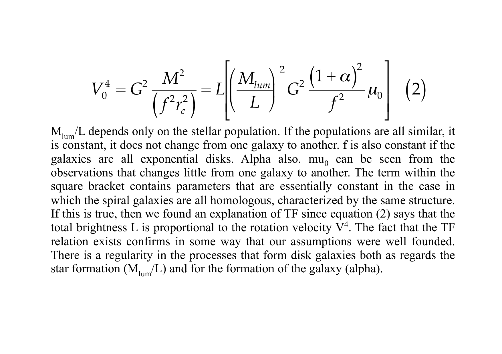
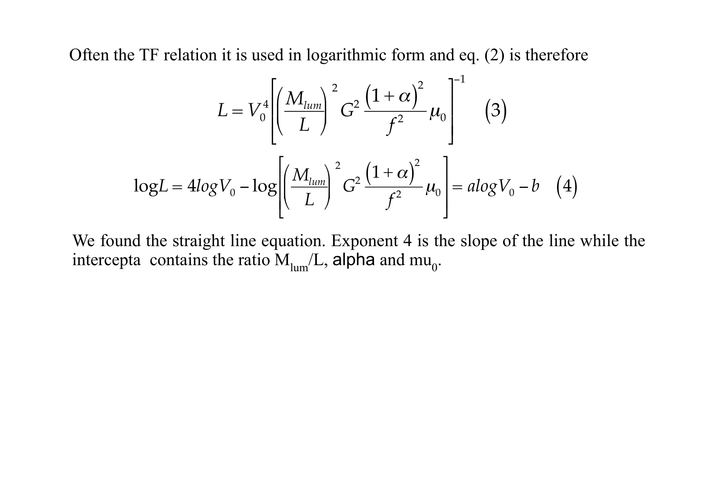
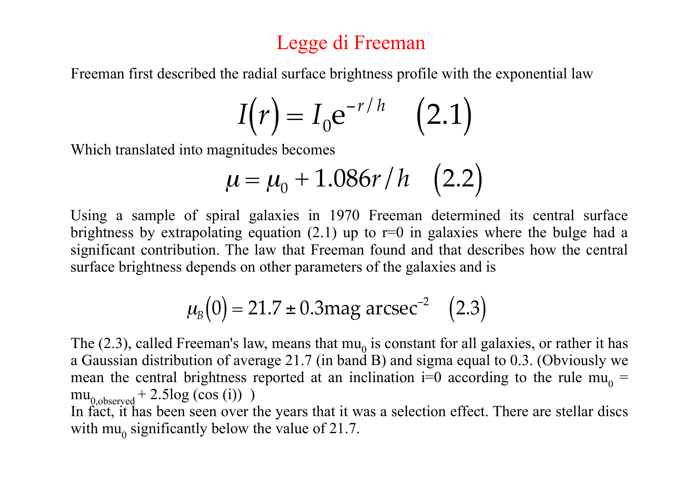
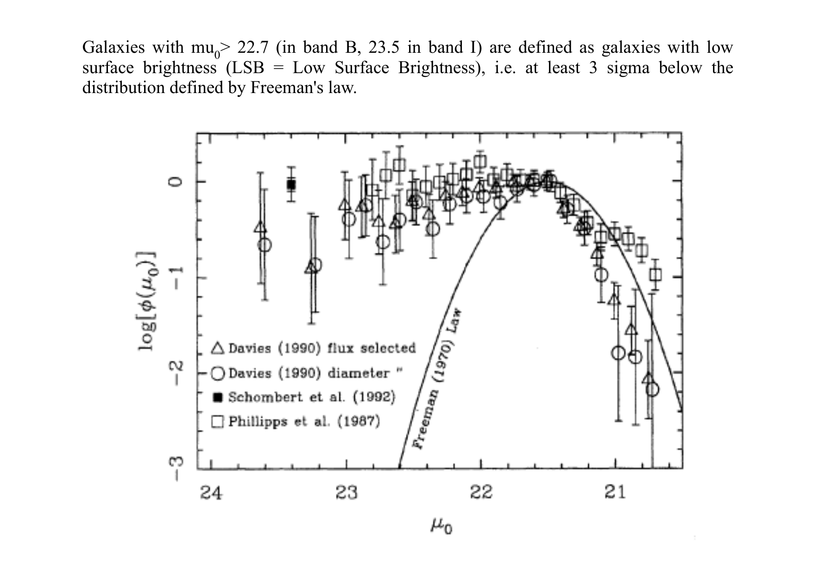
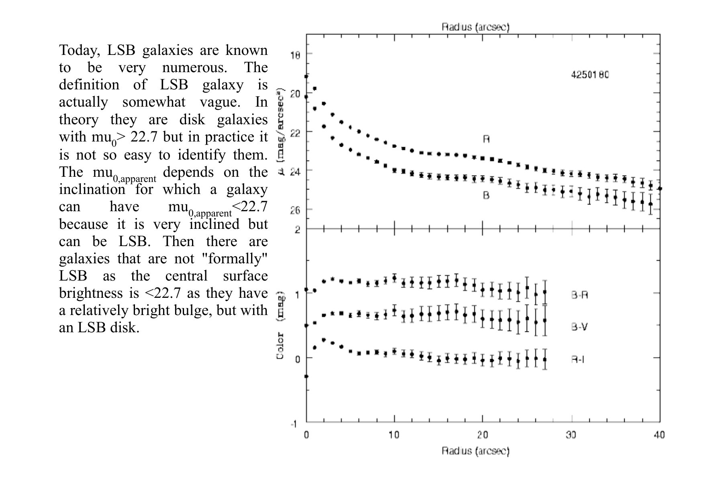
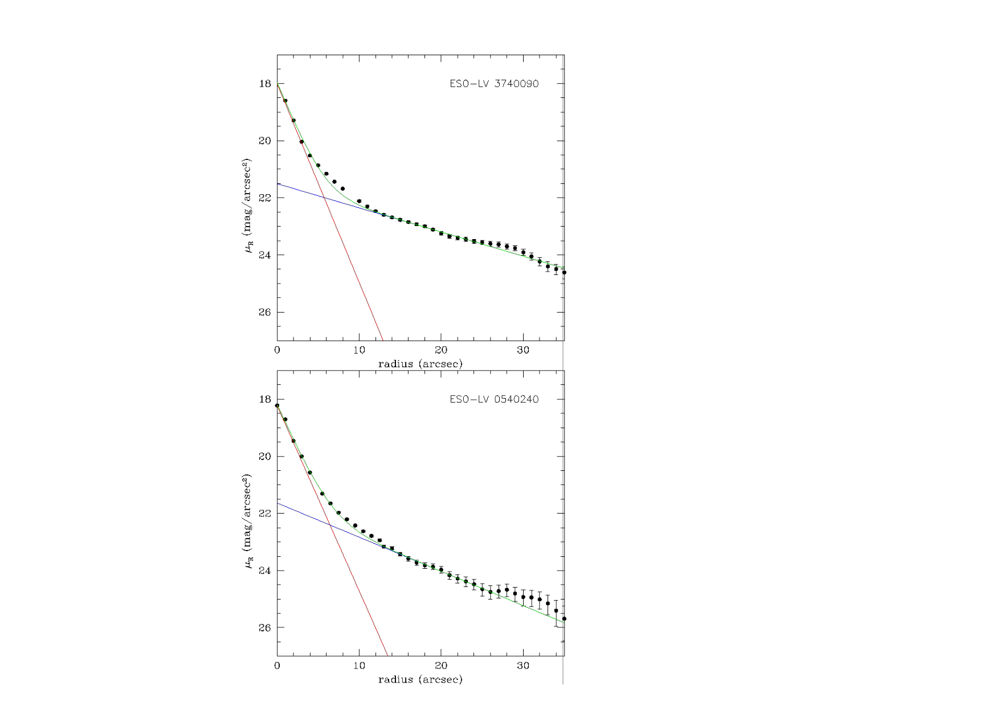
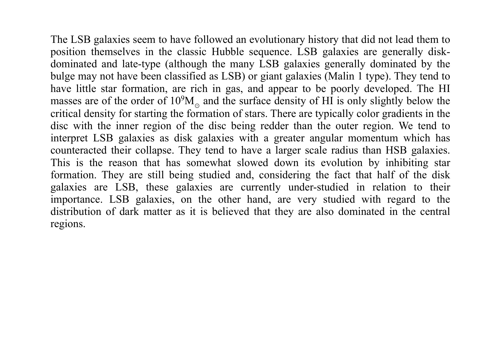
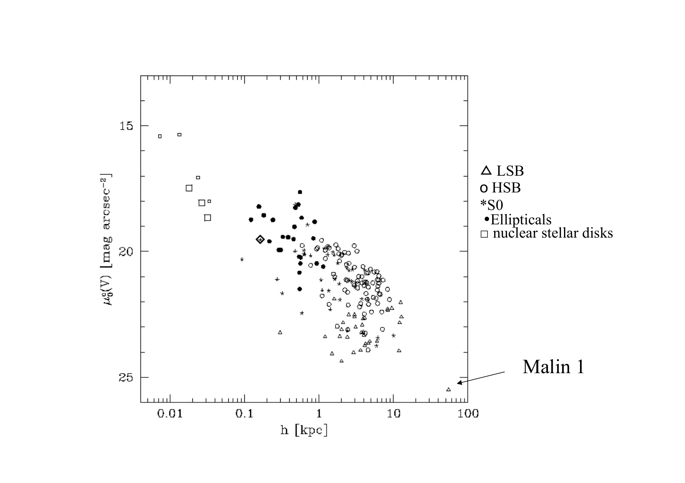
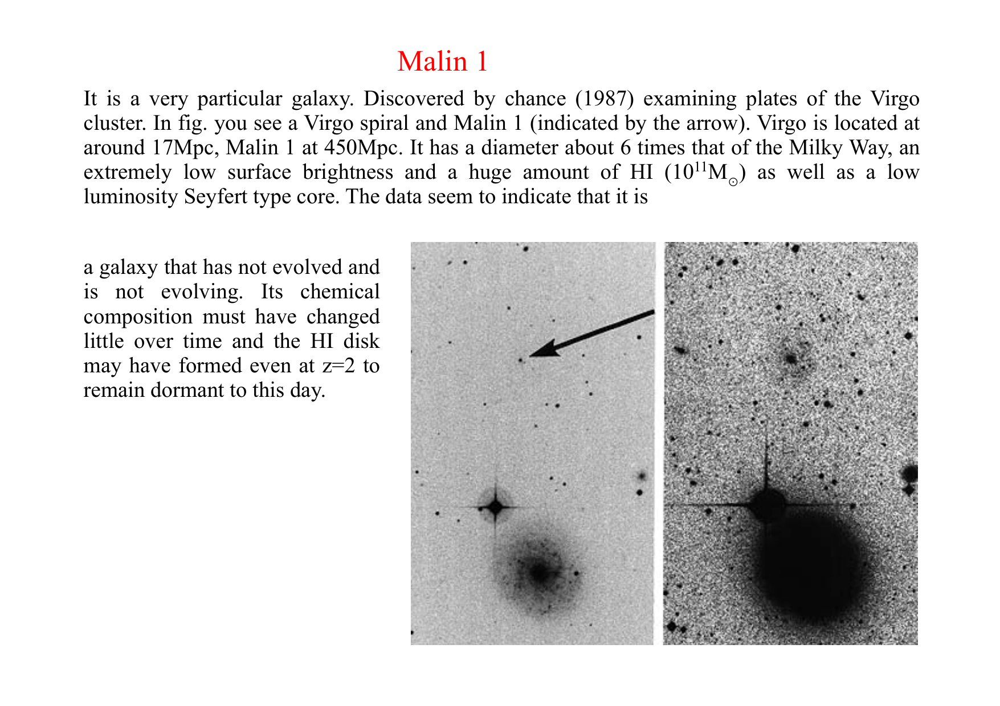


**low surface brightness (LSB) galaxies** are galaxies whose central + average surface brightness is well below the typical bright sequence ($\mu_0 > 23$ mag/arcsec$^2$ in B-band). historically overlooked but constitute a substantial fraction of the galaxy population. include the recently-discovered **ultra-diffuse galaxies (UDGs)**.

## the LSB regime

| galaxy type | $\mu_0$ (B-band) |
|---|---|
| typical bright spiral | $\sim 21$ mag/arcsec$^2$ |
| typical elliptical | $\sim 22$ |
| **LSB galaxy** | $\gtrsim 23$ |
| **ultra-diffuse galaxy (UDG)** | $\gtrsim 24$ |

LSBs are **harder to detect** because their surface brightness is below the typical sky background ($\sim 22$ mag/arcsec$^2$ in $V$).

## the historical missing population

before the 1980s, LSBs were largely unknown because:
- **photographic surveys** missed them due to limited dynamic range.
- **CCD selection effects** preferred high-SB targets.
- early **galaxy catalogues** (NGC, UGC) systematically missed the faint end.

**Disney 1976** + **Impey + Bothun 1997** argued LSBs are the **majority** of galaxies by number.

## the discoveries

- **Malin 1** (Bothun 1987): a **giant LSB spiral**, $> 10^{12}$ stars total but with $\mu_0 \sim 26$ mag/arcsec$^2$. extreme example.
- **dwarf spheroidals** in the Local Group: classical LSBs.
- **UDGs in Coma Cluster** (van Dokkum 2015): $\sim 1000$ MW-sized galaxies with $\sim 100\times$ fewer stars. challenging classification + dark-matter content.
- **NGC 1052-DF2** (van Dokkum 2018): a UDG **lacking dark matter**! controversial measurement. tested the universality of dark matter in galaxies.

## the formation

several proposed mechanisms:
1. **late + slow gas accretion**: LSBs formed late + grew gradually, never reaching high SF efficiency.
2. **angular momentum**: LSBs have high specific angular momentum, suppressing gas concentration.
3. **stellar feedback**: SN feedback expels gas, leaving low-density disks.
4. **environmental quenching** (cluster UDGs): ram-pressure stripping leaves gas-poor remnants.

## the dark-matter content

LSBs are typically **very dark-matter-dominated**:
- typical LSB spiral: $M_{\rm DM}/M_* \sim 50$ to $100$.
- UDGs in Coma + Virgo: $M_{\rm DM}/M_* \sim 100$ to $1000$.
- exception: some UDGs (NGC 1052-DF2, DF4) appear DM-deficient. controversial.

so LSBs are **excellent DM probes**: with little stellar contribution to gravity, the dark-matter halo dominates.

## the importance

LSBs constrain:
- **galaxy formation models**: must reproduce the LSB population without overproducing them.
- **dark-matter physics**: alternative DM (warm, fuzzy, self-interacting) make different predictions for LSB density profiles.
- **completeness of cosmic baryon census**: how much mass is in LSBs?

modern surveys (LSST + Euclid) will discover thousands of new LSBs + UDGs at unprecedented depth.

## see also

- [Sersic profile](./Sersic%20profile.html)
- [De Vaucouleurs and exponential profiles](./De%20Vaucouleurs%20and%20exponential%20profiles.html)
- [Dark matter rotation curves](./Dark%20matter%20rotation%20curves.html)
- [Dark matter in dwarf galaxies](./Dark%20matter%20in%20dwarf%20galaxies.html)
- [Cosmic_inventory_dark_matter](./Cosmic_inventory_dark_matter.html)
- [Galaxy size-luminosity relation](./Galaxy%20size-luminosity%20relation.html)
- [Surface brightness dimming](./Surface%20brightness%20dimming.html)
- [Astrophysics_of_Galaxies_MOC](../../04_Atlas/Astrophysics_of_Galaxies_MOC.html)

---

## astrophysics of galaxies figures and slides (Prof. Alessandro Pizzella)

*Low Surface Brightness (LSB) galaxies: central surface brightness mu_0(B) > 23 mag/arcsec^2.*

*Ultra-Diffuse Galaxies (UDGs) in clusters (van Dokkum et al. 2015).*

*Dark matter domination down to the smallest radii.*

---

## lecture slides and reference figures (Prof. Alessandro Pizzella)



  <h4 class="backlinks-title">Linked References (1)</h4>
  <ul class="backlinks-list">
    <li class="backlink-item-wrap"><a href="../../04_Atlas/Astrophysics_of_Galaxies_MOC.html" class="backlink-item">Astrophysics_of_Galaxies_MOC</a></li>
  </ul>

