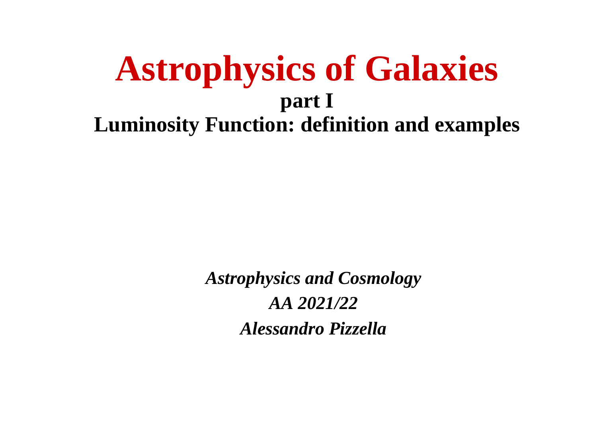
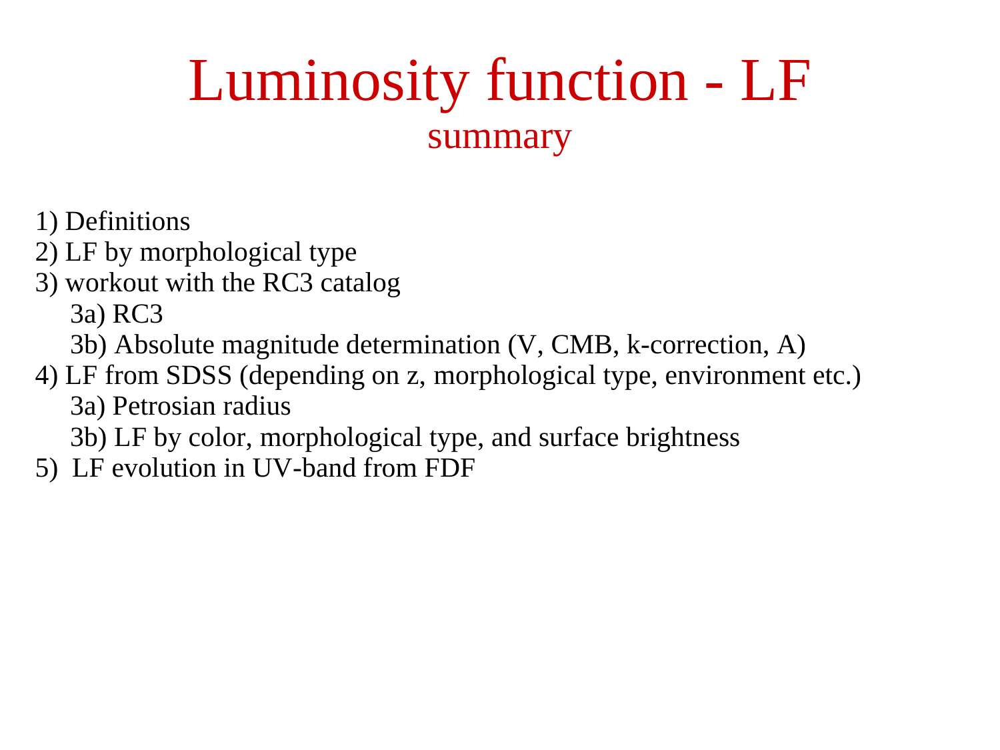
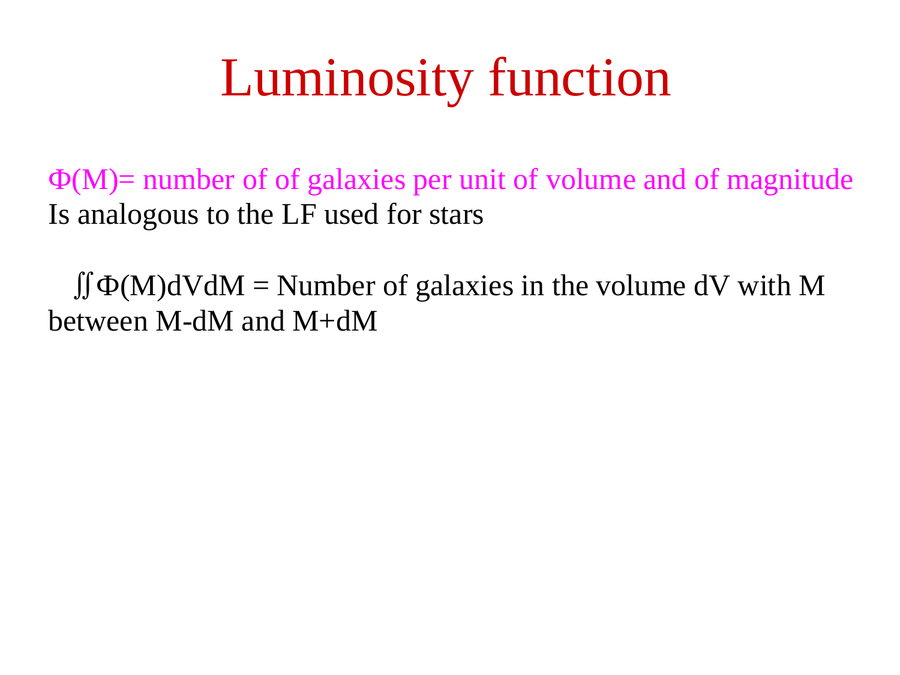
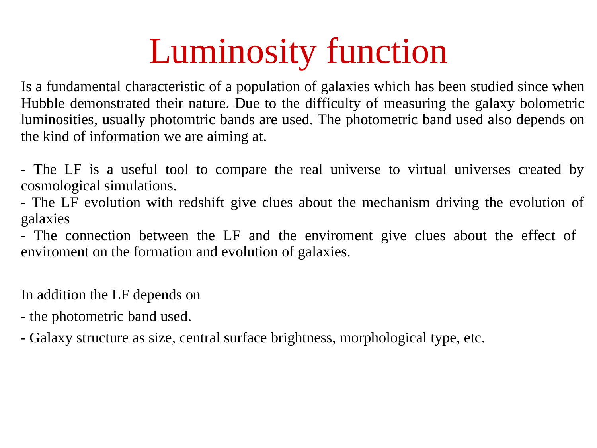
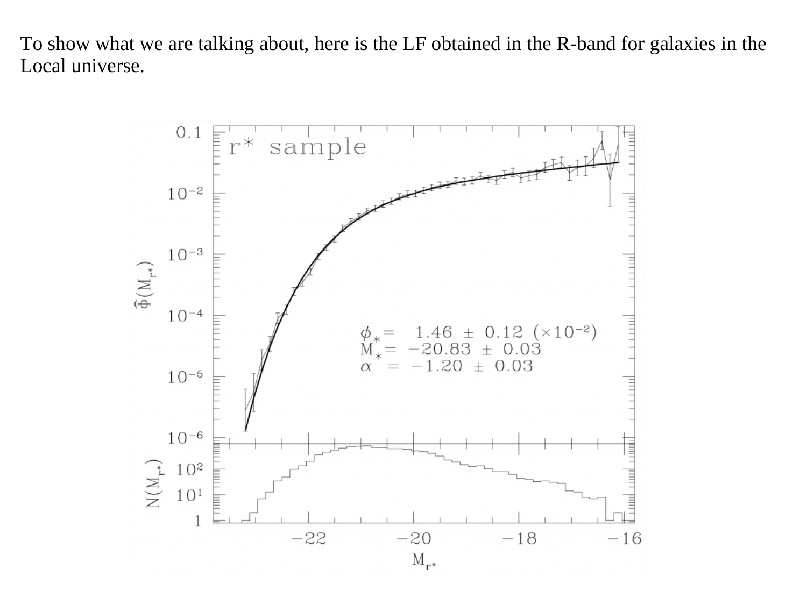
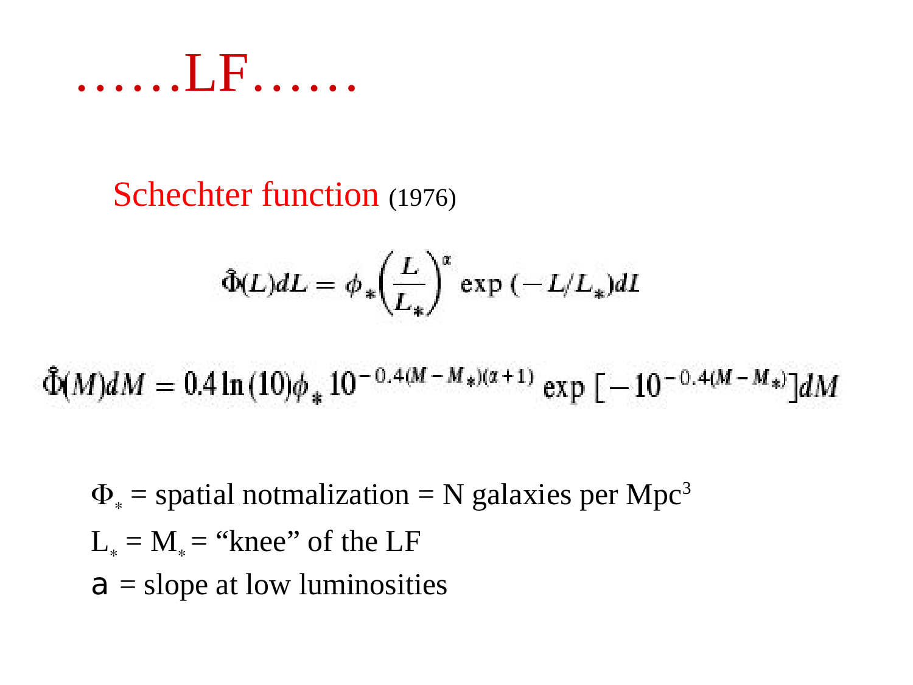
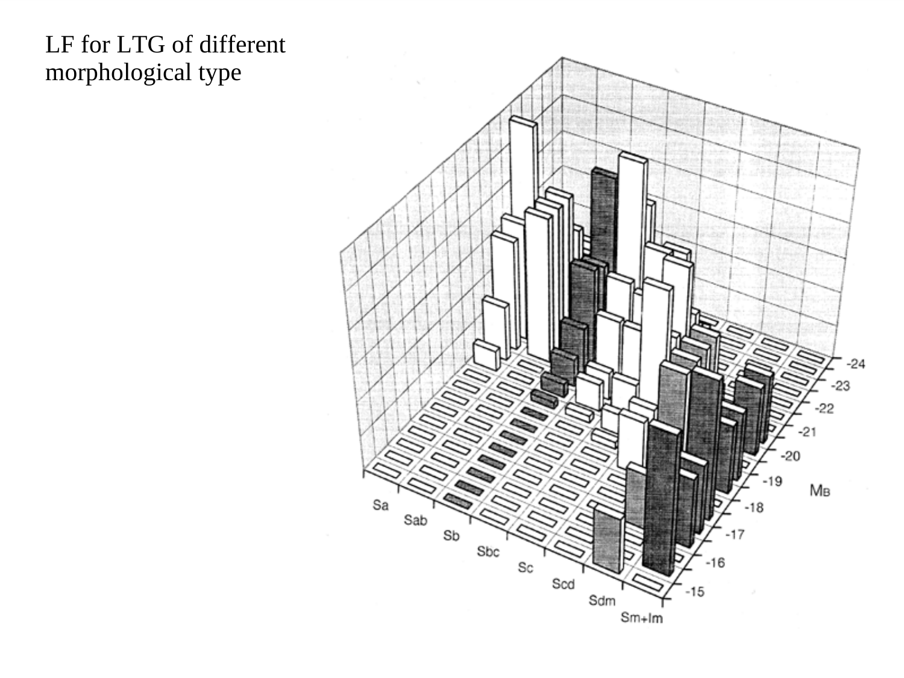
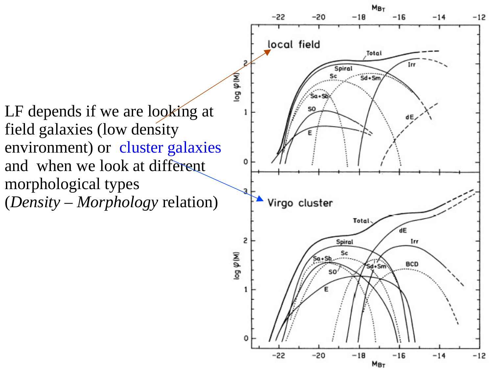
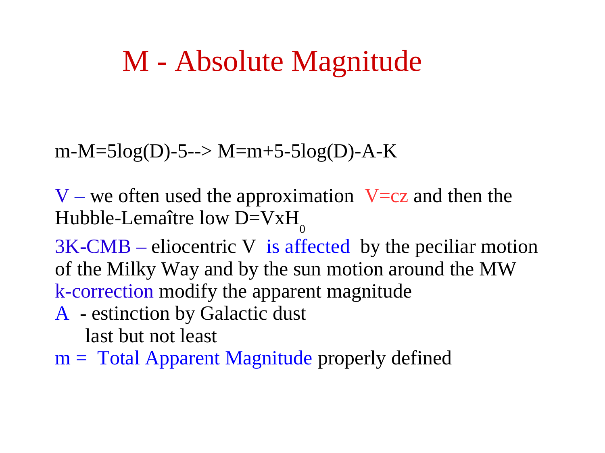
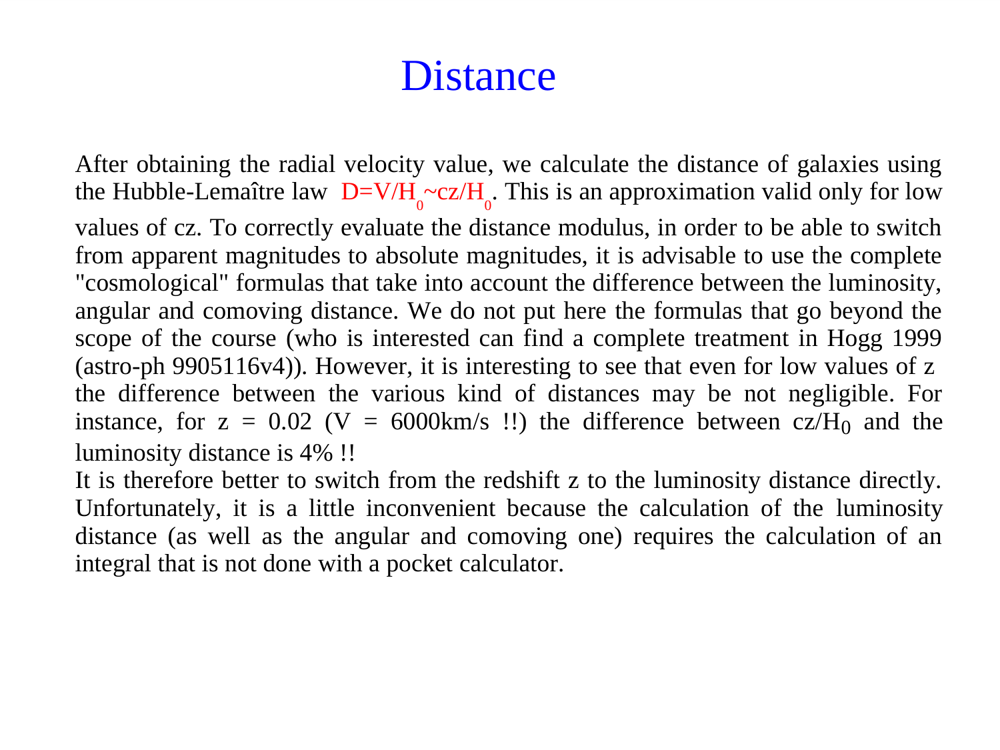

# The Galaxy Luminosity Function Definition and Estimators

## 1. Fundamental Mathematical Definition

The **galaxy luminosity function (LF)** $\Phi(L)$ is the fundamental statistical distribution in extragalactic astrophysics. It defines the number density of galaxies per unit luminosity per unit comoving volume of the universe.

$$dN = \Phi(L) \, dL \, dV$$

where $dN$ is the expected number of galaxies in a comoving volume element $dV$ with intrinsic luminosities in the interval $[L, L + dL]$.

- **Physical Units of $\Phi(L)$**:
  $$[\Phi(L)] = \frac{\text{number of galaxies}}{[\text{Volume}] \cdot [\text{Luminosity}]} = \mathrm{Mpc}^{-3} \, L_\odot^{-1} \quad \left(\text{or } \mathrm{Mpc}^{-3} \, (\mathrm{erg\,s^{-1}})^{-1}\right)$$
- **Physical Units of $\Phi(L) \, dL$**: $\mathrm{Mpc}^{-3}$ (number density).

---

### 1.1 Coordinate Invariance: Derivation of $\Phi(M)$ from $\Phi(L)$

In observational astronomy, intrinsic power is conventionally measured in absolute magnitudes $M$. In magnitude space, the differential distribution is defined such that:

$$dN = \Phi(M) \, dM \, dV$$

with physical units of $[\Phi(M)] = \mathrm{Mpc}^{-3} \, \mathrm{mag}^{-1}$.

Because the total number of galaxies within an equivalent physical interval must be independent of the chosen coordinate system (conservation of galaxy counts):

$$dN = \Phi(L) \, |dL| \, dV = \Phi(M) \, |dM| \, dV \implies \Phi(M) = \Phi(L) \left| \frac{dL}{dM} \right|$$

#### Step-by-Step Derivation of $|dL/dM|$:
1. **Pogson's Relation**:
   $$M - M_0 = -2.5 \log_{10}\left(\frac{L}{L_0}\right) = -\frac{2.5}{\ln 10} \ln\left(\frac{L}{L_0}\right)$$
2. **Inverting for Luminosity**:
   $$L = L_0 \cdot 10^{-0.4(M - M_0)} = L_0 \exp\left[ -0.4 \ln(10) (M - M_0) \right]$$
3. **Differentiating with respect to $M$**:
   $$\frac{dL}{dM} = L_0 \cdot \left( -0.4 \ln 10 \right) \cdot 10^{-0.4(M - M_0)} = -0.4 \ln(10) \, L$$
4. **Taking the Absolute Value**:
   $$\left| \frac{dL}{dM} \right| = 0.4 \ln(10) \, L \approx 0.92103 \, L$$
5. **Final Transformation**:
   $$\boxed{ \Phi(M) = 0.4 \ln(10) \, L \, \Phi(L) }$$

---

### 1.2 Statistical Moments of the Luminosity Function

#### The 0-th Moment: Total Galaxy Number Density
Integrating $\Phi(L)$ over all luminosities yields the total space density of galaxies per comoving unit volume:

$$n_{\rm gal} \equiv \int_0^\infty \Phi(L) \, dL \quad [\mathrm{Mpc}^{-3}]$$

#### The Cumulative Luminosity Function
The space density of galaxies with luminosities exceeding a given threshold $L$:

$$\Phi(>L) \equiv \int_L^\infty \Phi(L') \, dL'$$

#### The 1-st Moment: Total Luminosity Density (Emissivity $j = \rho_L$)
The total radiant energy emitted per unit time per unit comoving volume is the **first luminosity moment**:

$$\boxed{ j = \rho_L \equiv \int_0^\infty L \, \Phi(L) \, dL }$$

- **Physical Origin**: 
  If $dN/dV = \Phi(L) dL$ represents the number density of galaxies in $[L, L+dL]$, and each galaxy emits power $L$, then the differential luminosity density contributed by this bin is:
  $$d\rho_L = L \left( \frac{dN}{dV} \right) = L \, \Phi(L) \, dL$$
  Integrating over all possible luminosities $L \in [0, \infty)$ yields the total cosmic luminosity density $\rho_L$.
- **Physical Units**:
  $$[j] = [\rho_L] = [L] \times [\Phi(L) \, dL] = L_\odot \, \mathrm{Mpc}^{-3} \quad \left(\text{or } \mathrm{erg} \, \mathrm{s}^{-1} \, \mathrm{Mpc}^{-3}\right)$$

---

### 1.3 Unbroken Derivation of $j = \rho_L$ for a Schechter Luminosity Function

Let the differential luminosity function be parameterized by the standard **Schechter (1976)** form:

$$\Phi(L) \, dL = \phi^* \left(\frac{L}{L^*}\right)^\alpha \exp\left(-\frac{L}{L^*}\right) \frac{dL}{L^*}$$

where $\phi^*$ is the normalization ($\mathrm{Mpc}^{-3}$), $L^*$ is the characteristic transition luminosity, and $\alpha$ is the faint-end slope.

#### Step 1 — Substitute into the Integral
$$j = \int_0^\infty L \left[ \phi^* \left(\frac{L}{L^*}\right)^\alpha \exp\left(-\frac{L}{L^*}\right) \frac{dL}{L^*} \right]$$

Since $\phi^*$ and $L^*$ do not depend on $L$, factor $\phi^*$ out of the integral:
$$j = \phi^* \int_0^\infty L \left(\frac{L}{L^*}\right)^\alpha \exp\left(-\frac{L}{L^*}\right) \frac{dL}{L^*}$$

#### Step 2 — Dimensionless Variable Substitution
Define the dimensionless luminosity variable:
$$x \equiv \frac{L}{L^*} \implies L = L^* x$$
Differentiating:
$$dL = L^* dx \implies \frac{dL}{L^*} = dx$$

Examine the integration limits:
- When $L = 0 \implies x = 0/L^* = 0$
- When $L \to \infty \implies x = \infty/L^* \to \infty$

The limits remain $[0, \infty)$.

#### Step 3 — Algebraic Simplification
Substitute $L = L^* x$ and $dL/L^* = dx$ into the integrand:
$$j = \phi^* \int_0^\infty (L^* x) \cdot x^\alpha \cdot e^{-x} \, dx$$
Factor out the constant $L^*$:
$$j = \phi^* L^* \int_0^\infty x \cdot x^\alpha \cdot e^{-x} \, dx$$
Combine powers of $x$ via $x^1 \cdot x^\alpha = x^{\alpha + 1}$:
$$j = \phi^* L^* \int_0^\infty x^{\alpha + 1} e^{-x} \, dx$$

#### Step 4 — Connection to the Euler Gamma Function
Recall the formal definition of the Euler Gamma function:
$$\Gamma(z) \equiv \int_0^\infty t^{z - 1} e^{-t} \, dt \quad (\text{for } \mathrm{Re}(z) > 0)$$

Match the exponent of $x$ to $z - 1$:
$$z - 1 = \alpha + 1 \implies z = \alpha + 2$$

Thus, the integral is identically $\Gamma(\alpha + 2)$:
$$\int_0^\infty x^{(\alpha + 2) - 1} e^{-x} \, dx = \Gamma(\alpha + 2)$$

#### Step 5 — Final Exact Analytical Expression
$$\boxed{ j = \rho_L = \phi^* L^* \, \Gamma(\alpha + 2) }$$

---

### 1.4 Rigorous Asymptotic Analysis: Convergence vs Number Divergence

A central question in extragalactic astrophysics is why the total galaxy number density can diverge while the total luminosity density remains strictly finite.

#### A. Faint-End ($x \to 0$) Asymptotic Behavior
Near $x \to 0$, $e^{-x} \approx 1$. 
- **For Luminosity Density $j$**:
  The behavior near zero is given by:
  $$\int_0^\epsilon x^{\alpha + 1} \, dx = \left[ \frac{x^{\alpha + 2}}{\alpha + 2} \right]_0^\epsilon$$
  This integral converges at the lower bound if and only if:
  $$\alpha + 2 > 0 \implies \boxed{\alpha > -2}$$
- **For Total Galaxy Number Density $n_{\rm gal}$**:
  Evaluating $n_{\rm gal} = \phi^* \int_0^\infty x^\alpha e^{-x} dx = \phi^* \Gamma(\alpha + 1)$:
  $$\int_0^\epsilon x^\alpha \, dx = \left[ \frac{x^{\alpha + 1}}{\alpha + 1} \right]_0^\epsilon$$
  This integral converges at the lower bound if and only if:
  $$\alpha + 1 > 0 \implies \boxed{\alpha > -1}$$

#### B. Observational Reality and Cosmic Implications
In empirical galaxy surveys (e.g. Blanton et al. 2003, SDSS $r$-band):
$$\alpha_{\rm obs} \approx -1.1 \text{ to } -1.25$$

1. **Number Divergence ($\alpha \le -1$)**:
   Since $\alpha_{\rm obs} \approx -1.2$, we have $\alpha + 1 \approx -0.2 < 0$. The Euler Gamma function $\Gamma(\alpha + 1)$ has a pole at zero and diverges for negative non-integers:
   $$n_{\rm gal} = \phi^* \, \Gamma(\alpha + 1) \to \infty$$
   *Physical Meaning*: An untruncated Schechter function predicts an infinite number of infinitely faint dwarf galaxies. In the real universe, galaxy formation is suppressed below halo masses $M_{\rm halo} \lesssim 10^8 M_\odot$ by cosmic reionization photoheating and supernova feedback.
2. **Luminosity Convergence ($\alpha > -2$)**:
   Since $\alpha_{\rm obs} \approx -1.2 > -2$, we have $\alpha + 2 \approx +0.8 > 0$. The Gamma function $\Gamma(\alpha + 2)$ is strictly finite:
   $$j = \phi^* L^* \, \Gamma(\alpha + 2) < \infty$$
   *Physical Meaning*: The total energy output of galaxies per unit volume is finite, naturally resolving Olbers-type divergence issues.
3. **The Dominant Contributors to Cosmic Light**:
   Because $L \Phi(L) \propto (L/L^*)^{\alpha + 1} e^{-L/L^*} \approx (L/L^*)^{+0.8} e^{-L/L^*}$:
   - As $L \to 0$, $L \Phi(L) \to 0$ (faint dwarfs provide negligible energy).
   - As $L \to \infty$, $L \Phi(L) \to 0$ exponentially (giants are too rare).
   - The integrand peaks around $L \sim L^*$. Therefore, **galaxies near the characteristic knee $L^*$ (like the Milky Way and M31) dominate the total luminosity density of the universe**.

---

## 2. Unbroken Mathematical Derivation - The $1/V_{\rm max}$ Schmidt Estimator

In real astronomical surveys, galaxies are not observed in a volume-limited box; they are cataloged in an **apparent-magnitude-limited sample** defined by a sky area coverage $\Omega$ (in steradians) and an apparent magnitude cutoff $m_{\rm lim}$.

### Step 1 - The Maximum Accessible Distance
Consider the $i$-th observed galaxy with absolute magnitude $M_i$ and apparent magnitude $m_i$, situated at an observed distance $d_i$.
By the distance modulus relation.

$$m_i - M_i = 5 \log_{10}\left(\frac{d_i}{10\,\mathrm{pc}}\right) + K(z_i)$$

The galaxy could be displaced to a greater distance $d_{\rm max, i}$ before its apparent magnitude fades to the survey limit $m_{\rm lim}$.

$$m_{\rm lim} - M_i = 5 \log_{10}\left(\frac{d_{\rm max, i}}{10\,\mathrm{pc}}\right) + K(z_{\rm max, i})$$

Subtracting the two equations (neglecting small differential K-corrections).

$$m_{\rm lim} - m_i = 5 \log_{10}\left(\frac{d_{\rm max, i}}{d_i}\right)$$

Inverting this expression yields the maximum observable distance.

$$d_{\rm max, i} = d_i \times 10^{0.2 (m_{\rm lim} - m_i)}$$

### Step 2 - The Maximum Enclosed Survey Volume
The maximum comoving volume $V_{\rm max, i}$ over which the $i$-th galaxy could have been detected given the survey solid angle $\Omega$ and redshift limits $[z_{\rm min}, z_{\rm max}]$ is.

$$V_{\rm max, i} = \frac{\Omega}{4\pi} \int_{d_{\rm min}}^{d_{\rm max, i}} 4\pi r^2 \, dr = \frac{\Omega}{3} \left[ d_{\rm max, i}^3 - d_{\rm min}^3 \right]$$

In general cosmological coordinates with comoving distance $r(z)$.

$$V_{\rm max, i} = \Omega \int_{z_{\rm min}}^{z_{\rm max, i}} \frac{c \, d_L^2(z')}{(1+z')^2 H(z')} \, dz'$$

### Step 3 - The Non-Parametric Estimator (Schmidt 1968)
Because the $i$-th galaxy could have been detected anywhere within the volume $V_{\rm max, i}$, its effective contribution to the local space density is $1 / V_{\rm max, i}$.
In a discrete absolute magnitude bin of width $\Delta M$ containing $N_{\rm bin}$ galaxies, the unbiased non-parametric estimator of the luminosity function is.

$$\boxed{\Phi(M) \, \Delta M = \sum_{i=1}^{N_{\rm bin}} \frac{1}{V_{\rm max, i}}}$$

### Step 4 - Unbroken Derivation of the Poisson Variance
Treat the presence of each galaxy as an independent Poisson point process with expectation value $n_i = 1$ and variance $\mathrm{Var}(n_i) = 1$.
The estimator is a linear combination of independent random variables.

$$\hat{\Phi} = \frac{1}{\Delta M} \sum_{i=1}^{N_{\rm bin}} \frac{n_i}{V_{\rm max, i}}$$

By the standard error propagation theorem for independent random variables.

$$\sigma^2(\Phi(M)) = \mathrm{Var}(\hat{\Phi}) = \frac{1}{(\Delta M)^2} \sum_{i=1}^{N_{\rm bin}} \left( \frac{1}{V_{\rm max, i}} \right)^2 \mathrm{Var}(n_i)$$

Since $\mathrm{Var}(n_i) = 1$.

$$\boxed{\sigma^2(\Phi(M)) = \frac{1}{(\Delta M)^2} \sum_{i=1}^{N_{\rm bin}} \frac{1}{V_{\rm max, i}^2}}$$

The standard statistical uncertainty is therefore.

$$\sigma_\Phi(M) = \frac{1}{\Delta M} \sqrt{\sum_{i=1}^{N_{\rm bin}} \frac{1}{V_{\rm max, i}^2}}$$

Notice that if all galaxies occupied identical volumes ($V_{\rm max, i} = V$), this reduces to the familiar Poisson formula $\sigma_\Phi / \Phi = 1 / \sqrt{N_{\rm bin}}$.

---

## 3. Mathematical Proof of Malmquist Bias

In flux-limited catalogs, the accessible survey volume scales with absolute magnitude as.

$$V_{\rm max}(M) \propto d_{\rm max}^3(M) \propto 10^{0.6 (m_{\rm lim} - M)} \propto L^{1.5}$$

### Consequence for Sample Demographics
A luminous giant elliptical ($M_r \approx -22$) can be detected out to $d_{\rm max} \sim 1000\,\mathrm{Mpc}$, sampling a volume of $\sim 10^9\,\mathrm{Mpc}^3$.
A dwarf galaxy ($M_r \approx -14$) can only be detected out to $d_{\rm max} \sim 25\,\mathrm{Mpc}$, sampling a volume of only $\sim 10^4\,\mathrm{Mpc}^3$ (a factor of $10^5$ smaller).

Therefore, a raw histogram of apparent-magnitude-limited galaxies drastically over-represents luminous galaxies and almost entirely misses dwarf galaxies. The $1/V_{\rm max}$ weighting explicitly corrects for this volume bias.

### Analytic Malmquist Bias Shift
For a population of galaxies with true Gaussian distribution in absolute magnitude $p(M) \sim \mathcal{N}(M_0, \sigma_M^2)$, selecting galaxies at a fixed apparent magnitude $m$ shifts the mean observed absolute magnitude toward brighter values.

$$\langle M \rangle_{\rm obs} = M_0 - \sigma_M^2 \, \frac{d \ln A(m)}{dm}$$

where $A(m)$ is the differential number count. In a uniform Euclidean universe where $A(m) \propto 10^{0.6 m} = \exp(0.6 \ln 10 \cdot m)$.

$$\frac{d \ln A(m)}{dm} = 0.6 \ln(10) \approx 1.38155$$

Therefore, the classical Malmquist bias shift is.

$$\boxed{\Delta M \equiv \langle M \rangle_{\rm obs} - M_0 = -1.382 \, \sigma_M^2}$$

For a dispersion $\sigma_M \approx 0.5\,\mathrm{mag}$, the observed mean absolute magnitude is biased bright by more than $0.34\,\mathrm{mag}$.

---

## 4. Advanced Estimators (STY and SWML)

While simple and intuitive, the $1/V_{\rm max}$ estimator assumes that galaxies are uniformly distributed in space. If a large galaxy cluster or cosmic void lies within the survey volume, $1/V_{\rm max}$ distorts the inferred luminosity function normalization and shape.

### 1. The Sandage-Tammann-Yahil (STY 1979) Maximum Likelihood Estimator
STY fits the parametric shape (e.g. $\alpha$ and $M^*$ of a Schechter function) by maximizing the product of conditional probabilities.

$$\mathcal{L} = \prod_{i=1}^N p(M_i \mid z_i)$$

where $p(M_i \mid z_i)$ is the probability of observing a galaxy with absolute magnitude $M_i$ given that it is located at redshift $z_i$.

$$p(M_i \mid z_i) = \frac{\Phi(M_i)}{\int_{-\infty}^{M_{\rm lim}(z_i)} \Phi(M') \, dM'}$$

Because spatial density fluctuations $\rho(\mathbf{x})$ multiply both numerator and denominator, they cancel out identically. STY is **completely immune to large-scale galaxy clustering**.

### 2. Step-Wise Maximum Likelihood (SWML; Efstathiou et al. 1988)
Replaces the assumed parametric Schechter form with a series of discrete step functions, preserving immunity to clustering while eliminating model dependence.

---

## 5. Blackboard Observational Blueprint

When illustrating the luminosity function and $V_{\rm max}$ method on the blackboard.

```text
  The Survey Cone and V_max Volume Scaling.

       Observer (d = 0)
            \
             \      d_max (Dwarf Galaxy with M = -14)
              \    |
               \   |        d_max (L* Galaxy with M = -20.5)
                \  |       |
                 \ |       |              d_max (Giant Galaxy with M = -23)
                  \|_______|_____________|________________
                   |       |             |
                   | V_dwarf |           |
                   |       |  V_L*       |
                   |       |             |       V_giant
                   +======-+============-+=================> Distance d
                   Volume V_max ~ d^3 ~ 10^(-0.6 M)
                   Weight in LF - w_i = 1 / V_max,i
```

### Key Blackboard Features
- **The Survey Cone** - Draw an expanding cone with solid angle $\Omega$ starting from the observer.
- **Volume Boundaries** - Draw three concentric arcs showing the tiny detection sphere for dwarf galaxies, the medium sphere for $L^*$ galaxies, and the vast outer sphere for giants.
- **Formula Annotation** - Write the weighting formula $\Phi(M)\Delta M = \sum 1/V_{\rm max, i}$ and the variance formula $\sigma^2 = \sum 1/V_{\rm max, i}^2$.
- **Malmquist Bias Formula** - Write the shift $\Delta M = -1.382 \sigma_M^2$ on the blackboard to explain why distance ladder calibrations require bias corrections.

---

## 6. Textbook and Course Citations

- **Prof. Alessandro Pizzella Course Dispensa**
  - File - `dispense_LF1_1_eng-1.pdf`
  - Chapter 1, Section 1.1 "The Galaxy Luminosity Function", pages 1-4 (formal definition, $1/V_{\rm max}$ Schmidt method, volume limits, and Poisson errors).
- **Student Synthesis Document**
  - File - `Astrophysics_of_Galaxies.tex`
  - Section 1.1 "Luminosity Function Formalism", pages 4-8 ($1/V_{\rm max}$ derivation, STY maximum likelihood, and clustering insensitivity).
- **Mo, van den Bosch & White (2010), *Galaxy Formation and Evolution***
  - File - `Houjun Mo, Frank van den Bosch, Simon White - Galaxy Formation and Evolution (2010, Cambridge University Press) - libgen.li.pdf`
  - Chapter 2, Section 2.4.1 "The Luminosity Function", pages 83-85.
- **Binney & Merrifield (1998), *Galactic Astronomy***
  - File - `Binney J., Merrifield M. - Galactic Astronomy (1998, Princeton).pdf`
  - Chapter 4, Section 4.5 "The Galaxy Luminosity Function", pages 232-237.
- **Primary Literature References**
  - Schmidt, M. 1968, ApJ, 151, 393 ($1/V_{\rm max}$ method).
  - Sandage, A., Tammann, G. A., & Yahil, A. 1979, ApJ, 232, 352 (STY maximum likelihood).
  - Efstathiou, G., Ellis, R. S., & Peterson, B. A. 1988, MNRAS, 232, 431 (SWML).

---

## 7. See Also

- [[Schechter function]]
- [[Schechter function in magnitudes]]
- [[Integrals of the Schechter function]]
- [[Petrosian radius]]
- [[SDSS overview]]
- [[Astrophysics_of_Galaxies_MOC]]

---

## 8. Astrophysics of Galaxies Figures and Slides (Prof. Alessandro Pizzella)


*Lecture 1 - The Galaxy Luminosity Function (Prof. Alessandro Pizzella).*


*Luminosity function definition - Phi(L) dL = number density of galaxies in interval [L, L+dL].*


*Differential vs cumulative luminosity function.*


*Volume element and selection effects in magnitude-limited surveys (V_max method).*


*Malmquist bias - intrinsically brighter galaxies detected over much larger cosmic volumes.*

---

## 9. Lecture Slides and Reference Figures (Prof. Alessandro Pizzella)












## Linked References

- [[1Vmax estimator]]
- [[Double power-law modified Schechter]]
- [[Redshift distribution of flux-limited samples]]
- [[SDSS overview]]
- [[Schechter function in magnitudes]]
- [[Schechter function]]
- [[Stellar mass function]]
- [[Astrophysics_of_Galaxies_MOC]]
- [[Observational_Cosmology_MOC]]


