# Modified Newtonian Dynamics (MOND)

Parent [Astrophysics_of_Galaxies_MOC](../../04_Atlas/Astrophysics_of_Galaxies_MOC.html) · [Dark matter rotation curves](Dark%20matter%20rotation%20curves.html) · [Tully-Fisher relation](Tully-Fisher%20relation.html)

## 1. Physical Motivation and Fundamental Acceleration Scale

Modified Newtonian Dynamics (MOND) was formulated by Mordehai Milgrom in 1983 as an alternative hypothesis to non-baryonic dark matter. Rather than postulating vast halos of undetected collisionless particles, MOND posits that the laws of gravitation or inertia deviate from standard Newtonian physics in the regime of extremely low accelerations.

### The Universal Acceleration Scale $a_0$

Milgrom recognized that the mass discrepancy in galaxies appears not at a characteristic spatial scale, but whenever the gravitational acceleration falls below a universal threshold
$$a_0 \approx 1.2 \times 10^{-10} \text{ m s}^{-2} = 1.2 \text{ \AA} \text{ s}^{-2}$$

Cosmological coincidence - This empirical acceleration constant is remarkably close to cosmic acceleration scales formed by the speed of light $c$ and the Hubble constant $H_0$ or the cosmological constant $\Lambda$
$$a_0 \approx \frac{c H_0}{6} \approx \frac{c \sqrt{\Lambda / 3}}{2\pi}$$

In the Solar System and high-surface-brightness stellar cores, gravitational accelerations are orders of magnitude greater than $a_0$ ($g_{\text{Earth}} \approx 9.8 \text{ m s}^{-2} \sim 10^{11} a_0$, at Pluto's orbit $g \sim 10^4 a_0$), ensuring that all classical tests of General Relativity and Newtonian mechanics are preserved.

In the outer regions of spiral galaxies, in low-surface-brightness galaxies, and in dwarf spheroidals, the acceleration falls below $a_0$, entering the MOND regime where the mass discrepancy becomes pronounced.

## 2. Mathematical Formulation and Deep-MOND Regime

In its pristine phenomenological formulation, the true physical acceleration $\mathbf{a}$ relates to the Newtonian gravitational acceleration $\mathbf{g}_N$ via an interpolation function $\mu(x)$
$$\mu\left(\frac{a}{a_0}\right) \mathbf{a} = \mathbf{g}_N = -\nabla \Phi_N$$
where $a = |\mathbf{a}|$, and $\Phi_N$ is the conventional Newtonian potential satisfying Poisson's equation $\nabla^2 \Phi_N = 4\pi G \rho_{\text{baryon}}$.

### Properties of the Interpolation Function $\mu(x)$

The dimensionless interpolation function $\mu(x)$ must satisfy two asymptotic boundary conditions
1. Newtonian limit ($x \gg 1$)
   $$\lim_{x \to \infty} \mu(x) = 1 \implies \mathbf{a} = \mathbf{g}_N$$
2. Deep-MOND limit ($x \ll 1$)
   $$\lim_{x \to 0} \mu(x) = x \implies \left(\frac{a}{a_0}\right) \mathbf{a} = \mathbf{g}_N \implies a^2 = a_0 g_N$$

Standard analytical forms for $\mu(x)$ used in rotation curve modeling include
- The "Standard" function - $\mu(x) = \frac{x}{\sqrt{1 + x^2}}$
- The "Simple" function - $\mu(x) = \frac{x}{1 + x}$

In the deep-MOND regime ($a \ll a_0$), taking magnitudes yields the fundamental deep-MOND acceleration
$$a = \sqrt{a_0 g_N} = \sqrt{\frac{G M_b a_0}{r^2}} = \frac{\sqrt{G M_b a_0}}{r}$$
where $M_b$ is the enclosed baryonic mass.

Notice that the effective gravitational force falls off as $1/r$ rather than the Newtonian $1/r^2$.

### The AQUAL Lagrangian Field Theory (Bekenstein and Milgrom 1984)

The pristine formula $\mu(a/a_0)\mathbf{a} = \mathbf{g}_N$ violates momentum conservation for multi-body systems. To resolve this, Bekenstein and Milgrom (1984) derived the Aquadratic Lagrangian (AQUAL) theory from a modified gravitational action.

The field equation of AQUAL is a non-linear generalization of Poisson's equation
$$\nabla \cdot \left[ \mu\left(\frac{|\nabla \Phi|}{a_0}\right) \nabla \Phi \right] = 4\pi G \rho_{\text{baryon}}$$

This modified Poisson equation strictly guarantees the conservation of energy, linear momentum, and angular momentum, while recovering standard MOND in spherically symmetric geometries.

## 3. Unbroken Derivations of Key MOND Predictions

### Derivation 1. Asymptotically Flat Rotation Curves

Consider a test particle orbiting in the midplane of a galaxy at galactocentric radius $r$. Let the total baryonic mass of the galaxy be $M_b$.

In the outer limits of the galaxy, the acceleration is well below $a_0$. Equating the deep-MOND gravitational acceleration to the kinematic centripetal acceleration $a = v^2 / r$
$$\frac{v^2}{r} = \frac{\sqrt{G M_b a_0}}{r}$$

Multiplying both sides of the equation by $r$
$$v^2 = \sqrt{G M_b a_0}$$

Squaring both sides yields
$$v^4 = G M_b a_0$$

Taking the fourth root
$$v_{\text{flat}} = \left(G M_b a_0\right)^{1/4}$$

Crucial mathematical deduction - The radial coordinate $r$ cancels out completely. The orbital velocity at large radii becomes asymptotically independent of radius ($dv/dr = 0$).

Thus, MOND explains flat rotation curves as an inevitable consequence of modified dynamics without invoking unseen dark matter halos.

### Derivation 2. The Baryonic Tully-Fisher Relation (BTFR)

Rearranging the asymptotic velocity formula $v_{\text{flat}}^4 = G M_b a_0$ for the baryonic mass $M_b$
$$M_b = \frac{1}{G a_0} v_{\text{flat}}^4$$

Taking the base-10 logarithm on both sides
$$\log_{10} M_b = 4 \log_{10} v_{\text{flat}} - \log_{10}(G a_0)$$

Quantitative predictions of MOND for the Tully-Fisher relation
1. The logarithmic slope must be exactly 4.0.
2. The zero-point is fixed entirely by fundamental constants $G$ and $a_0$.
3. The relation has zero intrinsic scatter. All observed scatter must originate from observational uncertainties in inclination, distance, or stellar mass-to-light ratios.

Observational test - McGaugh et al. (2000, 2012) compiled the Baryonic Tully-Fisher Relation across 5 orders of magnitude in mass, down to gas-dominated dwarf galaxies ($M_b \approx M_{\text{gas}} \gg M_*$) where stellar mass-to-light ratio uncertainties vanish. The empirical data fit $M_b \propto v_{\text{flat}}^4$ with unmatched precision, matching Milgrom's 1983 prediction without any parameter tuning.

In standard Lambda-CDM, the virial mass of dark matter halos scales as $M_{\text{vir}} \propto v_{\text{vir}}^3$. To reproduce a slope of 4 and keep the scatter tiny, baryonic feedback mechanisms must fine-tune the galaxy-to-halo mass fraction $M_b / M_{\text{vir}}$ across all galaxy masses, an unsolved puzzle known as the disk-halo conspiracy.

### Derivation 3. The Radial Acceleration Relation (RAR)

In 2016, McGaugh, Lelli and Schombert analyzed 153 spiral galaxies from the SPARC database, measuring 2693 individual spatially resolved data points of observed radial acceleration $g_{\text{obs}} = v_{\text{obs}}^2 / r$ against the expected baryonic gravitational acceleration $g_{\text{bar}} = - \partial \Phi_{\text{bar}} / \partial r$.

They discovered the universal Radial Acceleration Relation
$$g_{\text{obs}} = \frac{g_{\text{bar}}}{1 - \exp\left(-\sqrt{g_{\text{bar}} / g_\dagger}\right)}$$
with the single empirical scale $g_\dagger = (1.20 \pm 0.02 \pm 0.24) \times 10^{-10} \text{ m s}^{-2}$, exactly identical to Milgrom's $a_0$.

This empirical relation demonstrates that the local acceleration in galaxies is entirely determined by the local baryonic distribution.

## 4. Triumphs and Failures of MOND

### Triumphs on Galactic Scales

- Rotation curve diversity - Explains why high-surface-brightness galaxies exhibit rotation curves that rise rapidly and decline slightly before flattening, whereas low-surface-brightness galaxies have slowly rising rotation curves.
- Freeman's surface brightness limit - Predicts the maximum central surface brightness of stable exponential disks $\Sigma_0 \lesssim a_0 / (2\pi G) \approx 138 \, M_\odot \text{ pc}^{-2}$ (Freeman's Law, 1970).
- Extreme dwarf galaxies - Successfully predicted the high velocity dispersions of ultra-faint dwarfs before their kinematics were measured.

### Severe Failures on Cluster and Cosmological Scales

1. The Galaxy Cluster Mass Discrepancy
   - When applied to rich galaxy clusters (such as the Coma cluster), MOND reduces the required dynamical mass by a factor of $\sim 2 - 3$, but it does not eliminate it.
   - Hydrostatic equilibrium of hot X-ray emitting gas ($T \sim 10^7 - 10^8 \text{ K}$) still requires a factor of 2 more mass than visible baryons. Proponents must invoke unseen baryonic mass (cold dense gas clouds) or sterile neutrinos ($m_\nu \sim 2 \text{ eV}$).

2. The Bullet Cluster (1E 0657-558)
   - In merging clusters, the collisional hot gas (which represents $\sim 90\%$ of the baryonic mass) is decelerated by hydrodynamic ram pressure and lags behind in the center.
   - Weak gravitational lensing maps show that the gravitational potential peaks follow the collisionless galaxies and dark matter halos, distinctly separated from the gas centroids.
   - Because MOND posits that gravity originates from baryons, the lensing peaks in MOND should center on the gas, directly contradicting observations.

3. Cosmic Microwave Background (CMB) Anisotropies
   - The acoustic power spectrum of the CMB (Planck, WMAP) requires non-baryonic cold dark matter ($\Omega_c h^2 \approx 0.120$, $\Omega_b h^2 \approx 0.022$).
   - The third acoustic peak height is driven by the gravitational potential wells of dark matter halos that do not participate in photon-baryon acoustic oscillations. In pure baryonic MOND models, the third acoustic peak is severely suppressed, failing to fit precision cosmological data.

4. Large Scale Structure Formation
   - Without collisionless dark matter to begin gravitational collapse during the radiation-dominated era, baryonic perturbations cannot grow sufficiently between recombination ($z \approx 1100$) and the present epoch to assemble galaxies and clusters.

## 5. Blackboard Observational Graphs and Sketches

### Graph 1. The Radial Acceleration Relation (RAR)

```
  log10 g_obs (m/s^2)
     ^
 -8  |                                      / / 1-to-1 Newtonian Line (g_obs = g_bar)
     |                                    / /   (High surface brightness cores)
 -9  |                                  / /
     |                                / /
-10  |  . . . . . . . . . . . . . . / / . . . . a_0 ~ 1.2 x 10^(-10) m/s^2
     |                            / /
-11  |                          / /  <=== Deep-MOND Regime -
     |                        / /         Slope = 0.5 (g_obs = sqrt(a_0 * g_bar))
-12  |                      / /           (Low surface brightness, dwarfs)
     +=========================================================================>
      -13     -12     -11     -10     -9      -8      -7   log10 g_bar (m/s^2)
```

Blackboard presentation notes
- At high accelerations ($g_{\text{bar}} \gg a_0$) - Data points lie tightly on the 1-to-1 line ($g_{\text{obs}} = g_{\text{bar}}$). No dark matter is needed in the inner regions of bright spirals.
- At low accelerations ($g_{\text{bar}} \ll a_0$) - The relation flattens asymptotically to slope $1/2$, following $g_{\text{obs}} = \sqrt{a_0 g_{\text{bar}}}$.

### Graph 2. The Baryonic Tully-Fisher Relation (BTFR)

```
  log10 M_baryon (Solar Masses)
     ^
12.0 |                                                * (Giant spirals)
     |                                         *     *
11.0 |                                  *     *
     |                           *     *
10.0 |                    *     *  Unbroken slope = 4.0
     |             *     *         M_b = v_flat^4 / (G * a_0)
 9.0 |      *     *
     |  *  *  (Gas-dominated dwarf irregulars)
 8.0 +=========================================================================>
       1.2     1.4     1.6     1.8     2.0     2.2     2.4   log10 v_flat (km/s)
      (16)    (25)    (40)    (63)   (100)   (158)   (250)   [v_flat in km/s]
```

Key takeaways for the blackboard
- Range - Extends over 5 orders of magnitude in baryonic mass ($10^7$ to $10^{12} M_\odot$).
- Gas dwarfs - In faint galaxies ($v_{\text{flat}} < 50 \text{ km s}^{-1}$), gas mass exceeds stellar mass by factors of 10. Even here, galaxies follow the exact same $v^4$ relation, proving that the scaling is with total baryonic mass, not stellar luminosity.

## 6. Exact Course Citations and Literature Provenance

- Milgrom, Mordehai (1983), A modification of the Newtonian dynamics as a possible alternative to the hidden mass hypothesis, The Astrophysical Journal, volume 270, pages 365 to 370 - Original formulation of MOND, the $a_0$ threshold, and the $v^4 \propto M_b$ prediction.
- Bekenstein, Jacob, and Mordehai Milgrom (1984), Does the missing mass problem reflect the breakdown of Newtonian gravity?, The Astrophysical Journal, volume 286, pages 7 to 14 - Formulation of the AQUAL non-linear Poisson equation.
- McGaugh, Stacy S., Federico Lelli, and James M. Schombert (2016), Radial Acceleration Relation in Rotationally Supported Galaxies, Physical Review Letters, volume 117, article 201101 - Landmark empirical verification of the RAR across 153 SPARC galaxies (included locally in course repository as PhysRevLett.117.201101.pdf).
- Course lecture notes and slides (Prof. Alessandro Pizzella)
  - Dispensa dispense_DM_2_eng.pdf
    - Section on Modified Newtonian Dynamics, pages 20 to 27 - Derivation of deep-MOND flat rotation curves, Tully-Fisher slope 4, and cluster mass deficits.
  - Slide file Astrophysic_gal_12_dm.pdf
    - Slide 13 - Milgrom (1983) hypothesis.
    - Slide 14 - Acceleration threshold $a_0 \approx 1.2 \times 10^{-10} \text{ m s}^{-2}$.
    - Slide 15 - Deep-MOND acceleration $a = \sqrt{a_N a_0}$.
    - Slide 16 - Derivation of $v_{\text{flat}} = (G M a_0)^{1/4}$.
    - Slide 17 - Baryonic Tully-Fisher relation.
    - Slides 59 to 70 - Successes on galaxy scales versus failures on clusters and cosmological scales.

---

## Connections

- Rotation curves - [Dark matter rotation curves](Dark%20matter%20rotation%20curves.html), [Dark matter in dwarf galaxies](Dark%20matter%20in%20dwarf%20galaxies.html)
- Scaling laws - [Tully-Fisher relation](Tully-Fisher%20relation.html), [Faber-Jackson relation](Faber-Jackson%20relation.html)
- Cosmological context - [Cosmic_inventory_dark_matter](Cosmic_inventory_dark_matter.html), [ΛCDM current parameters](%CE%9BCDM%20current%20parameters.html)

---

## Lecture Slides and Reference Figures (Prof. Alessandro Pizzella)


*Modified Newtonian Dynamics (Mordehai Milgrom 1983).*


*Acceleration threshold a_0 ~ 1.2 x 10^(-10) m/s^2.*


*Deep-MOND regime (a << a_0) - effective acceleration a = sqrt(a_N * a_0) = sqrt(G M a_0) / r.*


*Flat rotation curve derivation - v^2 / r = sqrt(G M a_0) / r implies v_flat = (G M a_0)^(1/4).*


*Natural explanation of the Baryonic Tully-Fisher Relation (M_baryon proportional to v_flat^4).*

---

## Additional Lecture Slides (Prof. Alessandro Pizzella)

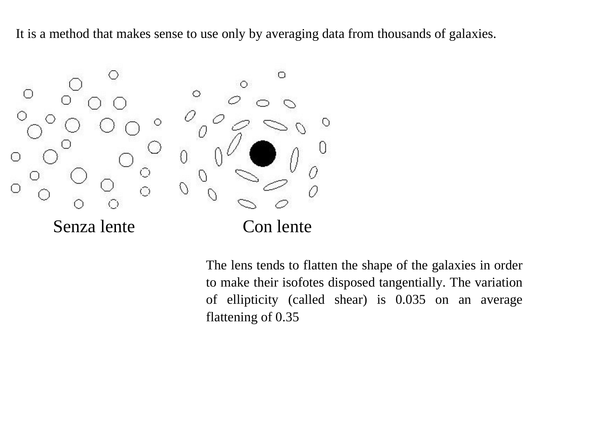

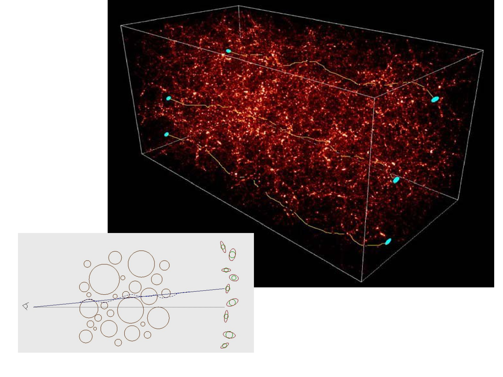

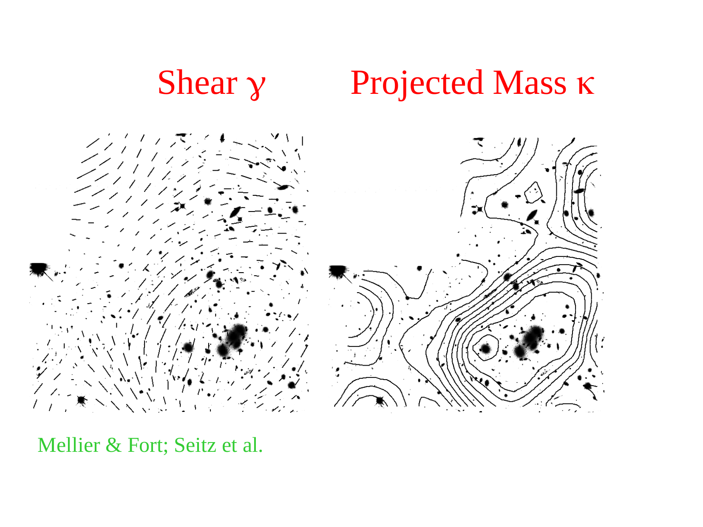

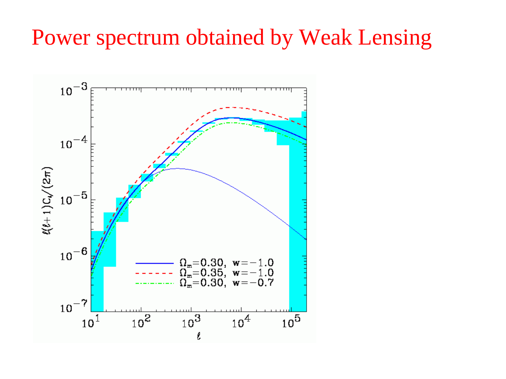

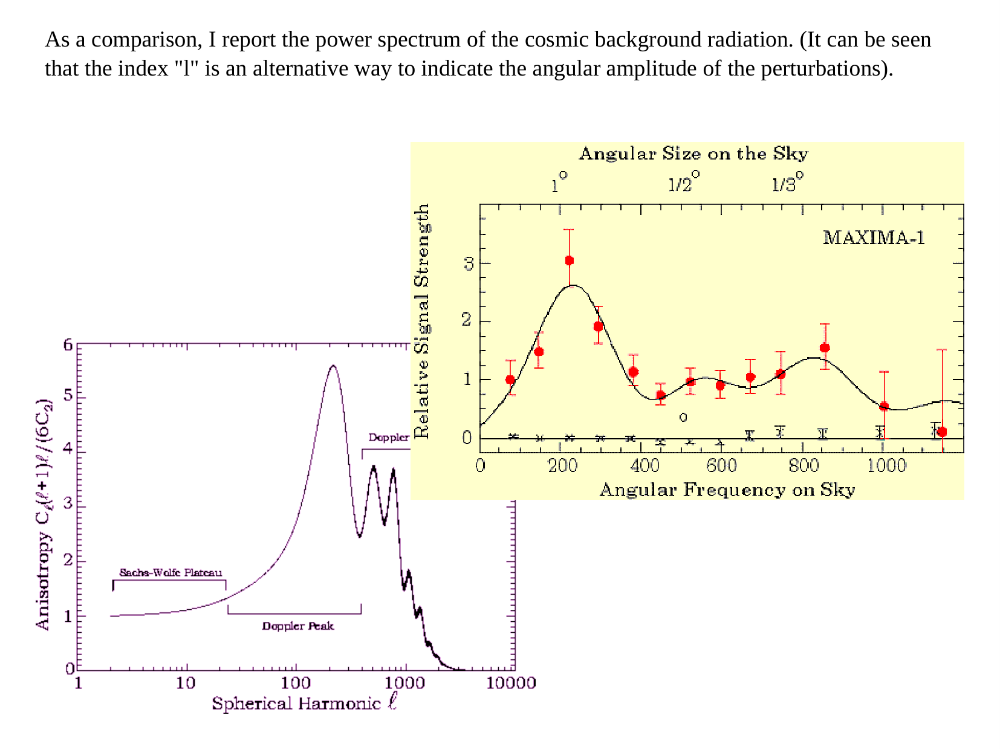

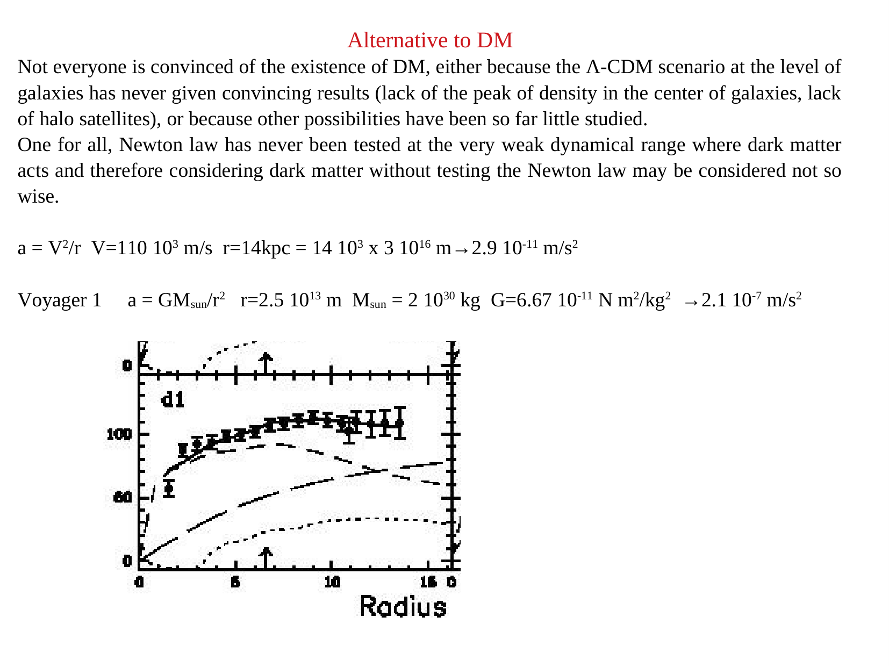

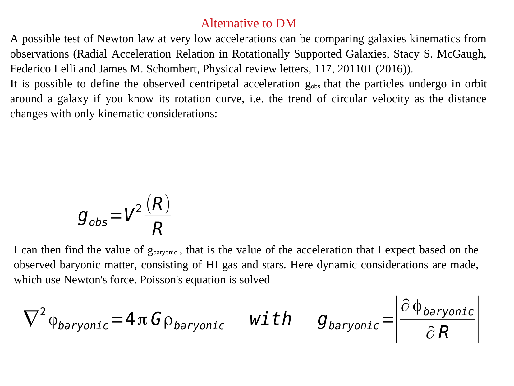

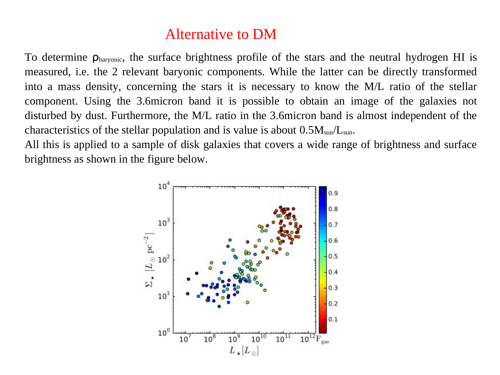

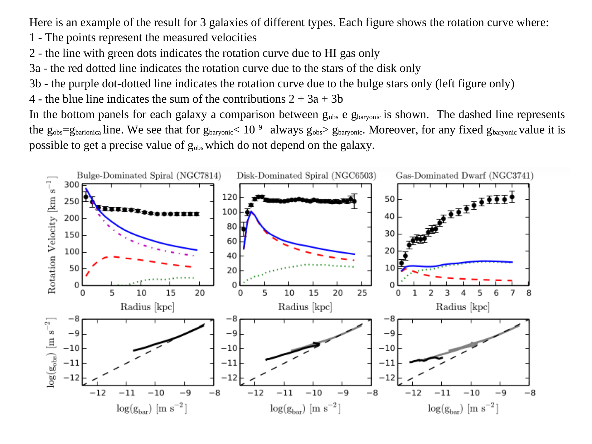

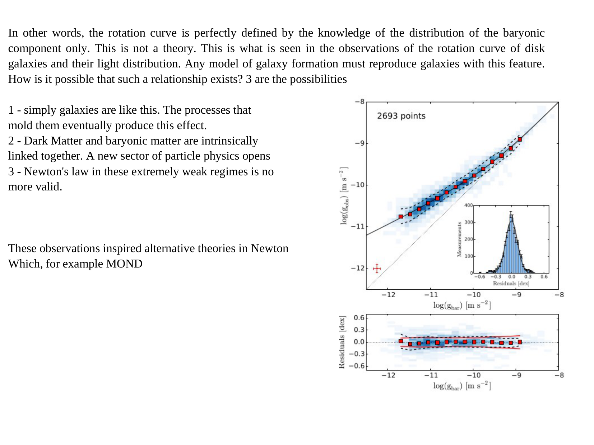

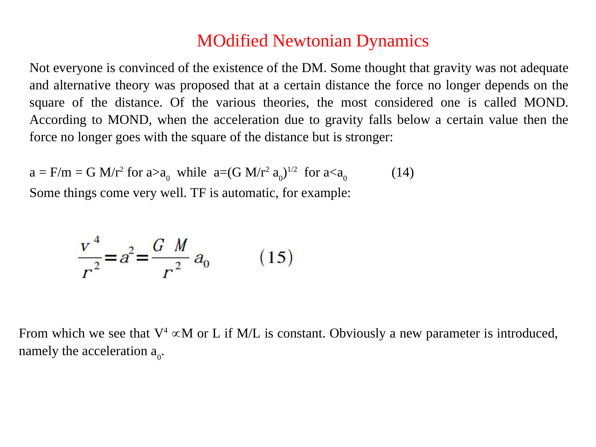

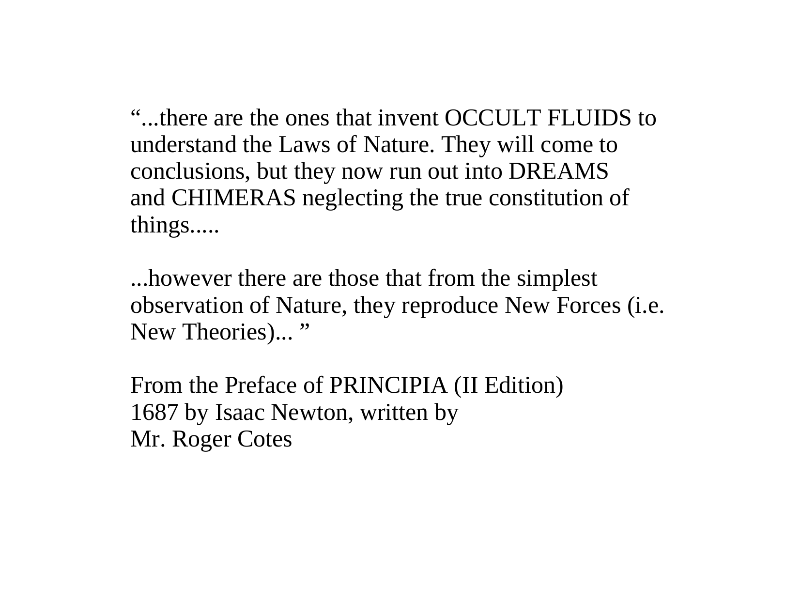

<div class="backlinks-section">
  <h4 class="backlinks-title">Linked References (4)</h4>
  <ul class="backlinks-list">
    <li class="backlink-item-wrap"><a href="Bullet%20Cluster%20and%20dark%20matter%20mapping.html" class="backlink-item">Bullet Cluster and dark matter mapping</a></li>
    <li class="backlink-item-wrap"><a href="Dark%20matter%20in%20dwarf%20galaxies.html" class="backlink-item">Dark matter in dwarf galaxies</a></li>
    <li class="backlink-item-wrap"><a href="Dark%20matter%20rotation%20curves.html" class="backlink-item">Dark matter rotation curves</a></li>
    <li class="backlink-item-wrap"><a href="../../04_Atlas/Astrophysics_of_Galaxies_MOC.html" class="backlink-item">Astrophysics_of_Galaxies_MOC</a></li>
  </ul>
</div>

