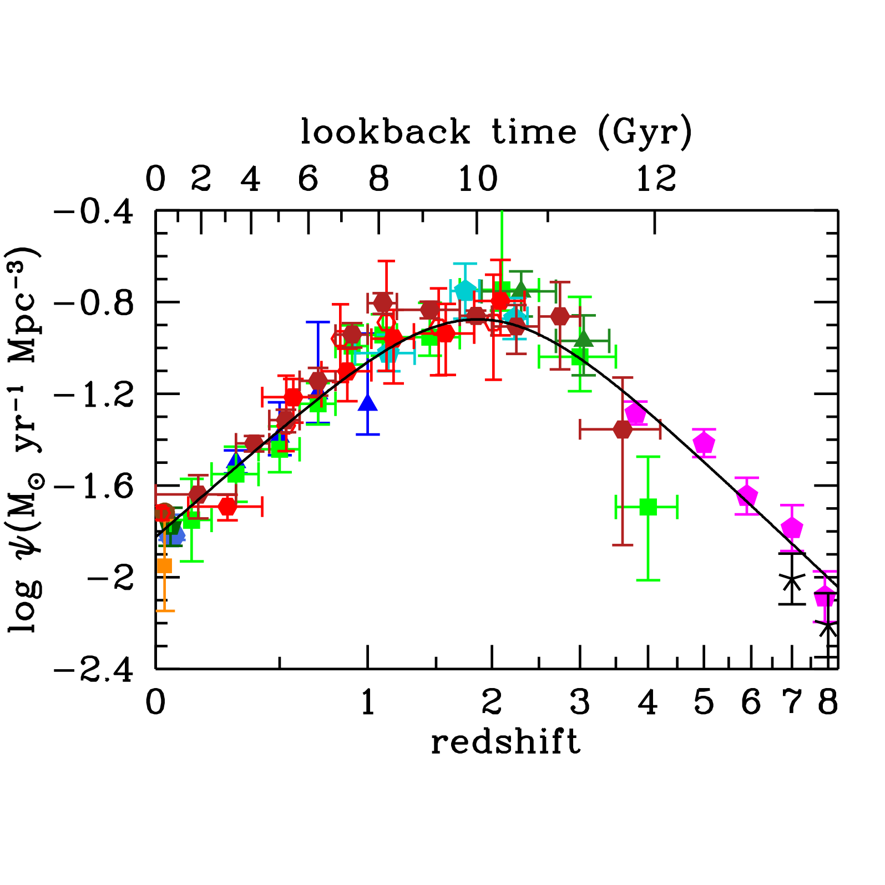
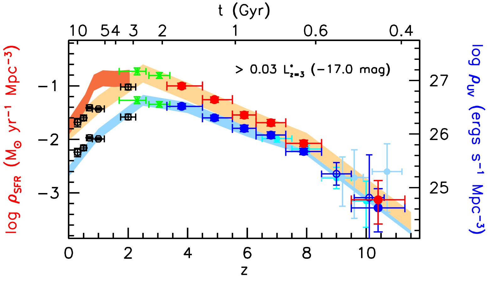
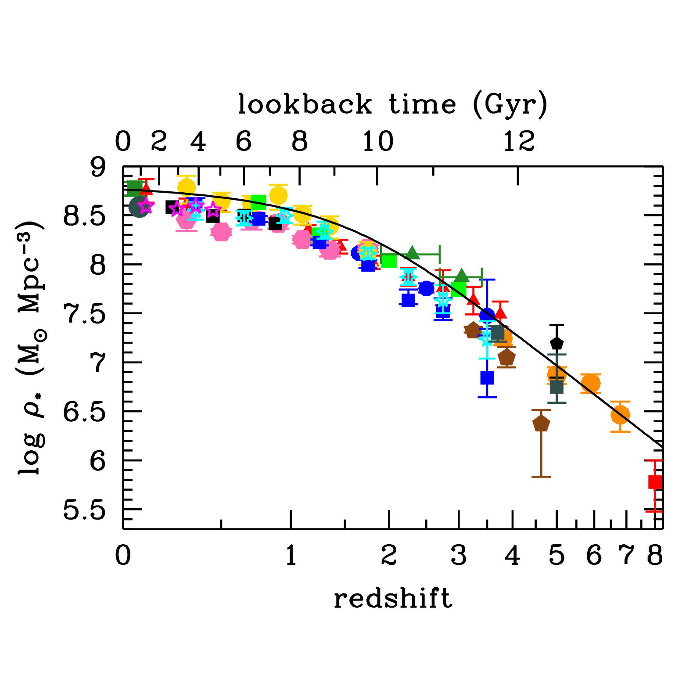


the **Madau plot** (Madau-Dickinson plot) shows the **cosmic star-formation rate density** $\rho_{SFR}$ as a function of redshift. one of the most-cited plots in cosmology. shows that **most stars in the universe formed around $z \sim 2$** (cosmic noon).

## the curve

$\rho_{SFR}(z)$, derived by integrating UV + IR LF measurements at each $z$:

| $z$ | $\rho_{SFR}$ ($M_\odot$/yr/Mpc$^3$) | era |
|---|---|---|
| 0 | $\sim 0.015$ | today |
| 0.5 | $\sim 0.05$ | rising |
| 1 | $\sim 0.10$ | rising |
| 2 | $\sim 0.13$ | **cosmic noon, peak** |
| 3 | $\sim 0.10$ | declining |
| 5 | $\sim 0.06$ | first galaxies dominate |
| 8 | $\sim 0.02$ | reionisation era |
| 10 | $\sim 0.005$ | first galaxies |

so the SFR density:
- **rises** from $z = 0$ to $z = 2$ (factor $\sim 10$).
- **peaks** at $z \sim 2$ (cosmic noon).
- **declines** beyond, dropping by factor $\sim 100$ by $z \sim 10$.

## the parametric form

Madau-Dickinson 2014:
$$\rho_{SFR}(z) \approx 0.015\,\frac{(1+z)^{2.7}}{1 + ((1+z)/2.9)^{5.6}}\,M_\odot/\text{yr}/\text{Mpc}^3$$

approximate; a useful analytic representation.

## the integral: cosmic stellar mass density

integrate $\rho_{SFR}(z)$ over time:
$$\rho_*(z) = \int_z^\infty \frac{\rho_{SFR}(z')\,dz'}{(1+z')H(z')}$$

(modulo the **mass return fraction** $\sim 30$ to $50\%$ from stellar evolution).

result: $\rho_*$ today $\approx 5 \times 10^8\,M_\odot/$Mpc$^3$. consistent with stellar mass functions measured in SDSS + GAMA.

## the science

what the Madau plot tells us:
- **half of stars formed before $z = 1.4$** (cosmic noon era).
- **the universe was much more vigorously star-forming** at $z \sim 2$ than today.
- **galaxy quenching** drives the post-noon decline: galaxies stop forming stars due to gas depletion, AGN feedback, environmental quenching.

## the contributing tracers

building $\rho_{SFR}(z)$ requires **multiple SFR tracers** at different $z$:
- **UV** (rest-frame) at $z = 0$ to $\sim 6$: from UV LF.
- **IR** (rest-frame) at $z = 0$ to $\sim 3$: from Spitzer + Herschel + ALMA.
- **H$\alpha$** at $z = 0$ to $\sim 2$: from spectroscopic surveys.
- **radio** at $z = 0$ to $\sim 3$: from VLA + ASKAP.
- **sub-mm** at $z = 1$ to $\sim 7$: from SCUBA + ALMA.

each tracer has different sensitivity + dust correction needs. the agreement of all tracers at $z \sim 0$ to $3$ validates the plot.

at $z > 6$: only UV LF + JWST IR / sub-mm. less robust + currently being refined by JWST.

## the dust correction

at $z \sim 2$: $\sim 50\%$ of cosmic SFR is dust-obscured. UV alone is **insufficient**. need IR-based correction.

the **dust-corrected** Madau plot (= dust-IR + UV) shows the **true** cosmic SFR. the **uncorrected UV** plot underestimates by factor $\sim 2$ at cosmic noon.

modern Madau plots are dust-corrected.

## the connection to galaxy formation

several insights:
- **galaxies grew most rapidly** at cosmic noon, when gas + dark matter halos were both abundant + star formation efficient.
- **today's massive ellipticals** mostly formed their stars at $z = 2$ to $4$, then quenched.
- **today's spirals** continue forming stars at lower rates.
- **dwarf galaxies** form most of their stars early + evolve passively.

so the Madau plot is the **cosmic star-formation history**, providing the boundary condition for galaxy-formation models.

## see also

- [UV luminosity function](./UV%20luminosity%20function.html)
- [Cosmic star formation history](./Cosmic%20star%20formation%20history.html)
- [UV SFR tracer](./UV%20SFR%20tracer.html)
- [H-alpha SFR tracer](./H-alpha%20SFR%20tracer.html)
- [IR SFR tracer](./IR%20SFR%20tracer.html)
- [Cosmic stellar mass density growth](./Cosmic%20stellar%20mass%20density%20growth.html)
- [Stellar populations I II III](./Stellar%20populations%20I%20II%20III.html)
- [High-z galaxies with JWST](./High-z%20galaxies%20with%20JWST.html)
- [Astrophysics_of_Galaxies_MOC](../../04_Atlas/Astrophysics_of_Galaxies_MOC.html)

---

## astrophysics of galaxies figures and slides (Prof. Alessandro Pizzella)

*The Cosmic Star Formation History (Madau Plot): SFR density rho_SFR(z) from Madau & Dickinson (2014).*

*High-redshift cosmic SFR density evolution up to z ~ 10 (Bouwens et al. 2015).*

*Cosmic stellar mass density growth rho_*(z) obtained by integrating the Madau curve.*


  <h4 class="backlinks-title">Linked References (4)</h4>
  <ul class="backlinks-list">
    <li class="backlink-item-wrap"><a href="../../04_Atlas/Astrophysics_of_Galaxies_MOC.html" class="backlink-item">Astrophysics_of_Galaxies_MOC</a></li>
    <li class="backlink-item-wrap"><a href="./Deep-field%20surveys.html" class="backlink-item">Deep-field surveys</a></li>
    <li class="backlink-item-wrap"><a href="./Protocluster%20detection%20techniques.html" class="backlink-item">Protocluster detection techniques</a></li>
    <li class="backlink-item-wrap"><a href="./UV%20luminosity%20function.html" class="backlink-item">UV luminosity function</a></li>
  </ul>

