the magnitude system is astronomy's logarithmic scale for measuring the flux (apparent brightness) and luminosity (absolute brightness) of celestial objects. originally formulated visually in antiquity, it is now mathematically standardized across calibrated optical and infrared filter passbands.

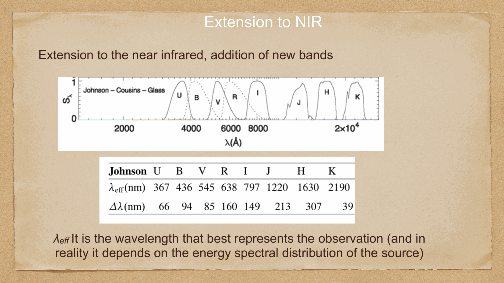

---

## historical origin: Hipparchus to Pogson

around 150 BCE, the Greek astronomer **Hipparchus** cataloged naked-eye stars into six brightness classes:
- 1st magnitude: the $\sim 20$ brightest stars in the night sky.
- 6th magnitude: the faintest stars visible to the human eye under clear dark skies.

in the 19th century, physiological experiments by Weber and Fechner demonstrated that the human eye's response to sensory stimuli is logarithmic: equal increments in perceived brightness correspond to equal multiplicative ratios in physical photon flux.

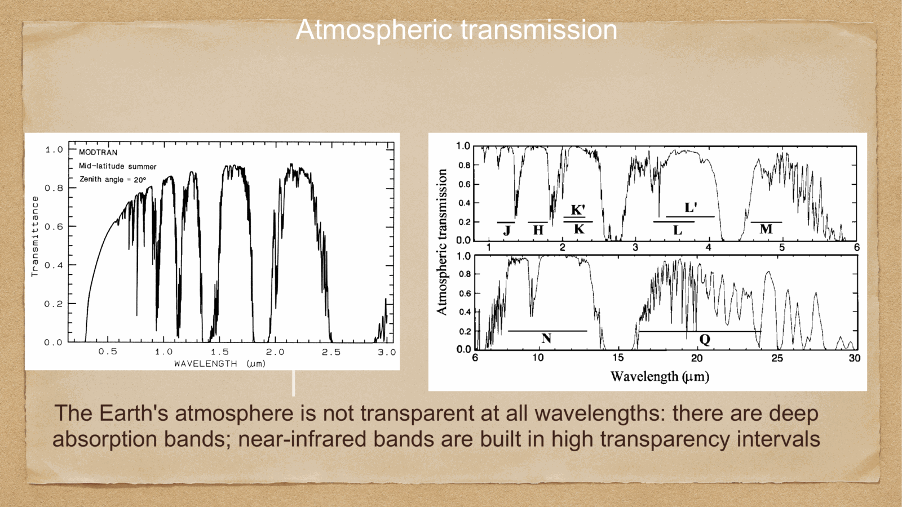

in 1856, **Norman Pogson** standardized the scale by defining that a difference of **5 magnitudes corresponds exactly to a factor of 100 in flux ratio**:
$$100^{1/5} = 10^{2/5} = 10^{0.4} \approx 2.511886...$$
so 1 magnitude corresponds to a flux ratio of $\approx 2.512$.

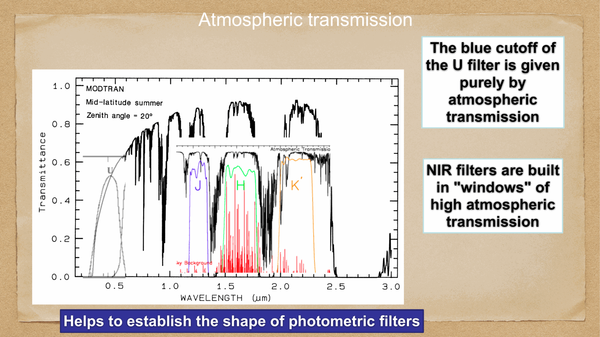

---

## the Pogson formulation

for two stars with received flux densities $F_1$ and $F_2$, the difference in their apparent magnitudes $m_1 - m_2$ is:
$$\boxed{\, m_1 - m_2 = -2.5 \log_{10}\left(\frac{F_1}{F_2}\right) \,}$$

### the inverse relation:
$$\frac{F_1}{F_2} = 10^{-0.4 (m_1 - m_2)}$$

### crucial notes on the scale:
1. **the minus sign**: brighter objects have **smaller** (or more negative) magnitudes! 
2. **apparent magnitude benchmarks**:
   - the Sun: $m = -26.74$
   - Full Moon: $m \approx -12.7$
   - Venus at maximum brightness: $m \approx -4.4$
   - Sirius (brightest night star): $m = -1.46$
   - Vega: $m \approx 0.03$ (historical zero-point)
   - naked-eye limit: $m \approx +6.0$
   - Hubble Space Telescope limit: $m \approx +31$

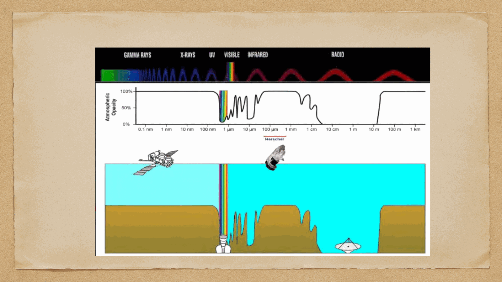

for a single star, defining an instrumental zero-point $C$:
$$m = -2.5 \log_{10} F + C$$

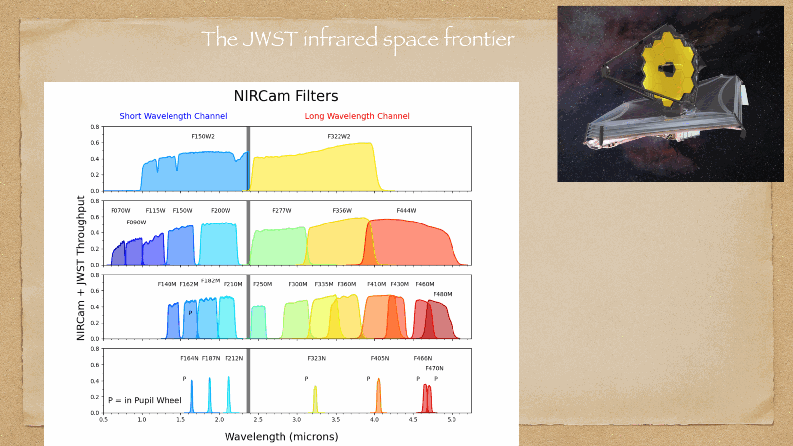

---

## absolute magnitude $M$ and the distance modulus $\mu$

apparent magnitude $m$ reflects both the intrinsic luminosity $L$ and distance $d$ through the inverse-square law $F = L/(4\pi d^2)$.

to compare intrinsic luminosities, astronomers define the **absolute magnitude** $M$:
the apparent magnitude a star would have if placed at a standard distance of **$d_0 = 10$ parsecs**:

$$m - M = -2.5 \log_{10}\left(\frac{F(d)}{F(10\text{ pc})}\right) = -2.5 \log_{10}\left(\frac{L / 4\pi d^2}{L / 4\pi (10)^2}\right) = -2.5 \log_{10}\left(\frac{10}{d}\right)^2 = 5 \log_{10}\left(\frac{d}{10}\right)$$

this defines the fundamental **distance modulus** $\mu$:
$$\boxed{\, \mu \equiv m - M = 5 \log_{10} d - 5 = 5 \log_{10}\left(\frac{d}{10\text{ pc}}\right) \,}$$
(where distance $d$ is strictly in parsecs).

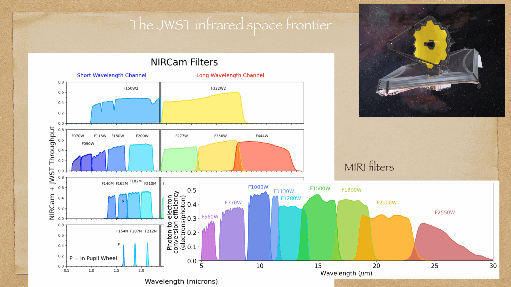

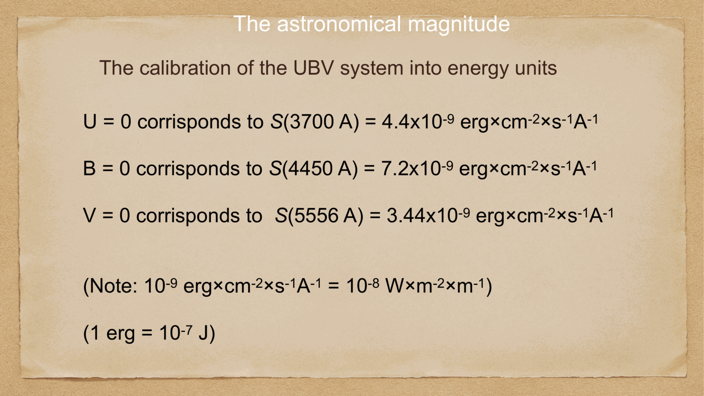

### distance modulus lookup table:
| distance $d$ | distance modulus $\mu = m - M$ | typical astronomical scale |
|---|---|---|
| $10$ pc | $0.0$ | solar neighborhood |
| $100$ pc | $+5.0$ | local open clusters (Pleiades $\sim 135$ pc) |
| $1$ kpc | $+10.0$ | Milky Way spiral arms |
| $8$ kpc | $+14.5$ | Galactic Center |
| $50$ kpc | $+18.5$ | Large Magellanic Cloud (LMC) |
| $780$ kpc | $+24.5$ | Andromeda Galaxy (M31) |
| $16$ Mpc | $+31.0$ | Virgo Galaxy Cluster |

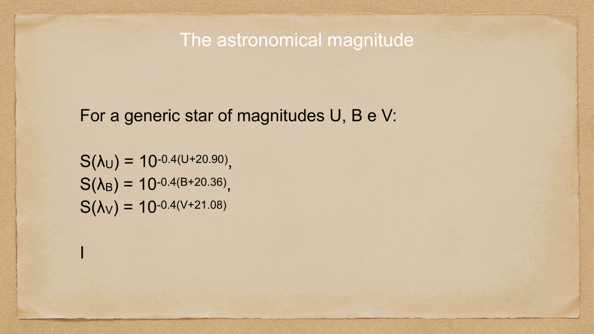

---

## bolometric magnitude and bolometric correction

the **bolometric magnitude** $m_{\text{bol}}, M_{\text{bol}}$ measures the total flux integrated across the entire electromagnetic spectrum ($0 \le \lambda < \infty$).

it is directly proportional to true luminosity:
$$M_{\text{bol}} - M_{\text{bol},\odot} = -2.5 \log_{10}\left(\frac{L}{L_\odot}\right)$$
taking $M_{\text{bol},\odot} = +4.74$ mag:
$$M_{\text{bol}} = 4.74 - 2.5 \log_{10}\left(\frac{L}{L_\odot}\right)$$

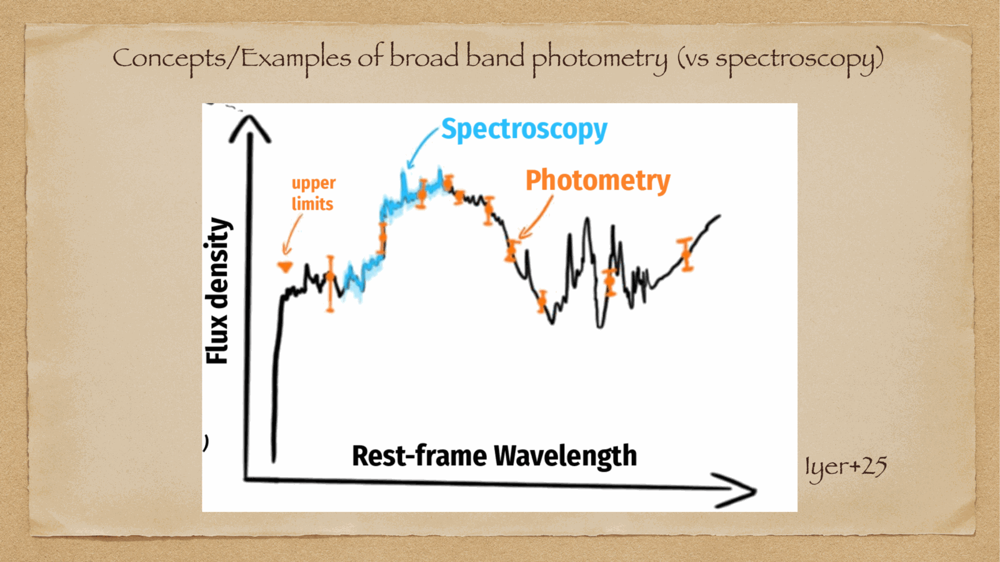

### bolometric correction (BC):
optical filters only sample a fraction of the total spectrum. the **bolometric correction** translates standard V-band magnitude to bolometric magnitude:
$$\boxed{\, BC \equiv m_{\text{bol}} - V = M_{\text{bol}} - M_V \,}$$
(by convention, $BC \le 0$ always in modern usage, because a star always emits more total bolometric flux than through the V-filter alone). $BC$ is large and negative for very hot stars (which emit predominantly in UV) and very cool stars (which emit in infrared), and minimal near G-type stars ($BC_\odot \approx -0.07$).

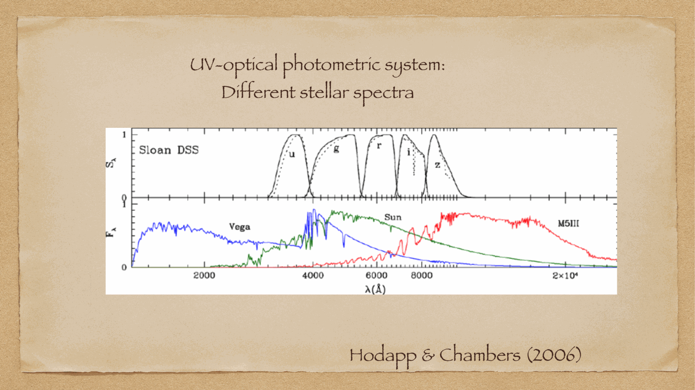

---

## broad-band photometric systems: UBVRI

telescopes use optical filters to measure flux in specific wavelength windows. the most widely used standard is the **Johnson-Cousins UBVRI system**:

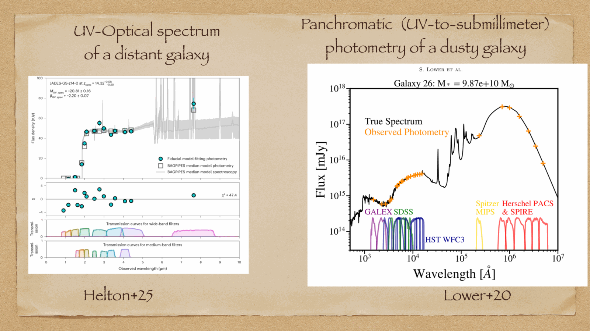

each filter is defined by a transmission function $S_X(\lambda)$ characterizing the fraction of light transmitted at each wavelength:
$$F_X = \int_0^\infty F_\lambda(\lambda) \, S_X(\lambda) \, d\lambda$$

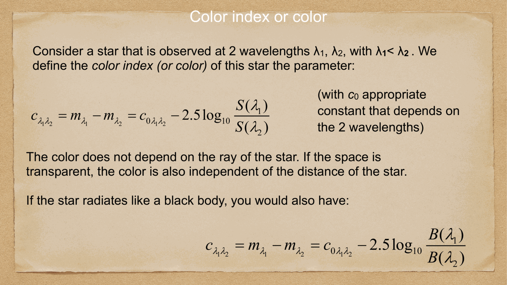

| filter | band name | central wavelength $\lambda_{\text{eff}}$ | bandpass FWHM $\Delta\lambda$ | physical feature tracked |
|---|---|---|---|---|
| **U** | Ultraviolet | $365$ nm ($3650$ Å) | $68$ nm | Balmer jump / continuum |
| **B** | Blue | $440$ nm ($4400$ Å) | $98$ nm | stellar temperature, line blanketing |
| **V** | Visual | $550$ nm ($5500$ Å) | $89$ nm | close to human eye photopic peak |
| **R** | Red (Cousins) | $640$ nm ($6400$ Å) | $160$ nm | $H\alpha$, intermediate-age stars |
| **I** | Infrared (Cousins) | $790$ nm ($7900$ Å) | $150$ nm | cool stars, lower dust extinction |

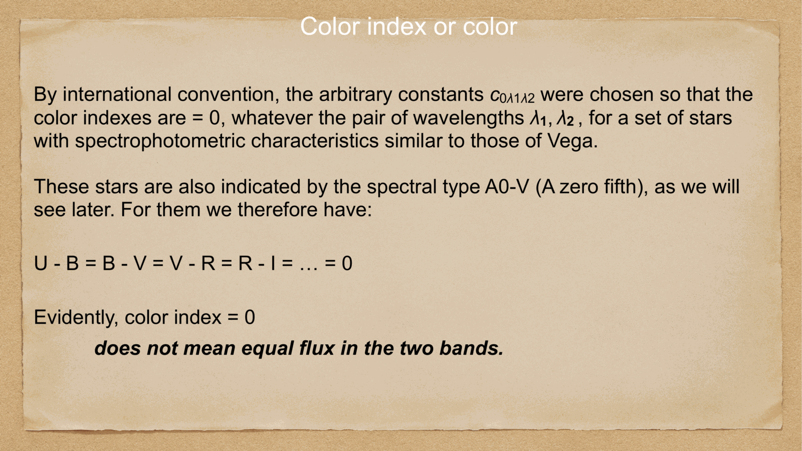

---

## color indices and color-temperature relation

the difference between magnitudes measured in two different filters is a **color index**:
$$B - V = m_B - m_V = -2.5 \log_{10}\left(\frac{F_B}{F_V}\right) + \text{const}$$
$$U - B = m_U - m_B = -2.5 \log_{10}\left(\frac{F_U}{F_B}\right) + \text{const}$$

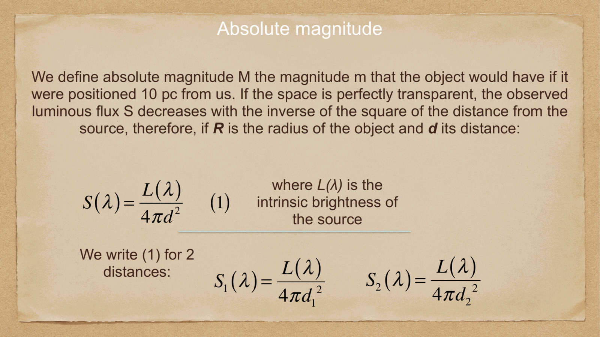

### color index as an intrinsic thermometer:
because distance cancels out in the ratio $F_B / F_V = (L_B / 4\pi d^2) / (L_V / 4\pi d^2) = L_B / L_V$, a **color index is completely independent of distance** (in the absence of dust extinction)!

- **hot stars ($T > 10,000$ K)**: emit far more blue light than yellow light $\implies F_B > F_V \implies B - V < 0$ (e.g. O stars have $B - V \approx -0.33$).
- **cool stars ($T < 4000$ K)**: emit predominantly in yellow/red $\implies F_B < F_V \implies B - V > 0$ (e.g. M dwarfs have $B - V \approx +1.5$).
- the Sun ($T_{\text{eff}} \approx 5778$ K): $B - V = +0.65$.

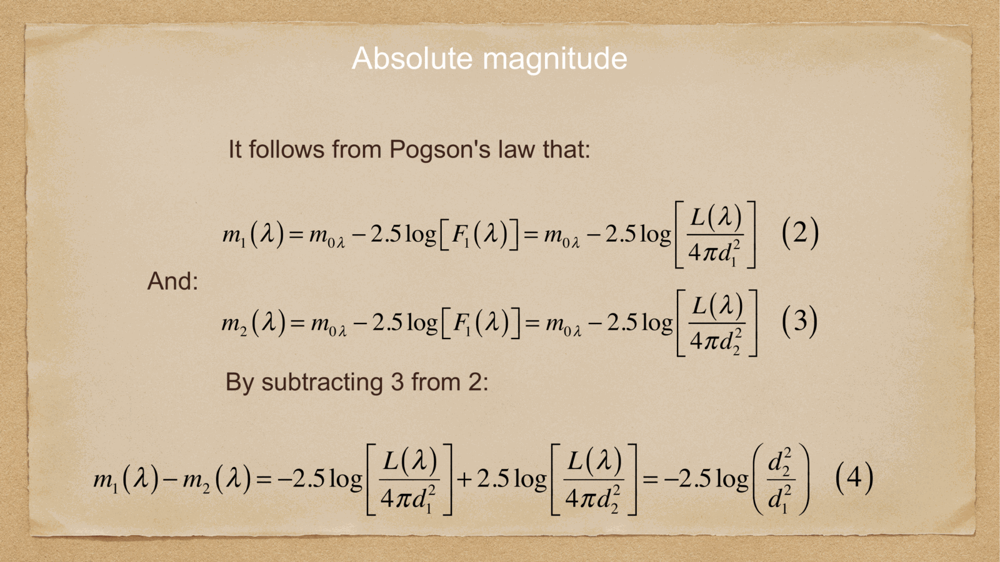

---

## photometric zero-points: Vega vs AB systems

1. **the Vega system**: historically defines the bright standard star **Vega** ($\alpha$ Lyr, A0V) to have magnitude $0.00$ in all filters ($U=B=V=R=I=0$), so all color indices for Vega are $0.00$.
2. **the AB magnitude system (Oke & Gunn 1983)**: defined directly in physical units of monochromatic flux density:
   $$m_{\text{AB}}(\nu) = -2.5 \log_{10}\left(\frac{f_\nu}{1\text{ Jy}}\right) + 8.90 = -2.5 \log_{10}\left(f_\nu [\text{erg s}^{-1}\text{ cm}^{-2}\text{ Hz}^{-1}]\right) - 48.60$$
   where $m_{\text{AB}} = 0$ corresponds to a constant flux density $f_\nu = 3631$ Jy across all frequencies. modern large-scale sky surveys (SDSS, Pan-STARRS, DES, LSST, Euclid) use AB magnitudes.

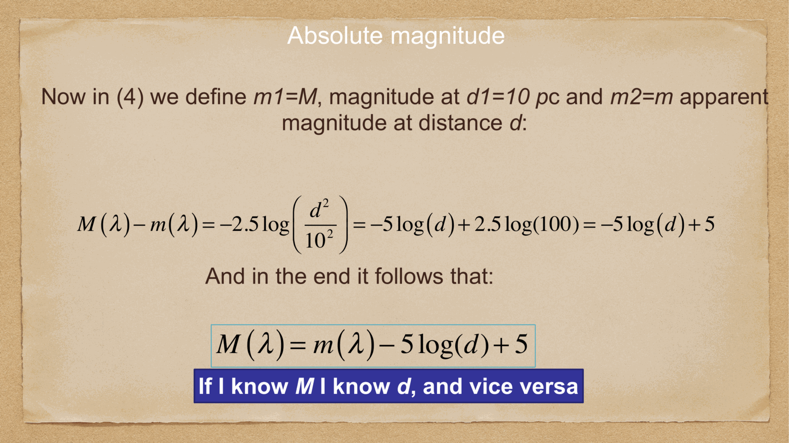

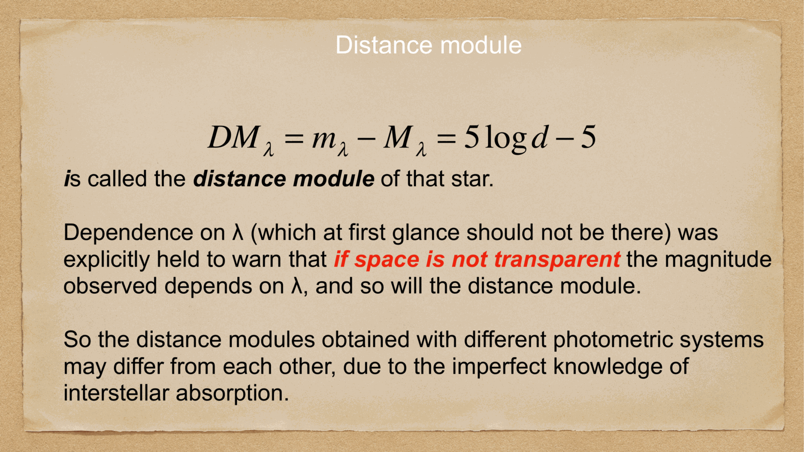

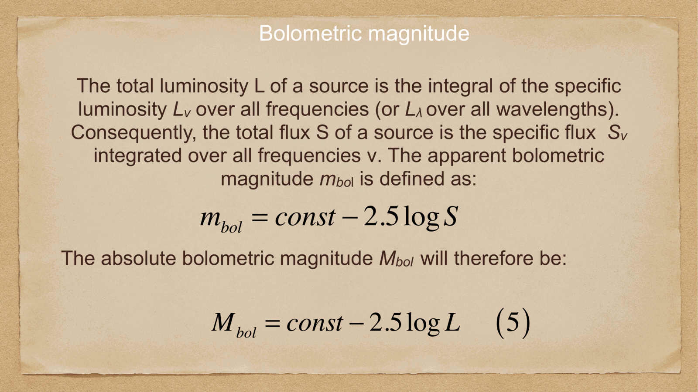

---

## see also

- [[Fundamentals_Astrophysics_Cosmology_MOC]]
- [[Electromagnetic radiation basics]]
- [[Blackbody radiation and Stefan-Boltzmann]]
- [[Interstellar absorption]]
- [[HR diagram]]
- [[Parallax and standard candles]]

---

## observational astrophysics course slides (Prof. Paolo Cassata)

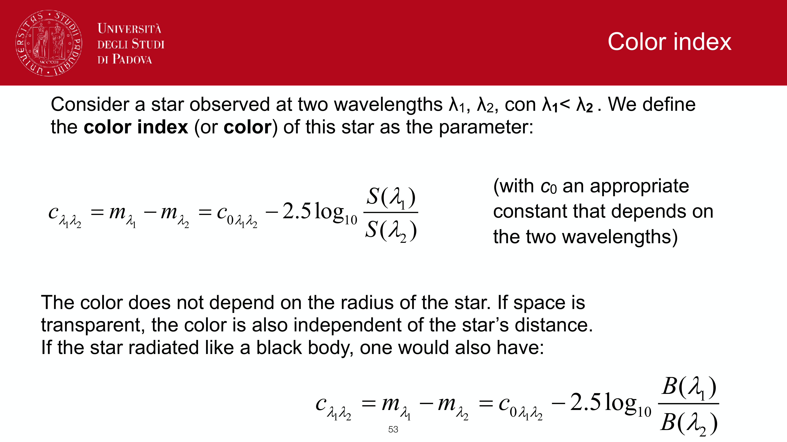
*Vega magnitude system: alpha Lyr defined as m = 0 across all optical/NIR passbands.*

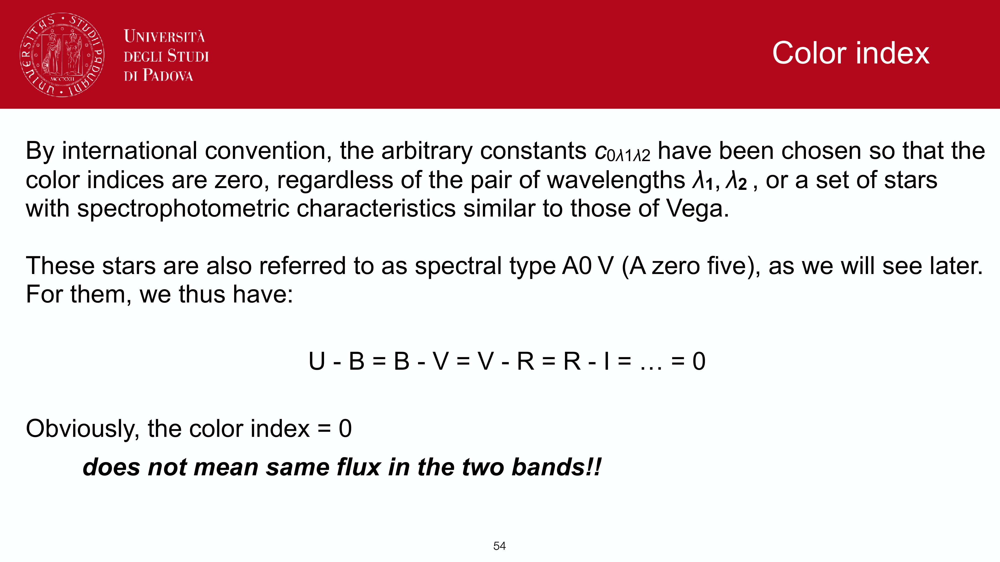
*AB magnitude system: monochromatic flux zero-point f_nu,0 = 3631 Jy.*

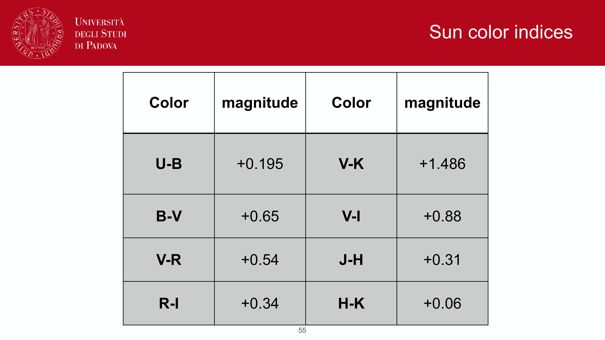
*AB magnitude formula: m_AB = -2.5 log10(f_nu / Jy) + 8.90.*

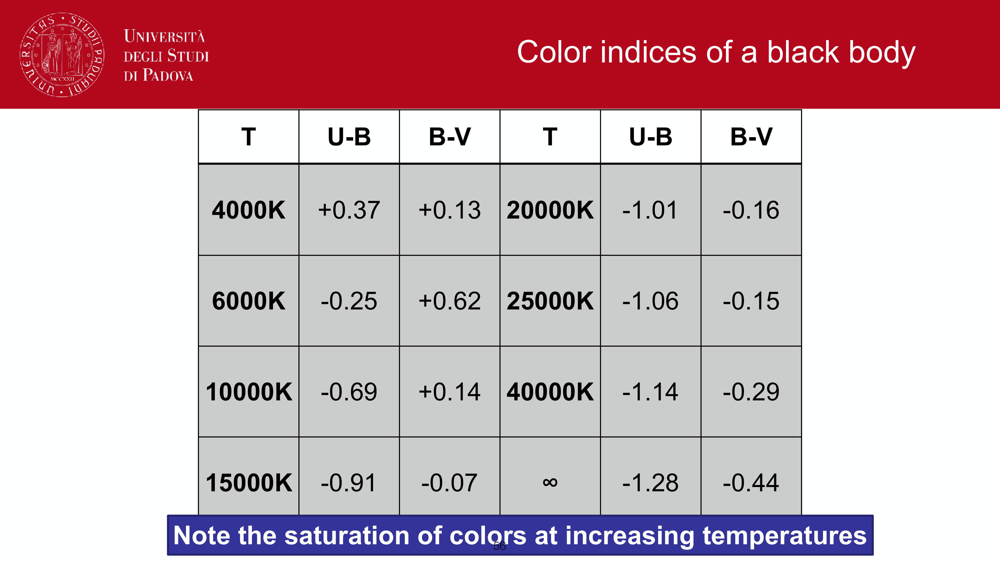
*ST magnitude system: defined per unit wavelength flux density f_lambda.*

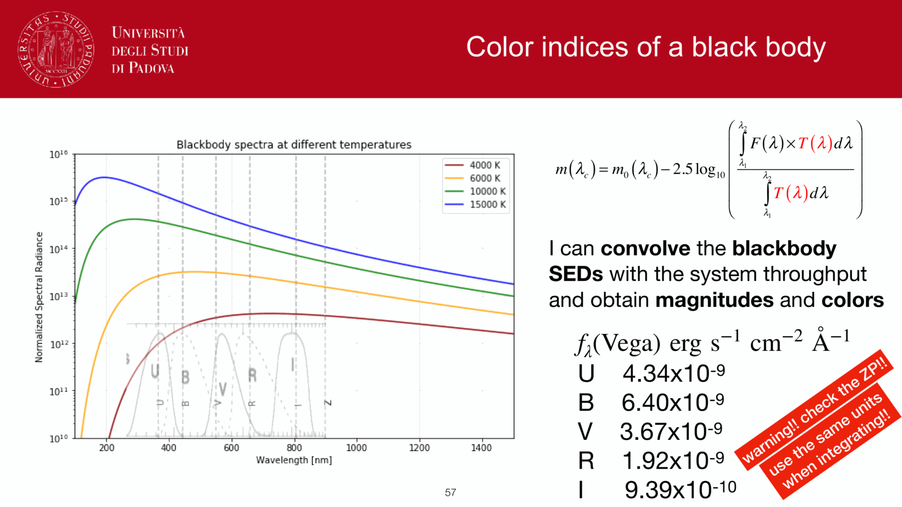
*Comparison of Vega, AB, and ST zero-points.*

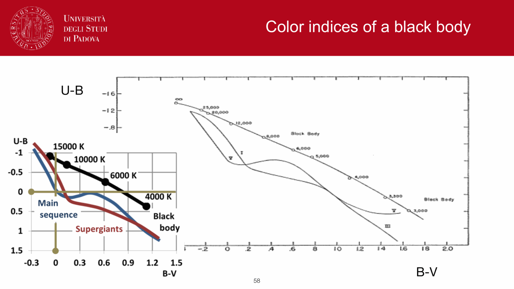
*Synthetic photometry: integrating SED over filter transmission curve T(lambda).*

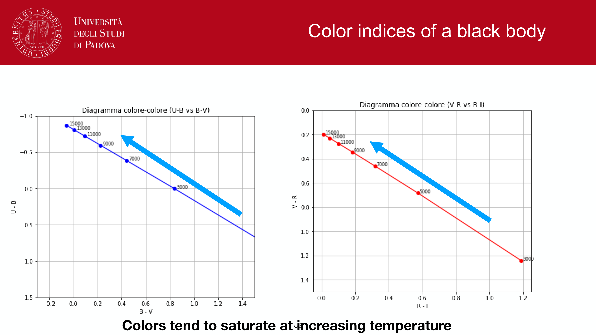
*Effective flux and pivot wavelength of photometric bandpasses.*

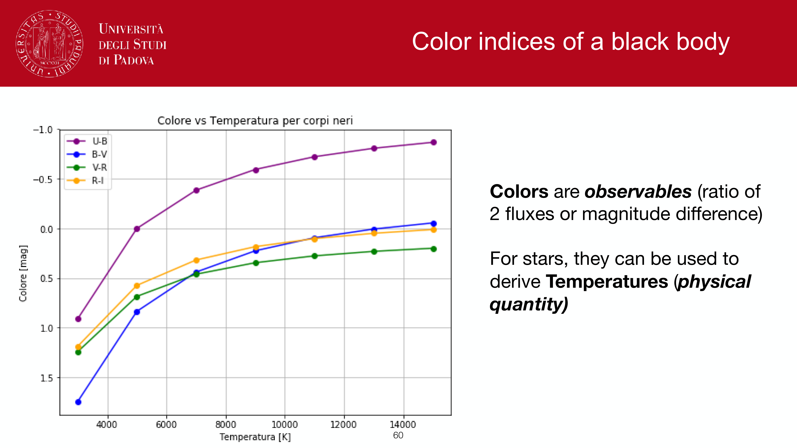
*Photometric catalogs and standardized star standards (Landolt, Stetson).*

## Linked References

- [[Aperture photometry]]
- [[Atmospheric extinction]]
- [[Bolometric correction and effective temperature]]
- [[CCD detectors and SNR]]
- [[Color indices]]
- [[Distance modulus]]
- [[Earth atmosphere for observations]]
- [[Filter systems and bandpasses]]
- [[Flux calibration]]
- [[Interstellar absorption]]
- [[Linearity and saturation]]
- [[Parallax and standard candles]]
- [[Photometric standard stars]]
- [[Photometric system conversion and color terms]]
- [[Pogson magnitudes and flux relation]]
- [[Radiation quantities and inverse square law]]
- [[Specific intensity flux luminosity]]
- [[Survey resources for Obs Astro]]
- [[Useful constants and conversions]]
- [[Fundamentals_Astrophysics_Cosmology_MOC]]
- [[Observational_Astrophysics_MOC]]

