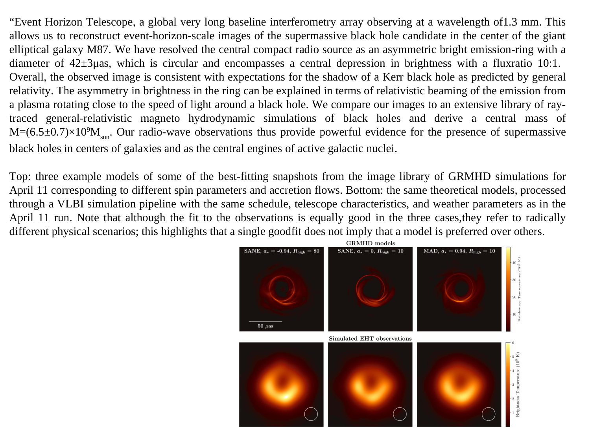
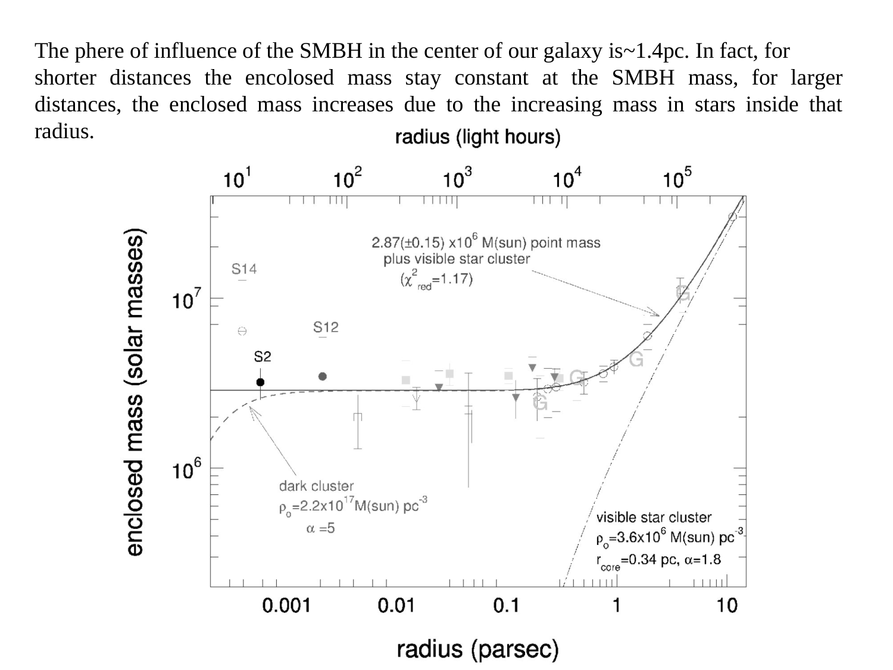
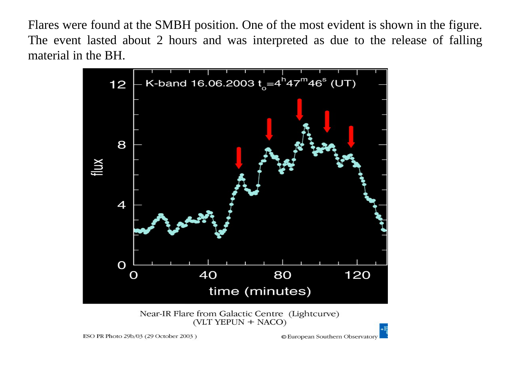
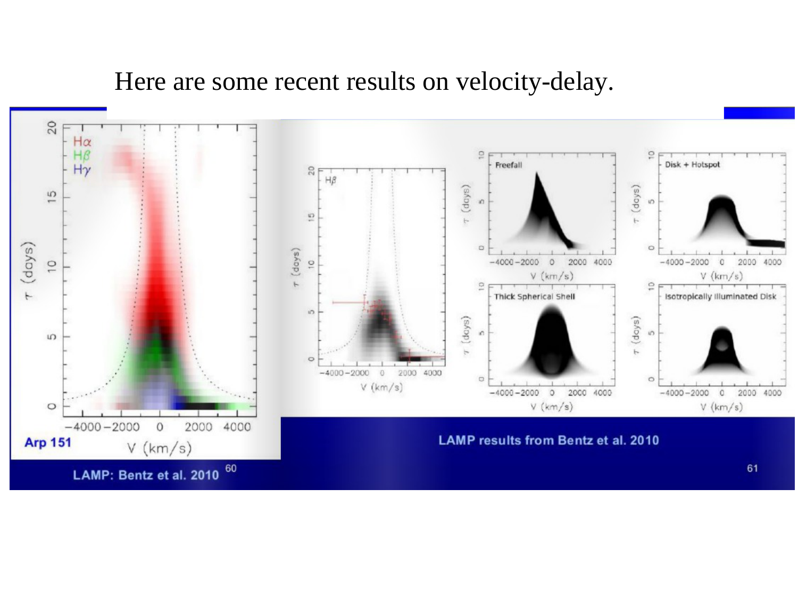
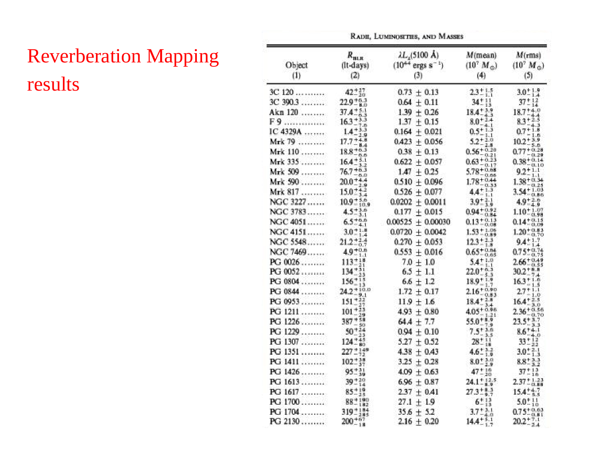
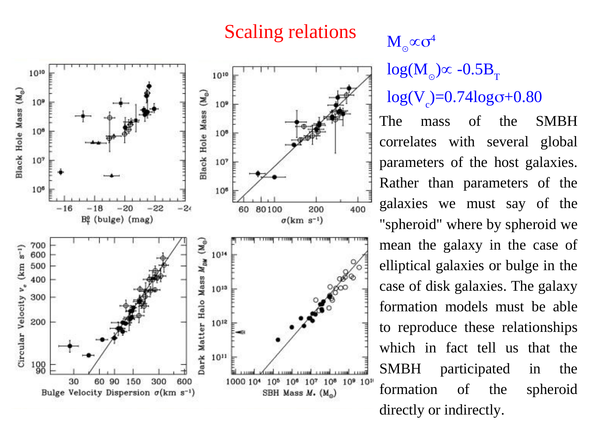
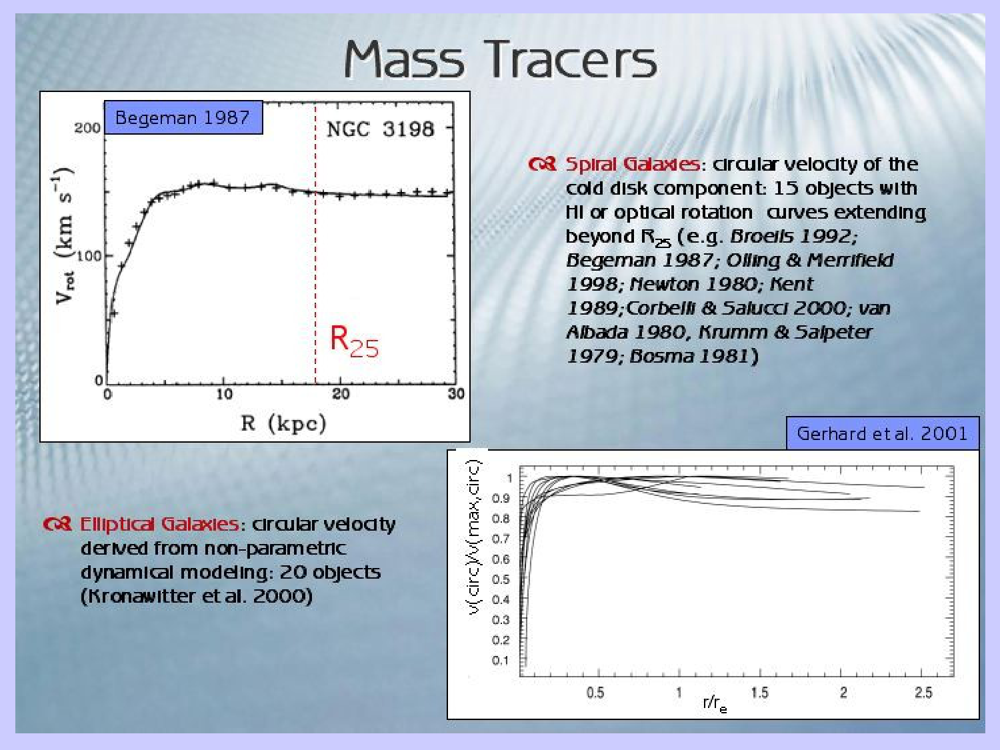
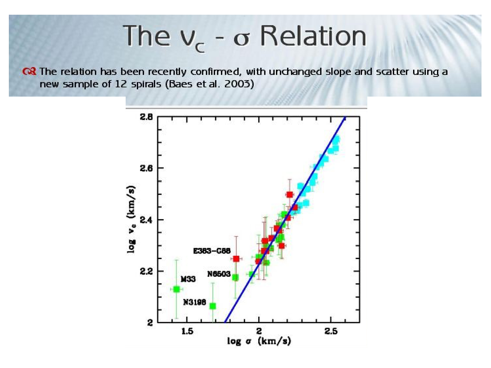
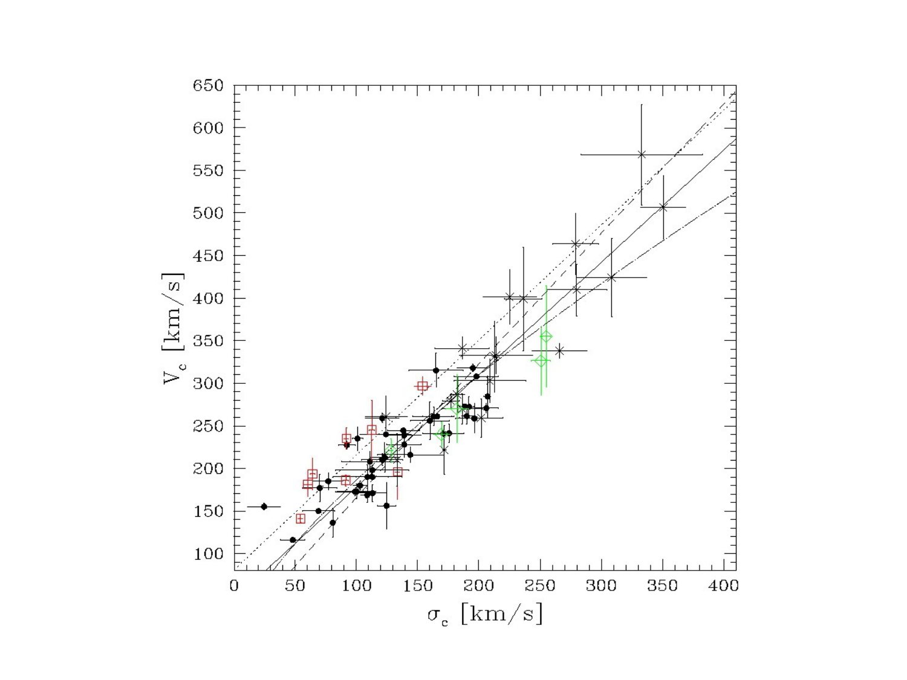

# Magorrian Relation

## 1. Empirical Definition and Scaling

The **Magorrian relation** (Magorrian et al. 1998; Marconi & Hunt 2003; Häring & Rix 2004; Kormendy & Ho 2013) describes the fundamental empirical correlation between the mass of a central supermassive black hole $M_\bullet$ and the stellar mass of its host galaxy spheroidal component $M_{\rm bulge}$.

$$M_\bullet \approx 1.4 \times 10^{-3} \, M_{\rm bulge}$$

In logarithmic form across classical bulges and elliptical galaxies.

$$\log_{10}\left(\frac{M_\bullet}{M_\odot}\right) = (8.46 \pm 0.08) + (1.05 \pm 0.11) \log_{10}\left(\frac{M_{\rm bulge}}{10^{11} M_\odot}\right)$$

The observed intrinsic scatter is approximately $0.3$ to $0.4$ dex across three orders of magnitude in bulge mass ($10^9 M_\odot \le M_{\rm bulge} \le 10^{12} M_\odot$). This indicates that supermassive black holes consistently account for approximately $0.1\%$ to $0.5\%$ of the total stellar mass of the spheroidal host.

---

## 2. Unbroken Mathematical Derivation - Self-Regulated AGN Feedback

The spatial gravitational reach of a supermassive black hole is limited to its sphere of influence $r_{\rm infl} \sim 10\,\mathrm{pc}$, whereas the galactic bulge extends over $R_e \sim 10\,\mathrm{kpc}$ (three orders of magnitude larger). The tight linear coupling is established during the active quasar phase through self-regulated gas accretion and energy-momentum injection into the interstellar medium.

### Step 1 - Gravitational Binding Energy of the Spheroid
Consider a spheroidal bulge of total stellar mass $M_{\rm bulge}$ and 1D velocity dispersion $\sigma$. By the Virial theorem, the gravitational potential energy and total binding energy of the gas and stellar reservoir scale as.

$$E_{\rm bind} \approx \frac{G M_{\rm bulge}^2}{R_e} \approx M_{\rm bulge} \sigma^2$$

where we have substituted the virial equilibrium condition $G M_{\rm bulge} / R_e \sim \sigma^2$.

### Step 2 - Total Energy Injected by Black Hole Growth
As the black hole grows from an initial seed to its final mass $M_\bullet$ via accretion of gas, the total rest-mass energy converted into radiant and kinetic output is governed by the accretion radiative efficiency $\eta \approx 0.1$.

$$E_{\rm acc} = \eta M_\bullet c^2$$

### Step 3 - Hydrodynamic Coupling to the Host Gas Reservoir
Only a small fraction $f_{\rm acc}$ of this radiated energy couples hydrodynamically to the interstellar gas.

$$E_{\rm feedback} = f_{\rm acc} E_{\rm acc} = f_{\rm acc} \eta M_\bullet c^2$$

In the energy-driven feedback regime (Silk & Rees 1998; King 2003, 2005), the expanding shocked outflow sweeps up the interstellar gas until the feedback energy equals or exceeds the gravitational binding energy of the gas.

$$E_{\rm feedback} \ge E_{\rm bind}$$

### Step 4 - Derivation of the Linear Mass Ratio
Equating the feedback energy to the host binding energy at the blowout threshold.

$$f_{\rm acc} \eta M_\bullet c^2 \approx M_{\rm bulge} \sigma^2$$

Rearranging for the mass ratio $M_\bullet / M_{\rm bulge}$.

$$\frac{M_\bullet}{M_{\rm bulge}} \approx \frac{1}{f_{\rm acc} \eta} \left(\frac{\sigma}{c}\right)^2$$

For a characteristic massive elliptical galaxy with stellar velocity dispersion $\sigma \approx 200\,\mathrm{km\,s^{-1}}$.

$$\frac{\sigma}{c} \approx \frac{200\,\mathrm{km\,s^{-1}}}{3 \times 10^5\,\mathrm{km\,s^{-1}}} \approx 6.67 \times 10^{-4}$$

$$\left(\frac{\sigma}{c}\right)^2 \approx 4.44 \times 10^{-7}$$

The mechanical coupling fraction from relativistic winds and radiation in numerical simulations is $f_{\rm acc} \approx 4.4 \times 10^{-4}$ to $5 \times 10^{-4}$. Substituting these values into the ratio.

$$\frac{M_\bullet}{M_{\rm bulge}} \approx \frac{4.44 \times 10^{-7}}{(5 \times 10^{-4})(0.1)} \approx \frac{4.44 \times 10^{-7}}{5 \times 10^{-5}} \approx 10^{-3}$$

This analytical balance proves why the central black hole mass represents roughly $0.1\%$ to $0.2\%$ of the host bulge mass across cosmological epochs.

### Step 5 - Connection Between Magorrian and M-Sigma Relations
The Magorrian relation is linked to the $M_\bullet - \sigma$ relation through the Faber-Jackson relation and the Virial theorem.

1. Virial mass scaling - $M_{\rm bulge} \propto R_e \sigma^2 / G$
2. Faber-Jackson relation - $L \propto \sigma^4$, which with slowly varying mass-to-light ratio gives $M_{\rm bulge} \propto \sigma^4$
3. Combining $M_\bullet \propto \sigma^4$ with $M_{\rm bulge} \propto \sigma^4$ naturally yields $M_\bullet \propto M_{\rm bulge}$

---

## 3. Classical Bulges Versus Pseudobulges

Observational analyses (Kormendy & Ho 2013) demonstrate that the Magorrian relation is not universal across all galaxy morphologies.

### Classical Bulges and Elliptical Galaxies
- Built through major mergers, violent relaxation, and intense high-redshift starbursts
- The mean black hole to bulge mass ratio is approximately $0.49\% \pm 0.07\%$
- Exhibit very tight correlation with low intrinsic scatter ($\sim 0.28\,\mathrm{dex}$)
- Demonstrates true co-evolution where black hole growth and spheroid assembly were mutually regulated

### Pseudobulges
- Built through internal secular disk processes, bar-driven gas inflow, and gentle star formation
- Do not correlate tightly with black hole mass
- Lie systematically below the Magorrian relation by $0.5$ to $1.0$ dex
- The black hole mass ratio is typically $M_\bullet / M_{\rm bulge} < 0.1\%$
- Indicates that secular disk evolution drives central mass growth without triggering large-scale AGN feedback

### Bulgeless and Pure Disk Galaxies
- Galaxies without a spheroidal component (e.g. M33) generally lack massive black holes or host intermediate-mass black holes far below the relation ($M_\bullet < 1500\,M_\odot$)
- Proves that the presence of a classical bulge formed via violent relaxation is the necessary prerequisite for massive black hole co-evolution

---

## 4. Blackboard Observational Blueprint

When sketching the Magorrian relation during the oral examination.

```text
  log10(M_BH / M_sun)
       |
    10 |                                   / (M87, NGC 4889)
       |                                 /
     9 |                               /   <=== Classical Bulges & Ellipticals
       |                             /         Slope beta ~ 1.0
     8 |                           /   (Milky Way Bulge)
       |                         /
     7 |                       /
       |                     /     *  *  (Pseudobulges fall below)
     6 |                   /    *    *
       |                 /
     5 +===============+===============+===============+===============+
       8               9              10              11              12
                                     log10(M_bulge / M_sun)
```

### Key Blackboard Features
- **Horizontal Axis** - Bulge stellar mass $\log_{10}(M_{\rm bulge} / M_\odot)$ ranging from $8.0$ to $12.5$
- **Vertical Axis** - Central black hole mass $\log_{10}(M_\bullet / M_\odot)$ ranging from $5.0$ to $10.5$
- **Slope** - Linear slope $\beta = 1.0$ representing a constant ratio $M_\bullet / M_{\rm bulge} \approx 10^{-3}$
- **Dynamic Range** - Spans from small bulges ($M_\bullet \sim 10^6 M_\odot$) to giant cD ellipticals ($M_\bullet \sim 10^{10} M_\odot$)
- **Offsets** - Mark pseudobulges as scattered points falling $0.5$ to $1.0$ dex below the solid line

---

## 5. Textbook and Course Citations

- **Prof. Alessandro Pizzella Course Dispensa**
  - File - `dispense_smbh_20_eng.pdf`
  - Chapter 3, Section 3.2 "The $M_{\rm BH} - M_{\rm bulge}$ relation", page 27 (original Magorrian 1998 discovery, observed mass ratios, and co-evolution framework).
- **Student Synthesis Document**
  - File - `SMBH_in_Galaxies.tex`
  - Section 10.2 "The Magorrian Relation", pages 23-25 (Häring & Rix 2004 calibrations, classical bulges vs pseudobulges, coupling equations).
- **Mo, van den Bosch & White (2010), *Galaxy Formation and Evolution***
  - File - `Houjun Mo, Frank van den Bosch, Simon White - Galaxy Formation and Evolution (2010, Cambridge University Press) - libgen.li.pdf`
  - Chapter 14, Section 14.4 "AGN and Galaxy Formation", pages 670-673 (feedback energy balance, blowout criteria, and host binding energy).
- **Binney & Merrifield (1998), *Galactic Astronomy***
  - File - `Binney J., Merrifield M. - Galactic Astronomy (1998, Princeton).pdf`
  - Chapter 10, Section 10.5 "Galactic Nuclei", pages 700-710.
- **Binney & Tremaine (2008), *Galactic Dynamics***
  - File - `Binney, Tremaine - Galactic Dynamics 2ed.pdf`
  - Chapter 8, Section 8.4, pages 700-705.

---

## 6. See Also

- [M sigma relation](M%20sigma%20relation.html)
- [Reverberation mapping](Reverberation%20mapping.html)
- [Water maser BH masses](Water%20maser%20BH%20masses.html)
- [Stellar dynamics SMBH masses](Stellar%20dynamics%20SMBH%20masses.html)
- [Fundamental plane of ellipticals](Fundamental%20plane%20of%20ellipticals.html)
- [Faber-Jackson relation](Faber-Jackson%20relation.html)
- [Astrophysics_of_Galaxies_MOC](../../04_Atlas/Astrophysics_of_Galaxies_MOC.html)

---

## 7. Astrophysics of Galaxies Figures and Slides (Prof. Alessandro Pizzella)


*John Magorrian et al. (1998) - correlation between black hole mass and host galaxy bulge mass.*


*Mean mass ratio M_BH ~ 0.001 to 0.002 M_bulge (~0.1-0.2% of bulge stellar mass).*


*Co-evolution of supermassive black holes and host galaxies - self-regulated growth via AGN feedback.*

---

## 8. Lecture Slides and Reference Figures (Prof. Alessandro Pizzella)













<div class="backlinks-section">
  <h4 class="backlinks-title">Linked References (10)</h4>
  <ul class="backlinks-list">
    <li class="backlink-item-wrap"><a href="Faber-Jackson%20relation.html" class="backlink-item">Faber-Jackson relation</a></li>
    <li class="backlink-item-wrap"><a href="Galactic%20Center%20Sgr%20A%20and%20S-stars.html" class="backlink-item">Galactic Center Sgr A and S-stars</a></li>
    <li class="backlink-item-wrap"><a href="Ionized%20gas%20SMBH%20masses.html" class="backlink-item">Ionized gas SMBH masses</a></li>
    <li class="backlink-item-wrap"><a href="M%20sigma%20relation.html" class="backlink-item">M sigma relation</a></li>
    <li class="backlink-item-wrap"><a href="Reverberation%20mapping.html" class="backlink-item">Reverberation mapping</a></li>
    <li class="backlink-item-wrap"><a href="Stellar%20dynamics%20SMBH%20masses.html" class="backlink-item">Stellar dynamics SMBH masses</a></li>
    <li class="backlink-item-wrap"><a href="Velocity%20dispersion%20from%20line%20width.html" class="backlink-item">Velocity dispersion from line width</a></li>
    <li class="backlink-item-wrap"><a href="Water%20maser%20BH%20masses.html" class="backlink-item">Water maser BH masses</a></li>
    <li class="backlink-item-wrap"><a href="../../04_Atlas/Astrophysics_of_Galaxies_MOC.html" class="backlink-item">Astrophysics_of_Galaxies_MOC</a></li>
    <li class="backlink-item-wrap"><a href="../../04_Atlas/Observational_Cosmology_MOC.html" class="backlink-item">Observational_Cosmology_MOC</a></li>
  </ul>
</div>

