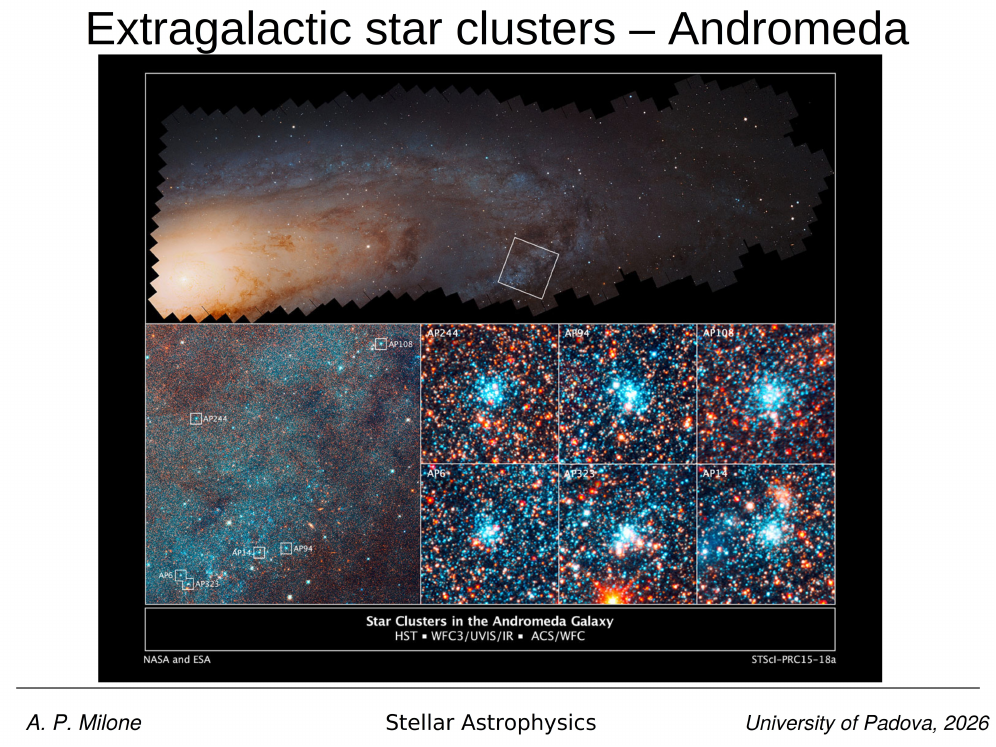
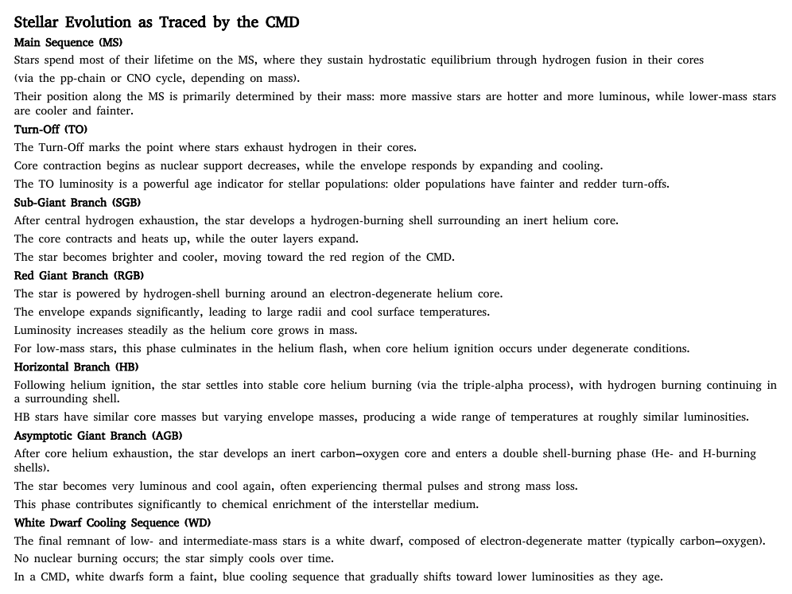
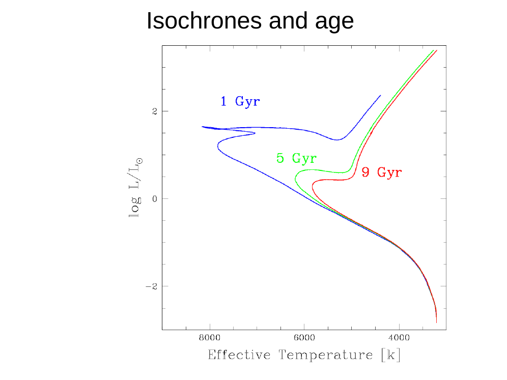
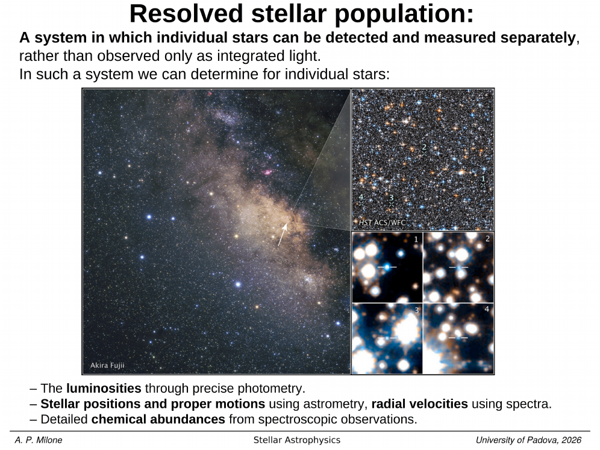


the **main-sequence turn-off** is the bluest, brightest point on the cluster's main sequence in the CMD, the locus where stars have just exhausted central hydrogen and start the brief journey across the subgiant branch toward the giant branch. it is the single most precise *resolved* age indicator known.

the underlying logic is the MS lifetime relation
$$ \tau_\mathrm{MS}(M) \approx 10 \, (M/M_\odot)^{-2.5} \, \mathrm{Gyr}. $$
inverting,
$$ M_\mathrm{TO}(t) \approx (t / 10\,\mathrm{Gyr})^{-1/2.5} \, M_\odot $$
so that for a coeval cluster of age $t$, the star currently leaving the MS has mass $M_\mathrm{TO}(t)$. plugging in:

- $t = 1$ Gyr $\rightarrow M_\mathrm{TO} \approx 2.5 \, M_\odot$ (early A on the TO)
- $t = 4$ Gyr $\rightarrow M_\mathrm{TO} \approx 1.36 \, M_\odot$ (late F)
- $t = 10$ Gyr $\rightarrow M_\mathrm{TO} \approx 1.00 \, M_\odot$ (early G, sun-like)
- $t = 13$ Gyr $\rightarrow M_\mathrm{TO} \approx 0.85 \, M_\odot$ (mid G to early K, GC value)

the TO mass therefore drops monotonically with age. on the CMD this manifests as the TO point sliding *redder and fainter* with increasing age along the locus of points $(\mathrm{colour}_\mathrm{TO}(t), V_\mathrm{TO}(t))$ that an isochrone traces out. the magnitude of the shift depends on metallicity but at $[\mathrm{Fe}/\mathrm{H}] \sim -1.5$ a typical sensitivity is $\Delta V_\mathrm{TO} / \Delta \log t \approx 1.4$ mag per dex, or roughly $0.1$ mag per Gyr at old ages.

practical fitting strategies fall into three families.

(1) **vertical methods**: measure the absolute TO magnitude $M_V^\mathrm{TO}$ and compare to isochrones. this requires an independent distance modulus, otherwise age and distance are degenerate. the TO is reasonably well-defined as the bluest point on the MS, but in practice the MS-TO transition is gradual and the bluest-point measurement is noisy; modern work uses the *brightness* of the TO at a fixed $\Delta(B-V)$ from the unevolved MS, or the magnitude difference $\Delta V_\mathrm{TO}^\mathrm{HB}$ between TO and horizontal branch which removes the distance dependence.

(2) **horizontal methods** (chaboyer 1995): the colour difference $\delta(B-V)$ between the TO and the base of the RGB at fixed magnitude is age-sensitive but reddening-insensitive (since reddening shifts both TO and RGB by the same colour amount). this is the workhorse for relative ages between GCs.

(3) **isochrone-fitting**: a full chi-square fit of model isochrones to the entire CMD, simultaneously solving for $(t, [\mathrm{Fe}/\mathrm{H}], (m-M)_0, E(B-V))$, with priors on $[\mathrm{Fe}/\mathrm{H}]$ from spectroscopy and on $(m-M)_0$ from gaia parallax or RR Lyrae (see [Isochrones and isochrone fitting](./Isochrones%20and%20isochrone%20fitting.html)).

precision and pitfalls. with HST or JWST photometry the TO can be located to $\sim 0.05$ mag, which translates to a relative-age precision of $\sim 5\%$ between GCs, or $\sim 0.5$ Gyr at $10$ Gyr (marin-franch et al. 2009). absolute ages are limited by *systematic* uncertainties: the assumed He abundance $Y$ (helium-rich populations have brighter, redder TOs at fixed age, mimicking older ages by $\sim 1$ Gyr per $\Delta Y = 0.04$); the CNO and alpha enhancement mixture, which affects opacities and the TO morphology; convective core overshooting, which extends MS lifetimes and lowers $M_\mathrm{TO}$ at fixed age; and the reddening law, which moves the TO colour. realistic absolute ages for GCs are accurate to $\sim 1$ Gyr, with the oldest milky way GCs (NGC 6397, M92, M30) clustering at $12.5 \pm 0.5$ Gyr.

a critical degeneracy: ages and metallicities are partially anti-correlated in TO photometry, because metal-rich isochrones at younger ages have similar TO colours and magnitudes to metal-poor isochrones at older ages (the [Age-metallicity degeneracy](./Age-metallicity%20degeneracy.html)). resolved CMDs break this degeneracy via the *RGB slope* and *HB morphology*, which respond differently to age and to $[\mathrm{Fe}/\mathrm{H}]$, but only if the photometry is deep and clean.

the TO is also the foundation of the cluster age from main sequence turn-off derivation that places GC ages within a Gyr of the WMAP/Planck $\Lambda$CDM age of the universe, providing a cosmologically meaningful lower limit $t_0 > 12$ Gyr from stellar physics alone.

## see also
- [Stellar_Astrophysics_MOC](../../04_Atlas/Stellar_Astrophysics_MOC.html)
- [Main sequence on the CMD](./Main%20sequence%20on%20the%20CMD.html)
- [Subgiant branch SGB](./Subgiant%20branch%20SGB.html)
- [Isochrones and isochrone fitting](./Isochrones%20and%20isochrone%20fitting.html)
- Cluster age from main sequence turn-off
- [Age-metallicity degeneracy](./Age-metallicity%20degeneracy.html)

---

## Complete Lecture Slide Panels & Observational Evidence (Lecture 02 — Reading the CMD II: Isochrones & Age Clocks)

> **Context**: *Isochrone fitting, Turnoff luminosity-age scaling, distance modulus determination, theoretical evolutionary tracks vs observed HST/Gaia filter systems.*

The following slides from Prof. Antonino Milone's lecture series provide the direct observational, photometric, and theoretical foundations for this topic:

*Figure P02-01: LAntonino_p02_01.png — Observational data, CMD morphology, and diagnostics from Lecture 02 — Reading the CMD II: Isochrones & Age Clocks.*

*Figure P02-02: LAntonino_p02_02.png — Observational data, CMD morphology, and diagnostics from Lecture 02 — Reading the CMD II: Isochrones & Age Clocks.*

*Figure P02-03: LAntonino_p02_03.png — Observational data, CMD morphology, and diagnostics from Lecture 02 — Reading the CMD II: Isochrones & Age Clocks.*

*Figure P02-04: LAntonino_p02_04.png — Observational data, CMD morphology, and diagnostics from Lecture 02 — Reading the CMD II: Isochrones & Age Clocks.*

*Figure P02-05: LAntonino_p02_05.png — Observational data, CMD morphology, and diagnostics from Lecture 02 — Reading the CMD II: Isochrones & Age Clocks.*

*Figure P02-06: LAntonino_p02_06.png — Observational data, CMD morphology, and diagnostics from Lecture 02 — Reading the CMD II: Isochrones & Age Clocks.*

*Figure P02-07: LAntonino_p02_07.png — Observational data, CMD morphology, and diagnostics from Lecture 02 — Reading the CMD II: Isochrones & Age Clocks.*

*Figure P02-08: LAntonino_p02_08.png — Observational data, CMD morphology, and diagnostics from Lecture 02 — Reading the CMD II: Isochrones & Age Clocks.*

*Figure P02-09: LAntonino_p02_09.png — Observational data, CMD morphology, and diagnostics from Lecture 02 — Reading the CMD II: Isochrones & Age Clocks.*

*Figure P02-10: LAntonino_p02_10.png — Observational data, CMD morphology, and diagnostics from Lecture 02 — Reading the CMD II: Isochrones & Age Clocks.*

*Figure P02-11: LAntonino_p02_11.png — Observational data, CMD morphology, and diagnostics from Lecture 02 — Reading the CMD II: Isochrones & Age Clocks.*

*Figure P02-12: LAntonino_p02_12.png — Observational data, CMD morphology, and diagnostics from Lecture 02 — Reading the CMD II: Isochrones & Age Clocks.*

*Figure P02-13: LAntonino_p02_13.png — Observational data, CMD morphology, and diagnostics from Lecture 02 — Reading the CMD II: Isochrones & Age Clocks.*

*Figure P02-14: LAntonino_p02_14.png — Observational data, CMD morphology, and diagnostics from Lecture 02 — Reading the CMD II: Isochrones & Age Clocks.*

*Figure P02-15: LAntonino_p02_15.png — Observational data, CMD morphology, and diagnostics from Lecture 02 — Reading the CMD II: Isochrones & Age Clocks.*

*Figure P02-16: LAntonino_p02_16.png — Observational data, CMD morphology, and diagnostics from Lecture 02 — Reading the CMD II: Isochrones & Age Clocks.*

*Figure P02-17: LAntonino_p02_17.png — Observational data, CMD morphology, and diagnostics from Lecture 02 — Reading the CMD II: Isochrones & Age Clocks.*

*Figure P02-18: LAntonino_p02_18.png — Observational data, CMD morphology, and diagnostics from Lecture 02 — Reading the CMD II: Isochrones & Age Clocks.*

*Figure P02-19: LAntonino_p02_19.png — Observational data, CMD morphology, and diagnostics from Lecture 02 — Reading the CMD II: Isochrones & Age Clocks.*

*Figure P02-20: LAntonino_p02_20.png — Observational data, CMD morphology, and diagnostics from Lecture 02 — Reading the CMD II: Isochrones & Age Clocks.*

*Figure P02-21: LAntonino_p02_21.png — Observational data, CMD morphology, and diagnostics from Lecture 02 — Reading the CMD II: Isochrones & Age Clocks.*

*Figure P02-22: LAntonino_p02_22.png — Observational data, CMD morphology, and diagnostics from Lecture 02 — Reading the CMD II: Isochrones & Age Clocks.*

*Figure P02-23: LAntonino_p02_23.png — Observational data, CMD morphology, and diagnostics from Lecture 02 — Reading the CMD II: Isochrones & Age Clocks.*

*Figure P02-24: LAntonino_p02_24.png — Observational data, CMD morphology, and diagnostics from Lecture 02 — Reading the CMD II: Isochrones & Age Clocks.*

*Figure P02-25: LAntonino_p02_25.png — Observational data, CMD morphology, and diagnostics from Lecture 02 — Reading the CMD II: Isochrones & Age Clocks.*

*Figure P02-26: Lecture02_p15-15.png — Observational data, CMD morphology, and diagnostics from Lecture 02 — Reading the CMD II: Isochrones & Age Clocks.*

*Figure P02-27: Lecture02_p25-25.png — Observational data, CMD morphology, and diagnostics from Lecture 02 — Reading the CMD II: Isochrones & Age Clocks.*

*Figure P02-28: Lecture02_p35-35.png — Observational data, CMD morphology, and diagnostics from Lecture 02 — Reading the CMD II: Isochrones & Age Clocks.*

*Figure P02-29: Lecture02_p5-05.png — Observational data, CMD morphology, and diagnostics from Lecture 02 — Reading the CMD II: Isochrones & Age Clocks.*


  <h4 class="backlinks-title">Linked References (6)</h4>
  <ul class="backlinks-list">
    <li class="backlink-item-wrap"><a href="./Isochrones%20and%20isochrone%20fitting.html" class="backlink-item">Isochrones and isochrone fitting</a></li>
    <li class="backlink-item-wrap"><a href="./M-dwarf%20discontinuity%20and%20convective%20merging%20instability.html" class="backlink-item">M-dwarf discontinuity and convective merging instability</a></li>
    <li class="backlink-item-wrap"><a href="./Main%20sequence%20on%20the%20CMD.html" class="backlink-item">Main sequence on the CMD</a></li>
    <li class="backlink-item-wrap"><a href="./Stellar%20evolutionary%20phases%20on%20the%20CMD.html" class="backlink-item">Stellar evolutionary phases on the CMD</a></li>
    <li class="backlink-item-wrap"><a href="../../04_Atlas/Stellar_Astrophysics_MOC.html" class="backlink-item">Stellar_Astrophysics_MOC</a></li>
    <li class="backlink-item-wrap"><a href="./Subgiant%20branch%20SGB.html" class="backlink-item">Subgiant branch SGB</a></li>
  </ul>

