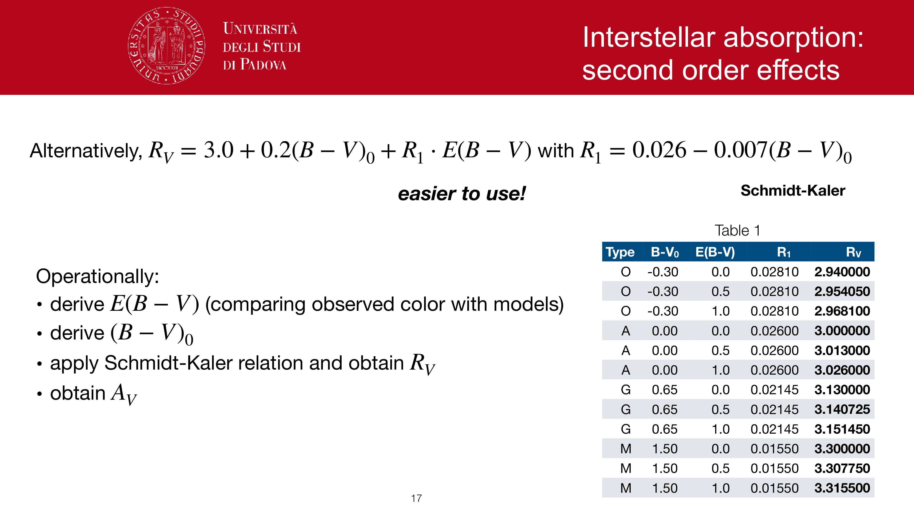
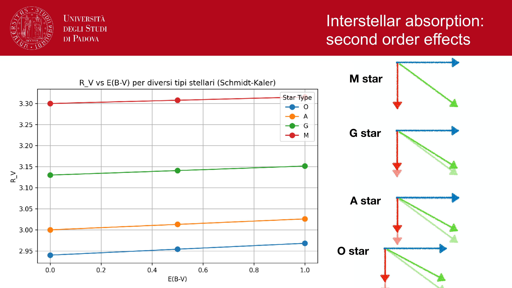
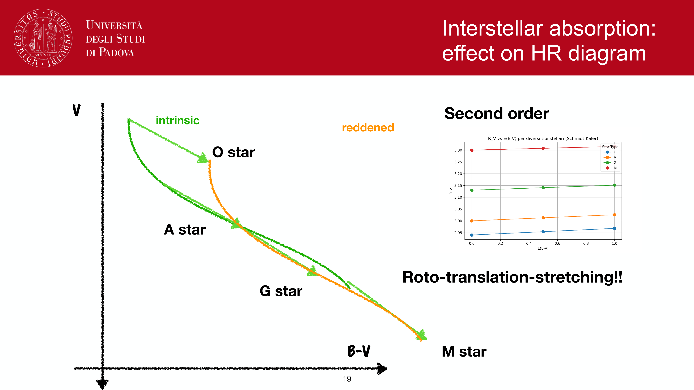
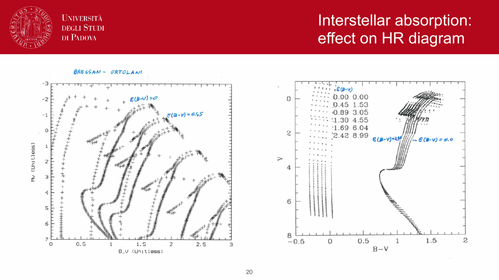
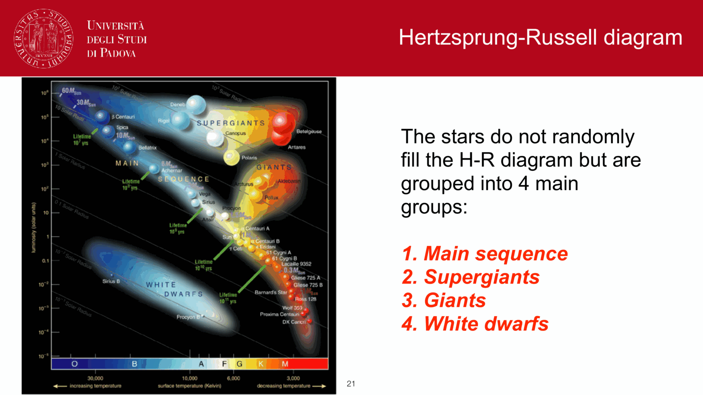
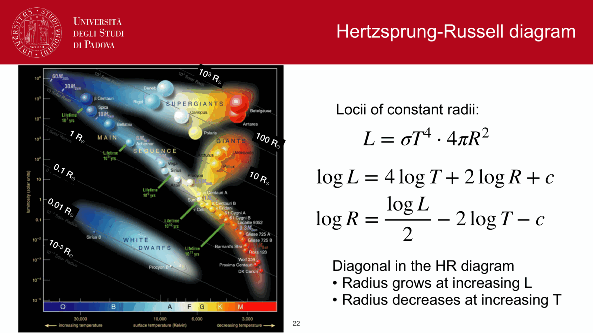


the **Hertzsprung-Russell (HR) diagram**, discovered independently by Ejnar Hertzsprung (1911) and Henry Norris Russell (1913), is the central organizing framework of stellar astrophysics. it plots the intrinsic luminosity of stars against their surface temperature.

---

## axes and conventions

an HR diagram can be presented in two equivalent representations:
1. **theoretical plane**: Logarithm of Luminosity $\log(L/L_\odot)$ (or absolute bolometric magnitude $M_{\text{bol}}$) on the vertical axis versus Effective Temperature $T_{\text{eff}}$ on the horizontal axis. **crucial convention**: temperature increases to the **left** (from $3000$ K on the right to $40,000$ K on the left).
2. **observational plane (Color-Magnitude Diagram, CMD)**: Absolute magnitude $M_V$ (or apparent magnitude $V$ in a cluster) on the vertical axis versus Color Index (e.g. $B-V$ or $G_{BP} - G_{RP}$) on the horizontal axis. bluer (hotter) stars lie to the left, redder (cooler) stars to the right.

---

## the four major stellar groups

stars do not populate the HR diagram randomly: over $99\%$ of stars fall into four distinct regions:

1. **the Main Sequence (Sequenza Principale)**:
   - a continuous diagonal band running from the top-left (hot, luminous O/B stars) to the bottom-right (cool, faint M dwarfs).
   - comprises **$\approx 85-90\%$ of all observed stars** (including our Sun at $T_{\text{eff}} \approx 5800$ K, $L = 1 L_\odot$).
   - **physical state**: stars in core hydrogen burning equilibrium ($4p \to {}^4\text{He}$).
2. **Red Giants (Giganti Rosse)**:
   - situated in the upper right ($T_{\text{eff}} \sim 3000-5000$ K, $L \sim 10^2 - 10^4 L_\odot$).
   - cool surface temperature but enormous luminosity, requiring enormous radii ($R \sim 10 - 100 R_\odot$).
   - **physical state**: hydrogen-exhausted core; hydrogen shell burning around an inert, contracting helium core.
3. **Supergiants (Supergiganti)**:
   - occupy the very top of the diagram ($L \sim 10^4 - 10^6 L_\odot$, across all spectral types).
   - colossal radii ($R \sim 100 - 1500 R_\odot$). Betelgeuse, Rigel, Deneb.
   - **physical state**: evolved stages of massive stars ($M \gtrsim 8 M_\odot$) undergoing advanced core nuclear burning.
4. **White Dwarfs (Nane Bianche)**:
   - located in the lower left ($T_{\text{eff}} \sim 8,000 - 30,000$ K, $L \sim 10^{-4} - 10^{-2} L_\odot$).
   - hot surface but extremely faint, implying tiny Earth-sized radii ($R \sim 0.01 R_\odot$).
   - **physical state**: electron-degenerate compact stellar corpses with no ongoing nuclear fusion, cooling passively over cosmic time.

---

## lines of constant stellar radius

from the Stefan-Boltzmann relation $L = 4\pi R^2 \sigma T_{\text{eff}}^4$, taking the logarithm yields:
$$\log L = 4 \log T_{\text{eff}} + 2 \log R + \text{const}$$

for a fixed radius $R = \text{constant}$, $\log L$ is a linear function of $\log T_{\text{eff}}$ with slope $+4$.
because the horizontal axis of the HR diagram runs backwards (temperature decreasing to the right), lines of constant radius appear as **parallel diagonals running from top-left to bottom-right**:
- $R = 1000 R_\odot$: passes through the red supergiants.
- $R = 100 R_\odot$: cuts through the red giant branch.
- $R = 1 R_\odot$: cuts through the Sun on the main sequence.
- $R = 0.01 R_\odot$: passes through the white dwarf sequence.

---

## main sequence lifetime and mass progression

along the main sequence, stellar mass $M$ increases monotonically from bottom-right to top-left:
- bottom-right: $M \sim 0.08 M_\odot$, $T_{\text{eff}} \sim 2500$ K, $L \sim 10^{-4} L_\odot$.
- solar position: $M = 1.0 M_\odot$, $T_{\text{eff}} \approx 5800$ K, $L = 1 L_\odot$.
- top-left: $M \sim 60-100 M_\odot$, $T_{\text{eff}} \sim 40,000-50,000$ K, $L \sim 10^6 L_\odot$.

the duration of the main sequence phase is governed by nuclear fuel consumption:
$$t_{\text{MS}} \approx 10^{10} \left(\frac{M}{M_\odot}\right) \left(\frac{L}{L_\odot}\right)^{-1} \approx 10^{10} \left(\frac{M}{M_\odot}\right)^{-2.5} \text{ yr}$$

---

## see also

- [Fundamentals_Astrophysics_Cosmology_MOC](../../04_Atlas/Fundamentals_Astrophysics_Cosmology_MOC.html)
- [Stellar scaling relations](./Stellar%20scaling%20relations.html)
- [Main sequence, giants, supergiants, white dwarfs](./Main%20sequence%2C%20giants%2C%20supergiants%2C%20white%20dwarfs.html)
- [Solar evolution and final stages](./Solar%20evolution%20and%20final%20stages.html)
- [Cluster ages from CMD turnoff](./Cluster%20ages%20from%20CMD%20turnoff.html)

---

## observational astrophysics course slides (Prof. Paolo Cassata)

*Extinction correction in observational CMDs: reddening vector shifting points down-right.*

*De-reddened CMD morphology.*

*Main sequence core hydrogen fusion via pp-chain and CNO cycle.*

*Schonberg-Chandrasekhar limit: maximum isothermal core mass fraction ~10%.*

*Subgiant branch: contraction of inert helium core and expansion of hydrogen-burning envelope.*

*Red Giant Branch (RGB): Hayashi convective boundary and dredge-up episodes.*

*Core helium flash in low-mass stars (M < 2 M_Sun) due to electron degeneracy.*

*Horizontal Branch (HB) and Red Clump: quiescent core helium burning.*


  <h4 class="backlinks-title">Linked References (7)</h4>
  <ul class="backlinks-list">
    <li class="backlink-item-wrap"><a href="../../04_Atlas/Fundamentals_Astrophysics_Cosmology_MOC.html" class="backlink-item">Fundamentals_Astrophysics_Cosmology_MOC</a></li>
    <li class="backlink-item-wrap"><a href="./HR%20diagram.html" class="backlink-item">HR diagram</a></li>
    <li class="backlink-item-wrap"><a href="./Mass-luminosity%20relation.html" class="backlink-item">Mass-luminosity relation</a></li>
    <li class="backlink-item-wrap"><a href="../../04_Atlas/Observational_Astrophysics_MOC.html" class="backlink-item">Observational_Astrophysics_MOC</a></li>
    <li class="backlink-item-wrap"><a href="./Spectroscopic%20parallax%20and%20main-sequence%20fitting.html" class="backlink-item">Spectroscopic parallax and main-sequence fitting</a></li>
    <li class="backlink-item-wrap"><a href="./Stellar%20scaling%20relations.html" class="backlink-item">Stellar scaling relations</a></li>
    <li class="backlink-item-wrap"><a href="./Stellar%20spectra%20and%20spectral%20classification.html" class="backlink-item">Stellar spectra and spectral classification</a></li>
  </ul>

