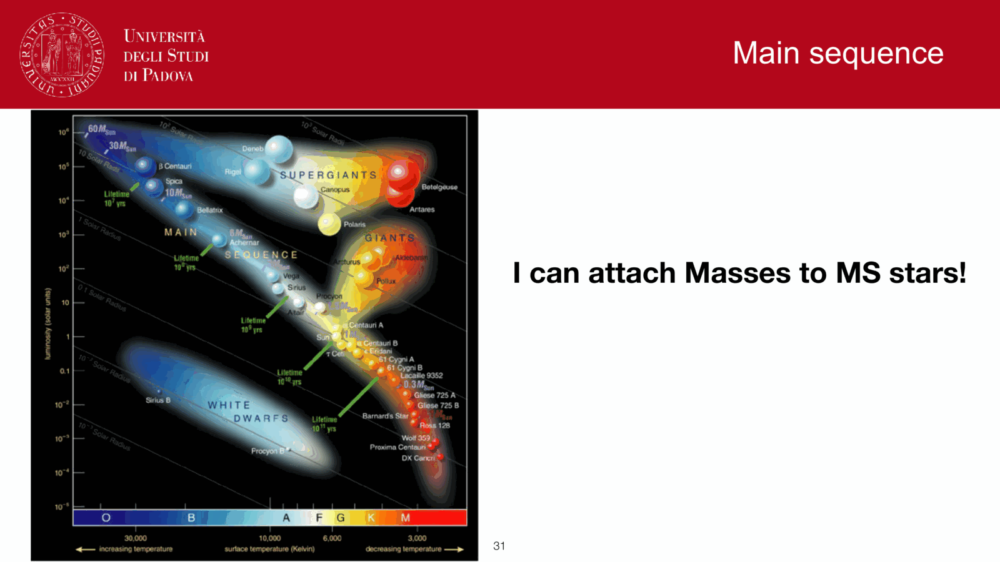
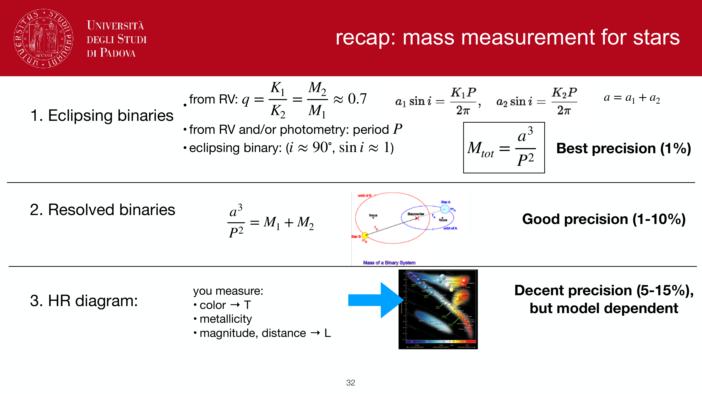
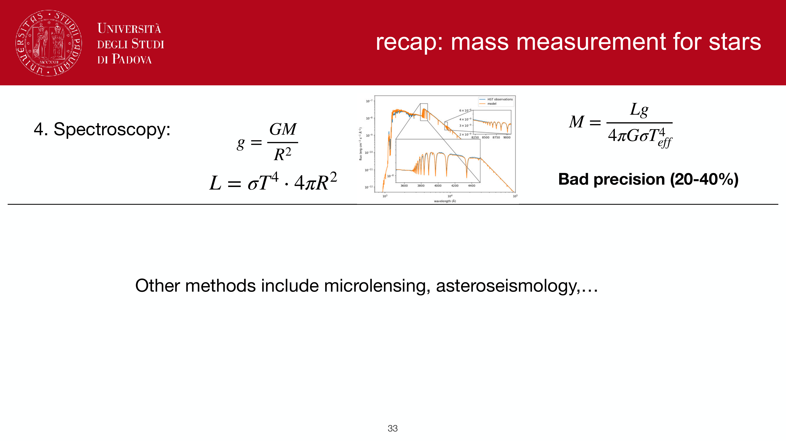
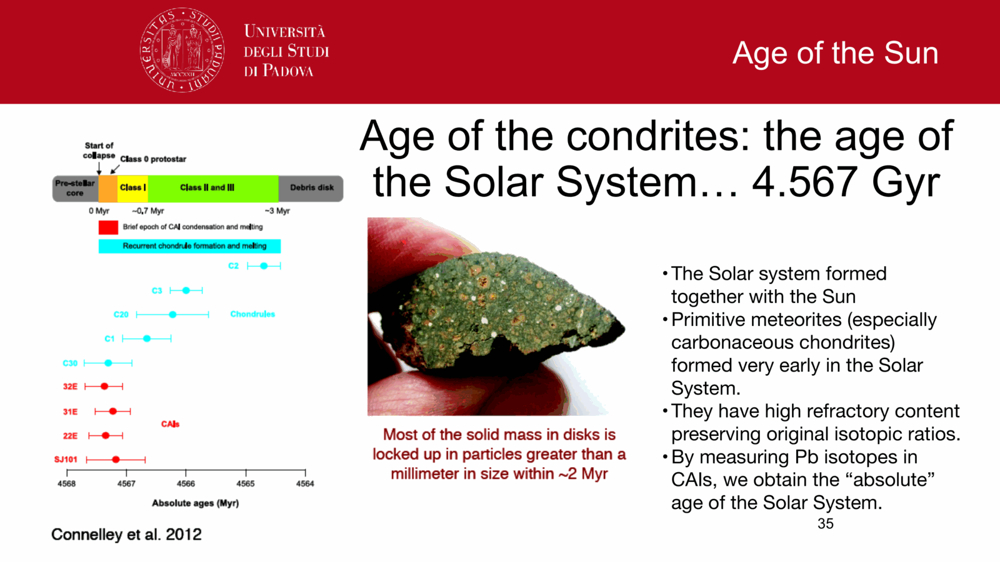
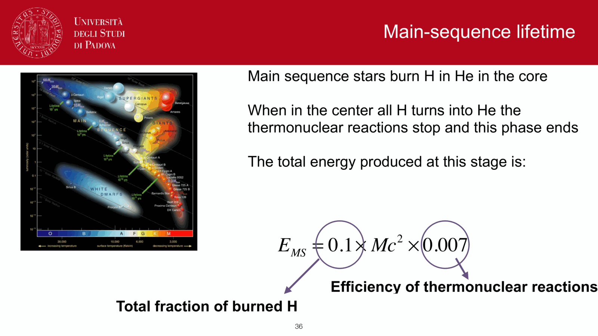


the **mass-luminosity relation (MLR)** is the empirical and theoretical power-law relationship connecting stellar mass $M$ to bolometric luminosity $L$ for stars on the [main sequence](./Main%20sequence%20on%20the%20CMD.html). because luminosity is the rate of energy loss, the steepness of the MLR is the primary physical reason why massive stars die rapidly while low-mass stars survive for cosmic epochs.

## piecewise empirical power laws

the relation is customarily approximated by:
$$\frac{L}{L_\odot} \approx a\,\left(\frac{M}{M_\odot}\right)^\alpha$$
where the exponent $\alpha$ varies systematically across four mass regimes due to changing opacity mechanisms and interior energy transport:

1. **very low mass ($M \le 0.43\,M_\odot$, M-dwarfs)**:
   $$\alpha \approx 2.3 \quad (L \propto M^{2.3})$$
   stars are fully convective (or possess deep convective envelopes); molecular opacities ($\mathrm{H}_2\mathrm{O}$, $\mathrm{TiO}$) and collision-induced $\mathrm{H}_2$ absorption dominate the atmosphere, flattening the relation.
2. **intermediate low mass ($0.43 < M/M_\odot \le 2.0$, solar-type)**:
   $$\alpha \approx 4.0 \quad (L \propto M^4)$$
   classical Kramers opacity ($\kappa \propto \rho T^{-3.5}$) and radiative diffusion dominate energy transport, powered by the pp-chains.
3. **intermediate to massive ($2.0 < M/M_\odot \le 20.0$, A and B stars)**:
   $$\alpha \approx 3.5 \quad (L \propto M^{3.5})$$
   core CNO-cycle fusion dominates with convective cores; Thomson electron scattering ($\kappa_{\rm es} = \text{const}$) becomes significant.
4. **very massive ($M > 20.0\,M_\odot$, O stars)**:
   $$\alpha \to 1.0\text{--}1.5 \quad (L \propto M)$$
   radiation pressure $P_{\rm rad} = \frac{1}{3} a T^4$ dominates over gas pressure ($P \approx P_{\rm rad}$). the star approaches the **Eddington luminosity limit**:
   $$L_{\rm Edd} = \frac{4\pi G c M}{\kappa_{\rm es}} \approx 3.8 \times 10^4 \left(\frac{M}{M_\odot}\right) L_\odot$$
   where radiation force balances self-gravity, capping $\alpha$ at unity.

across the broad optical main sequence ($0.5 \le M/M_\odot \le 30$), the canonical average benchmark is:
$$L \propto M^{3.5}$$
spanning nearly **eight orders of magnitude in luminosity** ($10^{-3}\,L_\odot$ for late M-dwarfs to $10^5\,L_\odot$ for early O-stars) over a mass factor of only $\sim 300$.

## derivation from stellar interior physics

combining hydrostatic equilibrium, the ideal gas equation of state, and radiative diffusion yields:
1. central pressure: $P_c \sim \frac{G M^2}{R^4}$
2. central temperature: $T_c \sim \frac{\mu m_H}{k_B} \frac{G M}{R}$
3. radiative transport flux: $L \sim \frac{R^2 T_c^4}{\kappa \rho R} \sim \frac{R T_c^4}{\kappa \bar\rho}$

substituting $\bar\rho \propto M/R^3$ and $T_c \propto \mu M / R$:
$$L \propto \frac{R}{\kappa (M/R^3)} \left(\frac{\mu M}{R}\right)^4 = \frac{\mu^4 M^3}{\kappa}$$

- **electron scattering regime ($\kappa = \text{const}$)**:
  $$L \propto \mu^4 M^3$$
- **Kramers opacity regime ($\kappa = \kappa_0 \rho T^{-3.5}$)**:
  $$\kappa \propto \left(\frac{M}{R^3}\right)\left(\frac{\mu M}{R}\right)^{-3.5} \propto \mu^{-3.5} M^{-2.5} R^{0.5}$$
  $$L \propto \frac{\mu^4 M^3}{\mu^{-3.5} M^{-2.5} R^{0.5}} = \mu^{7.5} M^{5.5} R^{-0.5}$$
  since $R \propto M^{0.8}$, this evaluates to $L \propto \mu^{7.5} M^{5.1}$ (steepening to $M^4$ when convection and realistic outer boundary conditions are matched).

## main-sequence lifetimes

because available nuclear fuel scales linearly with mass ($E_{\rm nuc} \propto M$) while fuel consumption rate scales with luminosity ($L \propto M^{3.5}$):
$$\tau_{\rm MS} = \frac{E_{\rm nuc}}{L} \propto \frac{M}{M^{3.5}} = M^{-2.5}$$
calibrated to the solar lifetime $\tau_\odot \approx 10$ Gyr:
$$\tau_{\rm MS} \approx 10\,\text{Gyr}\,\left(\frac{M}{M_\odot}\right)^{-2.5}$$
- a $20\,M_\odot$ star exhausts core hydrogen in $\tau_{\rm MS} \approx 10\,\text{Gyr} \times 20^{-2.5} \approx 5.6$ Myr.
- a $0.5\,M_\odot$ star consumes core hydrogen over $\tau_{\rm MS} \approx 10\,\text{Gyr} \times 0.5^{-2.5} \approx 56$ Gyr.

## implications for population synthesis and galaxy SEDs

1. **spectral domination by massive stars**:
   in young stellar populations, the steep MLR ensures that O and B stars ($M \gtrsim 10\,M_\odot$) completely drown out low-mass stars at UV and optical wavelengths.
2. **temporal reddening of an SSP**:
   as massive stars leave the MS, the upper cutoff of the surviving population shifts downward. the integrated luminosity drops precipitously:
   $$L_{\rm SSP}(t) \propto t^{-0.7\text{--}0.9}$$
   while the integrated colors shift redward as cooler, lower-mass stars and red giants dominate the light.
3. **mass-to-light ratio stability in the infrared**:
   the mass-to-light ratio $\Upsilon_V \equiv M_*/L_V$ grows by a factor $> 100$ between ages $10$ Myr and $10$ Gyr. however, in the near-infrared $K$-band ($2.2\,\mu$m), red giants and low-mass MS stars emit near their Rayleigh-Jeans peak, keeping $\Upsilon_K \approx 0.6\text{--}1.0\,M_\odot/L_\odot$ stable within $\sim 30\%$ across all mature stellar ages. this makes near-IR photometry the gold standard for measuring total stellar masses in galaxies.

## see also

- [Observational_Astrophysics_MOC](../../04_Atlas/Observational_Astrophysics_MOC.html)
- [Stellar_Astrophysics_MOC](../../04_Atlas/Stellar_Astrophysics_MOC.html)
- [Stellar scaling relations](./Stellar%20scaling%20relations.html)
- [HR diagram](./HR%20diagram.html)
- [Main sequence, giants, supergiants, white dwarfs](./Main%20sequence%2C%20giants%2C%20supergiants%2C%20white%20dwarfs.html)
- [Stellar evolution timescales](./Stellar%20evolution%20timescales.html)
- [Initial mass function](./Initial%20mass%20function.html)
- [Why hot massive stars dominate luminosity](./Why%20hot%20massive%20stars%20dominate%20luminosity.html)
- [Stellar mass estimation in unresolved populations](./Stellar%20mass%20estimation%20in%20unresolved%20populations.html)
- [Single stellar population SSP](./Single%20stellar%20population%20SSP.html)

---

## observational astrophysics course slides (Prof. Paolo Cassata)

*Empirical mass-luminosity relation from visual, interferometric, and eclipsing binaries.*

*Low-mass regime (M < 0.43 M_Sun): L proportional to M^2.3.*

*Intermediate-mass regime (0.43 M_Sun < M < 2 M_Sun): L proportional to M^4.*

*High-mass regime (2 M_Sun < M < 20 M_Sun): L proportional to M^3.5.*

*Very massive stars (M > 20 M_Sun): L proportional to M approaching Eddington limit.*

*Eddington luminosity limit: L_Edd = 4 pi G M c / kappa_es = 1.3 x 10^38 (M / M_Sun) erg/s.*


  <h4 class="backlinks-title">Linked References (6)</h4>
  <ul class="backlinks-list">
    <li class="backlink-item-wrap"><a href="./IMF%20from%20cluster%20luminosity%20functions.html" class="backlink-item">IMF from cluster luminosity functions</a></li>
    <li class="backlink-item-wrap"><a href="./Initial%20mass%20function.html" class="backlink-item">Initial mass function</a></li>
    <li class="backlink-item-wrap"><a href="../../04_Atlas/Observational_Astrophysics_MOC.html" class="backlink-item">Observational_Astrophysics_MOC</a></li>
    <li class="backlink-item-wrap"><a href="./Single%20stellar%20population%20SSP.html" class="backlink-item">Single stellar population SSP</a></li>
    <li class="backlink-item-wrap"><a href="./Stellar%20mass%20estimation%20in%20unresolved%20populations.html" class="backlink-item">Stellar mass estimation in unresolved populations</a></li>
    <li class="backlink-item-wrap"><a href="./Why%20hot%20massive%20stars%20dominate%20luminosity.html" class="backlink-item">Why hot massive stars dominate luminosity</a></li>
  </ul>

