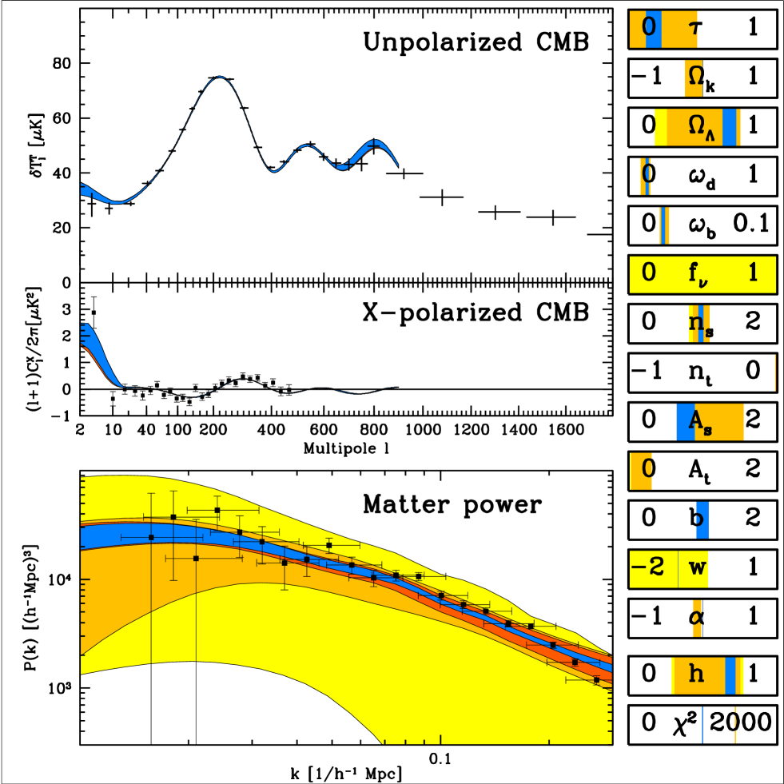
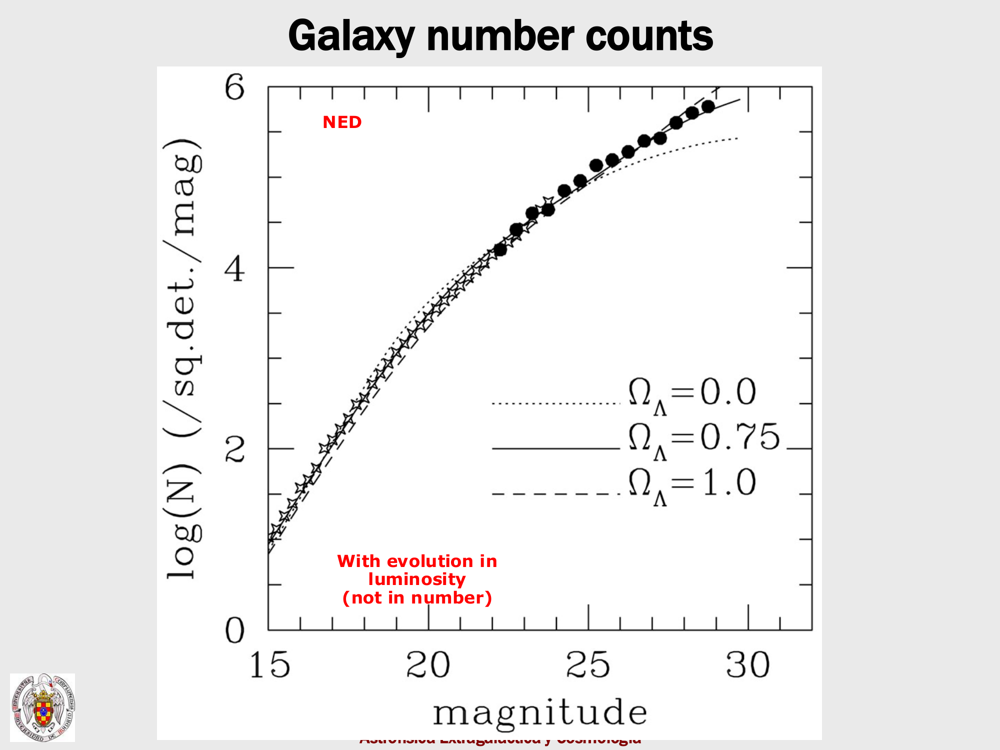
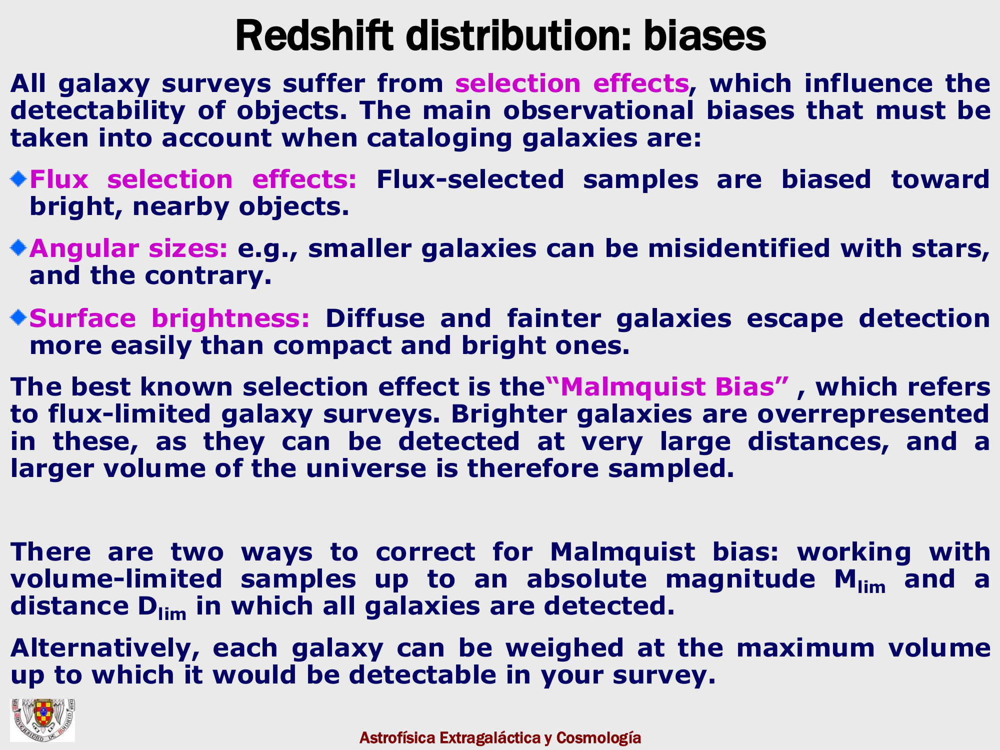
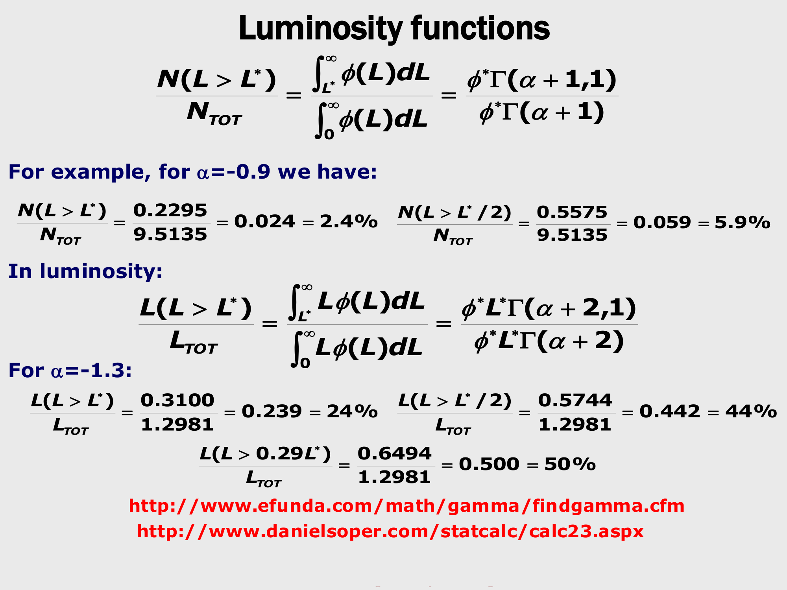
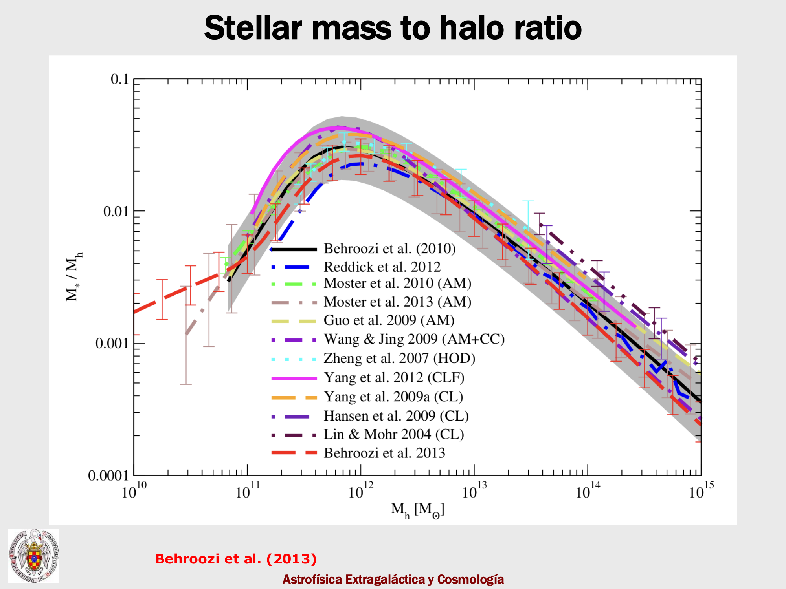

at the zeroth-order picture the universe is homogeneous,
	but at first order it is *almost* homogeneous,
		and the small density fluctuations are what eventually grow into galaxies and clusters.

we measure the variance of these fluctuations as a function of scale through the **matter power spectrum** $P_m(k)$:
$$P_m(k) \sim \langle   \vert\delta_m(\vec k)\vert ^2 \rangle, \qquad \delta_m \equiv \frac{\rho_m - \bar\rho_m}{\bar\rho_m}$$

a scale $\lambda$ corresponds to a wavenumber $k \sim 1/\lambda$. small $k$ = large scales; large $k$ = small scales.

---

## state of the art today

a single curve, stitched together from many surveys, covering five orders of magnitude in $k$:

| dataset | $k$ range probed |
|---|---|
| Planck TT (CMB temperature) | $k \sim 10^{-4}$–$10^{-3}\,h\,\text{Mpc}^{-1}$ |
| Planck EE, $\phi\phi$ (polarization, lensing) | $\sim 10^{-3}$–$10^{-2}$ |
| DES Y1 cosmic shear | $\sim 10^{-2}$–$10^{-1}$ |
| SDSS DR7 LRG | $\sim 10^{-2}$–$10^{-1}$ |
| BOSS DR9 Ly-α forest | $\sim 10^{-1}$–$10^0$ |

all of these independent measurements lie on a single curve, beautifully consistent with $\Lambda$CDM predictions.

---

## the turnover at the equality scale

the most striking feature is the **turnover** of $P_m(k)$ at $k \sim 0.02\,h\,\text{Mpc}^{-1}$:

> *this turn-around of the amplitude depends on the so-called epoch of equality of radiation with matter, i.e. when the contribution of non-relativistic matter is equal to that of radiation, therefore it is sensitive to the amount of matter.*

physically: modes that entered the horizon during the radiation-dominated era did *not* grow (the Meszaros effect — radiation pressure prevents matter perturbations from growing inside the horizon while photons dominate). modes that entered after equality grew freely. the boundary between the two regimes is the horizon size at equality, which directly fixes the position of the turnover.

so the position of the turnover is one of our handles on $\Omega_m h^2$.

---

## baryon acoustic oscillations

zoom in on the scale $k \sim 0.05\text{–}0.2\,h\,\text{Mpc}^{-1}$ and the smooth power-law has small wiggles superimposed on it: the **baryon acoustic oscillations** (BAO).

physical origin: before recombination, baryons and photons were tightly coupled in a single relativistic plasma. small perturbations propagated as **acoustic waves** with sound speed $c_s \sim c/\sqrt 3$. at recombination, the photons free-stream away and the baryons are left at the radius reached by the sound wave at that moment, the **sound horizon** $r_s \sim 150$ Mpc comoving. this leaves a characteristic wiggle pattern in the baryon distribution, which gravitationally couples to dark matter and thus shows up in the matter (galaxy) distribution today.

the **amplitude** of the wiggles is set by the ratio $\Omega_b/\Omega_m$:

- *if all the matter were baryons* (dashed line in the figure), the entire $P_m(k)$ would oscillate strongly — no smooth power-law
- *with mostly dark matter*, the wiggles are small relative to the smooth dark-matter power-law (solid line)

the data show small wiggles. this is **dark matter being detected through the absence of pure-baryon oscillations**.

---

## BAO measured directly in galaxy surveys

the right panel of the figure shows BAO measured directly:

- top: SDSS-II LRGs (luminous red galaxies)
- bottom: BOSS CMASS

the y-axis is $\log_{10}[P(k)/P(k)_{\rm smooth}]$ — the data divided by a smooth fitting function. the wiggles are unambiguous.

the BAO wavelength is a **standard ruler**: $r_s \sim 150$ Mpc at the epoch of recombination, calibrated from the CMB (which sees the same physics imprinted as acoustic peaks). measuring the angular size of $r_s$ at different redshifts gives the angular-diameter distance $d_A(z)$, and so direct constraints on $\Omega_m, \Omega_\Lambda, H_0$.

---

## why this matters

three independent windows on the same physics:
1. **CMB acoustic peaks** at $z = 1100$ — sound horizon imprinted on the photon last-scattering surface
2. **BAO in galaxies** at $z \sim 0.5\text{–}0.7$ — sound horizon imprinted on the baryon distribution
3. **BAO in Ly-α forest** at $z \sim 2$–$3$ — sound horizon imprinted in IGM hydrogen absorbers

all three pin down the same $r_s \approx 150$ Mpc, but at different epochs, so they trace the expansion history. consistency at all redshifts validates ΛCDM.

---

## the not-so-smooth universe

once you allow these perturbations to grow gravitationally over 13.8 Gyr, the universe goes from $\Delta T/T \sim 10^{-5}$ at recombination to the cosmic web today. the Springel / Max Planck IllustrisTNG simulations show this beautifully:

→ video: [Volker Springel cosmological simulation](https://www.youtube.com/watch?v=FBkYIqtYb0I)

galaxies sit on the nodes of a vast filamentary network, with voids in between. the cosmic web is the late-time outcome of structure growth, seeded by the same primordial perturbations that left the BAO wiggles in the matter power spectrum.

---

## see also

- [[Fundamentals_Astrophysics_Cosmology_MOC]]
- [[Cosmic_inventory_overview]]
- [[Linear evolution of perturbations in expanding universe]]
- [[Growth factor D(z)]]
- [[Press-Schechter halo mass function]]
- [[Baumann_reference]] — chapters 4 and 5 are the rigorous treatment

---

### Observational Cosmology Data Panels & Visual Evidence

*Tegmark et al. (2004) 3D Matter Power Spectrum $P(k)$ measured from SDSS luminous red galaxies across scales $k \sim 0.01 - 0.5\,h\,{\rm Mpc}^{-1}$, demonstrating turnover at $k_{\rm eq} \approx 0.015\,h\,{\rm Mpc}^{-1}$.*

*Large-scale structure: 2-point galaxy correlation function $\xi(r)$ and power spectrum Fourier transform pair.*

*Baryon Acoustic Oscillation (BAO) peak at $r_{\rm BAO} \approx 105\,h^{-1}\,{\rm Mpc}$ as a standard cosmological ruler.*

*Redshift-Space Distortions (RSD): Kaiser coherent infall flattening on large scales vs Fingers-of-God dispersion on small scales.*

*Linear galaxy bias $b = \sqrt{P_g(k)/P_m(k)}$ as a function of halo mass and galaxy luminosity.*

*Cosmic shear and weak gravitational lensing convergence power spectrum $P_\kappa(\ell)$.*

## Linked References

- [[Angular diameter distance]]
- [[Brief thermal history]]
- [[CMB power spectrum]]
- [[Cosmic_inventory_dark_matter]]
- [[Cosmic_inventory_overview]]
- [[Cosmological evolution of perturbations in the cosmic fluid]]
- [[Cosmological principle]]
- [[Galaxy clusters and overview of evolution]]
- [[Growth factor D(z)]]
- [[Hot vs cold dark matter]]
- [[Jeans analysis in expanding universe]]
- [[Lambda CDM current parameters]]
- [[Linear evolution of perturbations in expanding universe]]
- [[Linear vs nonlinear regime]]
- [[Matter radiation equality]]
- [[N-body simulations]]
- [[Perturbations in an expanding universe]]
- [[Press-Schechter halo mass function]]
- [[Saha equation and recombination]]
- [[Spherical collapse]]
- [[Fundamentals_Astrophysics_Cosmology_MOC]]
- [[Observational_Cosmology_MOC]]

