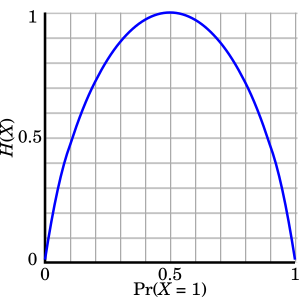

> The maximum entropy method reconstructs images by finding the smoothest possible sky distribution that still perfectly matches the observed data.

---

## core physical intuition

An interferometer does not sample every possible spatial frequency, leaving gaps in the data. When mathematically reconstructing the image, there are infinitely many possible images that could fit the measurements. You need a rule to pick the best one.

The maximum entropy method operates on the philosophy that you should assume the least amount of information possible. It seeks an image that is globally smooth and avoids introducing any artificial structures or sharp peaks unless the data absolutely demands it. By maximizing the informational entropy of the image while constraining it to fit the observed visibilities within the known noise limits, MEM produces a continuous, softly varying map. This makes it particularly excellent at recovering large, diffuse clouds of emission.

---

## key derivation & equations

The algorithm seeks to maximize the image entropy $H$, which is defined relative to a default prior image map $M_k$
$$H = -\sum_k I_k \ln \left( \frac{I_k}{M_k} \right)$$

This maximization is subject to the strict constraint that the resulting image $I$ must correctly predict the observed complex visibilities $V_i^{\rm obs}$ within the thermal noise $\sigma_i$. This is enforced using a chi-squared limit
$$\chi^2 = \sum_i \frac{\lvert V_i^{\rm obs} - V_i^{\rm model}\rvert^2}{\sigma_i^2} \leq N_{\rm data}$$

The algorithm iteratively adjusts the pixel values $I_k$ to find the unique global maximum of $H$ that satisfies the $\chi^2$ boundary.

---

## astrophysical context

MEM has historically been used extensively for single-dish deconvolution and for imaging highly extended radio sources where emission covers large fractions of the field of view. While the CLEAN algorithm remains more popular for fields dominated by bright point sources, MEM is superior for rendering the smooth, large-scale structure of molecular clouds or extended galactic halos without breaking them up into artificial speckles.

---

## connections & zettel links

* parent moc: [Astronomical_Interferometry_MOC](../../04_Atlas/Astronomical_Interferometry_MOC.html)
* related zettels: [CLEAN algorithm](interf/CLEAN%20algorithm.html), [Deconvolution algorithms compared](interf/Deconvolution%20algorithms%20compared.html), [Dirty beam and dirty image](interf/Dirty%20beam%20and%20dirty%20image.html)

  <h4 class="backlinks-title">Linked References (7)</h4>
  <ul class="backlinks-list">
    <li class="backlink-item-wrap"><a href="CLEAN%20algorithm.html" class="backlink-item">CLEAN algorithm</a></li>
    <li class="backlink-item-wrap"><a href="Deconvolution%20algorithms%20compared.html" class="backlink-item">Deconvolution algorithms compared</a></li>
    <li class="backlink-item-wrap"><a href="Dirty%20beam%20and%20dirty%20image.html" class="backlink-item">Dirty beam and dirty image</a></li>
    <li class="backlink-item-wrap"><a href="interf/CLEAN%20algorithm.html" class="backlink-item">CLEAN algorithm</a></li>
    <li class="backlink-item-wrap"><a href="interf/Deconvolution%20algorithms%20compared.html" class="backlink-item">Deconvolution algorithms compared</a></li>
    <li class="backlink-item-wrap"><a href="interf/Dirty%20beam%20and%20dirty%20image.html" class="backlink-item">Dirty beam and dirty image</a></li>
    <li class="backlink-item-wrap"><a href="../../04_Atlas/Astronomical_Interferometry_MOC.html" class="backlink-item">Astronomical_Interferometry_MOC</a></li>
  </ul>

