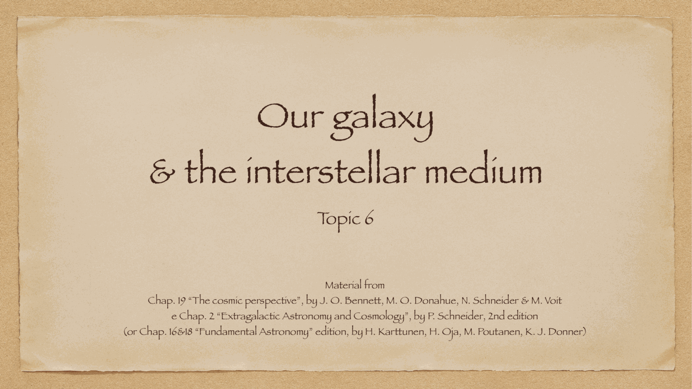
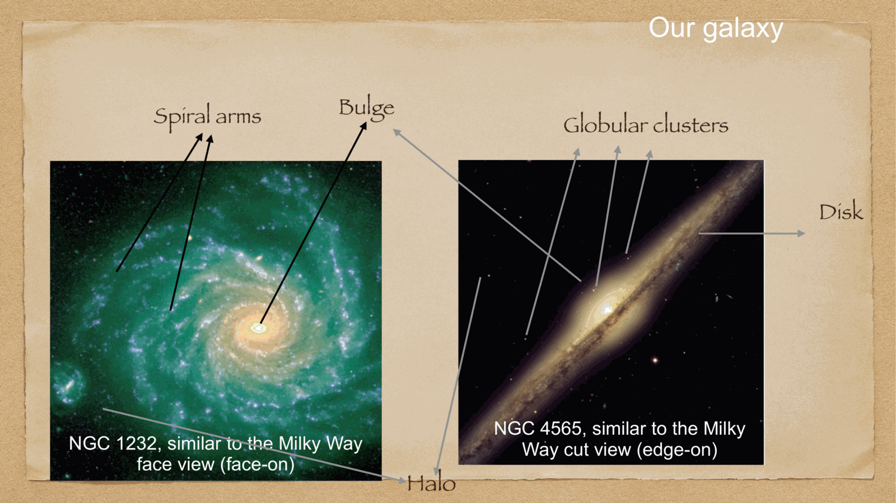
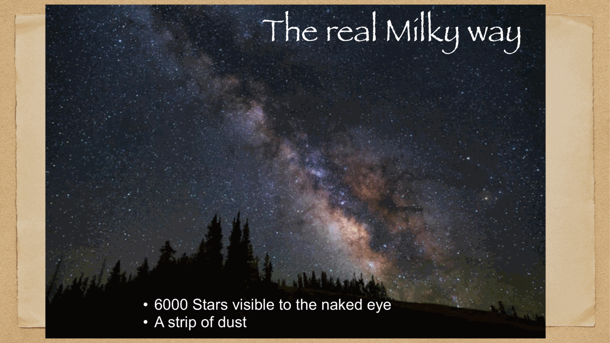
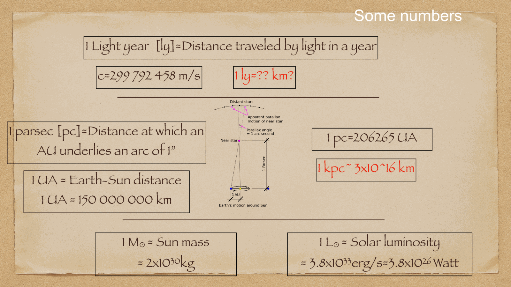
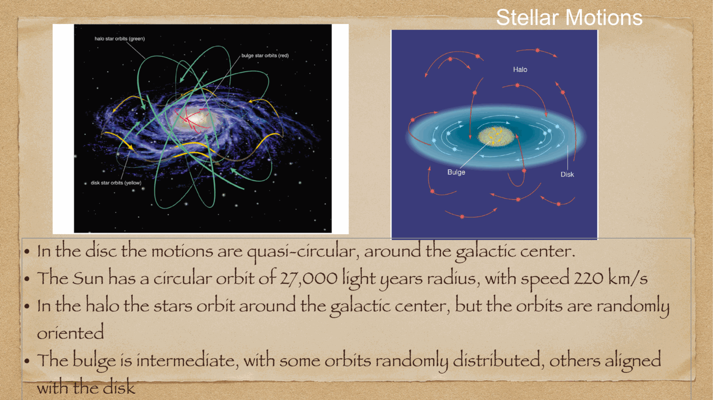
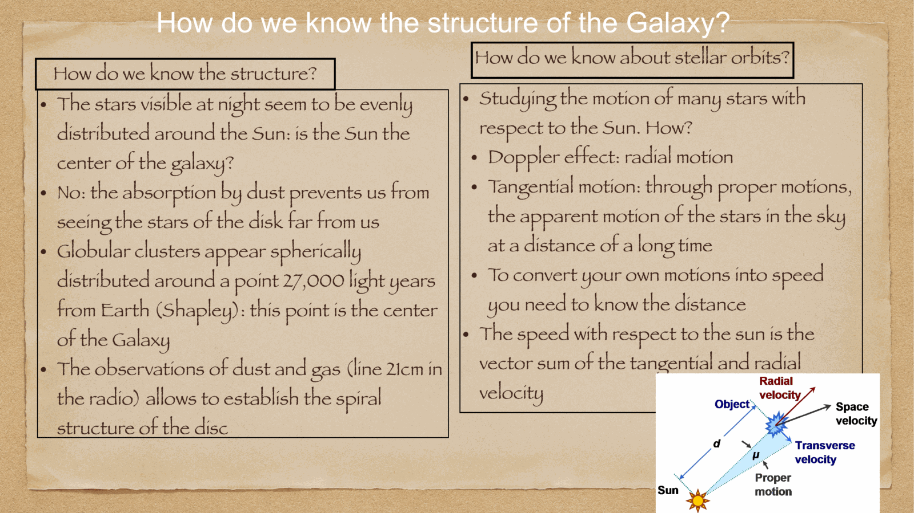

our home galaxy, the **Milky Way**, is a barred spiral galaxy of Hubble morphological type **SBbc**. because our solar system is embedded directly within its dusty disk, mapping its three-dimensional structure requires panoramic multi-wavelength observations—from radio 21 cm lines that penetrate dust to infrared space surveys (2MASS, Spitzer, Gaia).

---

## external analogs and panoramic views

because we cannot view the Milky Way from outside, astronomers use nearby edge-on and face-on spiral galaxies as direct morphological analogs:
- **NGC 4565 (Needle Galaxy)**: excellent analog for the Milky Way viewed **edge-on**—showing the thin disk, dense dust lanes, central spheroidal bulge, and surrounding faint halo.
- **NGC 1232**: excellent analog for the Milky Way viewed **face-on**—revealing grand-design spiral arms emerging from a central bar and winding outward into a multi-arm disk.

---

## the primary structural components

the Milky Way comprises five distinct morphological components:

### 1. the Galactic Disk:
- **diameter**: $\approx 30$ kpc ($\sim 100,000$ light-years).
- **the Thin Disk (Disco Sottile)**:
  - vertical scale height: $h_z \approx 300$ pc.
  - stellar mass: $\approx 6 \times 10^{10} M_\odot$ ($\sim 85\%$ of disk stars).
  - content: young to intermediate-age stars (Population I), open clusters, cold molecular clouds, atomic gas, and active star formation.
  - kinematics: ordered circular rotation ($v_{\text{rot}} \approx 220$ km/s, low velocity dispersion $\sigma_z \sim 15-20$ km/s).
- **the Thick Disk (Disco Spesso)**:
  - vertical scale height: $h_z \approx 1000$ pc ($1$ kpc).
  - stellar mass: $\sim 10-15\%$ of disk stars.
  - content: intermediate-age to old stars, lower metallicity ($[\text{Fe}/\text{H}] \sim -0.5$), higher velocity dispersion ($\sigma_z \sim 40$ km/s). formed early in a violent merger or disk heating event.

### 2. the Central Bulge (Bulge):
- radius: $R \approx 2-3$ kpc, spheroidal/triaxial boxy-peanut bar shape.
- stellar mass: $\approx 1 \times 10^{10} M_\odot$.
- content: dense concentration of predominantly old, metal-rich stars; rapid random velocities with cylindrical rotation.

### 3. the Stellar Halo:
- radius: extends out to $R \sim 50$ kpc.
- stellar mass: $\approx 1-2 \times 10^9 M_\odot$ (only $\sim 1\%$ of total Galactic stellar mass).
- content: ancient metal-poor stars (Population II), $\sim 150-160$ **globular clusters**, and tidal stellar streams (e.g. Sagittarius stream) from devoured dwarf galaxies.
- kinematics: chaotic, highly eccentric orbits with very low net rotation and high velocity dispersion ($\sigma_v \sim 120-150$ km/s).

### 4. the Dark Matter Halo:
- colossal, nearly spherical halo extending out to $R > 100-200$ kpc.
- total virial mass: $M_{\text{vir}} \approx (1.0 - 1.5) \times 10^{12} M_\odot$.
- dominates the gravitational potential of the Milky Way beyond $R \sim 8$ kpc.

---

## solar location and the local standard of rest (LSR)

the Sun is situated in the Orion-Cygnus spur (between the major Sagittarius and Perseus spiral arms):
- **Galactocentric distance**: $R_0 = 8.18 \pm 0.04$ kpc ($\sim 26,000$ light-years).
- **height above Galactic midplane**: $z_0 \approx 20-25$ pc north of the midplane.
- **circular orbital velocity**: $V_0 = 220 \pm 5$ km/s.
- **Galactic year (orbital period)**: $P_{\text{orb}} = \frac{2\pi R_0}{V_0} \approx 230$ million years (the Sun has completed $\sim 20$ orbits since its birth).

---

## see also

- [Fundamentals_Astrophysics_Cosmology_MOC](../../04_Atlas/Fundamentals_Astrophysics_Cosmology_MOC.html)
- [Galactic coordinate system](Galactic%20coordinate%20system.html)
- [Stellar populations I II III](Stellar%20populations%20I%20II%20III.html)
- [Interstellar medium components and gas cycle](Interstellar%20medium%20components%20and%20gas%20cycle.html)
- [Spiral arm kinematics](Spiral%20arm%20kinematics.html)
- [Dark matter on galactic scales](Dark%20matter%20on%20galactic%20scales.html)
- [Galactic Center](Galactic%20Center.html)

  <h4 class="backlinks-title">Linked References (11)</h4>
  <ul class="backlinks-list">
    <li class="backlink-item-wrap"><a href="Dark%20matter%20on%20galactic%20scales.html" class="backlink-item">Dark matter on galactic scales</a></li>
    <li class="backlink-item-wrap"><a href="Galactic%20Center.html" class="backlink-item">Galactic Center</a></li>
    <li class="backlink-item-wrap"><a href="Galactic%20HI%20kinematics%20and%20Milky%20Way%20spiral%20structure.html" class="backlink-item">Galactic HI kinematics and Milky Way spiral structure</a></li>
    <li class="backlink-item-wrap"><a href="Galactic%20coordinate%20system.html" class="backlink-item">Galactic coordinate system</a></li>
    <li class="backlink-item-wrap"><a href="Galaxies%20in%20the%20local%20universe.html" class="backlink-item">Galaxies in the local universe</a></li>
    <li class="backlink-item-wrap"><a href="Interstellar%20absorption.html" class="backlink-item">Interstellar absorption</a></li>
    <li class="backlink-item-wrap"><a href="Interstellar%20medium%20components%20and%20gas%20cycle.html" class="backlink-item">Interstellar medium components and gas cycle</a></li>
    <li class="backlink-item-wrap"><a href="Proper%20motion%20and%20stellar%20kinematics.html" class="backlink-item">Proper motion and stellar kinematics</a></li>
    <li class="backlink-item-wrap"><a href="Spiral%20arm%20kinematics.html" class="backlink-item">Spiral arm kinematics</a></li>
    <li class="backlink-item-wrap"><a href="Stellar%20populations%20I%20II%20III.html" class="backlink-item">Stellar populations I II III</a></li>
    <li class="backlink-item-wrap"><a href="../../04_Atlas/Fundamentals_Astrophysics_Cosmology_MOC.html" class="backlink-item">Fundamentals_Astrophysics_Cosmology_MOC</a></li>
  </ul>

