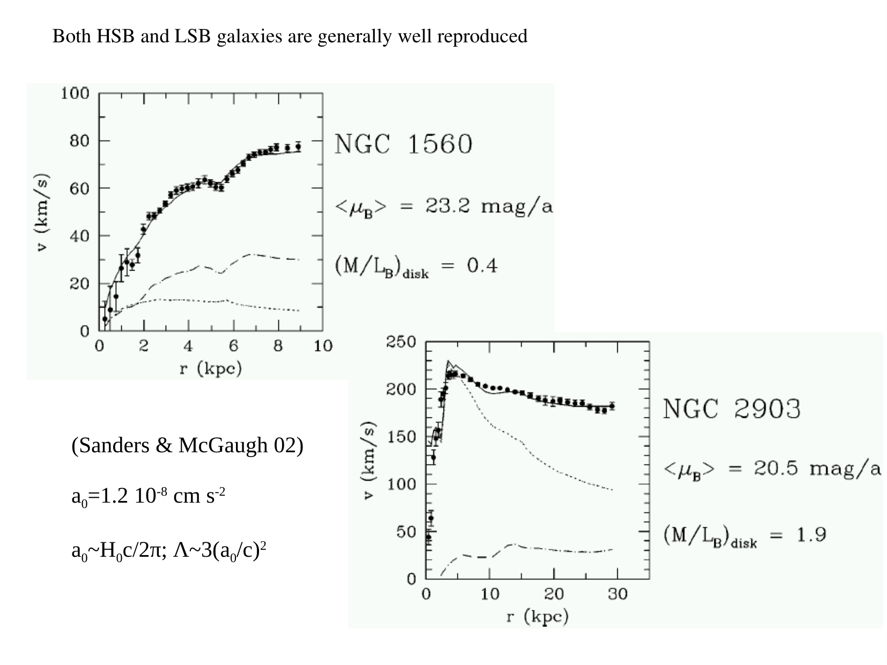
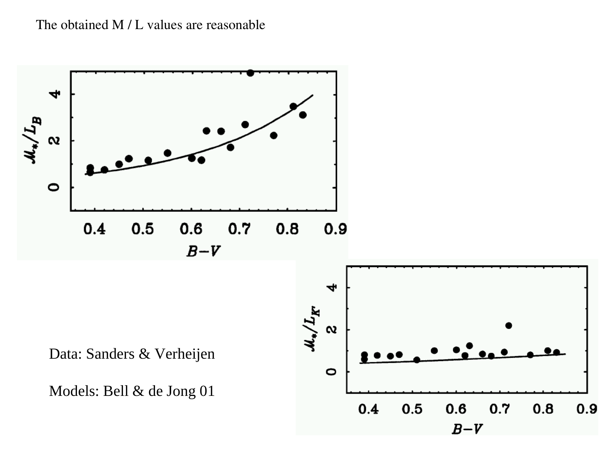
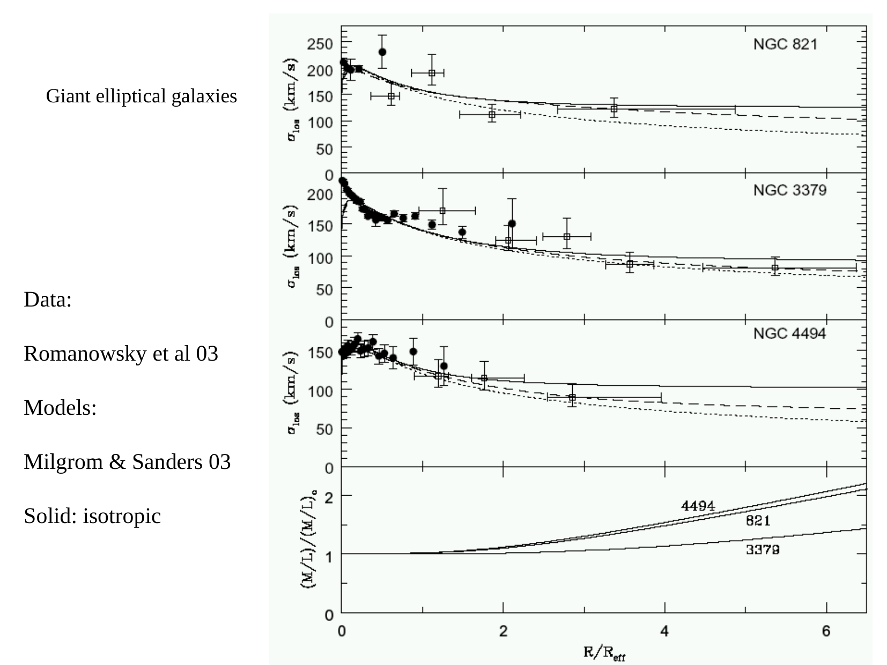
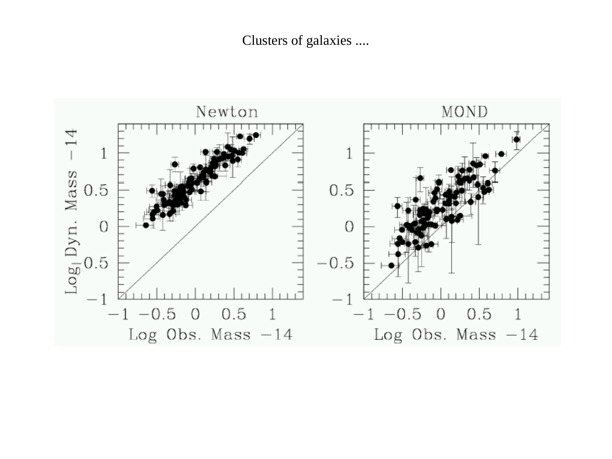
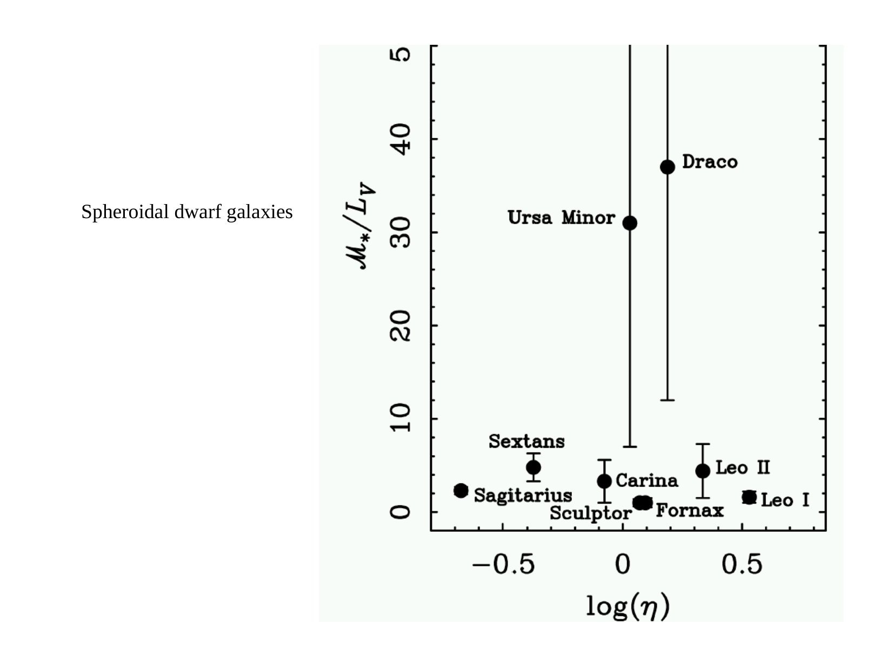
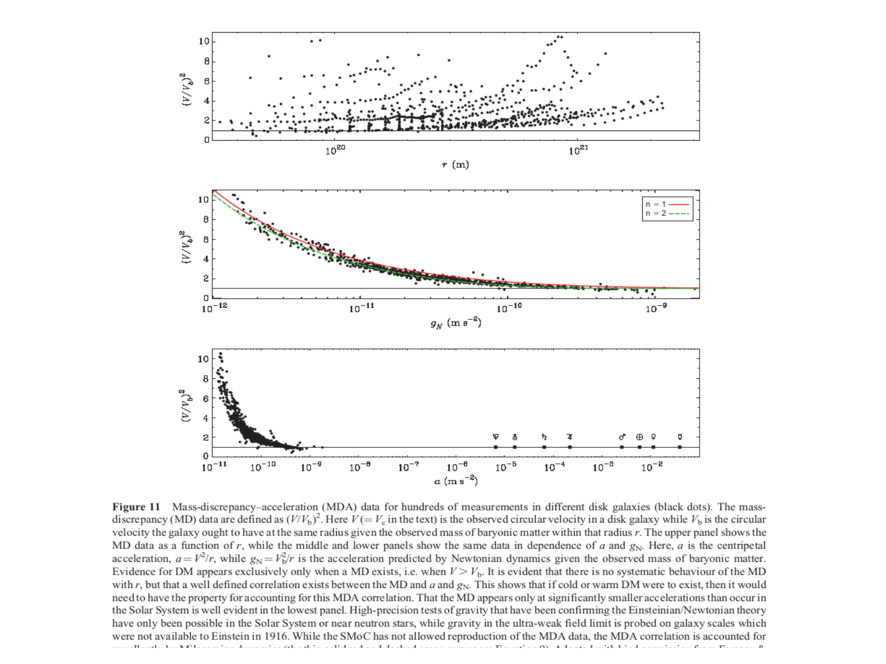
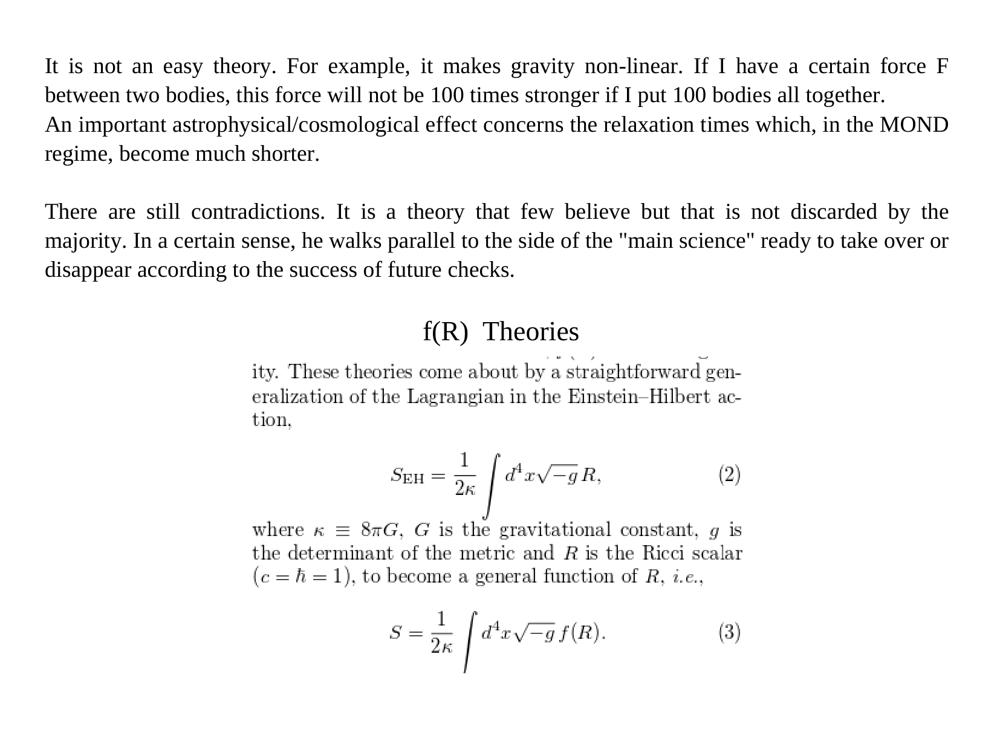
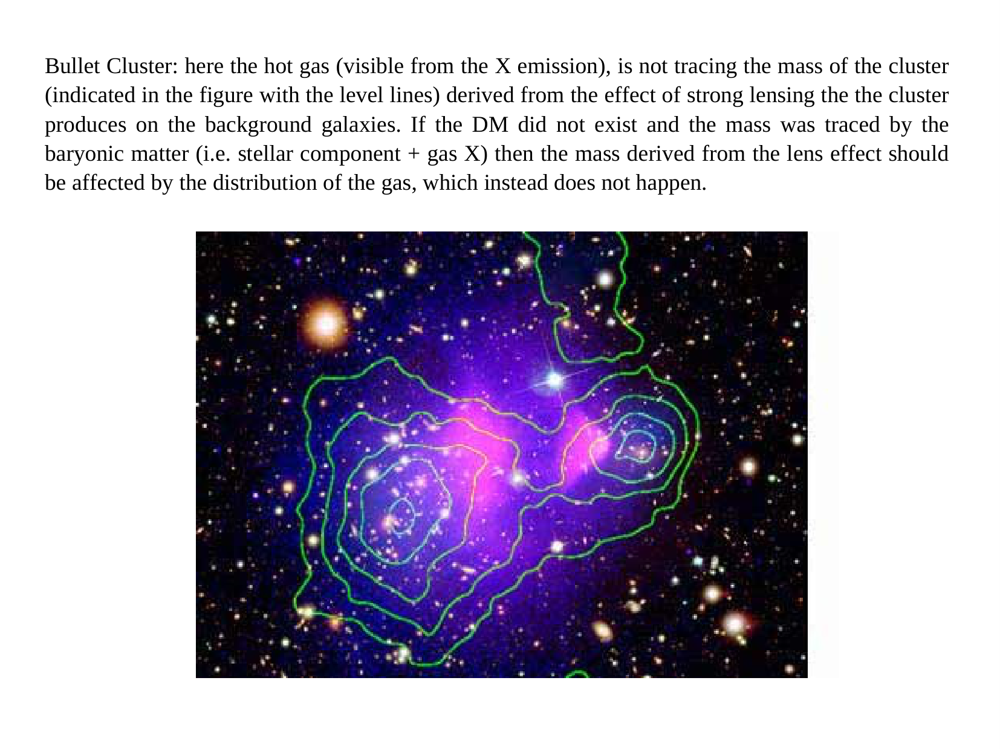
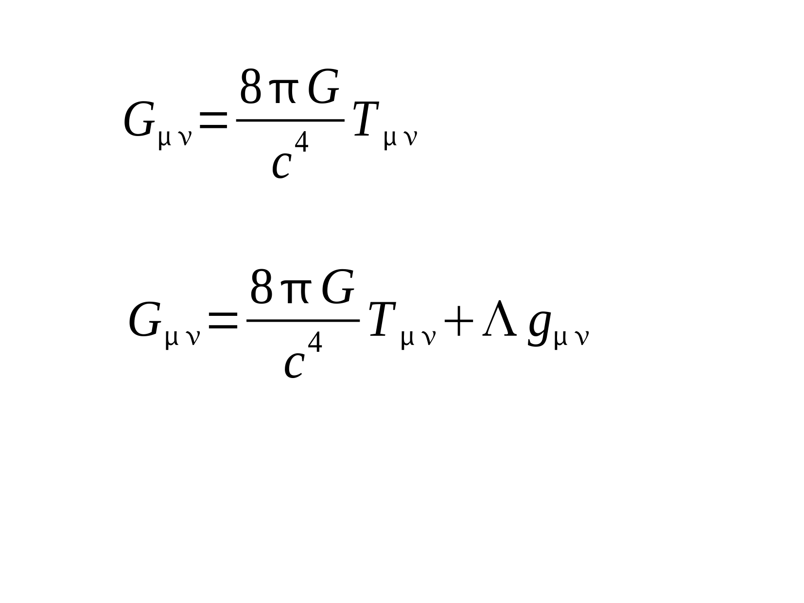
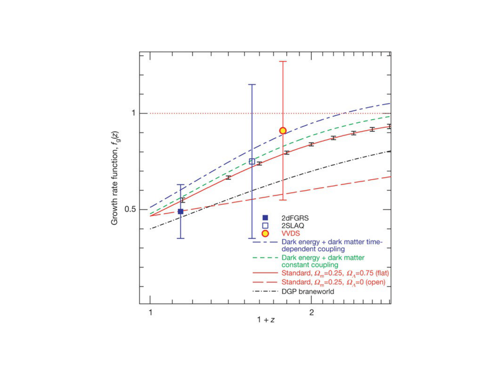


# modified gravity alternatives

up: [Astrophysics_of_Galaxies_MOC](../../04_Atlas/Astrophysics_of_Galaxies_MOC.html) · [Dark matter rotation curves](./Dark%20matter%20rotation%20curves.html)

## mond (modified newtonian dynamics)

Proposed by Mordehai Milgrom in 1983 as an alternative to dark matter. MOND posits that Newton's second law breaks down below a characteristic acceleration scale:

$$a_0 \approx 1.2 \times 10^{-10} \text{ m s}^{-2} \approx \frac{c H_0}{2\pi}$$

The modified equation of motion is:
$$\mu\left(\frac{a}{a_0}\right) a = g_N$$
where $g_N = G M / r^2$ is standard Newtonian gravitational acceleration, and $\mu(x)$ is an interpolation function:
$$\mu(x) \approx \begin{cases} 1 & x \gg 1 \text{ (Newtonian regime)} \\ x & x \ll 1 \text{ (Deep MOND regime)} \end{cases}$$

## deep mond regime consequences

When $a \ll a_0$:
$$\frac{a^2}{a_0} = \frac{G M}{r^2} \implies a = \frac{\sqrt{G M a_0}}{r}$$
For circular motion $a = v^2/r$:
$$\frac{v^4}{r^2} = \frac{G M a_0}{r^2} \implies v_{\rm flat} = (G M a_0)^{1/4}$$

- **flat rotation curves**: $v_{\rm flat}$ is completely independent of radius $r$.
- **baryonic tully-fisher relation**: $M_{\rm bar} \propto v_{\rm flat}^4$ emerges naturally with exact normalization set by $a_0$.

## challenges and failures

- **galaxy clusters**: MOND fails to explain the velocity dispersions of rich clusters (e.g., Coma) without invoking missing baryons or massive neutrinos.
- **the bullet cluster**: [Bullet Cluster and dark matter mapping](./Bullet%20Cluster%20and%20dark%20matter%20mapping.html) shows lensing peaks offset from the gas, requiring collisionless dark mass.
- **cosmology and cmb**: relativistic MOND formulations (TeVeS, Bekenstein 2004) struggle to simultaneously match the acoustic peak heights in the CMB power spectrum and the galaxy matter power spectrum $P(k)$ without a cold dark matter component.

## connections

- dark matter evidence: [Bullet Cluster and dark matter mapping](./Bullet%20Cluster%20and%20dark%20matter%20mapping.html), [Dark matter rotation curves](./Dark%20matter%20rotation%20curves.html)
- scaling laws: [Tully-Fisher relation](./Tully-Fisher%20relation.html)

---

## lecture slides and reference figures (Prof. Alessandro Pizzella)



  <h4 class="backlinks-title">Linked References (4)</h4>
  <ul class="backlinks-list">
    <li class="backlink-item-wrap"><a href="../../04_Atlas/Astrophysics_of_Galaxies_MOC.html" class="backlink-item">Astrophysics_of_Galaxies_MOC</a></li>
    <li class="backlink-item-wrap"><a href="./Bullet%20Cluster%20and%20dark%20matter%20mapping.html" class="backlink-item">Bullet Cluster and dark matter mapping</a></li>
    <li class="backlink-item-wrap"><a href="./Ionized%20gas%20kinematics.html" class="backlink-item">Ionized gas kinematics</a></li>
    <li class="backlink-item-wrap"><a href="./Mass-radius%20and%20mass-velocity%20relations.html" class="backlink-item">Mass-radius and mass-velocity relations</a></li>
  </ul>

