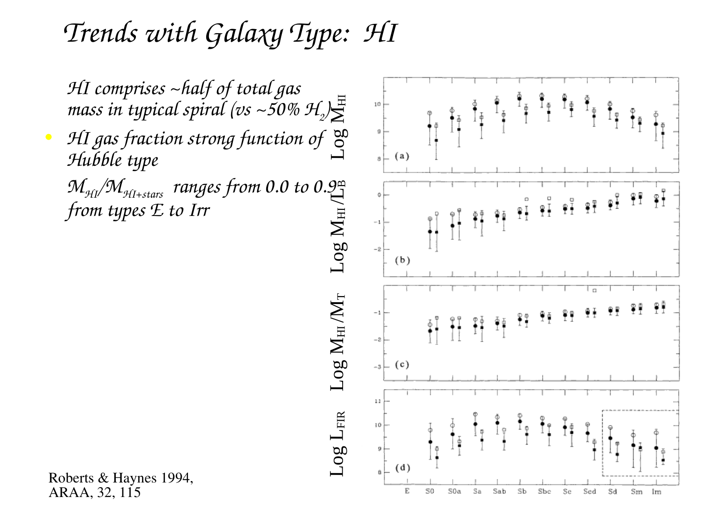
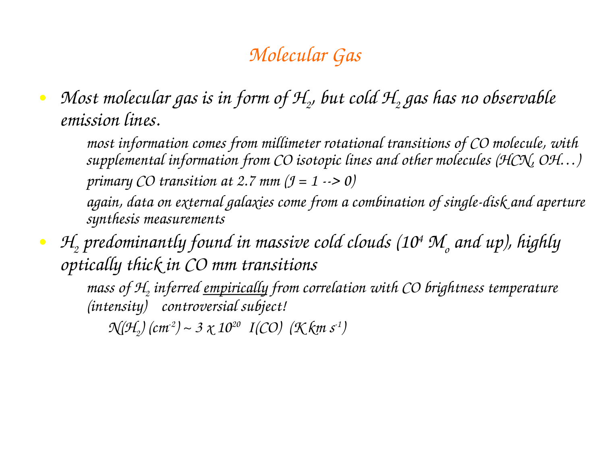
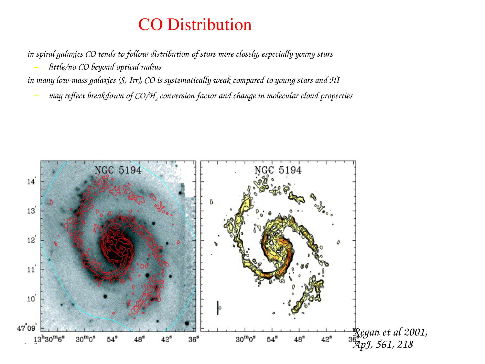
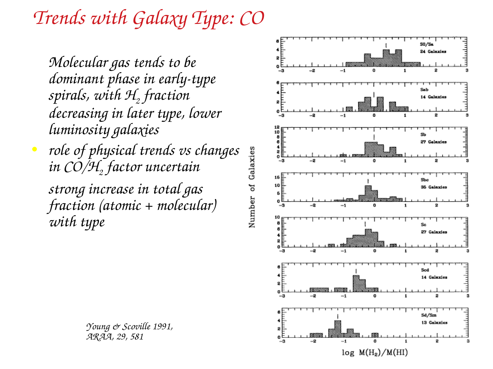
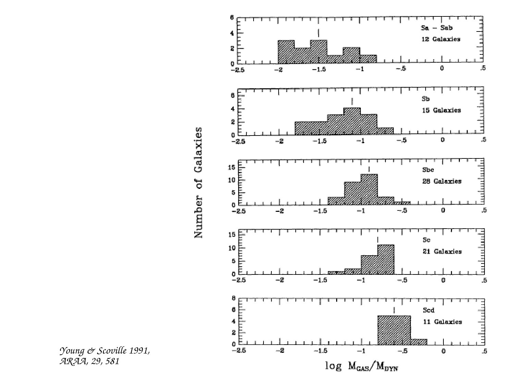
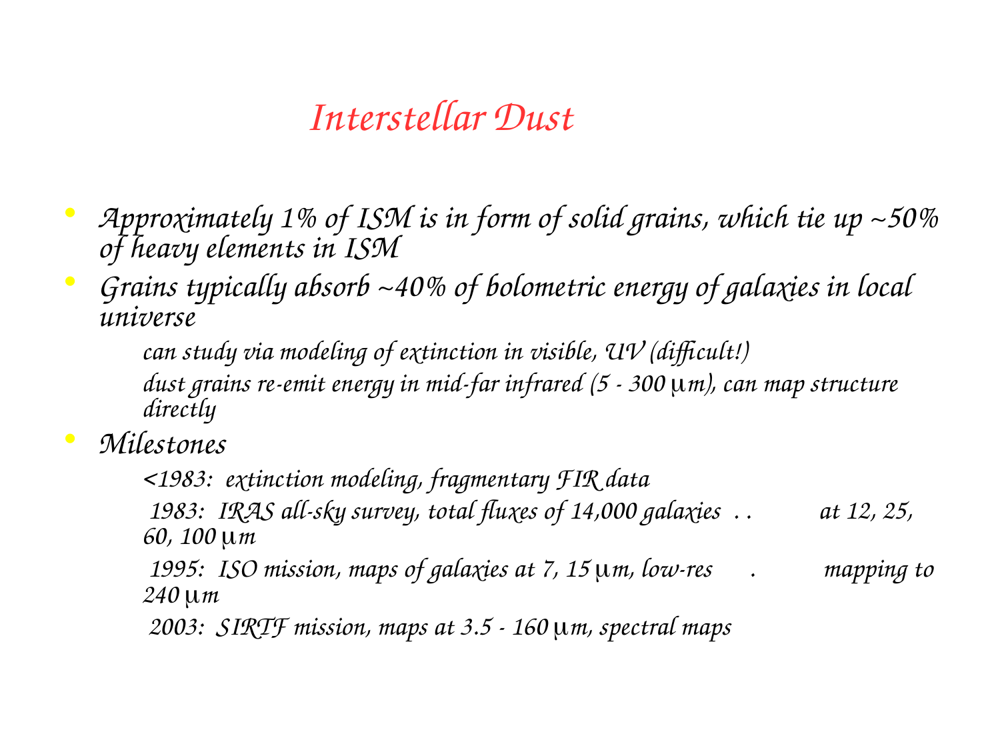

# Molecular Clouds

Parent [Astrophysics_of_Galaxies_MOC](../../04_Atlas/Astrophysics_of_Galaxies_MOC.html) · [Schmidt-Kennicutt law](Schmidt-Kennicutt%20law.html) · [H I regions](H%20I%20regions.html)

## 1. Physical Properties of Giant Molecular Clouds (GMCs)

Giant Molecular Clouds represent the coldest, densest, and most gravitationally bound phase of the interstellar medium (ISM). They serve as the exclusive astrophysical incubators for star formation across cosmic time.

Representative physical parameters of galactic GMCs
- Gas temperature - $T \sim 10 - 20 \text{ K}$ throughout the bulk volume, maintained by a balance between cosmic ray heating and molecular rotational line cooling (primarily $^{12}\text{CO}$ and $^{13}\text{CO}$).
- Number density - Mean volume density $n(\text{H}_2) \sim 10^2 - 10^4 \text{ cm}^{-3}$, with dense pre-stellar clumps and cores reaching $n \sim 10^5 - 10^8 \text{ cm}^{-3}$.
- Total mass - $M \sim 10^4 - 10^6 M_\odot$, with the upper mass cutoff set by galactic shear and feedback.
- Physical size - Outer radii $R \sim 10 - 100 \text{ pc}$.
- Dynamic state - Highly turbulent, supersonic velocity dispersions ($\mathcal{M} \equiv \sigma_v / c_s \sim 5 - 20$), threaded by magnetic fields with typical strengths $B \sim 10 - 50 \, \mu\text{G}$.

## 2. Molecular Tracers and the Physics of Carbon Monoxide

Molecular hydrogen ($\text{H}_2$) comprises over $99\%$ of the molecular gas mass in GMCs. However, cold $\text{H}_2$ is virtually invisible in direct emission.

### The Invisibility of Cold Molecular Hydrogen

1. Quantum mechanical symmetry - Because the $\text{H}_2$ molecule consists of two identical protons, it possesses inversion symmetry and has zero permanent electric dipole moment ($\mu = 0$).
2. Selection rules - Dipole transitions ($\Delta J = \pm 1$) are strictly forbidden. Radiative transitions can only occur via very weak electric quadrupole channels ($\Delta J = \pm 2$).
3. High excitation energy - The lowest excited rotational state of ortho- or para-hydrogen ($J = 2 \to 0$) requires an excitation energy
$$\frac{\Delta E_{20}}{k_B} \approx 512 \text{ K}$$
At typical GMC temperatures of $T \approx 10 - 20 \text{ K}$, the Boltzmann factor $\exp(-\Delta E / k_B T) \sim e^{-30} \approx 10^{-13}$ is vanishingly small. The $J=2$ rotational state remains completely unpopulated in cold molecular clouds.

Direct $\text{H}_2$ emission is detectable only when gas is shock-heated or irradiated by intense ultraviolet radiation ($T > 1000 \text{ K}$) in photodissociation regions (PDRs).

### Carbon Monoxide ($^{12}\text{CO}$) as the Primary Proxy

Astronomers trace cold molecular gas using trace carbon monoxide ($^{12}\text{C}^{16}\text{O}$), the second most abundant molecule in the interstellar medium (abundance relative to $\text{H}_2$ is $X_{\text{CO}} \approx [\text{CO}/\text{H}_2] \sim 10^{-4}$).
- Permanent dipole moment - As an asymmetric diatomic molecule, carbon monoxide has an electric dipole moment $\mu = 0.110 \text{ Debye}$.
- Rotational energy levels - The rigid rotor energy levels are $E_J = h B J(J+1)$, where $B \approx 57.636 \text{ GHz}$ is the rotational constant.
- The fundamental $J = 1 \to 0$ transition - Has rest frequency
$$\nu_{10} = 2B = 115.271 \text{ GHz} \quad (\lambda = 2.60 \text{ mm})$$
- Low excitation threshold - The energy required to excite the $J=1$ state is
$$\frac{\Delta E_{10}}{k_B} = \frac{h \nu_{10}}{k_B} \approx 5.53 \text{ K}$$
Because $\Delta E_{10} / k_B < T_{\text{cloud}}$, collisions with $\text{H}_2$ readily populate the $J=1$ level even in the coldest clouds.
- Critical density - Balancing collisional de-excitation with spontaneous radiative decay ($A_{10} \approx 7.2 \times 10^{-8} \text{ s}^{-1}$) yields the critical density
$$n_{\text{crit}} = \frac{A_{10}}{\langle \sigma v \rangle} \approx 2 \times 10^3 \text{ cm}^{-3}$$

## 3. Mathematical Derivation of the $X_{\text{CO}}$ Conversion Factor

A fundamental paradox arises when measuring molecular gas masses using $^{12}\text{CO}(1-0)$.

The $^{12}\text{CO}(1-0)$ emission line is heavily optically thick throughout molecular clouds, with line-center optical depths reaching $\tau \sim 10 - 100$.

For an optically thick, thermalized radiative transfer medium, the emergent brightness temperature saturates at the kinetic temperature of the cloud surface
$$T_{\text{mb}}(v) \approx T_k \left[ 1 - e^{-\tau(v)} \right] \approx T_k$$

Under naive radiative transfer, an optically thick emission line reflects only the surface area and temperature of the cloud, containing zero information about column density or total interior mass!

How, then, can the integrated intensity of an optically thick line serve as a reliable mass estimator?

### Resolution. The Virialized Cloud Ensemble Model

The resolution lies in the fact that GMCs are self-gravitating, virialized entities governed by supersonic turbulence.

Consider a spherical, virialized molecular cloud of total mass $M$, radius $R$, and one-dimensional velocity dispersion $\sigma_v$.

By the Virial Theorem, gravitational potential energy balances internal kinetic energy
$$2 K + U = 0 \implies 3 M \sigma_v^2 - \frac{3}{5} \frac{G M^2}{R} = 0$$

Solving for the virial mass
$$M_{\text{vir}} = \frac{5 \sigma_v^2 R}{G}$$

The line-integrated luminosity of the cloud in the $^{12}\text{CO}(1-0)$ line, denoted $L_{\text{CO}}$, is defined as the brightness temperature integrated over the projected surface area of the cloud $A = \pi R^2$ and over the full Doppler line profile $\Delta v \propto \sigma_v$
$$L_{\text{CO}} = \int_{\text{area}} dA \int T_{\text{mb}}(v) dv \approx T_{\text{mb,peak}} \, (\pi R^2) \, (\sqrt{2\pi} \sigma_v) \propto T_k R^2 \sigma_v$$
where we used the fact that at line center $T_{\text{mb,peak}} \approx T_k$.

Now consider the ratio of total virial mass to integrated CO luminosity, defined as the mass conversion factor $\alpha_{\text{CO}}$
$$\alpha_{\text{CO}} \equiv \frac{M_{\text{vir}}}{L_{\text{CO}}} \propto \frac{\frac{R \sigma_v^2}{G}}{T_k R^2 \sigma_v} = \frac{\sigma_v}{G T_k R}$$

To evaluate this ratio, we invoke Larson's second scaling law, which demonstrates empirically that self-gravitating molecular clouds have approximately constant mean surface mass density $\Sigma \equiv M / (\pi R^2) \approx \text{const} \approx 100 \, M_\odot \text{ pc}^{-2}$.

Expressing velocity dispersion in terms of surface density $\Sigma$ and radius $R$
$$\Sigma = \frac{M}{\pi R^2} = \frac{5 \sigma_v^2}{\pi G R} \implies \frac{\sigma_v}{R} = \sqrt{\frac{\pi G \Sigma}{5 R}}$$
$$\sigma_v = \sqrt{\frac{\pi G \Sigma R}{5}}$$

Substituting this expression for $\sigma_v$ into the conversion factor ratio
$$\alpha_{\text{CO}} \propto \frac{\sqrt{\frac{\pi G \Sigma R}{5}}}{G T_k R} = \frac{\sqrt{\pi \Sigma}}{\sqrt{5 G} \, T_k \sqrt{R}} = \frac{\sqrt{\bar{\rho}}}{T_k \sqrt{G}}$$
where $\bar{\rho} \approx M / R^3 \propto \Sigma / R$ is the mean volume density.

More fundamentally, if we express the ratio in terms of mean column density $N(\text{H}_2) = \Sigma / (\mu m_{\text{H}})$ and integrated velocity width $W_{\text{CO}} = \int T_{\text{mb}} dv \approx T_k \sigma_v$
$$X_{\text{CO}} \equiv \frac{N(\text{H}_2)}{W_{\text{CO}}} \propto \frac{\Sigma}{T_k \sigma_v} \propto \frac{\Sigma}{T_k \sqrt{G \Sigma R}} \propto \frac{\sqrt{\Sigma / R}}{T_k \sqrt{G}} \propto \frac{\sqrt{\bar{n}(\text{H}_2)}}{T_k}$$

Because all self-gravitating clouds in galactic disks share comparable mean volume densities ($\bar{n} \sim 10^2 - 10^3 \text{ cm}^{-3}$) and gas kinetic temperatures ($T_k \sim 10 - 15 \text{ K}$), the ratio $\alpha_{\text{CO}}$ is remarkably invariant!

Physical summary - Even though individual lines of sight are optically thick, the Doppler linewidth $\sigma_v$ reflects the gravitational potential depth of the cloud ($M \propto \sigma_v^2 R$). Clouds with more mass have broader linewidths, allowing CO photons from different velocity channels to escape without self-absorption. The cloud-integrated CO luminosity scales directly with the total virial mass.

### Quantitative Calibration Values

In astronomical units, the column density conversion factor $X_{\text{CO}}$ is defined by
$$N(\text{H}_2) = X_{\text{CO}} \cdot W_{\text{CO}}$$
where $W_{\text{CO}} \equiv \int T_{\text{mb}} dv$ has units of $\text{K km s}^{-1}$.

The canonical Milky Way conversion factor (Bolatto, Wolfire and Leroy 2013) is
$$X_{\text{CO,MW}} \approx 2.0 \times 10^{20} \text{ cm}^{-2} (\text{K km s}^{-1})^{-1}$$

The corresponding mass conversion factor $\alpha_{\text{CO}}$, which converts CO line luminosity $L'_{\text{CO}}$ [$\text{K km s}^{-1} \text{pc}^2$] to total molecular gas mass including a factor of $1.36$ for helium and metals, is
$$\alpha_{\text{CO,MW}} \approx 4.35 \, M_\odot (\text{K km s}^{-1} \text{pc}^2)^{-1}$$

### Metallicity Dependence and CO-Dark Molecular Gas

In low-metallicity environments (such as dwarf irregular galaxies or high-redshift galaxies), $X_{\text{CO}}$ increases dramatically.

Physical mechanism - Carbon and oxygen are less abundant, and the dust-to-gas ratio is low. Dust grains provide the primary shielding against interstellar Far-Ultraviolet (FUV) radiation.
- Molecular hydrogen can self-shield against dissociating Lyman-Werner band photons ($11.2 - 13.6 \text{ eV}$) at modest column densities ($A_V \sim 0.2$).
- In contrast, CO relies on dust shielding ($A_V \gtrsim 1 - 2$) to prevent photodissociation.

In low-metallicity clouds, a massive outer shell forms where hydrogen is fully molecular ($\text{H}_2$), but carbon exists as ionized carbon ($\text{C}^+$) rather than CO. This reservoir is termed CO-dark molecular gas.

Empirically, the conversion factor scales inversely with gas-phase oxygen metallicity
$$X_{\text{CO}} \propto Z^{-1.5 \text{ to } -2.0} \implies \alpha_{\text{CO}} \approx \alpha_{\text{CO,MW}} \left(\frac{Z}{Z_\odot}\right)^{-1.7}$$

In the Small Magellanic Cloud ($Z \approx 0.2 Z_\odot$), $\alpha_{\text{CO}}$ is a factor of $\sim 20 - 50$ higher than the Milky Way value.

## 4. Larson's Empirical Scaling Relations (1981)

Richard Larson (1981) compiled millimeter observations of molecular clouds spanning over three decades in physical size and established three universal scaling laws

1. The Linewidth-Size Relation (Supersonic Turbulence)
$$\sigma_v = 1.10 \left(\frac{R}{1 \text{ pc}}\right)^{0.50 \pm 0.05} \text{ km s}^{-1}$$
This power law of exponent $\sim 0.5$ indicates that molecular cloud internal kinematics are dominated by a universal cascade of compressible, supersonic, magnetohydrodynamic turbulence (consistent with Burgers turbulence rather than Kolmogorov incompressible $1/3$ scaling).

2. The Density-Size Relation (Constant Column Density)
$$\langle n(\text{H}_2) \rangle \approx 3400 \left(\frac{R}{1 \text{ pc}}\right)^{-1.10} \text{ cm}^{-3}$$
Multiplying by radius demonstrates that the mean surface mass density is constant across clouds
$$\Sigma_{\text{GMC}} \equiv \mu m_{\text{H}} \langle n(\text{H}_2) \rangle R \approx \text{constant} \approx 100 - 170 \, M_\odot \text{ pc}^{-2}$$

3. Virial Equilibrium
$$M_{\text{vir}} \equiv \frac{5 \sigma_v^2 R}{G} \approx M_{\text{lum}}$$
The virial parameter $\alpha_{\text{vir}} \equiv 5 \sigma_v^2 R / (G M) \approx 1 - 2$, proving that molecular clouds are gravitationally bound structures in approximate hydrostatic balance supported by turbulent and magnetic pressure.

## 5. Blackboard Observational Graphs and Sketches

### Graph 1. Larson's Linewidth-Size Scaling Relation

```
  log10 sigma_v (km/s)
     ^
 2.0 |                                          * Giant GMC complexes (R ~ 100 pc)
     |                                   *     *  sigma_v ~ 10 km/s
 1.0 |                            *     *
     |                     *     *  Turbulent power law -
 0.0 |              *     *         sigma_v propto R^(0.50)
     |       *     *
-0.5 | *    *  Dense pre-stellar cores (R ~ 0.1 pc, sigma_v ~ 0.3 km/s)
     +=========================================================================>
      -1.0         0.0        +1.0        +2.0        +3.0   log10 R (pc)
```

Presentation notes for the blackboard
- Extends seamlessly from sub-parsec star-forming dense cores to massive $10^6 M_\odot$ giant molecular cloud complexes.
- Demonstrates that turbulence is scale-dependent, transferring energy from galactic shear on large scales down to dissipation scales.

### Graph 2. The Metallicity Dependence of the CO Conversion Factor $\alpha_{\text{CO}}$

```
  log10 alpha_CO (M_sun / (K km s^-1 pc^2))
     ^
 2.5 |  * Low-metallicity dwarf galaxies (SMC - Z ~ 0.2 Z_sun)
     |    \  Severe CO-dark molecular gas (alpha_CO ~ 50 - 100)
 2.0 |      \
     |        \
 1.5 |          \
     |            \====================* Milky Way value (alpha_CO ~ 4.35)
 1.0 |                                  \  (Z ~ Z_sun)
     |                                   \  ULIRGs / Starbursts (alpha_CO ~ 0.8)
 0.0 +=========================================================================>
       7.8         8.0         8.2         8.4         8.6         8.8
                                 12 + log10(O/H)
```

Key quantitative takeaways for the blackboard
- At solar metallicity ($12 + \log(\text{O}/\text{H}) \approx 8.7$) - Standard Milky Way factor $\alpha_{\text{CO}} \approx 4.35$.
- In metal-poor dwarfs ($12 + \log(\text{O}/\text{H}) < 8.2$) - $\alpha_{\text{CO}}$ shoots upward because dust shielding fails and CO photodissociates, while $\text{H}_2$ self-shields.
- In extreme starbursts and ULIRGs - $\alpha_{\text{CO}}$ drops to $\sim 0.8$ because the entire interstellar medium is a warm, high-pressure, space-filling molecular medium where gas is not confined to discrete bound clouds.

## 6. Exact Course Citations and Literature Provenance

- Larson, Richard B. (1981), Turbulence and star formation in molecular clouds, Monthly Notices of the Royal Astronomical Society, volume 194, pages 809 to 826 - Original discovery of the three Larson scaling relations.
- Bolatto, Alberto D., Mark Wolfire, and Adam K. Leroy (2013), The CO-to-H2 Conversion Factor, Annual Review of Astronomy and Astrophysics, volume 51, pages 207 to 268 - Comprehensive review of $X_{\text{CO}}$, virial derivations, and metallicity scaling.
- Mo, Houjun, Frank van den Bosch, and Simon White (2010), Galaxy Formation and Evolution, Cambridge University Press
  - Chapter 10 The Interstellar Medium, Section 10.1 Components of the ISM, pages 452 to 468 - Giant molecular clouds, excitation temperatures, and CO chemistry.
- Binney, James, and Michael Merrifield (1998), Galactic Astronomy, Princeton University Press
  - Chapter 8 The Interstellar Medium, Section 8.2 Molecular Gas, pages 440 to 455 - Dipole vs quadrupole physics, $^{12}\text{CO}(1-0)$ line transfer, and cloud mass distributions.
- Course lecture notes and slides (Prof. Alessandro Pizzella)
  - Slide file Astrophysic_gal_10_ism.pdf (Interstellar Medium)
    - Slide 13 - Properties of Giant Molecular Clouds (temperatures, densities, masses).
    - Slide 14 - Rotational energy levels and millimeter spectroscopy of $^{12}\text{CO}$.
    - Slide 15 - The $X_{\text{CO}}$ conversion factor definition and numerical values.
    - Slide 16 - Larson scaling laws and supersonic turbulence.
    - Slides 17 to 18 - Cold dust emission, metallicity dependence, and star formation rate surface densities.

---

## Connections

- Star formation physics - [Schmidt-Kennicutt law](Schmidt-Kennicutt%20law.html), Star formation efficiency and timescales
- ISM phases - [H I regions](H%20I%20regions.html), [Interstellar medium components and gas cycle](Interstellar%20medium%20components%20and%20gas%20cycle.html)
- Photodissociation - [Photodissociation regions PDRs](Photodissociation%20regions%20PDRs.html), [Ionisation stratification](Ionisation%20stratification.html)

---

## Lecture Slides and Reference Figures (Prof. Alessandro Pizzella)













<div class="backlinks-section">
  <h4 class="backlinks-title">Linked References (5)</h4>
  <ul class="backlinks-list">
    <li class="backlink-item-wrap"><a href="H%20I%20regions.html" class="backlink-item">H I regions</a></li>
    <li class="backlink-item-wrap"><a href="H%20II%20region%20spectroscopy.html" class="backlink-item">H II region spectroscopy</a></li>
    <li class="backlink-item-wrap"><a href="Photodissociation%20regions%20PDRs.html" class="backlink-item">Photodissociation regions PDRs</a></li>
    <li class="backlink-item-wrap"><a href="Schmidt-Kennicutt%20law.html" class="backlink-item">Schmidt-Kennicutt law</a></li>
    <li class="backlink-item-wrap"><a href="../../04_Atlas/Astrophysics_of_Galaxies_MOC.html" class="backlink-item">Astrophysics_of_Galaxies_MOC</a></li>
  </ul>
</div>

