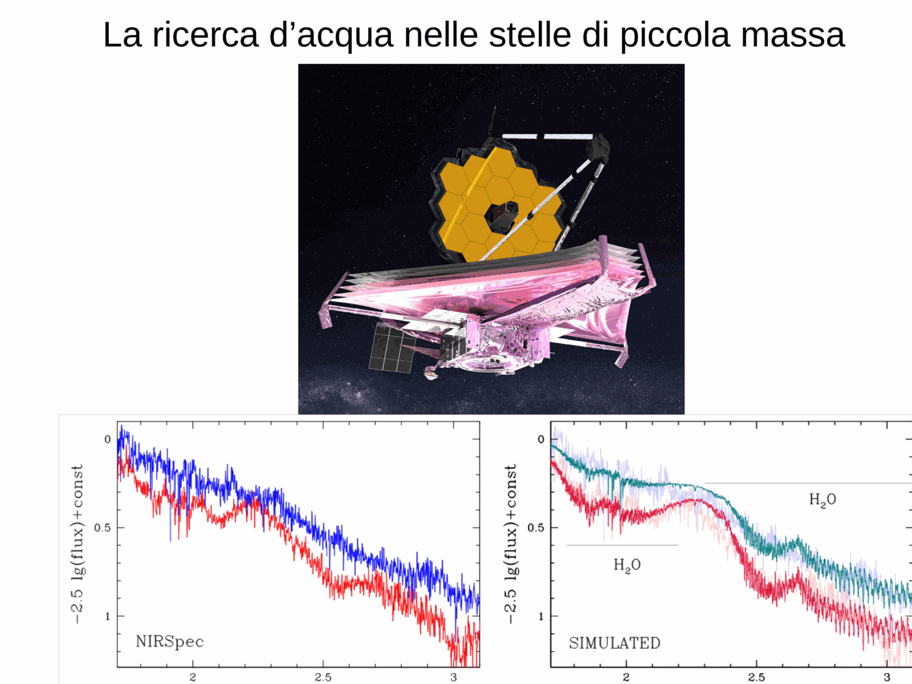
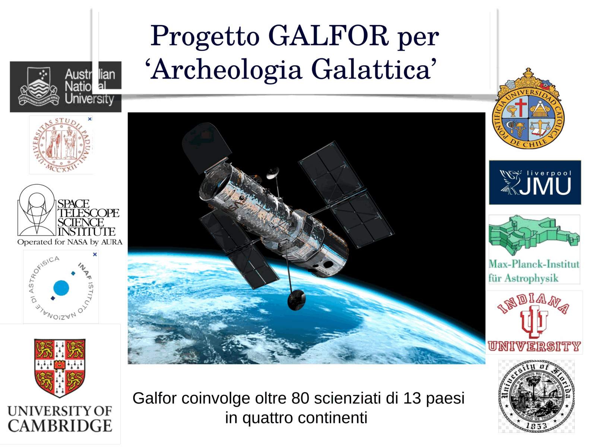
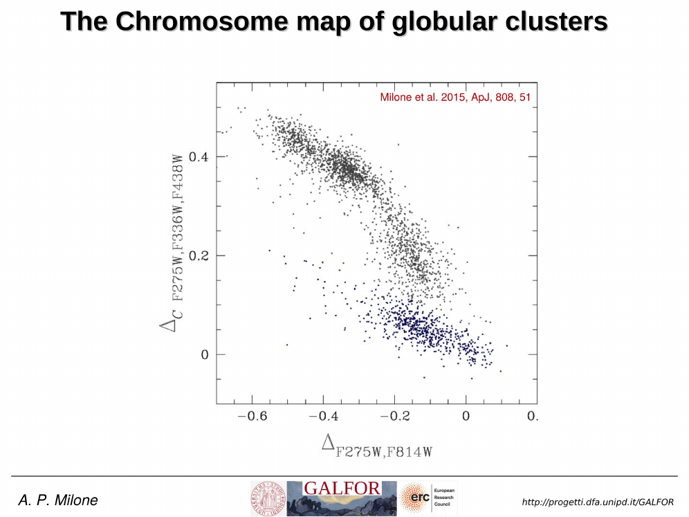
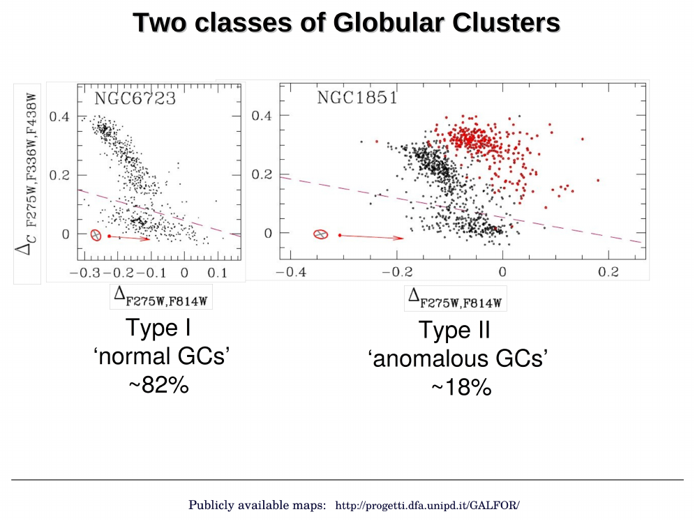
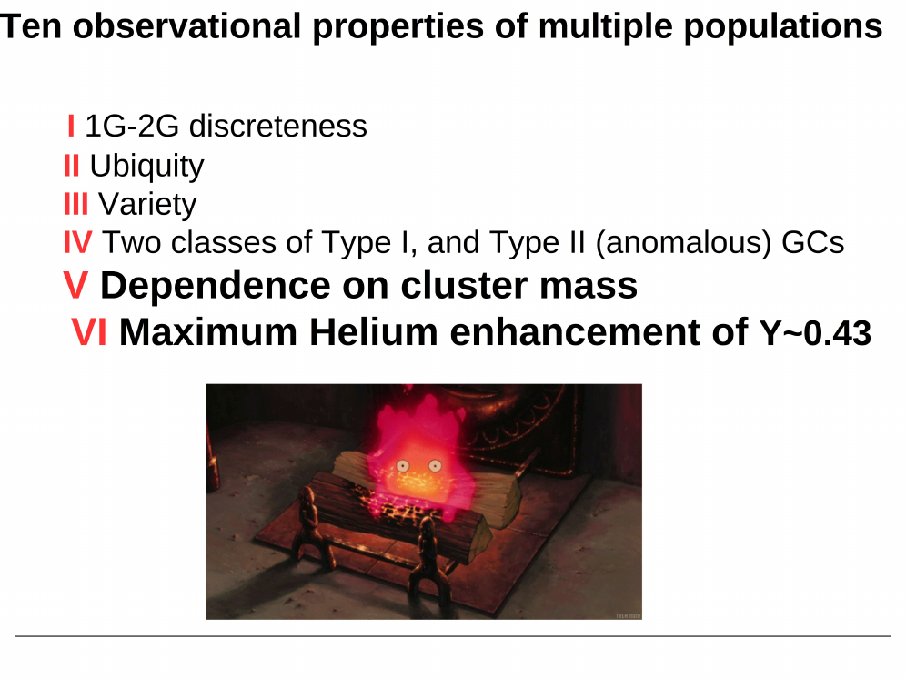
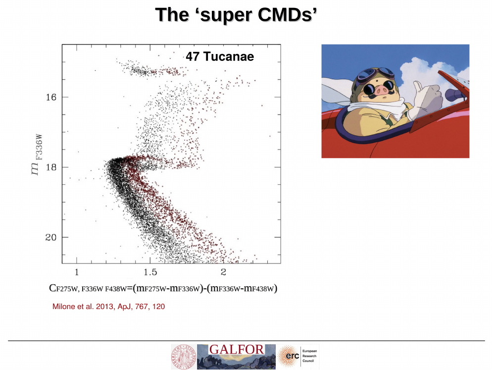


for most of the 20th century globular clusters were the textbook example of a [Single stellar population SSP](./Single%20stellar%20population%20SSP.html): one age, one metallicity, one helium content, all stars formed in a single burst from chemically homogeneous gas. this picture broke down gradually + then catastrophically over three decades.

## the spectroscopic prelude

the first cracks appeared in the 1970s with low-resolution spectroscopy of red giants in M3 + M13. some giants showed strong CN bands, others did not, at the same luminosity + metallicity. cohen, norris, freeman, suntzeff + others noticed star-to-star variations in CN, CH, Na that could not be reproduced by any single isochrone.

through the 1980s + 1990s these scattered anomalies coalesced into a coherent pattern. high-resolution echelle spectroscopy by carretta, gratton, sneden, kraft + collaborators showed that essentially every well-studied galactic GC has a [Na O anticorrelation](./Na%20O%20anticorrelation.html): stars that are sodium-rich are oxygen-poor, + vice versa. this anti-correlation is not seen in halo or disk field stars at the same metallicity. it is the chemical fingerprint of GCs.

the fanfare moment was the FLAMES@VLT survey by carretta + gratton + bragaglia (2009, 2010), which observed ~2500 RGB stars in 19 GCs. every cluster showed Na-O. they argued this was the defining signature of a globular cluster: any old massive cluster has it, any cluster without it is not really a GC.

*Na-O anti-correlation in 19 GCs (Carretta et al. 2009): every cluster shows the inverse correlation between [Na/Fe] and [O/Fe], the chemical fingerprint of multiple populations.*

## the photometric revolution

spectroscopy is expensive + reaches only the brightest giants. the breakthrough came when HST + UV photometry made the populations visible directly on the [Color-magnitude diagrams of clusters](./Color-magnitude%20diagrams%20of%20clusters.html).

bedin et al. 2004 used ACS to image $\omega$ Centauri + found a clearly split Main sequence MS: two parallel sequences separated by ~0.1 mag in color, both extending from the turn-off down several magnitudes. this could not be a chance superposition or a binary sequence. $\omega$ Cen was already known to be chemically peculiar (wide [Fe/H] spread, anomalous abundances), but the MS split forced the conclusion that it hosted physically distinct populations.

piotto et al. 2007 then found a triple main sequence in NGC 2808, a cluster previously thought to be normal. three discrete MS branches, with the bluest interpreted as helium-enhanced ($Y \sim 0.40$) by d'antona + caloi. this was the moment GCs lost their SSP status definitively. NGC 2808 had no metallicity spread, so the only way to split the MS was a [Helium spread in GCs](./Helium%20spread%20in%20GCs.html).

## the UV legacy survey

milone, piotto, bedin + collaborators systematized this with the HST UV Legacy Survey of GCs (PI piotto, milone et al. 2017). 57 galactic GCs imaged in F275W + F336W + F438W + F606W + F814W. the UV filters are the magic: F275W is sensitive to OH, F336W to NH, F438W contains the CN + CH bands. stars with different (C, N, O) abundances split cleanly in UV colors even when they overlap in optical.

this survey produced [Photometric chromosome maps](./Photometric%20chromosome%20maps.html) for nearly every galactic GC + showed that multiple populations are universal in old massive clusters. it also revealed [Type I and Type II GCs](./Type%20I%20and%20Type%20II%20GCs.html) as two distinct flavors of the phenomenon.

## what we now believe

every old galactic GC with mass $M \gtrsim 10^{4.5}\, M_\odot$ hosts at least two populations:
- 1G: primordial composition (Na-poor, O-rich, CN-weak, normal He)
- 2G: enhanced in Na, Al, N, He + depleted in O, Mg, C

the 2G fraction averages ~65% across the survey, increases with cluster mass, + the populations are not radially mixed in the youngest dynamical sense (2G often centrally concentrated, suggesting it formed in a denser inner region).

this is the central problem of Stellar Astrophysics today: GCs are not SSPs, the Na-O anti-correlation reflects hot proton-capture nucleosynthesis, + something polluted the cluster gas before the 2G formed. who the polluter was remains the open question (see [Polluter scenarios for second-generation GC stars](./Polluter%20scenarios%20for%20second-generation%20GC%20stars.html)).

## see also

- [Na O anticorrelation](./Na%20O%20anticorrelation.html)
- [CN CH MgAl anticorrelations](./CN%20CH%20MgAl%20anticorrelations.html)
- [Helium spread in GCs](./Helium%20spread%20in%20GCs.html)
- [Photometric chromosome maps](./Photometric%20chromosome%20maps.html)
- [Type I and Type II GCs](./Type%20I%20and%20Type%20II%20GCs.html)
- [Polluter scenarios for second-generation GC stars](./Polluter%20scenarios%20for%20second-generation%20GC%20stars.html)
- [GC formation models with MPs](./GC%20formation%20models%20with%20MPs.html)
- [Single stellar population SSP](./Single%20stellar%20population%20SSP.html)
- [Color-magnitude diagrams of clusters](./Color-magnitude%20diagrams%20of%20clusters.html)
- [Stellar populations I II III](./Stellar%20populations%20I%20II%20III.html)
- [Stellar_Astrophysics_MOC](../../04_Atlas/Stellar_Astrophysics_MOC.html)

---

## Complete Lecture Slide Panels & Observational Evidence (Lecture 15 — Multiple Stellar Populations I: Discovery & Light Elements)

> **Context**: *Spectroscopic Na-O and Mg-Al anticorrelations, high-temperature CNO/NeNa/MgAl burning cycles, and HST UV filter sensitivity to C, N, O molecular bands.*

The following slides from Prof. Antonino Milone's lecture series provide the direct observational, photometric, and theoretical foundations for this topic:

*Figure P15-01: L15_p05_chromosome_map_intro-05.png — Observational data, CMD morphology, and diagnostics from Lecture 15 — Multiple Stellar Populations I: Discovery & Light Elements.*

*Figure P15-02: LAntonino_p15_01.png — Observational data, CMD morphology, and diagnostics from Lecture 15 — Multiple Stellar Populations I: Discovery & Light Elements.*

*Figure P15-03: LAntonino_p15_02.png — Observational data, CMD morphology, and diagnostics from Lecture 15 — Multiple Stellar Populations I: Discovery & Light Elements.*

*Figure P15-04: LAntonino_p15_03.png — Observational data, CMD morphology, and diagnostics from Lecture 15 — Multiple Stellar Populations I: Discovery & Light Elements.*

*Figure P15-05: LAntonino_p15_04.png — Observational data, CMD morphology, and diagnostics from Lecture 15 — Multiple Stellar Populations I: Discovery & Light Elements.*

*Figure P15-06: LAntonino_p15_05.png — Observational data, CMD morphology, and diagnostics from Lecture 15 — Multiple Stellar Populations I: Discovery & Light Elements.*

*Figure P15-07: LAntonino_p15_06.png — Observational data, CMD morphology, and diagnostics from Lecture 15 — Multiple Stellar Populations I: Discovery & Light Elements.*

*Figure P15-08: LAntonino_p15_07.png — Observational data, CMD morphology, and diagnostics from Lecture 15 — Multiple Stellar Populations I: Discovery & Light Elements.*

*Figure P15-09: LAntonino_p15_08.png — Observational data, CMD morphology, and diagnostics from Lecture 15 — Multiple Stellar Populations I: Discovery & Light Elements.*

*Figure P15-10: LAntonino_p15_09.png — Observational data, CMD morphology, and diagnostics from Lecture 15 — Multiple Stellar Populations I: Discovery & Light Elements.*

*Figure P15-11: LAntonino_p15_10.png — Observational data, CMD morphology, and diagnostics from Lecture 15 — Multiple Stellar Populations I: Discovery & Light Elements.*

*Figure P15-12: LAntonino_p15_11.png — Observational data, CMD morphology, and diagnostics from Lecture 15 — Multiple Stellar Populations I: Discovery & Light Elements.*

*Figure P15-13: LAntonino_p15_12.png — Observational data, CMD morphology, and diagnostics from Lecture 15 — Multiple Stellar Populations I: Discovery & Light Elements.*

*Figure P15-14: LAntonino_p15_13.png — Observational data, CMD morphology, and diagnostics from Lecture 15 — Multiple Stellar Populations I: Discovery & Light Elements.*

*Figure P15-15: LAntonino_p15_14.png — Observational data, CMD morphology, and diagnostics from Lecture 15 — Multiple Stellar Populations I: Discovery & Light Elements.*

*Figure P15-16: LAntonino_p15_15.png — Observational data, CMD morphology, and diagnostics from Lecture 15 — Multiple Stellar Populations I: Discovery & Light Elements.*

*Figure P15-17: LAntonino_p15_16.png — Observational data, CMD morphology, and diagnostics from Lecture 15 — Multiple Stellar Populations I: Discovery & Light Elements.*

*Figure P15-18: LAntonino_p15_17.png — Observational data, CMD morphology, and diagnostics from Lecture 15 — Multiple Stellar Populations I: Discovery & Light Elements.*

*Figure P15-19: LAntonino_p15_18.png — Observational data, CMD morphology, and diagnostics from Lecture 15 — Multiple Stellar Populations I: Discovery & Light Elements.*

*Figure P15-20: LAntonino_p15_19.png — Observational data, CMD morphology, and diagnostics from Lecture 15 — Multiple Stellar Populations I: Discovery & Light Elements.*

*Figure P15-21: LAntonino_p15_20.png — Observational data, CMD morphology, and diagnostics from Lecture 15 — Multiple Stellar Populations I: Discovery & Light Elements.*

*Figure P15-22: LAntonino_p15_21.png — Observational data, CMD morphology, and diagnostics from Lecture 15 — Multiple Stellar Populations I: Discovery & Light Elements.*

*Figure P15-23: LAntonino_p15_22.png — Observational data, CMD morphology, and diagnostics from Lecture 15 — Multiple Stellar Populations I: Discovery & Light Elements.*

*Figure P15-24: LAntonino_p15_23.png — Observational data, CMD morphology, and diagnostics from Lecture 15 — Multiple Stellar Populations I: Discovery & Light Elements.*

*Figure P15-25: LAntonino_p15_24.png — Observational data, CMD morphology, and diagnostics from Lecture 15 — Multiple Stellar Populations I: Discovery & Light Elements.*

*Figure P15-26: LAntonino_p15_25.png — Observational data, CMD morphology, and diagnostics from Lecture 15 — Multiple Stellar Populations I: Discovery & Light Elements.*

*Figure P15-27: Lecture15_p15-15.png — Observational data, CMD morphology, and diagnostics from Lecture 15 — Multiple Stellar Populations I: Discovery & Light Elements.*

*Figure P15-28: Lecture15_p25-25.png — Observational data, CMD morphology, and diagnostics from Lecture 15 — Multiple Stellar Populations I: Discovery & Light Elements.*

*Figure P15-29: Lecture15_p35-35.png — Observational data, CMD morphology, and diagnostics from Lecture 15 — Multiple Stellar Populations I: Discovery & Light Elements.*

*Figure P15-30: Lecture15_p5-05.png — Observational data, CMD morphology, and diagnostics from Lecture 15 — Multiple Stellar Populations I: Discovery & Light Elements.*


  <h4 class="backlinks-title">Linked References (21)</h4>
  <ul class="backlinks-list">
    <li class="backlink-item-wrap"><a href="./Bulge%20CMD%20complications.html" class="backlink-item">Bulge CMD complications</a></li>
    <li class="backlink-item-wrap"><a href="./CN%20CH%20MgAl%20anticorrelations.html" class="backlink-item">CN CH MgAl anticorrelations</a></li>
    <li class="backlink-item-wrap"><a href="./Differential%20reddening%20maps.html" class="backlink-item">Differential reddening maps</a></li>
    <li class="backlink-item-wrap"><a href="./Effects%20of%20differential%20reddening%20on%20CMD%20analysis.html" class="backlink-item">Effects of differential reddening on CMD analysis</a></li>
    <li class="backlink-item-wrap"><a href="./Extended%20main%20sequence%20turn-off%20eMSTO.html" class="backlink-item">Extended main sequence turn-off eMSTO</a></li>
    <li class="backlink-item-wrap"><a href="./GC%20formation%20models%20with%20MPs.html" class="backlink-item">GC formation models with MPs</a></li>
    <li class="backlink-item-wrap"><a href="./Helium%20flash%20and%20horizontal%20branch.html" class="backlink-item">Helium flash and horizontal branch</a></li>
    <li class="backlink-item-wrap"><a href="./Helium%20spread%20in%20GCs.html" class="backlink-item">Helium spread in GCs</a></li>
    <li class="backlink-item-wrap"><a href="./JWST%20and%20the%20first%20stars.html" class="backlink-item">JWST and the first stars</a></li>
    <li class="backlink-item-wrap"><a href="./Mass%20dependence%20of%20multiple%20populations.html" class="backlink-item">Mass dependence of multiple populations</a></li>
    <li class="backlink-item-wrap"><a href="./Multiple%20populations%20in%20extragalactic%20GCs.html" class="backlink-item">Multiple populations in extragalactic GCs</a></li>
    <li class="backlink-item-wrap"><a href="./Na%20O%20anticorrelation.html" class="backlink-item">Na O anticorrelation</a></li>
    <li class="backlink-item-wrap"><a href="./Origin%20of%20eMSTO%20age%20spread%20or%20rotation.html" class="backlink-item">Origin of eMSTO age spread or rotation</a></li>
    <li class="backlink-item-wrap"><a href="./Photometric%20chromosome%20maps.html" class="backlink-item">Photometric chromosome maps</a></li>
    <li class="backlink-item-wrap"><a href="./Polluter%20scenarios%20for%20second-generation%20GC%20stars.html" class="backlink-item">Polluter scenarios for second-generation GC stars</a></li>
    <li class="backlink-item-wrap"><a href="./Splitting%20of%20the%20upper%20MS%20in%20young%20clusters.html" class="backlink-item">Splitting of the upper MS in young clusters</a></li>
    <li class="backlink-item-wrap"><a href="./Stellar%20Astrophysics%20research%20citations%20index.html" class="backlink-item">Stellar Astrophysics research citations index</a></li>
    <li class="backlink-item-wrap"><a href="../../04_Atlas/Stellar_Astrophysics_MOC.html" class="backlink-item">Stellar_Astrophysics_MOC</a></li>
    <li class="backlink-item-wrap"><a href="./The%20Galactic%20Bulge.html" class="backlink-item">The Galactic Bulge</a></li>
    <li class="backlink-item-wrap"><a href="./Type%20I%20and%20Type%20II%20GCs.html" class="backlink-item">Type I and Type II GCs</a></li>
    <li class="backlink-item-wrap"><a href="./eMSTO%20and%20multiple%20populations%20connection.html" class="backlink-item">eMSTO and multiple populations connection</a></li>
  </ul>

