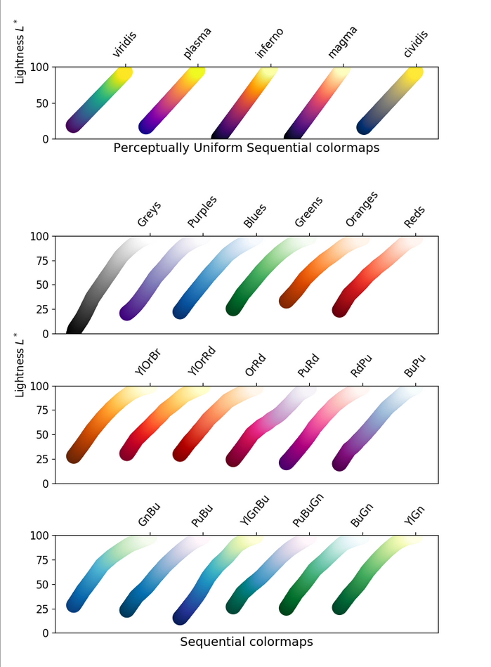
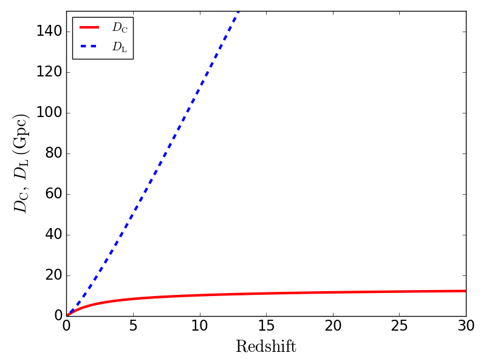
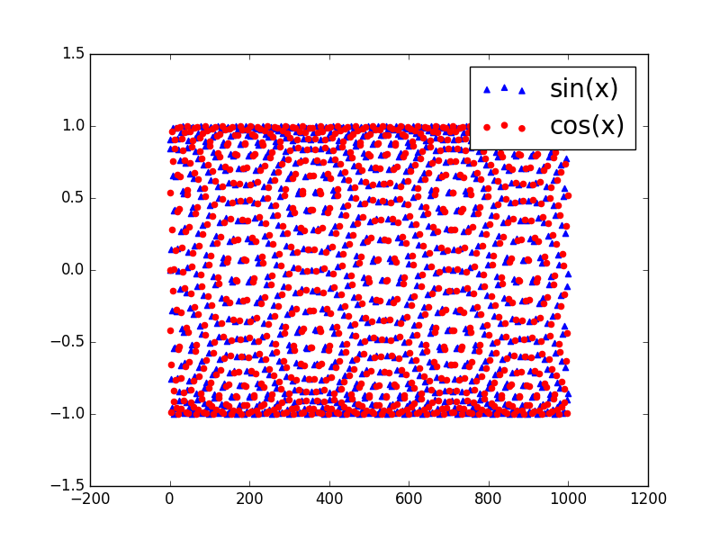
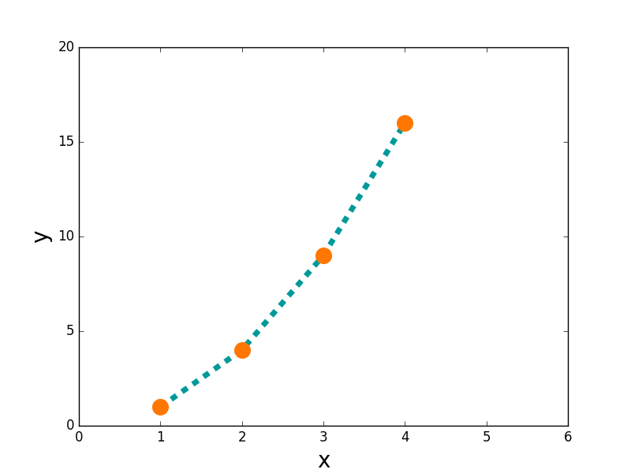


**N-body simulations** numerically follow the gravitational evolution of $\sim 10^9$ to $10^{12}$ "particles" representing dark matter (+ optionally baryons) under their mutual gravity. the standard tool for predicting the **non-linear regime** of structure formation. (companion: [Astrophysical N-body problem formulation](./Astrophysical%20N-body%20problem%20formulation.html) for the algorithmic side.)

## the basic problem

solve Newton's equations for $N$ particles each interacting via gravity:
$$\ddot{\vec r}_i = -\sum_{j\ne i}\frac{G m_j(\vec r_i - \vec r_j)}{\lvert \vec r_i - \vec r_j\rvert^3}$$

in cosmology, with periodic boundary conditions in a comoving box, in expanding spacetime.

## the algorithms

### direct N$^2$
sum over all pairs. cost $O(N^2)$ per timestep. fine for small $N \lesssim 10^4$. used in stellar dynamics + few-body simulations.

### tree code (Barnes-Hut)
group distant particles into multipole approximations. cost $O(N\log N)$. used for galaxy-scale + small cosmological volumes.

### particle-mesh (PM)
solve Poisson's equation on a grid via FFT. cost $O(N) + O(N_g \log N_g)$. fast, but limited resolution at small scales.

### hybrid PM-tree (P$^3$M, PMTree)
combine PM for long-range + tree for short-range. industry standard for cosmological simulations.

### tree-PM
similar idea, used in GADGET, IllustrisTNG, etc.

## the key cosmological simulations

| name | year | $N$ | volume | notes |
|---|---|---|---|---|
| **Aquarius** | 2008 | $10^9$ | MW-like halo | very high resolution, single halo |
| **Millennium** | 2005 | $10^{10}$ | $500\,h^{-1}$ Mpc | standard, dark matter only |
| **Bolshoi** | 2011 | $10^{10}$ | $250\,h^{-1}$ Mpc | improved cosmological parameters |
| **IllustrisTNG** | 2018 | $10^{10}$ | $300\,h^{-1}$ Mpc | hydrodynamics + galaxy physics |
| **EAGLE** | 2014 | $10^{10}$ | $100\,h^{-1}$ Mpc | hydrodynamics + sub-grid feedback |
| **FIRE** | 2014-onward | varies | individual galaxies | high-resolution galaxy formation |
| **Uchuu** | 2021 | $2 \times 10^{12}$ | $2\,h^{-1}$ Gpc | one of the largest |
| **MillenniumTNG** | 2023 | $10^{11}$ | $740\,h^{-1}$ Mpc | + neutrinos |

## what dark-matter-only simulations predict

run gravity on cold dark matter particles. predict:
- **halo formation**: virialised, NFW-profile dark-matter halos.
- **halo mass function**: closely matched to Press-Schechter (with corrections).
- **substructure**: many smaller satellite halos within larger ones.
- **cosmic web**: filaments, sheets, voids.
- **galaxy clustering** at the halo level (without baryon physics).

## hydrodynamic simulations

add gas + radiative cooling + star formation + supernova feedback + AGN feedback. predict:
- **galaxy populations** with realistic morphology + colors.
- **scaling relations** (Tully-Fisher, Faber-Jackson).
- **galaxy + halo mass function gap** (the "missing satellites" + "too big to fail" issues).
- **circumgalactic medium**.
- **galaxy + cluster x-ray / SZ properties**.

main projects: IllustrisTNG, EAGLE, SIMBA, FIRE, ASTRID.

## the limitations

- **sub-grid physics**: SF + feedback are below resolution; need empirical recipes.
- **resolution**: small scales unresolved. dwarf-scale physics uncertain.
- **box size**: large volumes need many particles; trade off with resolution.
- **computational cost**: a single IllustrisTNG run takes $\sim 10$ million CPU-hours.

so simulations + observations + analytic theory **all** needed; no single approach gives the full picture.

## the use in cosmology

simulations underpin:
- **cosmological parameter constraints**: precise $P(k)$ predictions for galaxy surveys.
- **lensing analyses**: matter distribution on small scales.
- **galaxy-halo connection**: halo abundance matching, conditional luminosity function.
- **cluster abundance + cosmology**: $\sigma_8$, $w$.
- **theoretical interpretation** of all observations.

## see also

- [Astrophysical N-body problem formulation](./Astrophysical%20N-body%20problem%20formulation.html)
- [Collisional vs collisionless N-body](./Collisional%20vs%20collisionless%20N-body.html)
- [N-body with Euler vs midpoint vs leapfrog](./N-body%20with%20Euler%20vs%20midpoint%20vs%20leapfrog.html)
- [Linear vs nonlinear regime](./Linear%20vs%20nonlinear%20regime.html)
- [Spherical collapse](./Spherical%20collapse.html)
- [Press-Schechter halo mass function](./Press-Schechter%20halo%20mass%20function.html)
- [Halo mass function vs galaxy mass function](./Halo%20mass%20function%20vs%20galaxy%20mass%20function.html)
- [Matter power spectrum and BAO](./Matter%20power%20spectrum%20and%20BAO.html)
- [Cosmic_inventory_dark_matter](./Cosmic_inventory_dark_matter.html)
- [Observational_Cosmology_MOC](../../04_Atlas/Observational_Cosmology_MOC.html)

---

### Numerical Methods & Algorithmic Diagnostics

*N-body spatial partitioning: Octree hierarchy for Barnes-Hut algorithm, showing multipole expansion of cell mass and center of mass.*

*Particle-Mesh (PM) algorithm: Cloud-In-Cell (CIC) mass assignment onto 3D grid, Poisson solver via FFT, and force interpolation.*

*Barnes-Hut tree-code opening angle criterion $\theta = s/d < \theta_{\rm crit} \approx 0.5-0.7$.*

*Direct summation vs Tree-code scaling: $\mathcal{O}(N^2)$ vs $\mathcal{O}(N\log N)$ CPU execution time.*


  <h4 class="backlinks-title">Linked References (3)</h4>
  <ul class="backlinks-list">
    <li class="backlink-item-wrap"><a href="./Cosmological%20evolution%20of%20perturbations%20in%20the%20cosmic%20fluid.html" class="backlink-item">Cosmological evolution of perturbations in the cosmic fluid</a></li>
    <li class="backlink-item-wrap"><a href="./Linear%20vs%20nonlinear%20regime.html" class="backlink-item">Linear vs nonlinear regime</a></li>
    <li class="backlink-item-wrap"><a href="../../04_Atlas/Observational_Cosmology_MOC.html" class="backlink-item">Observational_Cosmology_MOC</a></li>
  </ul>

