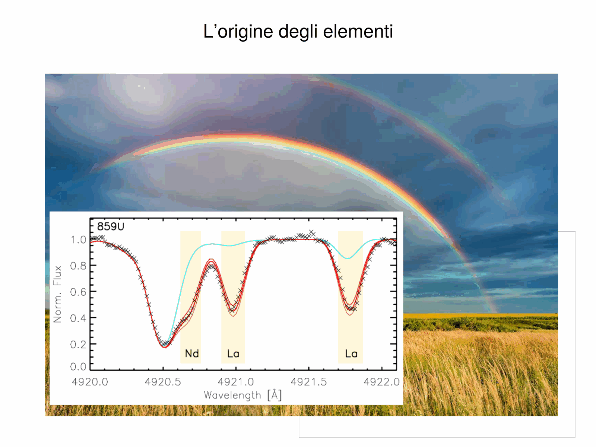
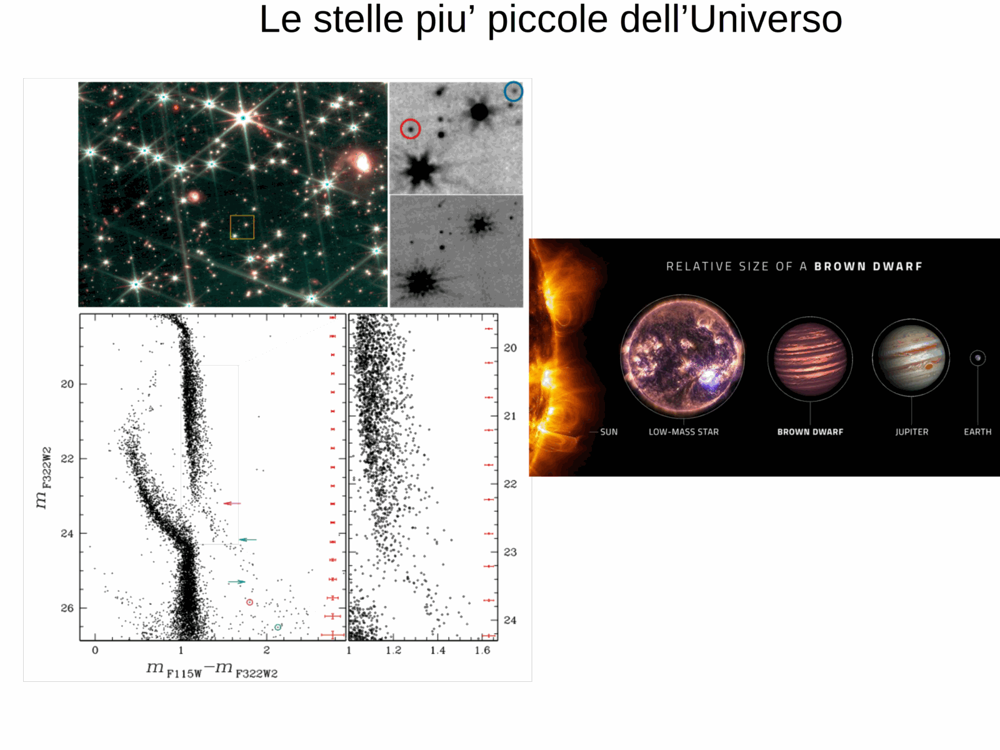


open clusters are the young-population complement to globulars in the SSP-laboratory pairing. where [Globular clusters as SSP laboratories](./Globular%20clusters%20as%20SSP%20laboratories.html) pin down low-mass evolution at old ages, open clusters span the age range from $\sim 1$ Myr to a few Gyr and supply the calibration for high-mass evolution, the upper main sequence, and the early post-MS phases.

their basic numbers: $N_\star \sim 10^2$ to a few $\times 10^3$ stars, half-mass radii $\sim 1$ to $5$ pc, total masses $10^2$ to $10^4 \, M_\odot$, and central densities orders of magnitude lower than GCs. they are *weakly bound*: the typical crossing time $t_\mathrm{cross} \sim r_h / \sigma_v \sim$ a few Myr, while the cluster's tidal-disruption time in the disk is $t_\mathrm{diss} \sim 10^8$ to $10^9$ yr. essentially all open clusters dissolve within $1$ Gyr, with the rare survivors (NGC 188, M67, berkeley 17) being the dynamically robust outliers used for absolute-age work on intermediate-age populations.

they live in the *thin disk* of the host galaxy, follow disk kinematics ($\sigma_z \lesssim 20$ km/s), and inherit the disk metallicity at their birth radius. for milky way disk clusters this is roughly solar with a galactocentric gradient $d[\mathrm{Fe}/\mathrm{H}]/dR_g \approx -0.06$ dex/kpc. they are population I objects (see [Population I and II stars](./Population%20I%20and%20II%20stars.html)).

three canonical examples define the calibration ladder:

- **pleiades** ($\sim 100$ Myr, $\sim 1000$ stars, $d \approx 136$ pc): the youngest of the three; its MS is fully populated up to early B stars, low-mass stars are still on the pre-main sequence with li depletion and rotation-activity diagnostics, and the post-MS is empty. used to anchor the upper-MS isochrones, the lithium depletion boundary age, and gyrochronology zero-points.

- **hyades** ($\sim 600$ Myr to $800$ Myr, $d \approx 47$ pc, the closest cluster to the sun): the TO sits near A-F type, the cluster shows a clear main sequence turn-off and a handful of red clump giants, and is the cornerstone of the cosmic distance ladder via the moving-cluster / convergent-point method historically and Gaia parallaxes today.

- **NGC 3532** ($\sim 300$ Myr, southern hemisphere, $\sim 2000$ stars): well-populated CMD with TO, subgiants, several G-K giants, used as a benchmark for intermediate-age MS-TO morphology.

other widely cited open clusters: $\alpha$ Per (90 Myr), praesepe (700 Myr), NGC 6791 (an unusually old, metal-rich open cluster, $\sim 8$ Gyr, that bridges to GCs in age but not in metallicity), M67 (4 Gyr, solar metallicity, the standard reference for solar-twin work).

inferentially, open clusters provide things that GCs cannot: a clean MS that extends well above $1 \, M_\odot$, so the full $L \propto M^\alpha$ relation can be tested across spectral types; a populated blue stragglers / upper-MS region; a red clump rather than a horizontal branch (because helium ignition is non-degenerate at $M > 2 \, M_\odot$); pre-main-sequence stars in the youngest cases, allowing direct tests of Hayashi tracks and d'antona-mazzitelli tracks; and time-resolved sampling of stellar rotation evolution.

their main weakness is small $N$, which means short-lived post-MS phases are statistically empty (one or two AGB stars per cluster, typically) and the upper MS is sparse. the "fuel-consumption theorem" applied to open clusters predicts $N_\mathrm{HB} \lesssim 1$, consistent with observation.

a research-grade modern application is using gaia-DR3 astrometry to identify "moving groups" of common-origin stars dispersed from now-dissolved open clusters, recovering stellar associations that have already crossed their dissolution time.

## see also
- [Stellar_Astrophysics_MOC](../../04_Atlas/Stellar_Astrophysics_MOC.html)
- [Star cluster types](./Star%20cluster%20types.html)
- [Globular clusters as SSP laboratories](./Globular%20clusters%20as%20SSP%20laboratories.html)
- [Single stellar population SSP](./Single%20stellar%20population%20SSP.html)
- [Color-magnitude diagrams of clusters](./Color-magnitude%20diagrams%20of%20clusters.html)
- [Stellar populations I II III](./Stellar%20populations%20I%20II%20III.html)

---

## Complete Lecture Slide Panels & Observational Evidence (Lecture 20 — Young Clusters & Pre-Main Sequence Evolution)

> **Context**: *Pre-main sequence (PMS) Hayashi and Henyey tracks, circumstellar disks, cluster dissolution, and initial-final mass relation (IFMR).*

The following slides from Prof. Antonino Milone's lecture series provide the direct observational, photometric, and theoretical foundations for this topic:

*Figure P20-01: LAntonino_p20_01.png — Observational data, CMD morphology, and diagnostics from Lecture 20 — Young Clusters & Pre-Main Sequence Evolution.*

*Figure P20-02: LAntonino_p20_02.png — Observational data, CMD morphology, and diagnostics from Lecture 20 — Young Clusters & Pre-Main Sequence Evolution.*

*Figure P20-03: LAntonino_p20_03.png — Observational data, CMD morphology, and diagnostics from Lecture 20 — Young Clusters & Pre-Main Sequence Evolution.*

*Figure P20-04: LAntonino_p20_04.png — Observational data, CMD morphology, and diagnostics from Lecture 20 — Young Clusters & Pre-Main Sequence Evolution.*

*Figure P20-05: LAntonino_p20_05.png — Observational data, CMD morphology, and diagnostics from Lecture 20 — Young Clusters & Pre-Main Sequence Evolution.*

*Figure P20-06: LAntonino_p20_06.png — Observational data, CMD morphology, and diagnostics from Lecture 20 — Young Clusters & Pre-Main Sequence Evolution.*

*Figure P20-07: LAntonino_p20_07.png — Observational data, CMD morphology, and diagnostics from Lecture 20 — Young Clusters & Pre-Main Sequence Evolution.*

*Figure P20-08: LAntonino_p20_08.png — Observational data, CMD morphology, and diagnostics from Lecture 20 — Young Clusters & Pre-Main Sequence Evolution.*

*Figure P20-09: LAntonino_p20_09.png — Observational data, CMD morphology, and diagnostics from Lecture 20 — Young Clusters & Pre-Main Sequence Evolution.*

*Figure P20-10: LAntonino_p20_10.png — Observational data, CMD morphology, and diagnostics from Lecture 20 — Young Clusters & Pre-Main Sequence Evolution.*

*Figure P20-11: LAntonino_p20_11.png — Observational data, CMD morphology, and diagnostics from Lecture 20 — Young Clusters & Pre-Main Sequence Evolution.*

*Figure P20-12: LAntonino_p20_12.png — Observational data, CMD morphology, and diagnostics from Lecture 20 — Young Clusters & Pre-Main Sequence Evolution.*

*Figure P20-13: LAntonino_p20_13.png — Observational data, CMD morphology, and diagnostics from Lecture 20 — Young Clusters & Pre-Main Sequence Evolution.*

*Figure P20-14: LAntonino_p20_14.png — Observational data, CMD morphology, and diagnostics from Lecture 20 — Young Clusters & Pre-Main Sequence Evolution.*

*Figure P20-15: LAntonino_p20_15.png — Observational data, CMD morphology, and diagnostics from Lecture 20 — Young Clusters & Pre-Main Sequence Evolution.*

*Figure P20-16: LAntonino_p20_16.png — Observational data, CMD morphology, and diagnostics from Lecture 20 — Young Clusters & Pre-Main Sequence Evolution.*

*Figure P20-17: LAntonino_p20_17.png — Observational data, CMD morphology, and diagnostics from Lecture 20 — Young Clusters & Pre-Main Sequence Evolution.*

*Figure P20-18: LAntonino_p20_18.png — Observational data, CMD morphology, and diagnostics from Lecture 20 — Young Clusters & Pre-Main Sequence Evolution.*

*Figure P20-19: LAntonino_p20_19.png — Observational data, CMD morphology, and diagnostics from Lecture 20 — Young Clusters & Pre-Main Sequence Evolution.*

*Figure P20-20: LAntonino_p20_20.png — Observational data, CMD morphology, and diagnostics from Lecture 20 — Young Clusters & Pre-Main Sequence Evolution.*

*Figure P20-21: LAntonino_p20_21.png — Observational data, CMD morphology, and diagnostics from Lecture 20 — Young Clusters & Pre-Main Sequence Evolution.*

*Figure P20-22: LAntonino_p20_22.png — Observational data, CMD morphology, and diagnostics from Lecture 20 — Young Clusters & Pre-Main Sequence Evolution.*

*Figure P20-23: LAntonino_p20_23.png — Observational data, CMD morphology, and diagnostics from Lecture 20 — Young Clusters & Pre-Main Sequence Evolution.*

*Figure P20-24: LAntonino_p20_24.png — Observational data, CMD morphology, and diagnostics from Lecture 20 — Young Clusters & Pre-Main Sequence Evolution.*

*Figure P20-25: LAntonino_p20_25.png — Observational data, CMD morphology, and diagnostics from Lecture 20 — Young Clusters & Pre-Main Sequence Evolution.*


  <h4 class="backlinks-title">Linked References (3)</h4>
  <ul class="backlinks-list">
    <li class="backlink-item-wrap"><a href="./Population%20I%20and%20II%20stars.html" class="backlink-item">Population I and II stars</a></li>
    <li class="backlink-item-wrap"><a href="./Star%20cluster%20types.html" class="backlink-item">Star cluster types</a></li>
    <li class="backlink-item-wrap"><a href="../../04_Atlas/Stellar_Astrophysics_MOC.html" class="backlink-item">Stellar_Astrophysics_MOC</a></li>
  </ul>

